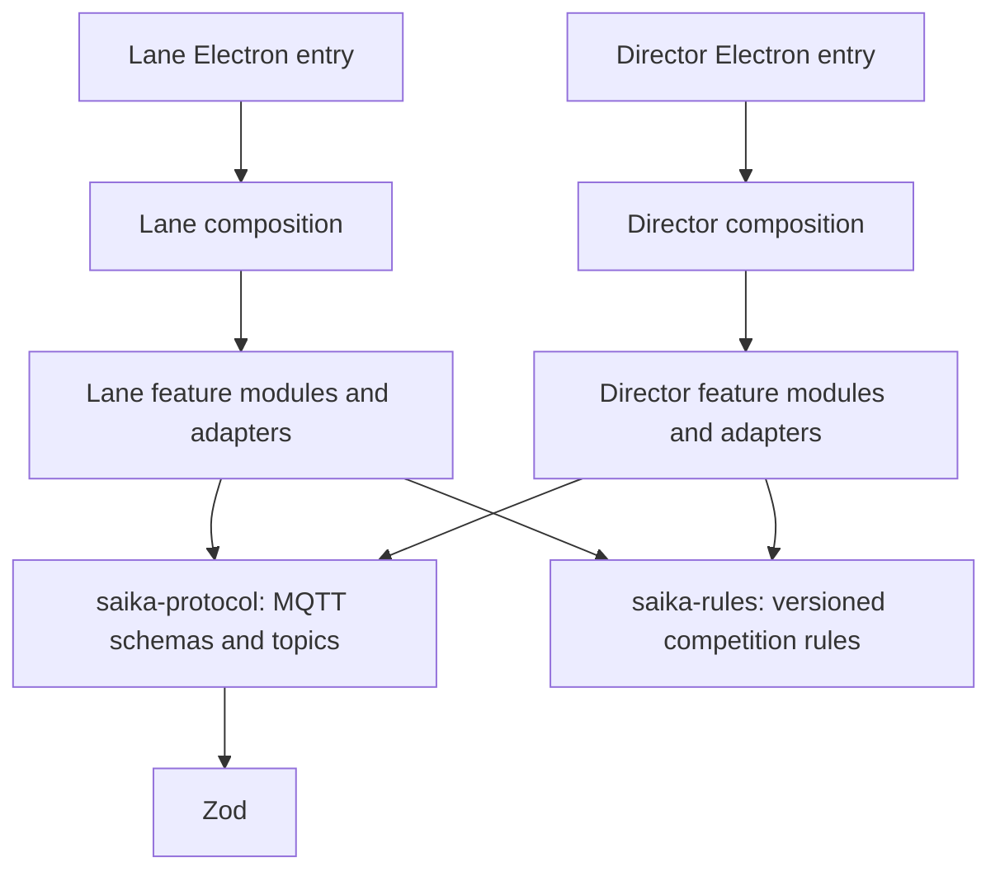

# ADR-0005: Application Composition and Shared MQTT Contracts

## Status

Proposed (implemented locally; pending review)

## Date

2026-09-09

## Context

Lane and Director already use feature modules, ports, CQRS and explicit dependency injection. Their main sources of
coupling were the construction of services in large startup functions and independent copies of MQTT schemas.
Lane's entry point combined Electron events, service construction, module registration, device reconnection,
window controls and competition-event coordination. Director's composition root constructed scoring, access,
evidence, verification and publication workflows in one function.

The duplicated schemas had already diverged: Director could publish `RUN_TIMED_TARGET` cues that Lane rejected,
and Lane discarded the optional `competitionUnit` field. Command issuer validation also differs deliberately:
Director requires a non-empty outgoing label, while Lane accepts legacy commands with an empty label.

## Decision

Continue with independently deployable **modular monoliths**, applying the ports-and-adapters boundaries in
[ADR-0002](0002-electron-architecture.md). Refine the existing architecture through explicit composition functions
and a shared wire-contract package. Dependency construction uses ordinary functions and typed arguments.

### Application composition

- Lane's `main.ts` owns Electron process and window creation. `createLaneServices` builds the service graph,
  `createLaneApp` registers features and restores their state, and `bindMainWindow` owns IPC window/update actions
  and close confirmation. `scheduleAutoConnect` accepts a port-listing interface. `bindCompetitionEvents` owns
  cancellation coordination and returns a subscription disposer.
- Director's `createContainer.ts` assembles explicitly typed factories for competition, operator access, evidence,
  scoring, backup capture and publication services. Factories receive the dependencies they use and return the
  instances needed by other factories or modules. `createAppRuntime` owns event forwarding and lifecycle order;
  `createOperationalSettingTargets` composes operational policy controls.
  The composition root supplies the board renderer directory explicitly, so asset lookup does not depend on
  whether Electron was launched with a package directory or the built main entry file.
- Each application has a static `composition/modules.ts` catalog. Registration order remains explicit. Module
  loaders check the complete catalog for duplicate names and missing declared services before registration
  starts, then inject only the declared subset. Registration itself is not transactional: a failure inside a
  module's `register` function can still leave that module's side effects installed.
- Director stops modules before infrastructure, flushes the Lane repository before closing SQLite, and retains
  startup rollback. Board shutdown waits for native window closure. Loading failures caused by intentional
  shutdown do not open a blocking error dialog. Lane releases composition event subscriptions and renderer
  forwarding when its window closes.

### Wire contracts

`@sasakiuri/saika-protocol` owns MQTT schemas, inferred transport types and topic builders, organized by message
family. It depends only on Zod. It contains no application services, device adapters, database code, UI, timers,
or competition-rule authority. Existing application import paths re-export the shared definitions, so adoption
does not require changing every feature import at once.

The package also owns the command schema factory. Director uses its default non-empty issuer validation; Lane
explicitly selects the historical permissive issuer-label policy. Payload fields and refinements have one
implementation despite that compatibility policy. Lane-specific timing defaults stay in Lane.

The existing protocol version and topic strings are retained. The shared cue schema accepts Director's existing
`RUN_TIMED_TARGET` value, and both endpoints retain the optional `competitionUnit` metadata. Legacy payloads that
omit optional fields remain valid. Sender identity authorization remains an application-owned policy, separate
from the human-readable issuer label.

### Enforcement and extension

Dependency-cruiser checks the package's dependency allowlist and prevents feature modules from importing their
application bootstrap. Lane's existing CQRS token module and type-only dependency declarations remain available.
CI runs the shared contract tests as well as the application suites and dependency checks.
Type-check and architecture tasks include workspace dependency tasks in their cache graph, so a shared-contract
change invalidates the corresponding consumer checks.

To extend a message, update its schema in `saika-protocol`, add wire-format validation cases there, and test the
affected publisher/subscriber. Use optional fields for backward-compatible additions; incompatible messages need
an explicit protocol-version decision. Update adapters independently of the wire definition.

To add a feature, implement its application-owned ports and adapters, construct shared instances in the relevant
composition factory, declare its required services in the module definition, and add the module to the static
catalog. Provide lifecycle entries when the feature starts a long-lived Director service. Extend Rule Packs in
`saika-rules` when rule authority changes; transport schemas describe messages rather than define competition rules.

## Consequences

- A wire-format change is reviewed and validated once for both applications.
- Composition can be read and tested by responsibility. Startup order, shared instance identity and shutdown
  ordering remain visible at the composition boundary.
- New code has enforceable dependency boundaries without a new DI framework or runtime service discovery.
- The shared package couples contract releases across the suite. Backward compatibility still needs wire fixtures
  and consumer tests; sharing TypeScript source alone cannot guarantee compatibility with older installations.
- Existing import facades add indirection. New consumers should prefer focused package subpaths, while existing
  facades keep the migration small and preserve established imports.
