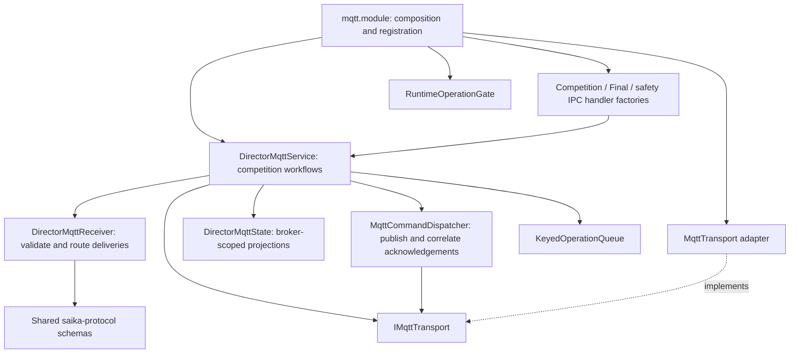

# ADR-0006: Director MQTT Application Boundaries

## Status

Proposed (implemented locally)

Lifecycle ownership and Lane command processing are further refined by
[ADR-0007](0007-mqtt-lifecycle-and-command-processing.md).

## Date

2026-09-09

## Context

The suite already uses modular monoliths, explicit composition, versioned Rule Packs and shared MQTT contracts.
The remaining concentration of responsibilities in Director was inside the MQTT feature: `DirectorMqttService`
combined competition workflows with message validation, acknowledgement tracking and broker-scoped state, while
`mqtt.module.ts` registered IPC handlers containing substantial competition, Final and safety-stop logic.

Changes to a message family, a competition command or a broker transition therefore required navigating the same
large files. Application code also imported command result types from infrastructure, and the competition service
constructed its own default network adapter.

## Decision

Keep the existing modular monolith and explicit dependency injection. Refine the MQTT feature into independently
exercisable application components. Its ordering requirements and shared competition state stay inside one process;
this change introduces no service deployment, framework, wire format or storage migration.

### Responsibilities and dependency direction

- `domain/IMqttTransport.ts` defines the transport port and credentials. `infra/MqttTransport.ts` implements it.
  `mqtt.module.ts` supplies the concrete adapter explicitly. Tests supply a fake transport.
- `application/DirectorMqttService.ts` orchestrates competition membership, firing, recovery, timers and cleanup.
  It preserves the existing publish-before-command ordering and retained timer intent for retries.
- `DirectorMqttReceiver` validates JSON and shared schemas, checks topic structure and payload identities, and
  routes valid deliveries through typed callbacks. Empty retained messages clear the corresponding projection.
  Every valid shot delivery retains its original JSON for evidence recording, including duplicates and replays.
- `DirectorMqttState` owns Lane and competition projections, per-competition shot history, bounded shot
  deduplication and snapshot revision tracking. Lane ownership is resolved from competition membership, so a late
  retained delivery cannot overwrite another competition's active Lane projection. Final snapshot waits require
  fresh state and score for the current finish command, matching session and scoring mode.
- `MqttCommandDispatcher` owns pending command deadlines, exact acknowledgement-topic correlation, progress,
  terminal outcomes, idempotent cleanup errors and cancellation when the broker session is reset. Its deadline
  releases command callers even when a QoS publication remains pending; late failures are observed.
- `DirectorMqttTypes` owns application request, result and snapshot types. Consumers of these types do not depend
  on the network adapter or service implementation.
- `createCompetitionControlHandlers`, `createFinalControlHandlers` and `createSafetyControlHandlers` receive only
  the services and operations they use. Their returned procedure sets are checked against the IPC contract.
  `CompetitionSeriesNavigation` contains shared calculations for configured stage and series transitions.

### Concurrency and lifecycle

`KeyedOperationQueue` serializes operations sharing a competition, membership or safety key while independent
keys can proceed concurrently. Failed operations release their keys without rejecting later queued work.

`RuntimeOperationGate` permits concurrent control operations between exclusive broker transitions. A transition
waits for controls submitted before it; controls submitted afterwards wait for the transition. Capturing this
boundary when the operation is submitted prevents a reader/writer deadlock. Failed operations propagate to their
callers without poisoning the next transition. The module retains ownership of broker configuration rollback,
startup, shutdown and event forwarding.

Neither queue is a cancellation mechanism. Broker-session reset still owns pending-command cancellation, state
reset and timer cleanup. Snapshot waits retain their existing bounded deadlines.

### Enforcement and extension

Dependency-cruiser prevents MQTT application components from importing MQTT infrastructure or module registration,
including type-only imports. The existing process, feature/bootstrap and domain boundaries remain in force.

When adding a feature:

1. Extend the shared protocol schema and wire fixtures when the message format changes.
2. Add its inbound validation/routing to `DirectorMqttReceiver` and its projection to `DirectorMqttState` when needed.
3. Implement the competition workflow in the application layer, using the command dispatcher and appropriate queue
   keys for ordering. Add a focused collaborator when the workflow introduces an independent state or lifecycle.
4. Register its IPC procedure in the responsible handler factory and supply its dependencies from `mqtt.module.ts`.
5. Test the affected failure boundary: identity mismatch, duplicate delivery, timeout, retained replay, final snapshot
   correlation or a broker transition concurrent with a command. Keep service and module integration tests as checks
   that the components still work together.

## Consequences

The largest MQTT files are smaller and each extracted component has explicit ownership and tests. New message
families and acknowledgement behavior can be changed without modifying unrelated IPC workflows. Transport creation
is confined to composition, and architecture checks prevent the old reverse dependency from returning.

Competition orchestration remains substantial because it coordinates ordered, stateful workflows. Further splits
should follow independent behavior and lifecycle, rather than a line-count target. The additional files require
navigation between the coordinator and its collaborators; typed dependencies and this responsibility map make that
relationship explicit.
