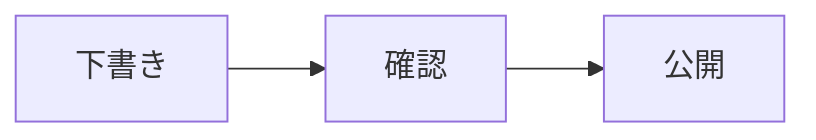

# Nilay Knowledge

<!-- cspell:words NFKC licence frontmatter BudouX cmdk nuqs -->

`@sasakiuri/nilay-knowledge` is the Next.js website at <https://knowledge.nilay.jp>.

Use Node 22.22.2 or newer and npm 10.9.4. Run commands from the repository root:

```bash
npm ci
npm run dev --workspace=@sasakiuri/nilay-knowledge
npm run lint --workspace=@sasakiuri/nilay-knowledge
npm run typecheck --workspace=@sasakiuri/nilay-knowledge
npm run test:coverage --workspace=@sasakiuri/nilay-knowledge
npm run build --workspace=@sasakiuri/nilay-knowledge
npm run size-limit --workspace=@sasakiuri/nilay-knowledge
npm run start --workspace=@sasakiuri/nilay-knowledge
```

The development and production servers listen on port 3000. Build generates the
RSS feed and sitemap in `public/`, then builds Next.js into `.next/`. This committed
version uses a Next.js server, including `/api/og`; it does not export `out/`.
The inherited Firebase configuration is retained as historical configuration and
is not a deployment pipeline for this build.

Optional environment variables are `NEXT_PUBLIC_GA_MEASUREMENT_ID` and
`NEXT_PUBLIC_FACEBOOK_APP_ID`. Set them before building; Turbo includes both in
the build cache key. `ANALYZE=true npm run build --workspace=@sasakiuri/nilay-knowledge`
enables the bundle analyzer. When GA4 is configured, `useReportWebVitals` sends performance
measurements (including LCP, INP and CLS) to that same property after GA initializes.
Without a measurement ID, GA4 analytics and reporting stay disabled. Vercel Speed
Insights independently collects performance metrics through the root layout's
`SpeedInsights` component when Vercel provides `VERCEL=1`. Local builds omit this
component because its collection routes are supplied by Vercel. Turbo includes
`VERCEL` in the build cache key. GA4 reports contain only metric IDs,
numbers and ratings/navigation types are included; DOM text and attribution URLs
are not added. Text uses system fonts, so reading does not require
downloading Japanese web fonts and builds do not contact Google Fonts. BudouX adds
phrase boundaries to page and home-card titles during server rendering using
`<wbr>`; the original title text, metadata and heading IDs are preserved. BudouX
is pinned to 0.7.0: the newer releases evaluated here pull in registry-authentication
dependencies that this site does not use, including an npm audit finding. Reassess
the dependency tree before updating it.

Articles and news live in `content/`; their committed public copies live in
`public/content/`. When editing content or assets, keep the public copies in sync.
Use `npm run new:article --workspace=@sasakiuri/nilay-knowledge -- "Title"` or
`npm run new:news --workspace=@sasakiuri/nilay-knowledge -- "Title"` to create entries.
The creation commands reserve a new directory before writing, add a numeric suffix
when the slug already exists, and write UTC timestamps. Article slugs use Unix
seconds; news slugs use the local calendar date.

## Vercel deployment

Use the existing Vercel project with these settings:

| Setting                                         | Value                      |
| ----------------------------------------------- | -------------------------- |
| Git repository                                  | `sasakiuri/oss`            |
| Production branch                               | `1.x`                      |
| Root Directory                                  | `packages/nilay-knowledge` |
| Include source files outside the Root Directory | Enabled                    |
| Node.js                                         | `24.x`                     |

[`vercel.json`](vercel.json) selects Next.js, installs the root lockfile with
`npm ci --ignore-scripts --workspace=@sasakiuri/nilay-knowledge --include-workspace-root=false`,
runs this package's `npm run build`, and uses `.next/`.
Only this workspace and its dependencies are installed. The package does not
override Node.js with `engines.node`; the Vercel project's `24.x` setting selects
the deployment runtime independently of the repository's development tools.
Skipping install scripts avoids the repository's Electron rebuild. The separate
build command still runs `prebuild` to prepare styles, RSS and the sitemap.

Enable **Skip deployment** under Root Directory so unrelated workspace changes do
not deploy the site. Shared dependencies and repository-wide changes can still
trigger a deployment. In Domains, redirect the fixed production `vercel.app`
domain to `knowledge.nilay.jp` with status 308.

Under Deployment Checks, require the GitHub checks `CI Required` and
`Knowledge deployment smoke (production)` for production. The latter is published
by `.github/workflows/knowledge-deployment.yml` on `vercel.deployment.ready`, before
the production domain switches. The workflow must exist on the default branch.
It uses the default branch's verification script and reports its result on the
deployed commit, without running source code supplied by the deployment event.
Store this project's automation bypass secret as the GitHub Actions secret
`KNOWLEDGE_VERCEL_AUTOMATION_BYPASS_SECRET`; it is sent only to the deployment
being checked and never forwarded through cross-origin redirects.

The smoke check verifies the homepage, its JavaScript bundle, a sitemap-listed
article, RSS, sitemap, static image and generated OG image. Run it manually with:

```bash
SMOKE_BASE_URL=https://knowledge.nilay.jp npm run test:deployment --workspace=@sasakiuri/nilay-knowledge
```

For a protected deployment, set `VERCEL_AUTOMATION_BYPASS_SECRET` in the shell
environment as well. The workflow's manual trigger accepts a deployment URL.
In Vercel's team **My Notifications**, keep **Deployment Failures** email and web
notifications enabled for the deployment owner.

To recover a failed release, use **Instant Rollback** on the project's production
deployment, verify the destination and domains, and check the site again. Hobby
supports returning to the immediately previous production deployment. Rollback
restores that deployment's build and environment, not the current settings.
After rollback, automatic production-domain assignment is suspended; promote a
verified fix and restore automatic assignment when resuming normal deployments.

See Vercel's [Git settings](https://vercel.com/docs/project-configuration/git-settings)
and [monorepo configuration](https://vercel.com/docs/monorepos),
[Deployment Checks](https://vercel.com/docs/deployment-checks), and
[Instant Rollback](https://vercel.com/docs/instant-rollback).

## Content architecture

`app/` composes pages from server data and presentation components. Content access
is divided into explicit boundaries under `lib/content/`:

| Module                  | Responsibility                                                                 |
| ----------------------- | ------------------------------------------------------------------------------ |
| `types.ts`              | Shared metadata, summary, source, rendered document and TOC contracts          |
| `schemas.ts`            | Zod schemas for frontmatter and search documents, with inferred data types     |
| `repository.ts`         | File enumeration, reads, metadata validation and publication ordering          |
| `render.ts`, `paths.ts` | Markdown rendering, relative asset URLs and heading anchors                    |
| `images.ts`             | Intrinsic dimensions of published local images, injected by the server adapter |
| `server.ts`             | Server-only Next.js adapter with request-scoped React memoization              |
| `metadata.ts`           | Canonical, Open Graph, Twitter and RSS discovery metadata                      |
| `publication.ts`        | RSS and sitemap serialization from validated content                           |

The repository takes a content directory explicitly and has no dependency on
React or Markdown rendering. `list()` returns summaries without bodies or HTML;
`read()` and `listSources()` return validated Markdown sources. The server adapter
shares source reads between page metadata and detail rendering. The news page
loads summaries once and filters them into its existing categories. The curated
article index and reading order are shared in `lib/content/navigation.ts`.

The article directory uses repository summaries, so article titles, categories and
tags come from frontmatter and counts reflect existing content. The editorial
reading order and optional descriptions remain in `navigation.ts`; changing an
article's category does not change its previous/next reading links. New articles
appear in the directory automatically, including articles outside that reading order.

The directory supports one category and multiple tags, matching every selected
tag. It stores filters as `category=<id>` and repeated `tag=<label>` query parameters,
so bookmarks, reloads, browser history and the share menu preserve the selection.
Tag counts reflect the current category and other selected tags. Unknown filters
produce an explicit empty result and can be cleared. The complete directory is
rendered statically; interactive filtering requires JavaScript. Existing category
heading anchors remain available. Article tags link to the directory, and related
articles prioritize shared tags, then the same category, using editorial order to
break ties. Unclassified articles are not related solely because they lack a category.

The [metadata validator](lib/content/frontmatter.ts) requires `title`, `published` and `tags`. Dates accept `YYYY-MM-DD` or ISO
timestamps with a timezone, and invalid calendar dates fail validation. `updated`,
`image` and `description` are optional for both collections. Invalid metadata reports the source
file and field; I/O and parsing failures propagate. Slugs must be single URL
segments made of letters, digits, underscores and hyphens, starting with a letter
or digit. The server adapter treats invalid public route segments as missing
content, so metadata and detail pages return the normal not-found response.
The build generates detail pages from the enumerated content entries;
rebuild the production site after changing content.

Tags are trimmed and deduplicated during validation. Case and punctuation remain
significant, and blank tags are rejected. Use the same tag spelling across articles
to connect them; tags may be empty (`tags: []`).

### Managing article categories and tags

Edit `category` and `tags` in the article's `index.md` frontmatter, then synchronize
its copy under `public/content/`. An article has one category and any number of tags:

```yaml
category: procedures
tags: [所持許可, 申請書]
```

Category IDs, display names and directory order are defined once in
[`lib/content/categories.ts`](lib/content/categories.ts). The IDs are
`getting-started`, `procedures`, `equipment`, `hunting`, `shooting`, `resources`
and `uncategorized`. Missing categories and `uncategorized` are displayed as
`未分類`; unknown IDs are rejected with the source filename. Add a definition
there before assigning a new category. Keep IDs stable because shared URLs use them.
All existing articles have an explicit category. News retains its existing tag-based
classification.

Create articles with classification already filled in, or inspect existing usage:

```bash
npm run new:article --workspace=@sasakiuri/nilay-knowledge -- "申請の手順" --category procedures --tag 所持許可 --tag 申請書
npm run new:article --workspace=@sasakiuri/nilay-knowledge -- --help
npm run taxonomy --workspace=@sasakiuri/nilay-knowledge
npm run lint:metadata --workspace=@sasakiuri/nilay-knowledge
```

Repeat `--tag` for multiple tags. Omitting `--category` creates an explicitly
unclassified article. Invalid categories or blank tags fail before creating files.
The `taxonomy` report lists category IDs, tag names and usage counts, and identifies
unclassified or untagged articles by slug and title. `lint:metadata` validates all
article/news frontmatter without rendering the bodies and runs as part of `lint`.

Zod schemas define both runtime validation and the corresponding TypeScript data
types. Search validation also checks collection-specific destinations and unique
IDs. JSON-LD factories use `schema-dts` types without adding runtime code.

Rendering operates on the parsed HTML tree. Relative links and images, including
Markdown references and embedded HTML, resolve under `/content/<type>/<slug>/`.
Code examples, URI schemes, root paths and fragment links keep their meaning.
The TOC uses the same heading IDs as the generated HTML, including repeated and
formatted headings. `rehype-autolink-headings` appends heading permalinks with
Japanese accessible names; their encoded fragments match TOC and search URLs.
GitHub alerts are processed before soft line breaks. Raw HTML
is intentionally supported for trusted, reviewed repository content; this renderer
is not an upload or user-input sanitization boundary.

Element and code-fence visitors use `unist-util-visit`. Table wrapping and search
text extraction retain their explicit recursive order for nested tables and
spaces around block elements.

The feed and sitemap scripts use the same repository as pages. They resolve paths
from their own locations and also work when invoked directly from the repository
root. Sitemap detail entries use `updated ?? published`; static pages omit an
invented modification date. Public asset copies remain committed and require the
synchronization described above.

Regression tests exercise temporary content directories, the real Markdown
pipeline, all committed article TOC targets, feed/sitemap URL parity, metadata,
and content creation from a different working directory. `fast-check` generates
Japanese, formatted and duplicate headings to check TOC, search and permalink
destinations together, and exercises URL resolution with varied paths and fragments.
Run package tests,
lint, typecheck and build after changing a content boundary.

## Editorial checks

`npm run lint:text --workspace=@sasakiuri/nilay-knowledge` checks authored
`content/**/*.md` with `textlint-rule-prh` and
`textlint-rule-preset-ja-technical-writing`. The dictionary in `prh.yml` checks
site-name spelling and specific Japanese misspellings. The Japanese preset adds
duplicate-word, grammar, invalid-character and paired-punctuation checks. Its
sentence-length, long-kanji, tone and repeated-particle style rules are disabled
to preserve legal terminology and historical prose. Block quotes, links, code
and published copies under `public/` are excluded. Narrow `textlint-disable`
comments identify exceptions in quoted source material. The command reports
findings without modifying articles. The root text-spacing check continues to
exclude imported content.

`npm run lint:markdown --workspace=@sasakiuri/nilay-knowledge` checks the same
authored Markdown with `remark-lint-no-undefined-references` and
`remark-lint-no-duplicate-definitions`. It checks link, image and GFM footnote
references before rendering, including references that would otherwise remain
plain text. Literal square brackets must be escaped; GitHub alert markers are
allowed. Frontmatter, GFM and math use the corresponding remark parsers. Findings
include file paths and source positions, and make the command fail. Both editorial
checks run as part of the package's normal `lint` command.

Install [lychee v0.24.2](https://github.com/lycheeverse/lychee/releases/tag/lychee-v0.24.2)
and put its executable on `PATH`, or set `LYCHEE_BIN` to its path. Then run:

```bash
npm run lint:links --workspace=@sasakiuri/nilay-knowledge
npm run lint:links:external --workspace=@sasakiuri/nilay-knowledge
```

The first command checks local links, assets and article/news heading fragments
without network access. It renders article and news bodies using the site's
Markdown pipeline into `.cache/links/`, maps canonical site URLs to local targets,
and uses actual public assets. Static App Router pages are registered as route
targets; their page bodies are not scanned. This does not require a Next.js static
export. Unsupported URL schemes fail preparation, including protocol typos that
lychee would otherwise skip. A missing lychee executable fails with installation
instructions. Run the commands separately because each rebuilds the temporary inputs.

The external command also checks HTTP links and returns a failing exit code when
links fail. Markdown reports are written to `.cache/links/internal.md` and
`.cache/links/external.md`, respectively. External failures require review because
rate limits and temporary network failures can resemble broken links.

The `Knowledge content links` workflow checks local links on relevant pull
requests. On its weekly schedule and manual runs, it also reports external
failures in the workflow summary and artifacts without failing the job for dead
external links. Reports are retained for 30 days. Tests of actual lychee detection
run when the binary is available, including in that workflow; otherwise those
integration cases are skipped. `lint:links:prepare` generates the inputs alone
for CI.

## Search metadata and crawl checks

Each public page has a canonical URL with a trailing slash and its own description,
Open Graph and Twitter metadata. Article frontmatter supports an optional plain-text
`description`; the committed guides include editorial summaries. Without that field,
the first visible paragraph supplies the summary. Markdown syntax, HTML comments,
styles, scripts and hidden elements are excluded. Summaries are limited to 160 Unicode
code points and shared by meta tags, Article/NewsArticle JSON-LD and RSS.
This is an editorial limit, not a Google requirement or a guarantee of snippet length.
Publication and modification dates come from frontmatter, never the build time.
Articles show both publication and modification dates when an update is recorded.
OG/Twitter cards can fall back to a generated title card. Article JSON-LD includes
an image only when frontmatter declares one, since a title/logo card is not a
representative article image.

Curated category pages at `/articles/category/{category}/` have their own titles,
introductions, summaries, canonical URLs, breadcrumbs and CollectionPage/ItemList
structured data. They are generated only for subjects with an editorial introduction
in `lib/content/category-pages.ts` and at least two articles. Empty, unclassified and
single-article subjects do not generate landing pages. Home, directory and article
links use these pages where available; other categories retain their directory
filters. The sitemap follows the same eligibility rules. Existing article URLs and
shared filter URLs are unchanged. Directory summaries prefer frontmatter descriptions.

`app/robots.ts` advertises the sitemap and allows crawling, including page resources
and social images. `X-Robots-Tag: noindex` applies only to public Markdown copies and
the two search JSON indexes. It does not block crawling of those files, so crawlers
can read the directive. PDF documents, images and archived HTML remain indexable.
Filtered article directory URLs canonicalize to `/articles/`.

Authored internal page links and social sharing URLs use the same trailing-slash
canonical URLs. Next.js normalizes `Link` destinations; plain Markdown/HTML anchors
must include the slash themselves. The four historical law documents under
`content/articles/1379067191/olds/` have individual titles, descriptions identifying
them as historical material, and self-referencing canonicals. The historical label
and navigation back to the source article render without JavaScript; the old script
no longer overwrites the document title on load. Their original legal text is
preserved, and their public copies must stay synchronized.

After building, run the full-site checks and the representative Lighthouse audit:

```bash
npm run test:seo --workspace=@sasakiuri/nilay-knowledge
npm run lhci:run --workspace=@sasakiuri/nilay-knowledge
```

After deploying this checkout, check the actual public responses as well:

```bash
npm run test:seo:live --workspace=@sasakiuri/nilay-knowledge
# To check a preview deployment with production canonical URLs:
SEO_BASE_URL=https://preview.example.com npm run test:seo:live --workspace=@sasakiuri/nilay-knowledge
```

The live check defaults to `https://knowledge.nilay.jp`, starts no local server and
uses a single worker for read-only GET/HEAD requests. Browser requests to third-party
origins and methods other than GET/HEAD are blocked, including analytics. It expects the deployed
content to match this checkout; an older deployment or protected preview will fail.
It does not publish changes or change any search-engine account settings.

For search performance after release, submit `/sitemap.xml` in the site's Google
Search Console property and inspect representative article and category URLs.
Track impressions, clicks, CTR and indexing by page and query, comparing equivalent
periods after recrawling. Search Console access and actual indexing are separate
from local validation. Review date-sensitive articles (permits, fees, laws and
lecture schedules) against their official sources before updating the text and
its `updated` date; a deployment alone is not an editorial review.

The SEO checks fetch every sitemap URL and inspect delivered HTML with JavaScript
disabled. They verify repository/sitemap parity, HTTP status, unique titles and
descriptions, canonicals, social metadata, structured data, crawlable internal links,
robots rules, source headers and missing-page behavior. They also reject redirects
and broken internal resources, missing fragment targets, HTML embedded in link URLs,
and concatenated URL schemes. Historical document metadata and source-copy parity
are checked separately, along with decoding the static and generated Japanese social
images at their advertised dimensions. They run with the normal
Playwright suite as well. Lighthouse samples eight pages, including a category guide, on desktop and mobile;
its SEO score alone does not detect duplicate descriptions or incomplete structured
data. Local checks do not measure Google indexing or search rankings.

The implementation follows Google's guidance on
[descriptions](https://developers.google.com/search/docs/appearance/snippet),
[canonical URLs](https://developers.google.com/search/docs/crawling-indexing/consolidate-duplicate-urls),
[Article structured data](https://developers.google.com/search/docs/appearance/structured-data/article)
and [robots directives](https://developers.google.com/search/docs/crawling-indexing/robots-meta-tag).
Sitemap publication and post-release verification follow the
[sitemap guidance](https://developers.google.com/search/docs/crawling-indexing/sitemaps/build-sitemap).

## Reading, search and printing

The home page retains its photographic banner, with separate sections for
introductory guides and reference links: forms, permit renewal, the species guide
and shooting ranges. A compact news list
shows the three most recent entries with their publication dates. The article directory provides native subject anchors, also linked
from each article header. Subject IDs live in `lib/content/navigation.ts` and
should remain stable when labels change. Shared layout and title utilities in
`app/globals.css` set the reading width and use installed Japanese sans-serif
fonts. The blue-gray header and footer and orange sharing control retain the original
site theme, with warm neutral reading surfaces. A floating action button opens
social and email sharing links; on articles and news it also offers a printing icon
alongside the sharing icons. Print preparation
and keyboard shortcuts remain active when this menu is closed.

Article and news footers link to GitHub for corrections. The Issue link selects
the generic report template and prefills the article title, public URL and source
file. The PR link opens that Markdown file in GitHub's editor, where readers can
propose a change. Repository location and target branch live in `lib/config.ts`.

The header theme menu offers light, dark and system modes.
The default follows the device setting; an explicit choice is saved in this
browser under `knowledge-theme` and retained across pages and reloads. The same
palette covers article text, tables, search and mobile menus. Printing always
uses a light background, including when the screen uses dark mode.

Article footers offer previous/next links in the curated article index order,
across category boundaries, plus a link back to the index. The news landing page
is excluded from this sequence. Articles outside the curated index still link
back to the index; add them to `lib/content/navigation.ts` to include them in the
reading order. The news collection retains its publication-date ordering.

The header, home page and article directory open the same search dialog. `Ctrl+K` or `Cmd+K` opens
it from any page and `Esc` closes it. The cmdk input supports Up/Down selection
and Enter to follow a result; Tab and modified link clicks remain available.
Japanese IME confirmation does not activate a result. Matching words in titles,
sections and excerpts use `highlight-words-core` and semantic `<mark>` elements.
Search covers
article and news titles, tags, headings and Markdown body text. Results link to
the matching section using the same heading IDs as the rendered page. Attached
PDFs are available through the separate PDF search target; image contents
are not indexed. Article/news filters reuse the same content index. The query (`q`)
and target (`type=articles`, `news`, or `pdf`; omitted for articles and news together)
are synchronized to the URL by nuqs without page reloads or scrolling. Opening a
shared URL with these conditions restores the search dialog. Typing replaces the
current history entry and preserves unrelated parameters. Reopening search after
following a result restores the last query.

Following Saika Docs, MiniSearch runs in the browser with Japanese characters and
bigrams, NFKC normalization and boosted heading/title matches. Multiple
search terms must all match. The static `/search-index.json` route uses the
validated content repository and the existing Markdown parser, excluding HTML
markup, scripts and hidden text. The dialog downloads the index on first open,
reuses it until the page is reloaded, and offers a retry on download or validation
failure. A worker downloads, validates and indexes the data, then performs searches
and returns only the top 20 excerpts and the total count. The search engine and its
index are loaded only when search first opens; indexing does not block typing or
dialog controls. Rebuild after changing content to update both pages and the search index.

The static `/pdf-search-index.json` route uses `pdfjs-dist` during the build to
extract text from locally published PDFs linked by articles/news. Each result
opens the original PDF at its matching page. External and unreferenced PDFs are
excluded; paths and symlinks must stay inside `public/content`. Missing or broken
referenced PDFs fail the build. Pages without extractable text are counted in the
build log; OCR is not performed. PDF data is downloaded and indexed in the existing
worker only for a nonempty query with the PDF target selected, then reused.
The current corpus contains 135 linked PDFs / 1,615 pages, of which 1,509 pages
have text; 106 blank or image-only pages are excluded. The extra index is about
650 kB gzip, separate from the normal article/news download. PDF parsing code and
fonts stay on the server.

Search and Graphviz workers expose typed APIs through Comlink. The shared worker
client rejects pending and future calls when a worker fails or is disposed, and
releases its proxy and listeners. Search initialization can retry a failed index
download; Graphviz rendering retains cancellation and a ten-second timeout.
Tests cover real Comlink message transport, remote errors and worker termination.

Open the floating “共有・印刷” menu and choose “ページを印刷”, or use
`Ctrl+P` / `Cmd+P` on an article or news item. This opens
collapsed content and waits for every article image to load and decode before
opening the print dialog. Loading failures are announced and can be retried;
navigating away cancels preparation. The browser's own print menu cannot wait for
asynchronous preparation: check its preview and reopen it after images load, or use
the page's print button. The print layout
hides navigation, search, sharing and heading-link controls, expands the article
to the page width, wraps tables and code, and retains the footer's attribution and
license notice. On screen, wide tables and code blocks can be focused and scrolled
with the keyboard. Collapsed article details open for printing and return to their
previous state afterward. Check the print preview for unusually large images or tables.

## Performance checks

Home images use Next.js responsive image optimization, with the banner photograph preloaded.
Article images keep their original URLs and full-resolution zoom; dimensions are
read from published local assets during generation to reserve space. The first
image loads eagerly, subsequent images load lazily, and author-provided loading,
decoding and dimensions are respected. Image paths are confined to `public/content`,
including symlink resolution. Missing or external images keep their existing URLs
without inferred dimensions; errors while reading local image dimensions fail the build.

The browser suite checks deferred image loading, image dimensions, search-worker
creation and reuse, and responsive home images. Run the reproducible browser
benchmark against a production server as described in [PERFORMANCE.md](PERFORMANCE.md).

`npm run size-limit --workspace=@sasakiuri/nilay-knowledge` checks an existing
production build. The gzip budgets are 330 kB of initial JS and 20 kB of initial
CSS per static page, 125 kB for the article/news index, and 800 kB for the optional
PDF index. Initial script, stylesheet and preload references are collected from
all generated HTML; shared assets are counted once per page and lazy chunks are
excluded. Missing build artifacts fail the check. These are compressed file-size
budgets, not measured network traffic or a performance score. CI runs the check
through the existing Turbo `size-limit` task after building. Run
`npm run test:size-budget --workspace=@sasakiuri/nilay-knowledge` for its input
validation tests.

## Accessibility checks

Keyboard users can skip to the main content, follow the table of contents, enlarge
standalone article images, search, and share a page. Dialogs keep focus inside and
return it to their opener on dismissal; selecting a search result focuses the
matching section. Informative image descriptions remain visible in the viewer.
Linked images retain their original links. Reduced-motion and forced-color system
preferences are respected, and focus indicators work on both light and dark surfaces.
The image viewer loads PhotoSwipe's JavaScript only when opened. Its zoom button,
image clicks and touch gestures enlarge the original image; focus the image region
and use arrow keys to pan after zooming. Radix keeps keyboard focus inside the
dialog and returns it to the original image button on close. Descriptions remain
visible and scrollable, and comparison illustrations retain their light canvas.
Image-loading failures are announced; close and reopen the viewer to retry.
SNS sharing uses a non-modal Radix Popover for positioning and dismissal. Opening
it keeps focus on the trigger so Tab reaches the first share link. Escape restores
the trigger; clicking another control dismisses sharing without taking its focus.

Following an internal page link moves reading focus to the new page title or the
linked section; browser history retains its scroll restoration. Search retries
return focus to the input. Header and theme controls reflow with enlarged text,
and article anchor offsets follow the actual header and TOC heights. Comparison
illustrations keep their light canvas in dark mode and the image viewer. The
species guide exposes each species as a heading and searchable section, and the
licence examination tables explicitly associate data cells with their headings.

Run the regression suite against a fresh production build:

```bash
npm run test:coverage --workspace=@sasakiuri/nilay-knowledge
npm run test:install --workspace=@sasakiuri/nilay-knowledge
npm run build --workspace=@sasakiuri/nilay-knowledge
npm run test:e2e --workspace=@sasakiuri/nilay-knowledge
```

Playwright starts an isolated server on port 3275. Chromium, Firefox and a 320px
viewport check every article and representative other pages in light/dark modes,
plus page-navigation focus, keyboard navigation, search recovery, modal focus,
200% root text sizing with increased text spacing, reduced motion, forced colors
and print-image visibility. Axe checks
WCAG 2.2 A/AA rules and best practices without excluded rules. CI runs this suite
for changes affecting this package and retains failure traces and screenshots.

Automated checks do not establish WCAG conformance. Manual release checks should
include NVDA/Firefox or VoiceOver/Safari reading order, Japanese labels and status
announcements, browser-native 200% text size/400% zoom, and whether image descriptions convey the
information needed to understand the article. Downloaded PDFs and third-party
pages need their own accessibility review. See the [WAI dialog pattern](https://www.w3.org/WAI/ARIA/apg/patterns/dialog-modal/)
and [reflow guidance](https://www.w3.org/WAI/WCAG22/Understanding/reflow.html).

## Markdown authoring blocks

`remark-directive` supplies two validated container blocks. Use `details` for a
collapsible section and `figure` for an image with a caption:

```markdown
:::details[補足資料]

- 通常の Markdown で本文を書けます。
- [資料を開く](document.pdf)

:::

:::figure[図1 比較図]{illustration}

:::
```

Both require a nonempty label. Labels support emphasis and inline code; links,
images and raw HTML belong in the body. `details` accepts any Markdown body and
the optional bare `{open}` attribute to start expanded. It renders native
`details`/`summary`, so keyboard interaction and the existing print expansion
continue to work. `figure` requires one Markdown image (inline or reference style)
with nonempty alternative text. Its label becomes the caption after the image;
optional `{illustration}` preserves a light image canvas in dark mode and zoom.
Image URLs, intrinsic dimensions and zoom use the normal image pipeline.

Names, forms and attributes outside this allowlist fail rendering and
`lint:markdown` with source positions. Arbitrary classes, styles and event
attributes are not accepted. Page rendering and search use the same transform,
including the text and heading destinations inside collapsed sections. Nested
blocks use more colons for the outer fence. Escape a literal directive colon as
`\:name[label]`, or put examples in code fences. Existing trusted HTML remains
supported. Update each edited article's `public/content/` copy alongside its source.

## Markdown diagrams and code

Code fences support a language and optional filename, following Saika Docs.
Both `ts:example.ts` and `ts filename="example.ts"` display a filename header.
Each block has a copy button that copies the original code, including whitespace;
clipboard failures display a message so the code can be selected manually.
Unknown languages remain readable as plain text. Syntax highlighting and KaTeX
styles are included for code and mathematical expressions.

````markdown
```ts:example.ts
const message = 'Hello';
console.log(message);
```




数式は $x^2 + y^2 = r^2$ のように記述できます。
````

`mermaid`, `dot` and `graphviz` fences become diagrams. Diagram engines load only
on pages containing diagrams; each uses a light canvas in either theme. The SVG
output is sanitized, and Mermaid uses strict security mode. Diagram source is
limited to 20,000 characters, and Graphviz runs in a worker with a ten-second
limit. Invalid syntax or rendering failures show an error and the source.
Without JavaScript, source blocks remain available in the initial HTML. After a
successful render, the source can be expanded with “図のソース”. Print uses the
rendered diagram, or its source if rendering has not completed.

## Import provenance

Imported only committed files from `sasakiuri/nilay` at
`cf622d7ce7b001dd0f4d9fd86138a2415fc03b82`, under `packages/knowledge.website/`.
The 34 commits affecting that directory retain their authors and timestamps;
paths are relocated and messages use Conventional Commits with the
`nilay-knowledge` scope. Each imported commit has a `Nilay-Commit` trailer with
its original hash. Original PR references are marked `nilay#` to distinguish
them from this repository. No uncommitted changes from Nilay were imported.
The 34 imported commits follow the existing OSS history in a linear sequence.
A final integration commit contains the workspace adjustments.

This private website package is versioned independently from the Saika suite.
It is not published to npm. Changesets can track future package changes.

## Licenses and content attribution

The software retains the original Nilay [MIT license](LICENSE). The package
metadata lists both MIT for the software and CC BY-SA 4.0 for the site text.

The original site footer states that its text, unless individually marked
otherwise, is published by Nilay under CC BY-SA 4.0. That attribution and all
individual content and asset notices are retained. The repository's MIT license
does not replace these existing content terms or individual image/PDF notices.
See [the original license notice](components/footer.tsx).
