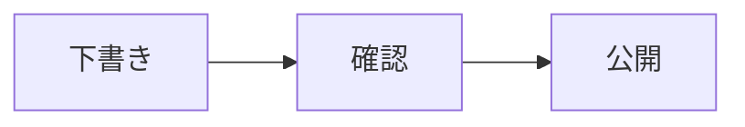

# Nilay Knowledge

<!-- cspell:words NFKC licence -->

`@sasakiuri/nilay-knowledge` is the Next.js website at <https://knowledge.nilay.jp>.

Use Node 22.22.2 or newer and npm 10.9.4. Run commands from the repository root:

```bash
npm ci
npm run dev --workspace=@sasakiuri/nilay-knowledge
npm run lint --workspace=@sasakiuri/nilay-knowledge
npm run typecheck --workspace=@sasakiuri/nilay-knowledge
npm run test:coverage --workspace=@sasakiuri/nilay-knowledge
npm run build --workspace=@sasakiuri/nilay-knowledge
npm run start --workspace=@sasakiuri/nilay-knowledge
```

The development and production servers listen on port 3000. Build generates the
RSS feed and sitemap in `public/`, then builds Next.js into `.next/`. This committed
version uses a Next.js server, including `/api/og`; it does not export `out/`.
The inherited Firebase configuration is retained as historical configuration and
is not a deployment pipeline for this build. Hosting and DNS are unchanged by
this import.

Optional environment variables are `NEXT_PUBLIC_GA_MEASUREMENT_ID` and
`NEXT_PUBLIC_FACEBOOK_APP_ID`. Set them before building; Turbo includes both in
the build cache key. `ANALYZE=true npm run build --workspace=@sasakiuri/nilay-knowledge`
enables the bundle analyzer. Text uses system fonts, so reading does not require
downloading Japanese web fonts and builds do not contact Google Fonts.

Articles and news live in `content/`; their committed public copies live in
`public/content/`. When editing content or assets, keep the public copies in sync.
Use `npm run new:article --workspace=@sasakiuri/nilay-knowledge -- "Title"` or
`npm run new:news --workspace=@sasakiuri/nilay-knowledge -- "Title"` to create entries.
The creation commands reserve a new directory before writing, add a numeric suffix
when the slug already exists, and write UTC timestamps. Article slugs use Unix
seconds; news slugs use the local calendar date.

## Content architecture

`app/` composes pages from server data and presentation components. Content access
is divided into explicit boundaries under `lib/content/`:

| Module                  | Responsibility                                                                 |
| ----------------------- | ------------------------------------------------------------------------------ |
| `types.ts`              | Shared metadata, summary, source, rendered document and TOC contracts          |
| `repository.ts`         | File enumeration, reads, metadata validation and publication ordering          |
| `render.ts`, `paths.ts` | Markdown rendering, relative asset URLs and heading anchors                    |
| `images.ts`             | Intrinsic dimensions of published local images, injected by the server adapter |
| `server.ts`             | Server-only Next.js adapter with request-scoped React memoization              |
| `metadata.ts`           | Canonical, Open Graph, Twitter and RSS discovery metadata                      |
| `publication.ts`        | RSS and sitemap serialization from validated content                           |

The repository takes a content directory explicitly and has no dependency on
React or Markdown rendering. `list()` returns summaries without bodies or HTML;
`read()` and `listSources()` return validated Markdown sources. The server adapter
shares source reads between page metadata and detail rendering. The news page
loads summaries once and filters them into its existing categories. The curated
article index and reading order are shared in `lib/content/navigation.ts`.

The [metadata validator](lib/content/frontmatter.ts) requires `title`, `published` and `tags`. Dates accept `YYYY-MM-DD` or ISO
timestamps with a timezone, and invalid calendar dates fail validation. `updated`
and `image` are optional for both collections. Invalid metadata reports the source
file and field; I/O and parsing failures propagate. Slugs must be single URL
segments made of letters, digits, underscores and hyphens, starting with a letter
or digit. The server adapter treats invalid public route segments as missing
content, so metadata and detail pages return the normal not-found response.
The build generates detail pages from the enumerated content entries;
rebuild the production site after changing content.

Rendering operates on the parsed HTML tree. Relative links and images, including
Markdown references and embedded HTML, resolve under `/content/<type>/<slug>/`.
Code examples, URI schemes, root paths and fragment links keep their meaning.
The TOC uses the same heading IDs as the generated HTML, including repeated and
formatted headings. GitHub alerts are processed before soft line breaks. Raw HTML
is intentionally supported for trusted, reviewed repository content; this renderer
is not an upload or user-input sanitization boundary.

The feed and sitemap scripts use the same repository as pages. They resolve paths
from their own locations and also work when invoked directly from the repository
root. Sitemap detail entries use `updated ?? published`; static pages omit an
invented modification date. Public asset copies remain committed and require the
synchronization described above.

Regression tests exercise temporary content directories, the real Markdown
pipeline, all committed article TOC targets, feed/sitemap URL parity, metadata,
and content creation from a different working directory. Run package tests,
lint, typecheck and build after changing a content boundary.

## Reading, search and printing

Following Saika Docs, the header theme menu offers light, dark and system modes.
The default follows the device setting; an explicit choice is saved in this
browser under `knowledge-theme` and retained across pages and reloads. The same
palette covers article text, tables, search and mobile menus. Printing always
uses a light background, including when the screen uses dark mode.

Article footers offer previous/next links in the curated article index order,
across category boundaries, plus a link back to the index. The news landing page
is excluded from this sequence. Articles outside the curated index still link
back to the index; add them to `lib/content/navigation.ts` to include them in the
reading order. The news collection retains its publication-date ordering.

The header and home page open the same search dialog. `Ctrl+K` or `Cmd+K` opens
it from any page, `Esc` closes it, and Tab moves through the results. Search covers
article and news titles, tags, headings and Markdown body text. Results link to
the matching section using the same heading IDs as the rendered page. Attached
PDFs and image contents are not indexed.

Following Saika Docs, MiniSearch runs in the browser with Japanese characters and
bigrams, NFKC normalization and boosted heading/title matches. Multiple
search terms must all match. The static `/search-index.json` route uses the
validated content repository and the existing Markdown parser, excluding HTML
markup, scripts and hidden text. The dialog downloads the index on first open,
reuses it until the page is reloaded, and offers a retry on download or validation
failure. A worker downloads, validates and indexes the data, then performs searches
and returns only the top 20 excerpts and the total count. The search engine and its
index are loaded only when search first opens; indexing does not block typing or
dialog controls. Rebuild after changing content to update both pages and the search index.

Use “ページを印刷” or `Ctrl+P` / `Cmd+P` on an article or news item. This opens
collapsed content and waits for every article image to load and decode before
opening the print dialog. Loading failures are announced and can be retried;
navigating away cancels preparation. The browser's own print menu cannot wait for
asynchronous preparation: check its preview and reopen it after images load, or use
the page's print button. The print layout
hides navigation, search, sharing and heading-link controls, expands the article
to the page width, wraps tables and code, and retains the footer's attribution and
license notice. On screen, wide tables and code blocks can be focused and scrolled
with the keyboard. Collapsed article details open for printing and return to their
previous state afterward. Check the print preview for unusually large images or tables.

## Performance checks

Home images use Next.js responsive image optimization, with the banner preloaded.
Article images keep their original URLs and full-resolution zoom; dimensions are
read from published local assets during generation to reserve space. The first
image loads eagerly, subsequent images load lazily, and author-provided loading,
decoding and dimensions are respected. Image paths are confined to `public/content`,
including symlink resolution. Missing or external images keep their existing URLs
without inferred dimensions; errors while reading local image dimensions fail the build.

The browser suite checks deferred image loading, image dimensions, search-worker
creation and reuse, and responsive home images. Run the reproducible browser
benchmark against a production server as described in [PERFORMANCE.md](PERFORMANCE.md).

## Accessibility checks

Keyboard users can skip to the main content, follow the table of contents, enlarge
standalone article images, search, and share a page. Dialogs keep focus inside and
return it to their opener on dismissal; selecting a search result focuses the
matching section. Informative image descriptions remain visible in the viewer.
Linked images retain their original links. Reduced-motion and forced-color system
preferences are respected, and focus indicators work on both light and dark surfaces.

Following an internal page link moves reading focus to the new page title or the
linked section; browser history retains its scroll restoration. Search retries
return focus to the input. Header and theme controls reflow with enlarged text,
and article anchor offsets follow the actual header and TOC heights. Comparison
illustrations keep their light canvas in dark mode and the image viewer. The
species guide exposes each species as a heading and searchable section, and the
licence examination tables explicitly associate data cells with their headings.

Run the regression suite against a fresh production build:

```bash
npm run test:coverage --workspace=@sasakiuri/nilay-knowledge
npm run test:install --workspace=@sasakiuri/nilay-knowledge
npm run build --workspace=@sasakiuri/nilay-knowledge
npm run test:e2e --workspace=@sasakiuri/nilay-knowledge
```

Playwright starts an isolated server on port 3275. Chromium, Firefox and a 320px
viewport check every article and representative other pages in light/dark modes,
plus page-navigation focus, keyboard navigation, search recovery, modal focus,
200% root text sizing with increased text spacing, reduced motion, forced colors
and print-image visibility. Axe checks
WCAG 2.2 A/AA rules and best practices without excluded rules. CI runs this suite
for changes affecting this package and retains failure traces and screenshots.

Automated checks do not establish WCAG conformance. Manual release checks should
include NVDA/Firefox or VoiceOver/Safari reading order, Japanese labels and status
announcements, browser-native 200% text size/400% zoom, and whether image descriptions convey the
information needed to understand the article. Downloaded PDFs and third-party
pages need their own accessibility review. See the [WAI dialog pattern](https://www.w3.org/WAI/ARIA/apg/patterns/dialog-modal/)
and [reflow guidance](https://www.w3.org/WAI/WCAG22/Understanding/reflow.html).

## Markdown diagrams and code

Code fences support a language and optional filename, following Saika Docs.
Both `ts:example.ts` and `ts filename="example.ts"` display a filename header.
Each block has a copy button that copies the original code, including whitespace;
clipboard failures display a message so the code can be selected manually.
Unknown languages remain readable as plain text. Syntax highlighting and KaTeX
styles are included for code and mathematical expressions.

````markdown
```ts:example.ts
const message = 'Hello';
console.log(message);
```




数式は $x^2 + y^2 = r^2$ のように記述できます。
````

`mermaid`, `dot` and `graphviz` fences become diagrams. Diagram engines load only
on pages containing diagrams; each uses a light canvas in either theme. The SVG
output is sanitized, and Mermaid uses strict security mode. Diagram source is
limited to 20,000 characters, and Graphviz runs in a worker with a ten-second
limit. Invalid syntax or rendering failures show an error and the source.
Without JavaScript, source blocks remain available in the initial HTML. After a
successful render, the source can be expanded with “図のソース”. Print uses the
rendered diagram, or its source if rendering has not completed.

## Import provenance

Imported only committed files from `sasakiuri/nilay` at
`cf622d7ce7b001dd0f4d9fd86138a2415fc03b82`, under `packages/knowledge.website/`.
The 34 commits affecting that directory retain their authors and timestamps;
paths are relocated and messages use Conventional Commits with the
`nilay-knowledge` scope. Each imported commit has a `Nilay-Commit` trailer with
its original hash. Original PR references are marked `nilay#` to distinguish
them from this repository. No uncommitted changes from Nilay were imported.
The 34 imported commits follow the existing OSS history in a linear sequence.
A final integration commit contains the workspace adjustments.

This private website package is versioned independently from the Saika suite.
It is not published to npm. Changesets can track future package changes.

## Licenses and content attribution

The software retains the original Nilay [MIT license](LICENSE). The package
metadata lists both MIT for the software and CC BY-SA 4.0 for the site text.

The original site footer states that its text, unless individually marked
otherwise, is published by Nilay under CC BY-SA 4.0. That attribution and all
individual content and asset notices are retained. The repository's MIT license
does not replace these existing content terms or individual image/PDF notices.
See [the original license notice](components/footer.tsx).
