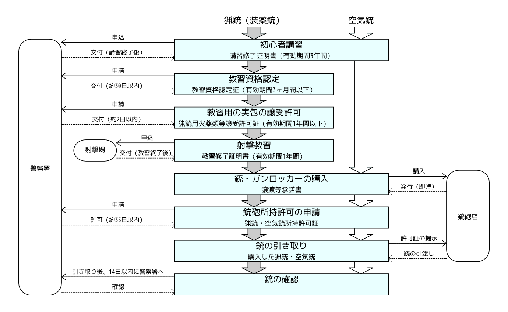
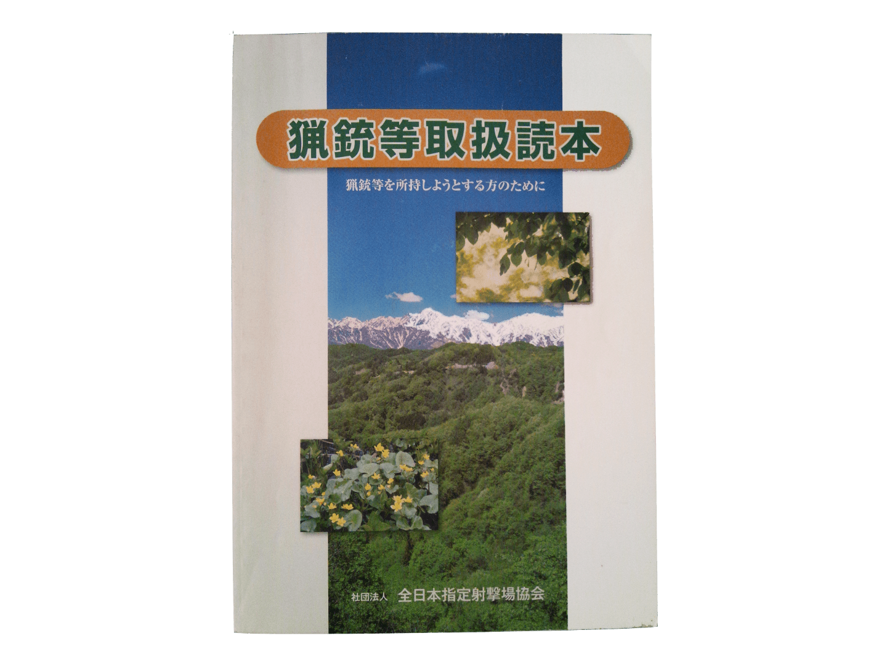

日本国内で銃砲を購入（入手）し所持するためには、猟銃・空気銃所持許可というものが必要です。このページでは、初めて空気銃・猟銃（装薬銃）を所持しようとする方が、銃の所持許可を取得するまでの手順について説明しています。各種申請・申込に必要な書類は、申請・申込書類一覧のページにあります。

<small>※2015 年 3 月 1 日より施行された銃刀法施行規則等の改正に対応しました。</small>

図 1 猟銃・空気銃を所持するまでの流れ

# 所持許可制について 〜銃砲所持の条件〜

**許可の要件**　銃砲を購入し所持するためには、所持（購入）しようとする銃の所持許可というものを受ける必要があります。 空気銃の場合は 18 歳以上、猟銃（散弾銃・ハーフライフル・ライフル銃などの装薬銃のこと）の場合は 20 歳以上 の方で、以下の*人的欠格事由*に該当しなければ、誰でも銃の所持許可を受けることができます。

  
人的欠格事由

  

    <ul>
      <li>1　破産手続開始の決定を受けて復権を得ない者</li>
      <li>2　精神障害もしくは発作による意識障害をもたらしその他銃砲もしくは刀剣類の適正な取扱に支障を及ぼす恐れがある病気として政令で定めるものに罹っている者、または介護保険法第８条第１６項に規定する認知症である者</li>
      <li>3　アルコール、麻薬、大麻、アヘンまたは覚せい剤の中毒者</li>
      <li>4　自己の行為の是非を判別し、またはその判別に従って行動する能力がなく、または著しく低い者</li>
      <li>5　住居の定まらないもの</li>
      <li>6　所持許可の取消処分を受けた日から５年（銃刀法第１１条第１項第４号により取消されたものは１０年）を経過していないもの</li>
      <li>7　所持許可の取消処分に係る聴聞の期日および場所が公示された日から当該処分をする日または当該処分をしないことを決定する日までの間に当該処分に係る銃砲または刀剣類を譲り渡し、その他自己の意思に基いて所持しないこととなった日から５年（銃刀法第１１条第１項第４号により取消されたものは１０年）を経過していない者</li>
      <li>8　年少射撃資格の認定を取消された日から５年（銃刀法第１１条の３第１項第３号により取り消されたものは１０年）を経過していない者</li>
      <li>9　禁錮以上の系に処せられた者で、その刑の執行を終わり、または執行を受けることがなくなった日から５年を経過していない者</li>
      <li>10　銃刀法もしくはこれに基づく命令の規定もしくはこれらに基づく処分に違反し、または猟銃用火薬類等について同法もしくはこれに基づく命令の規定もしくはこれらに基づく処分に違反して罰金の系に処せられ、その刑の執行を終わり、または執行を受けることがなくなった日から５年を経過していない者</li>
      <li>11　猟銃の所持許可を受けようとする者で、人の生命または身体を害する罪または銃砲刀剣類等を使用して当該罪以外の罪以外の凶悪な罪（それぞれ死刑または無期懲役もしくは長期３年以上の懲役もしくは金庫に当たるものに限る）で政令で定めるものに当たる違法な行為をして１０年を経過していない者</li>
      <li>ストーカー行為等の規制等に関する法律第２条第２項に規定するストーカー行為をし、同法第４条第１項の規定による警告を受け、または同法第５条第１項の規定による命令を受けたいずれかの日から３年を経過していない者</li>
      <li>12　11に掲げる違法な行為をして罰金以上の刑に処せられた者で、その刑の執行を終わり、または執行を受けることがなくなった日から５年を経過していない者</li>
      <li>13　集団的に、または常習的に暴力的不法行為その他の罪に当たる違法な行為であって国家公安委員会規則で定めるものを行う恐れがあると認めるに足りる相当な理由がある者</li>
      <li>14　他人の生命、身体もしくは財産もしくは公共の安全を害し、または自殺をする恐れがあると認めるに足りる相当な理由がある者</li>
      <li>15　所持許可の申請に当たって、申請書またはその添付書類の中の重要な事項について虚偽の記載をし、または事実を記載しなかったもの</li>
    </ul>
  

初めて銃砲の所持許可を受けようとする場合は、空気銃かライフル銃以外の猟銃（散弾銃・ハーフライフル）の所持許可を受けることができます。 （銃砲の種類・型式などの分類については「 [銃砲の種類と型式について](/articles/1403941906)」を参考にしてください。） ライフル銃の所持許可を受ける めには、標的射撃用途に供する場合はライフル射撃協会の推薦、 狩猟用途に供する場合は 10 年以上の継続した猟銃所持歴などの特別な条件が必要です。 （[参考： ライフル銃の所持許可取得](/articles/1379069901)）

**所持することのできる銃**　どのような銃でも所持できるわけではなく、銃の形状や機構に制限があります。 まず、次のような銃は所持することができません。

- 変装銃（仕込み銃など）
- 機関部・銃身部に著しい欠陥のある銃
- 連続自動撃発式の銃（フルオートの銃）
- 消音装置が取り付けられている銃

これに加えて、弾倉内に充填できる実包（弾丸）の数[\[表 1\]](#tbl:弾倉の制限)、口径の長さ[\[表 2\]](#tbl:口径の長さの制限)、銃の全長・銃身長[\[表 3\]](#tbl:銃の全長と銃身長の制限)に制限があります。 具体的には、弾倉内にライフル銃・空気銃については 6 発以上、ライフル銃以外の猟銃については 3 発以上装填できるもの、口径が大きすぎるもの、銃の全長・銃身長が短すぎるものは所持できません。

表 1 弾倉内弾数の制限

| 種類                   | 弾倉内弾数の制限 |
| :--------------------- | :--------------- |
| 散弾銃・ハーフライフル | 2 発以下まで     |
| ライフル銃・空気銃     | 5 発以下まで     |

表 2 口径の長さの制限

| 区分                     | ライフル銃  | 　散弾銃 ハーフライフル | 空気銃   |
| :----------------------- | :---------- | :------------------------- | :------- |
| 一般の銃                 | 10.5mm 以下 | 12 番以下                  | 8mm 以下 |
| 大型獣類の捕獲に供する銃 | 12.0mm 以下 | 8 番以下                   | –        |

表 3 銃の全長と銃身長の制限

| 種類   | 銃の全長                                                                            | 　銃身長             |
| :----- | :---------------------------------------------------------------------------------- | :------------------- |
| 猟銃   | 93.9 cm を超えるもの <small>(標的射撃用ライフルは 83.9 cm を超えるもの) </small> | 48.8 cm を超えるもの |
| 空気銃 | 79.9 cm を超えるもの                                                                | –                    |

**許可制について** 　自動車や小型船舶の免許とは異なり、銃を所持しようとする場合は銃砲それぞれに対して事前に個別の所持許可が必要です。 （これは初心者であろうが、既に銃を持っている者であろうが一緒です。） また、標的射撃・狩猟・有害鳥獣駆除といった限られた目的でのみ許可を受けることができます。 なお、狩猟を行う場合は、銃の所持許可とは別に[狩猟免許を取得する](/articles/1403944258)必要がありますが、狩猟免許の取得と所持許可の取得はどちらが先でも構いません。

表 4 　自動車免許と銃の銃所持許可との違い

| 自動車免許の場合                         | 銃の所持許可の場合                           |
| :--------------------------------------- | :------------------------------------------- |
| 免許があれば、好きな車を公道で運転できる | 自分が許可を受けた銃砲しか所持できない       |
| 免許がなくても車を購入し、所持できる     | 事前に許可がなければ銃砲を購入・所持できない |
| 他人の車を使用できる                     | 自分が許可を受けた銃砲以外は使用できない     |
| コレクション用として入手することができる | 限られた用途でしか許可を受けることができない |

上でも述べた通り、新規に銃を取得する場合も、既に銃を所持している方が追加で銃を取得する場合も、単に警察へ行って銃砲所持許可の申請を行うだけです。 しかし、申請の際に必要な添付書類の中には、講習や教習を受けなければ取得できないものがあります。 空気銃の場合は猟銃等講習（講習修了証明書）を修了することで、猟銃の場合は猟銃等講習（講習修了証明書）を受講し射撃教習（教習修了証明書）を修了することで添付書類が揃い、それぞれ所持許可の申請が可能になります。

- ※申請・申込に行く際には、前日に電話で問い合わせておくとスムーズにできます。
- ※警察署に行く際は、必ず印鑑を持って行ってください。
- ※全ての書類のコピーをとっておいてください。

# 初心者講習

## 初心者講習への申し込み

初めに猟銃等講習というものを受講します。 経験者講習と初心者講習があるので、初心者講習を選んで受けてください。 開催日程・場所は、各都道府県の公安委員会によって公開されているので、都道府県警察のホームページや電話で確認してください。 例えば、神奈川県の場合は [神奈川県警のホームページ](http://www.police.pref.kanagawa.jp/mes/mesd0072.htm)に予定が掲載されています。 （関連： [関東地方の猟銃等講習・技能講習開催日程](/articles/1414030655)）

銃砲・火薬類関係の全ての申請・申込先は、住所地を管轄する警察署の生活安全課というところです。 また、申請・申込の際に必要となる手数料は、都道府県の [収入証紙](http://ja.wikipedia.org/wiki/%E5%8F%8E%E5%85%A5%E8%A8%BC%E7%B4%99)によって支払います。 証紙の販売場所は都道府県によって異なりますが、例えば自動車免許の更新の際に証紙を購入している場所で購入することができます。

講習会の申込に必要な書類は以下のとおりです。

> **提出先：**住所地を管轄する警察署の生活安全課  
> **手数料：**6800 円（都道府県の収入証紙）
>
> - 猟銃等講習受講申込書：1 通
> - 申込人の写真：1 枚  
>   <small>縦 3.0 cm × 横 2.4 cm 　無帽・無背景で 6 ヶ月以内に撮影したもの（裏面に氏名と撮影日を記載）</small>

申込の際には「猟銃等取扱読本」[\[図 2\]](#fig:猟銃等取扱読本)というものが配布されます。 この教本には書類の形式、様々な申請・申込方法、銃の扱い方や法律に関することが記載されています。 初心者講習はこの読本に沿って行われ、最後には試験を行い合否を判定するので、事前に読んでおくと良いと思います。 （のちのちの許可申請や、更新のときも役に立つはずなので、講習が終わった後も保管しておくことをお勧めします。）

図 2 　猟銃等取扱読本

## 初心者講習の受講

講習当日は午前中に講師による猟銃等取扱読本に沿った講義が行われ、午後に内容の確認のための考査が行われます。 考査の時間は 60 分で、50 問の正誤式です。1 問 1 点で、45 点以上の得点で合格です。 この考査に合格すると、すぐその場で「講習修了証明書」が交付されます。 この講習修了証明書の有効期限は交付から 3 年なので、3 年以内に銃砲所持許可の申請と教習資格認定の申請（猟銃の所持許可を申請しようとする場合のみ）を終える必要があります。

空気銃の所持許可を申請しようとする方は、この講習修了証明書を取得できればすぐに[所持許可の申請](#所持許可の申請)に進めます。 猟銃の所持許可を申請しようとする方は、このあとに次の「射撃教習」を受ける必要があります。

# 射撃教習（猟銃の許可を申請しようとする方のみ）

猟銃の許可を受けようとする場合は、講習修了証明書（有効期間 3 年間）を取得した後、有効期間中に教習資格認定申請を行い射撃教習を受講します。 射撃教習の最後に行われる試験に合格すると「教習修了証明書」を取得することができます。

## 教習資格認定の申請

まずは射撃教習を受けるための資格認定を受けます。申請に必要な書類は次のとおりです:

> **提出先：**住所地を管轄する警察署の生活安全課  
> **手数料：**8900 円（都道府県の収入証紙）  
> **標準処理期間：**30 日以内
>
> - 教習資格認定申請書　 1 通
> - 同居親族書
> - 経歴書
> - かかりつけ医・精神保健指定医等が作成した診断書
>   かかりつけ医とは、申請者に対して作成日以前に 1 回以上の診断を行ったことのある歯科医以外の医師のことを指します。かかりつけ医の診断書を提出する際は、初診日の記載された診察券や過去の領収書等の証明できるものを提示してください。
> - 申請人の写真　 2 枚
>   縦 3.0 cm × 横 2.4 cm 　無帽・無背景で 6 ヶ月以内に撮影したもの（裏面に氏名と撮影日を記載）
> - 身分証明書（市町村役所等で取得してください）
> - 住民票の写し（本籍地の記載のあるもの、市町村役所等で取得してください）
> - 講習修了証明書（提示すればよい）
> - 都道府県の収入証紙 8900 円

申請後、法定の人的欠格事由に該当しないかどうかの審査が行われ、資格認定されると教習資格認定書が発行されます。 この申請の標準処理期間は、30 日を超えない範囲で各都道府県公安委員会によって定められているので、 認定書が発行されるまでは少し時間がかかります。 教習資格認定書の有効期間は３ヶ月間以内で定められているので、 有効期間内に次項の実包の申請と実際の教習射撃に進んでください。

診断書については作成日から 3 ヶ月以内ならば繰り返し他の申請に関して添付できます。所持許可の申請の際にも診断書が必要なので、 もし使いまわすのならばその旨を伝え、診断書を返してもらってください。

## 射撃教習用の装弾の申請

射撃教習では実弾を用いますが、実弾を購入するためには許可が必要です。教習資格認定書の発行後に申請書を提出し、実包の譲受（購入）許可を受けます:

> **提出先：**住所地を管轄する警察署の生活安全課  
> **手数料：**2400 円（都道府県収入証紙）  
> **標準処理期間：**3 日以内
>
> - 猟銃用火薬類等譲受許可申請書　 1 通
> - 教習資格認定書（提示すればよい）

猟銃用火薬類等譲受許可申請書中、実包欄の名称には「12 番」、個数は「100 個」と記載してください。銃の種類及び適合実包欄には「散弾銃」、「12 番紙薬莢」、目的欄には「射撃教習のため」と記載してください。申請が処理されると猟銃用火薬類等譲受許可証が交付されます。この譲受許可証を火薬店や射撃場に提示し、譲受期間内に射撃教習で用いる実包を購入します。装弾は射撃場で販売していることが多いですが一応問い合わせて確認してください。

## 射撃教習への申し込み

射撃教習を開催している射撃場を探し、射撃場に電話で射撃教習を申し込みます。 その際、実包の販売の有無、射撃ベスト等の貸し出しがあるのか、種目、持ち物等を確認しておいて下さい。

## 射撃教習の受講

射撃教習ではまず銃の分解・組立の方法、構え方、注意事項などを教わります。その際にテキストも配られます。 射撃教習で使う銃は射撃場が用意しています。次に実際に構える練習などをしたあと、射台（銃を撃つところ）に入って 1 ラウンド（25 発）の練習を行います。 弾は 2 発入りますが射撃教習では 1 発ずつ撃ちます。また、クレー（標的）は標準より遅く、まっすぐ飛ぶものしか出ません。

練習の後は分解や組立の試験、射撃の試験を行います。射撃の試験では、トラップの場合はクレー 25 枚中 2 枚、スキートの場合は 3 枚命中すれば合格です。 これに合格すると、いよいよ教習修了証明書が交付されます。この証明書の有効期間は 1 年間なので、気をつけてください。

# 所持許可の申請

## 銃・ガンロッカーの購入

銃砲店に行き購入する銃を探します。この際に講習修了証明書、教習修了証明書（猟銃の場合のみ）を持って行ってください。 購入する銃が決まったら、銃砲店から譲渡等承諾書を受け取ってください。ガンロッカーも所持許可の申請の前に購入・設置しておいてください。 猟銃の所持許可を申請をしようとする方は装弾ロッカーも必要です。

## 所持許可の申請

今までに入手したアイテムを持って所持許可の申請に行きます。

> **提出先：**住所地を管轄する警察署の生活安全課  
> **手数料：**10500 円（都道府県収入証紙）  
> **標準処理期間：**35 日以内
>
> - 銃砲所持許可申請書　 1 通
> - 同居親族書[\[※1\]](#remarks1)
> - 経歴書[\[※1\]](#remarks1)
> - かかりつけ医・精神保健指定医等が作成した診断書[\[※2\]](#remarks2)
>   かかりつけ医とは、申請者に対して作成日以前に 1 回以上の診断を行ったことのある歯科医以外の医師のことを指します。かかりつけ医の診断書を提出する際は、初診日の記載された診察券や過去の領収書等の証明できるものを提示してください。
> - 申請人の写真　 2 枚
>   縦 3.0 cm × 横 2.4 cm 　無帽・無背景で 6 ヶ月以内に撮影したもの（裏面に氏名と撮影日を記載）
> - 身分証明書（市町村役所で取得してください）[\[※1\]](#remarks1)
> - 住民票の写し（市役所で入手してください）[\[※1\]](#remarks1)
> - 譲渡等承諾書（銃砲店から取得してください）
> - 講習修了証明書（提示すればよい）
> - 教習修了証明書（猟銃の方のみ、提示すればよい）
>
> <small>**備考：**</small>  
> <small id="remarks1">※1：猟銃の所持許可を申請をしようとする方は、教習修了証明書の交付から 1 年以内ならば、住民票の写し・身分証明書・経歴書・同居親族書の添付を省略できます。</small>  
> <small id="remarks2">※2：猟銃の所持許可の申請をしようとする方は、診断書の作成日から起算して 3 ヶ月以内ならば、教習資格認定の申請の際に添付した診断書を再度添付することができます。</small>

この申請の標準処理期間は、35 日を超えない範囲で各都道府県公安委員会が定めています。 申請後、警察官が保管設備の確認に来ます。 無事許可が下りたら警察署に許可証を受け取りに行きます。

## 銃の引き取りと確認

警察署で許可証を受け取ったら、銃砲店に所持許可証を持って行き、購入した銃を引き取ります。 銃を受け取ってから 14 日以内に住所地を管轄する警察署に行き、許可証の記載事項に間違いがないかの確認を行います。

## 銃の使用

手に入れた銃を標的射撃や狩猟などに使用しましょう。射撃場で撃つためには実包が必要ですが、 教習射撃のときと同じように火薬類の譲受許可を申請してください。最初に 800 個程度を上限としているみたいです。 また長い間使用していない銃は「眠り銃」と呼ばれ、更新ができなくなる場合があります。もし忙しければ 1 年に 1 回程度で十分です。

# 参考

- 平成 27 年 5 月 1 日付警察庁丁保発第 101 号, 猟銃等講習会における考査の運用要領について（通達）
