狩猟の対象となる鳥獣（狩猟鳥獣）の一覧を掲載しています。 また、各狩猟鳥獣の判別方法（色や形の比較、習性）や、それぞれの分布・形態・習性などを図鑑としてまとめました。

# 狩猟鳥獣の一覧

[鳥獣の保護及び管理並びに狩猟の適正化に関する法律の第二条第七項](https://elaws.e-gov.go.jp/search/elawsSearch/elaws_search/lsg0500/detail?lawId=414AC0000000088#5) に基いて、[鳥獣の保護及び管理並びに狩猟の適正化に関する法律施行規則第三条](hhttps://elaws.e-gov.go.jp/search/elawsSearch/elaws_search/lsg0500/detail?lawId=414M60001000028#16)の別表第二に掲げられている狩猟鳥獣の一覧です。

日本には鳥類が550種以上、獣類が約80種（ネズミ・モグラ類、海棲哺乳類を含めると約160種）生息していますが、そのうちの鳥類28種、獣類20種、計48種が狩猟鳥獣に指定されています。

[狩猟鳥獣スライドショー (Nilay/About)](https://about.nilay.jp/labs/game-species-test)

※一覧中のイラストは[大日本猟友会のウェブサイト](https://www.moriniikou.jp/index.php?itemid=35)に掲載されているもので、狩猟免許試験における鳥獣判別の考査では、これらの図画と同じ図で出題されます。ただし、ウェブサイトに掲載されている以下のイラストたちは、実際の試験で用いられる図を多少トリミングしてあるようです。

## 狩猟鳥（28種）

  
カモ目

  

[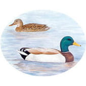  マガモ](#マガモ)

  

  

[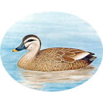  カルガモ](#カルガモ)

  

  

[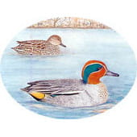  コガモ](#コガモ)

  

  

[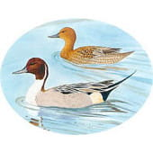  オナガガモ](#オナガガモ)

  

  

[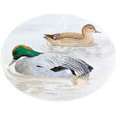  ヨシガモ](#ヨシガモ)

  

  

[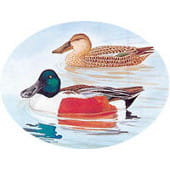  ハシビロガモ](#ハシビロガモ)

  

  

[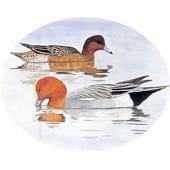  ヒドリガモ](#ヒドリガモ)

  

  

[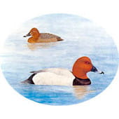  ホシハジロ](#hoshihajiro)

  

  

[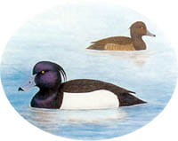  キンクロハジロ](#kinkurohajiro)

  

  

[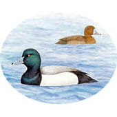  スズガモ](#suzugamo)

  

  

[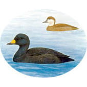  クロガモ](#kurogamo)

  

  
キジ目

  

[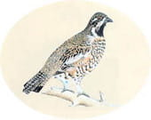  エゾライチョウ](#ezoraicho)

  

  

[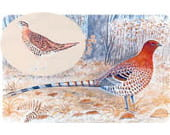  ヤマドリ](#yamadori)

  

  

[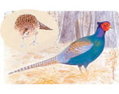  キジ](#kiji)

  

  

[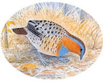  コジュケイ](#kojukei)

  

  
スズメ目

  

[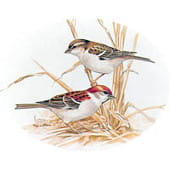  ニュウナイスズメ](#nyunaisuzume)

  

  

[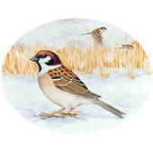  スズメ](#suzume)

  

  

[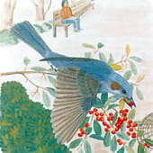  ヒヨドリ](#hiyodori)

  

  

[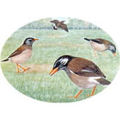  ムクドリ](#mukudori)

  

  

[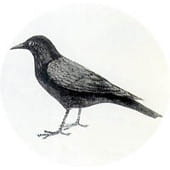  ハシボソガラス](#hashibosogarasu)

  

  

[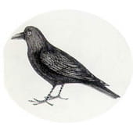  ハシブトガラス](#hashibutogarasu)

  

  

[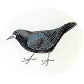  ミヤマガラス](#miyamagarasu)

  

  
チドリ目

  
ハト目

  
ペリカン目

  

[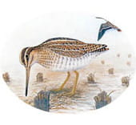  タシギ](#tashigi)

  

  

[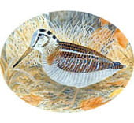  ヤマシギ](#yamashigi)

  

  

[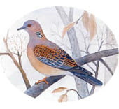  キジバト](#kijibato)

  

  

[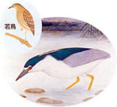  ゴイサギ](#goisagi)

  

  
ツル目

  
カツオドリ目

  

        

  

[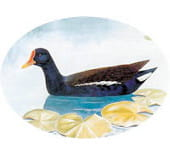  バン](#ban)

  

  

[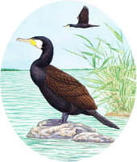  カワウ](#kawau)

  

## 狩猟獣（20種）

  
ネコ目

  
  

[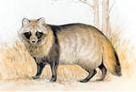  タヌキ](#タヌキ)

  

  

[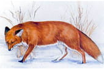  キツネ](#キツネ)

  

  

ノイヌ[^※1]

  

  

ノネコ[^※1]

  

[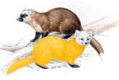  テン](#テン)

  

  

[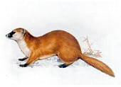  イタチ（オス）](#イタチ)

  

  

[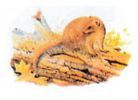  ミンク](#ミンク)

  

  

[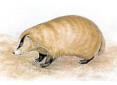  アナグマ](#アナグマ)

  

  

[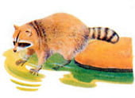  アライグマ](#アライグマ)

  

  

[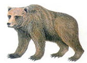  ヒグマ](#ヒグマ)

  

  

[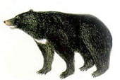  ツキノワグマ](#ツキノワグマ)

  

  

[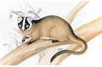  ハクビシン](#ハクビシン)

  

  
ネズミ目

  
ウサギ目

  

[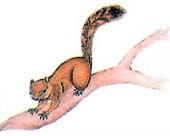  タイワンリス](#タイワンリス)

  

  

[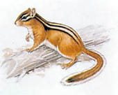  シマリス](#シマリス)

  

  

[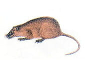  ヌートリア](#ヌートリア)

  

  

[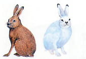  ノウサギ・ユキウサギ](#ノウサギ)

  

ウシ目

  

[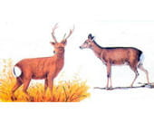  ニホンジカ](#ニホンジカ)

  

  

[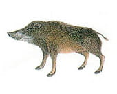  イノシシ](#イノシシ)

  

[^※1]: イヌとネコのうち野生化したもので、山野で自活しているのもをノライヌ・ノラネコと区別してノイヌ・ノネコと呼びます。

# 判別方法と習性

## 判別方法

### カモ類の判別

**陸ガモと海ガモ**　カモの仲間は、大まかに陸ガモ（淡水ガモ類）と海ガモ（潜水ガモ類）に分類することができます。 「陸」や「海」とついていますが、陸ガモは陸に、海ガモは海にいるわけではなく、どちらも湖沼・池・川・海岸・内湾等に生息しています。 これらの判別方法として、陸ガモと海ガモは図1のように尾がどの程度水面に近いかで大体見分けることができます。

<figure>
  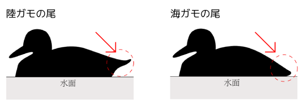
  <figcaption>図1　陸ガモと海ガモの尾の比較</figcaption>
</figure>

図1では、陸ガモの尾は水面より上に持ち上がり、海ガモの尾は水面近くに描かれています。

また、陸ガモと海ガモでは水面からの飛び立ち方が異なります。 陸ガモはほぼ垂直に急な角度で一気に飛び立ちますが、海ガモは助走をつけて水面を滑走するようにして飛び立ちます。

**模様や色による判別**　狩猟期間になるとカルガモを除くカモのオスは、鮮やかな色とそれぞれ独特の模様になります。 メスの判別は難しいですが、オスと一緒にいることが多いので、オスの判別を参考にメスを判別することができます。 また、ハシビロガモの嘴、オナガガモの尾、ヨシガモの冠羽といったような特徴を覚えていれば容易に見分けられます。

<figure>
  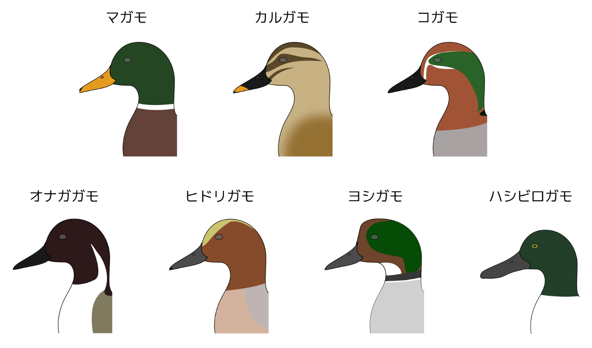
  <figcaption>図2　陸ガモたちの頭部の比較</figcaption>
</figure>

図2では、マガモは緑色の頭と黄色い嘴、カルガモは褐色の頭と先端が黄色い黒い嘴、コガモは茶色の頭と目の周りから後頭部へ伸びる緑色の模様、オナガガモはこげ茶色の頭と首の横の白い線、ヒドリガモは茶色の頭と黄色い額、ヨシガモは緑色の後頭部と白い喉、ハシビロガモは緑色の頭と幅広い黒い嘴が描かれています。

# 形態と生態

## 狩猟鳥

**陸ガモ**　[マガモ](#マガモ) | [カルガモ](#カルガモ) | [コガモ](#コガモ) | [オナガガモ](#オナガガモ) | [ヨシガモ](#ヨシガモ) | [ハシビロガモ](#ハシビロガモ) | [ヒドリガモ](#ヒドリガモ)  
**海ガモ**　[ホシハジロ](#hoshihajiro) | [キンクロハジロ](#kinkurohajiro) | [スズガモ](#suzugamo) | [クロガモ](#kurogamo)  
**キジ目**　[エゾライチョウ](#ezoraicho) | [ヤマドリ](#yamadori) | [キジ](#kiji) | [コジュケイ](#kojukei)  
**スズメ目**　[ニュウナイスズメ](#nyunaisuzume) | [スズメ](#suzume) | [ヒヨドリ](#hiyodori) | [ムクドリ](#mukudori) | [ハシボソガラス](#hashibosogarasu) | [ハシブトガラス](#hashibutogarasu) | [ミヤマガラス](#miyamagarasu)  
**その他鳥類**　[タシギ](#tashigi) | [ヤマシギ](#yamashigi) | [キジバト](#kijibato) | [バン](#ban) | [カワウ](#kawau)

  

<h3 id="マガモ">マガモ</h3>

カモ目カモ科マガモ属 （→ [ウィキペディア：マガモ](http://ja.wikipedia.org/wiki/%E3%83%9E%E3%82%AC%E3%83%A2)）  
（漢字：真鴨、英名：mallard、学名：*Anas platyrhynchos*）  
【大きさ】全長は約60cm。  
【分布】主に冬鳥であるが、一部少数は本州中部以北の湖沼で繁殖。主に湖沼・河川・内湾に生 息し、 周辺の草地で繁殖・営巣をする。  
【形態】陸ガモに分類される。オスについては、頭部は光沢のある緑色、首から胸にかけ ては褐色、体は灰色、尾の部分が黒く、首には白い首輪のような模様がある。嘴は黄色で先端が 黒色、足は橙色。  
【捕獲制限】カモ類の合計は1日5羽まで。網猟においては狩猟期間を通じてカモ類の合計は200 羽まで。

  

  

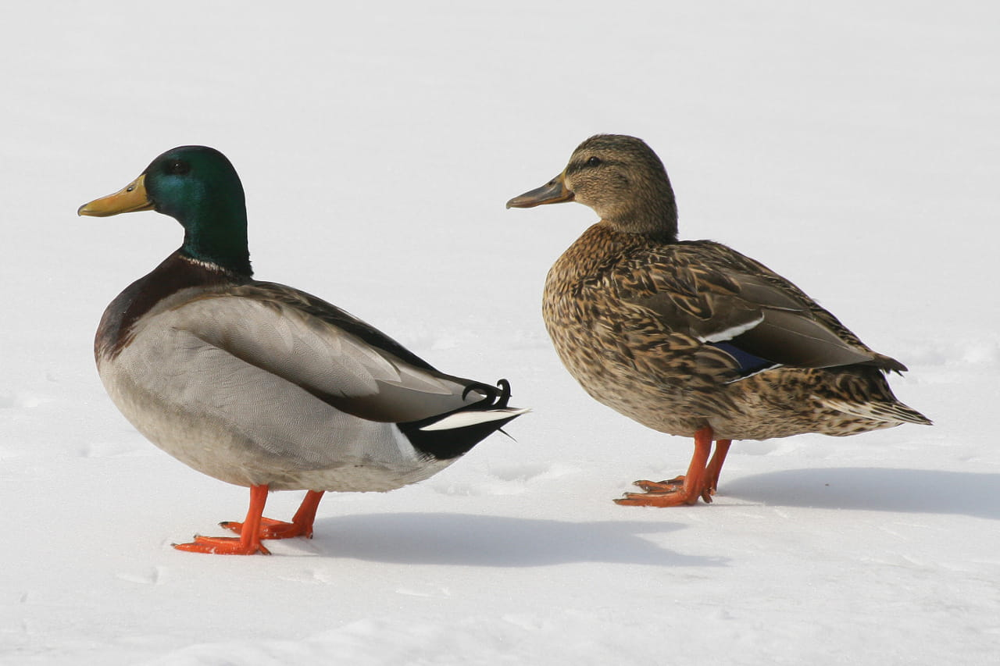
マガモのペア  
<small>[CC](http://creativecommons.org/licenses/by-nc/2.0/)
[<cite>Mallard Ducks (Anas platyrhynchos)</cite>](http://www.flickr.com/photos/sankax/3328332881)
(2009) by [Andreas Trepte](http://www.flickr.com/photos/sankax/)</small>

  

  

<h3 id="カルガモ">カルガモ</h3>

カモ目カモ科マガモ属 （→ [ウィキディア：カルガモ](http://ja.wikipedia.org/wiki/%E3%82%AB%E3%83%AB%E3%82%AC%E3%83%A2)）  
（漢字：軽鴨、英名：spotbill、学名：*Anas poecilorhyncha*）  
【大きさ】全長は約60cm。  
【分布】全国的に分布する留鳥または漂鳥。主に湖沼・河川・内湾に生息し、水辺近くの草むらで営巣する。  
【特徴・習性】陸ガモに分類される。オスとメスはほとんど同じ色をしている。体は褐色で全体に黒 い斑点があり、体の後ろほど黒味が増す。顔には薄い褐色で、顔を横切るように2本の黒い線がある。 頭頂部から首の後ろにかけては褐色。三列風切は白色で、翼鏡が光沢のある青色。嘴は黒く先端が黄 色い。足は橙色。  
【捕獲制限】カモ類の合計は1日5羽まで。網猟においては狩猟期間を通じてカモ類の合計は200羽まで。

  

  

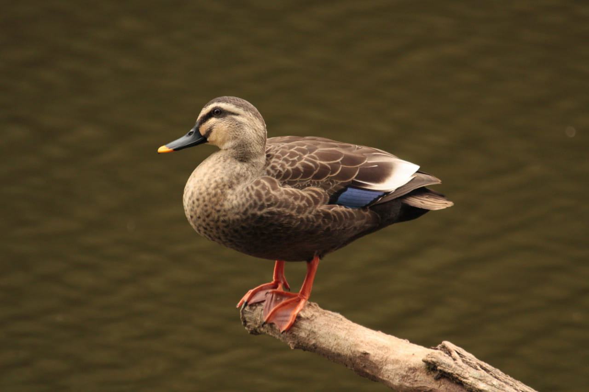
カルガモ（雌雄同色）  
<small>[CC](http://creativecommons.org/licenses/by-nc/2.0/)
2010 by [ Aaron Maizlish](http://www.flickr.com/photos/amaizlish/)  
[CC551 - Eastern Spot-billed Duck ---](http://www.flickr.com/photos/amaizlish/7280242290)</small>

  

  

<h3 id="コガモ">コガモ</h3>

カモ目カモ科マガモ属 （→ [ウィキペディア：コガモ](http://ja.wikipedia.org/wiki/%E3%82%B3%E3%82%AC%E3%83%A2)）  
（漢字：小鴨、英名：common teal、学名：*Anas crecca*）  
【大きさ】全長は約40cm。  
【分布】主に冬鳥で、一部は本州中部以北で繁殖。主に湖や河川等の淡水に生息し、水辺近くの草む らで営巣する。  
【特徴・習性】陸ガモに分類される。オスについては、頭部が赤褐色で眼の周りは光沢のある緑色。 胸から腹にかけては淡褐色で黒い斑が見られる。体は灰色で腰には淡黄色の斑がある。嘴と足は黒色  
【捕獲制限】カモ類の合計は1日5羽まで。網猟においては狩猟期間を通じてカモ類の合計は200羽まで。

  

  

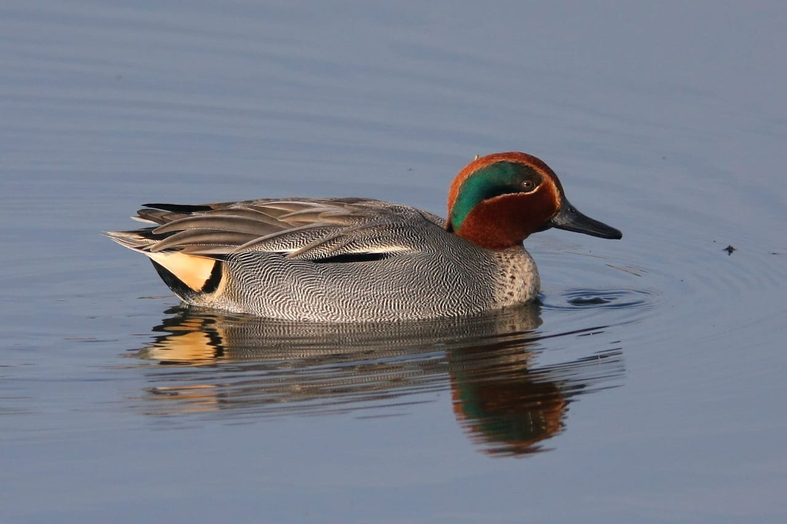
コガモのオス  
<small>[CC](http://creativecommons.org/licenses/by-nc/2.0/)
[<cite>Teal (Anas crecca)</cite>](http://www.flickr.com/photos/markkilner/3254016122)
(2009) by [Mark Kilner](http://www.flickr.com/photos/markkilner/)</small>

  

  

<h3 id="オナガガモ">オナガガモ</h3>

種類属 （→ [ウィキペディア：オナガガモ](http://ja.wikipedia.org/wiki/%E3%82%AA%E3%83%8A%E3%82%AC%E3%82%AC%E3%83%A2)）  
（漢字：尾長鴨、英名：pintail、学名：
*Anas acuta*）  
【大きさ】全長はオスが約75cm、メスが約50cm。  
【分布】冬鳥で全国的に分布。主に湖沼・河川・内湾に生息している。  
【特徴・習性】陸ガモに分類される。首と尾が長いのが特徴。オスについては、頭部が濃褐色、頭の 横から首、胸、腹の中央にかけては白色。体は灰色で腰に淡黄色の斑がある。嘴は黒色で両側面が青 みがかった灰色、足は黒色。  
【捕獲制限】カモ類の合計は1日5羽まで。網猟においては狩猟期間を通じてカモ類の合計は200羽まで。

  

  

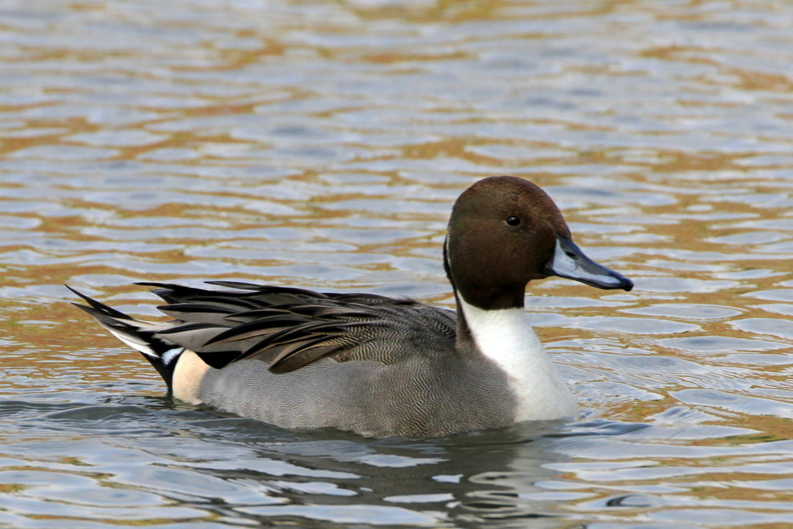
オナガガモのオス  
<small>[CC](http://creativecommons.org/licenses/by-nc/2.0/)
[<cite>Northern Pintail</cite>](http://www.flickr.com/photos/texaseagle/10946858194)
(2013) by [Ken Slade](http://www.flickr.com/photos/texaseagle/)</small>

  

  

<h3 id="ヨシガモ">ヨシガモ</h3>

カモ目カモ科マガモ属 （→ [ウィキペディア：ヨシガモ](http://ja.wikipedia.org/wiki/%E3%83%A8%E3%82%B7%E3%82%AC%E3%83%A2)）  
（漢字：葦鴨、英名：falcated duck、学名：*Anas falcata*）  
【大きさ】全長は約50cm。  
【分布】大部分が冬鳥であるが生息数は少ない。一部は北海道で繁殖。湖沼・河川・内湾などに生息 する。  
【特徴・習性】陸ガモに分類される。オスについては頭部に冠羽があり、三列風切が長く垂れている。 頭部は光沢のある緑色と光沢のある赤みがかった褐色。喉の部分は白く、首の全面には黒色の線があ る。体は灰色で、腰の両側に白斑がある。足と嘴は黒色。  
【捕獲制限】カモ類の合計は1日5羽まで。網猟においては狩猟期間を通じてカモ類の合計は200羽まで。

  

  

ヨシガモのオス  
<small>[CC](http://creativecommons.org/licenses/by-sa/4.0/)
[<cite>Falcated duck, Anas falcata</cite>](http://commons.wikimedia.org/wiki/File:Northern_Shoveler-Anas_clypeata.jpg)
(2014) by [Francis C. Franklin](http://commons.wikimedia.org/wiki/User:Baresi_franco)</small>

  

  

<h3 id="ハシビロガモ">ハシビロガモ</h3>

カモ目カモ科マガモ属 （→ [ウィキペディア：ハシビロガモ](http://ja.wikipedia.org/wiki/%E3%83%8F%E3%82%B7%E3%83%93%E3%83%AD%E3%82%AC%E3%83%A2)）  
（漢字：、英名：northern shoveler、学名：*Anas clypeata*）  
【大きさ】全長は約50cm。  
【分布】冬鳥として本州以南に飛来。主に湖沼・河口付近・内湾に生息している。  
【特徴・習性】陸ガモに分類される。幅の広い大きな嘴が特徴。目は黄色。オスについては、頭部が 光沢のある濃緑色、首から胸にかけては白く腹は明るい褐色、背は黒い。嘴は黒色で、足は橙色。  
【捕獲制限】カモ類の合計は1日5羽まで。網猟においては狩猟期間を通じてカモ類の合計は200羽まで。

  

  

ハシビロガモのオス  
<small>[CC](http://creativecommons.org/licenses/by-sa/2.5/)
[<cite>Anas clypeata</cite>](http://commons.wikimedia.org/wiki/File:Northern_Shoveler-Anas_clypeata.jpg)
(2014) by [Andreas Trepte](http://www.photo-natur.de/)</small>

  

  

<h3 id="ヒドリガモ">ヒドリガモ</h3>

カモ目カモ科マガモ属 （→ [ウィキペディア：ヒドリガモ](http://ja.wikipedia.org/wiki/%E3%83%92%E3%83%89%E3%83%AA%E3%82%AC%E3%83%A2)）  
（漢字：、英名：Eurasian wigeon、学名：*Anas penelope*）  
【大きさ】全長は約48.5cm。  
【分布】冬鳥として飛来。  
【特徴・習性】陸ガモに分類される。首と嘴が比較的短い。オスについては、頭部は赤褐色で頭頂部が淡黄色、体は 灰色で胸は淡褐色。雨覆は白色で、下尾筒は黒い。嘴は鉛色で足は黒色。  
【捕獲制限】カモ類の合計は1日5羽まで。網猟においては狩猟期間を通じてカモ類の合計は200羽まで。

  

  

ヒドリガモのオス  
<small>[CC](http://creativecommons.org/licenses/by-sa/2.0/)
[<cite>Wigeon</cite>](http://www.flickr.com/photos/39776840@N00/399411956/)
(2010) by [Kuribo](http://www.flickr.com/people/39776840@N00/)</small>

  

  

<h3 id="hoshihajiro">ホシハジロ</h3>

カモ目カモ科ハジロ属 （→ [ウィキペディア：ホシハジロ](http://ja.wikipedia.org/wiki/%E3%83%9B%E3%82%B7%E3%83%8F%E3%82%B8%E3%83%AD)）  
（漢字：星羽白、英名：common pochard、学名：*Aythya ferina*）  
【大きさ】全長は約45cm。  
【分布】冬鳥として全国に飛来。北海道では一部繁殖する。主に湖沼・河川・内湾に生息している。  
【特徴・習性】海ガモに分類される。オスについては、頭から首にかけてが赤褐色、胸は黒色、体は灰色で黒色の縞模様。 上下尾筒は黒色。嘴は黒色で先端 近くに青灰色の帯模様がある。足は暗灰色。  
【捕獲制限】カモ類の合計は1日5羽まで。網猟においては狩猟期間を通じてカモ類の合計は200羽まで。

  

  

ホシハジロのオス  
<small>[CC](http://creativecommons.org/licenses/by-sa/2.0/)
[<cite>Pochard on Surrey Water</cite>](http://www.flickr.com/photos/drplokta/2320487073/)
(2008) by [Mike Scott](http://www.flickr.com/people/24025712@N00/)</small>

  

  

<h3 id="kinkurohajiro">キンクロハジロ</h3>

カモ目カモ科ハジロ属 （→ [ウィキペディア：キンクロハジロ](http://ja.wikipedia.org/wiki/%E3%82%AD%E3%83%B3%E3%82%AF%E3%83%AD%E3%83%8F%E3%82%B8%E3%83%AD)）  
（漢字：金黒羽白、英名：tufted duck、学名：*Aythya fuligula*）  
【大きさ】全長は約40cm。  
【分布】冬鳥として飛来。北海道では一部繁殖する。主に湖沼や河川に生息している。  
【特徴・習性】海ガモに分類される。雌雄ともに冠羽がある。オスについては、頭部は紫がかった光沢のある黒色で、後頭 部には長い冠羽が垂れている。体全体は黒色で、脇と腹は白色。嘴は青みがかった灰色で、先端が黒色。足は暗灰色。  
【捕獲制限】カモ類の合計は1日5羽まで。網猟においては狩猟期間を通じてカモ類の合計は200羽まで。

  

  

キンクロハジロのオス  
<small>[CC](http://creativecommons.org/licenses/by-sa/2.5/)
[<cite>Aythya fuligula; male</cite>](http://commons.wikimedia.org/wiki/File:Aythya-fuligula_Tufted-Duck.jpg)
(2008) by [Andreas Trepte](http://www.photo-natur.de/)</small>

  

  

<h3 id="suzugamo">スズガモ</h3>

カモ目カモ科ハジロ属 （→ [ウィキペディア：スズガモ](http://ja.wikipedia.org/wiki/%E3%82%B9%E3%82%BA%E3%82%AC%E3%83%A2)）  
（漢字：鈴鴨、英名：greater scaup、学名：*Aythya marila*）  
【大きさ】全長は約45cm。  
【分布】冬鳥として多数飛来。主に内湾・河口付近に生息する。  
【特徴・習性】海ガモに分類される。オスについては、頭部が光沢のある濃緑色、胸と上下尾筒は黒色。腹と脇は白色で、 背には細かい縞模様がある。嘴は灰色で基部に白斑がある。足は暗灰色。  
【捕獲制限】カモ類の合計は1日5羽まで。網猟においては狩猟期間を通じてカモ類の合計は200羽まで。

  

  

スズガモのオス  
<small>[CC](http://creativecommons.org/licenses/by-sa/4.0/)
[<cite>Male Greater Scaup (Aythya marila)</cite>](http://commons.wikimedia.org/wiki/File:Greater-scaup-male2.jpg)
(2007) by [Calibas](http://commons.wikimedia.org/wiki/User:Calibas)</small>

  

  

<h3 id="kurogamo">クロガモ</h3>

カモ目カモ科クロガモ属 （→ [ウィキペディア：クロガモ](http://ja.wikipedia.org/wiki/%E3%82%AF%E3%83%AD%E3%82%AC%E3%83%A2)）  
（漢字：黒鴨、英名：common scoter、学名：*Melanitta nigra*）  
【大きさ】全長は約48cm。  
【分布】冬鳥として九州以北に飛来。主に海上に生息している。  
【特徴・習性】海ガモに分類される。オスについては体全体が黒い。嘴は黒色で、上嘴基部が膨らんでおり黄色い。足は黒 褐色。  
【捕獲制限】カモ類の合計は1日5羽まで。網猟においては狩猟期間を通じてカモ類の合計は200羽まで。

  

  

クロガモのオス  
<small>[CC](http://creativecommons.org/licenses/by-sa/2.0/)
[<cite>Barnegat Inlet N.J. ,Black Scoter</cite>](https://www.flickr.com/photos/23505652@N03/4311219441/)
(2010) by [Peter Massas](https://www.flickr.com/people/23505652@N03/)</small>

  

  

<h3 id="ezoraicho">エゾライチョウ</h3>

キジ目ライチョウ科エゾライチョウ属 （→ [ウィキペディア：エゾライチョウ](http://ja.wikipedia.org/wiki/%E3%82%A8%E3%82%BE%E3%83%A9%E3%82%A4%E3%83%81%E3%83%A7%E3%82%A6)）  
（漢字：蝦夷雷鳥、英名：hazel grouse、学名：*Tetrastes bonasia*）  
【大きさ】全長は約36cm。  
【分布】北海道において留鳥。低地から山地の森林に生息している。  
【形や色】頭部から首、背にかけては灰褐色で、褐色の斑がある。喉の部分は黒色で、目の上が赤色。 頬と胸は白色で、胸から腹にかけては褐色の斑がある。後頭部の羽毛が長い。

  

  

エゾライチョウ  
<small>[CC](http://creativecommons.org/licenses/by-nc/2.0/)
[<cite>Hazel grouse</cite>](https://www.flickr.com/photos/ressaure/14658715226)
(2014) by [Tatiana Bulyonkova](https://www.flickr.com/photos/ressaure/)</small>

  

  

<h3 id="yamadori">ヤマドリ</h3>

キジ目キジ科ヤマドリ属 （→ [ウィキペディア：ヤマドリ](http://ja.wikipedia.org/wiki/%E3%83%A4%E3%83%9E%E3%83%89%E3%83%AA)）  
（漢字：山鳥、英名：copper pheasant、学名：*Syrmaticus soemmerringii*）  
【大きさ】全長はオスが約125cm、メスが約55cm。  
【分布】本州から九州において留鳥として分布。低地から山地の林に生息している。  
【形や色】オスについては、全体が赤褐色で背・翼・胸から腹の羽縁白色。目の周りが赤色。尾はキ ジより長く、褐色・灰褐色・黄褐色の横縞。

  

  

ヤマドリ  
<small>[CC](http://creativecommons.org/licenses/by-nc-nd/2.0/)
[<cite>070619-028</cite>](//www.flickr.com/photos/ken_san/)
(2007) by [ken](//www.flickr.com/photos/ken_san/569076555)</small>

  

  

<h3 id="kiji">キジ</h3>

キジ目キジ科キジ属 （→ [ウィキペディア：キジ](http://ja.wikipedia.org/wiki/%E3%82%AD%E3%82%B8)）  
（漢字：雉子、英名：green pheasant、学名：*Phasianus versicolor*）  
【大きさ】全長はオスが約80cm、メスが約60cm。  
【分布】北海道と対馬を除く本州から九州に留鳥として分布する。低地から山地の草原・農耕地・川 原・林などに明るい場所に生息している。  
【形や色】オスについては、頭部・首・胸・腹が黒みがかった光沢のある緑色で、背は光沢のある黒 色。目の周りが赤色。雨覆は青みがかった灰色。尾は長く灰色で、 褐色の横縞がある。風切は灰褐 色で、褐色の斑がある。メスについては、全体が淡褐色で、黒色の斑がある。

  

  

キジ  
<small>[CC](http://creativecommons.org/licenses/by/2.0/)
[<cite>Green Pheasant Close up</cite>](//www.flickr.com/photos/conifer/3492301733)
(2009) by [coniferconifer](//www.flickr.com/photos/conifer/)</small>

  

  

<h3 id="kojukei">コジュケイ</h3>

キジ目キジ科コジュケイ属 （→ [ウィキペディア：コジュケイ](http://ja.wikipedia.org/wiki/%E3%82%B3%E3%82%B8%E3%83%A5%E3%82%B1%E3%82%A4)）  
（漢字：小綬鶏、英名：Chinese bamboo partridge、学名：*Bambusicola thoracicus*）  
【大きさ】全長は約27cm。  
【分布】本州に留鳥として分布。低地や低山の林・藪などに生息している。  
【形や色】頭頂部から背にかけては灰褐色で、背には黒褐色の斑がある。目の上から後頭部・胸は青 灰色で。腹は黄褐色で、胸側に赤褐色の斑がある。背から雨覆にかけて、暗褐色の班があり、縞模様 に見える。

  

  

コジュケイ  
<small>[CC](http://creativecommons.org/licenses/by-nc/2.0/)
[<cite>コジュケイ＠井の頭自然文化園</cite>](//www.flickr.com/photos/24256658@N06/6185595772)
(2011) by [tomosuke214](//www.flickr.com/photos/24256658@N06/)</small>

  

  

<h3 id="nyunaisuzume">ニュウナイスズメ</h3>

スズメ目スズメ科スズメ属 （→ [ウィキペディア：ニュウナイスズメ](http://ja.wikipedia.org/wiki/%E3%83%8B%E3%83%A5%E3%82%A6%E3%83%8A%E3%82%A4%E3%82%B9%E3%82%BA%E3%83%A1)）  
（漢字：入内雀、英名：russet sparrow、学名：*Passer rutilans*）  
【大きさ】全長は約14cm。  
【分布】本州中部以北で繁殖し、冬は暖地で越冬する。  
【形や色】オスの頭部は赤褐色で、喉の部分が黒色。背は褐色で、縦に黒色の班がある。頬 から腹にかけては白色。翼には細い白色の線が2本ある。

  

  

ニュウナイスズメ  
<small>[CC](http://creativecommons.org/licenses/by-sa/3.0/)
[<cite>ニュウナイスズメのオス</cite>](http://commons.wikimedia.org/wiki/User:Alpsdake)
(2014) by [Alpsdake](http://commons.wikimedia.org/wiki/File:Passer_rutilans.JPG)</small>

  

  

<h3 id="suzume">スズメ</h3>

スズメ目スズメ科スズメ属 （→ [ウィキペディア：スズメ](http://ja.wikipedia.org/wiki/%E3%82%B9%E3%82%BA%E3%83%A1)）  
【大きさ】全長は約14.5cm。  
【分布】小笠原諸島を除く全国で留鳥または漂鳥として分布。人家付近・田畑・草原などに 生息している。  
【形や色】頭部は赤褐色で、頬は白く、喉の部分・耳羽・目の先が黒い。背は褐色で、黒色 の縦斑がある。腹は白色。翼には細い白色の線がある。

  

  

スズメ  
<small>PD
[<cite>Passer montanus</cite>](http://commons.wikimedia.org/wiki/File:Tree_Sparrow_August_2007_Osaka_Japan.jpg)
(2007) by [Laitche](http://commons.wikimedia.org/wiki/User:Laitche)</small>

  

  

<h3 id="hiyodori">ヒヨドリ</h3>

スズメ目ヒヨドリ科ヒヨドリ属 （→ [ウィキペディア：ヒヨドリ](http://ja.wikipedia.org/wiki/%E3%83%92%E3%83%A8%E3%83%89%E3%83%AA)）  
（漢字：鵯、英名：brown-eared bulbul、学名：*Hypsipetes amaurotis*）  
【大きさ】全長は約27.5cm。  
【分布】全国に留鳥として分布。低地から山地の林・農耕地などに生息している。また都市 部の公園などでも見られる。  
【形や色】頭部は青灰色で耳羽が褐色。体は薄い灰褐色で、体の後方の腹の部分は白色。翼 や尾羽は灰色。頭頂部の羽毛が長い。  
【習性】波の形を描くようにして飛ぶ。「ヒーヨ」、「ピーヨ」などと鳴き、飛んでいると きには「ピーピー」と鳴く。

  

  

ヒヨドリ  
<small>[CC](http://creativecommons.org/licenses/by-nc/2.0/)
[<cite>hiyodori | ヒヨドリ</cite>](//www.flickr.com/photos/gryphtor/5335024929)
(2011) by [Joel](//www.flickr.com/photos/gryphtor/5335024929)</small>

  

  

<h3 id="mukudori">ムクドリ</h3>

スズメ目ムクドリ科ムクドリ属 （→ [ウィキペディア：ムクドリ](http://ja.wikipedia.org/wiki/%E3%83%A0%E3%82%AF%E3%83%89%E3%83%AA)）  
（漢字：椋鳥、英名：white-cheeked starling、学名：*Sturnus cineraceus*）  
【大きさ】全長は約24cm。 【分布】九州以北において留鳥または漂鳥。街中の公園や農耕地などで見られ、集落周辺の
林などで繁殖する。 【形や色】体は濃い灰色で、頭部・背・尾の部分は黒みがかっている。目の周りや頬には白 色の羽毛がある。尾羽の先端は白色。嘴と足は橙色をしている。

  

  

ムクドリ  
<small>[CC](http://creativecommons.org/licenses/by/2.0/)
[<cite>ムクドリ</cite>](//www.flickr.com/photos/nubobo/12084950724)
(2014) by [nubobo](//www.flickr.com/photos/nubobo/)</small>

  

  

<h3 id="hashibosogarasu">ハシボソガラス</h3>

スズメ目カラス科カラス属 （→ [ウィキペディア：ハシボソガラス](http://ja.wikipedia.org/wiki/%E3%83%8F%E3%82%B7%E3%83%9C%E3%82%BD%E3%82%AC%E3%83%A9%E3%82%B9)）  
（漢字：嘴細烏、英名：carrion crow、学名：*Corvus corone*）  
【大きさ】全長は約50cm。  
【分布】九州以北で繁殖する留鳥。低地や低山に生息している。  
【特徴・習性】全身は紫がかった光沢のある黒色。ハシブトガラスより小さく、嘴も細いく小さく湾 曲している。額は出っ張っていない。嘴と足は黒色。

  

  

ハシボソガラス  
<small>[CC](http://creativecommons.org/licenses/by-sa/3.0/)
[<cite>Corvus corone orientalis</cite>](http://commons.wikimedia.org/wiki/File:Carrion_crow_20090612.jpg)
(2009) by Aomorikuma（あおもりくま）</small>

  

  

<h3 id="hashibutogarasu">ハシブトガラス</h3>

スズメ目カラス科カラス属 （→ [ウィキペディア：ハシブトガラス](http://ja.wikipedia.org/wiki/%E3%83%8F%E3%82%B7%E3%83%96%E3%83%88%E3%82%AC%E3%83%A9%E3%82%B9)）  
（漢字：嘴太烏、英名：jungle crow、学名：*Corvus macrorhynchos*）  
【大きさ】全長は約58cm。  
【分布】小笠原諸島を除く全国で繁殖する留鳥。街中から山中まで広く分布している。  
【特徴・習性】全身が光沢のある黒色。嘴も黒色でハシボソガラスよりも太く、上嘴は大きく湾曲し ている。嘴の上の額が出っ張っている。

  

  

ハシブトガラス  
<small>[CC](http://creativecommons.org/licenses/by-nc/2.0/)
[<cite>ハシブトガラス Jungle Crow</cite>](https://www.flickr.com/photos/urasimaru/5208361117/)
(2010) by [urasimaru](https://www.flickr.com/photos/urasimaru/)</small>

  

  

<h3 id="miyamagarasu">ミヤマガラス</h3>

スズメ目カラス科カラス属 （→ [ウィキペディア：ミヤマガラス](http://ja.wikipedia.org/wiki/%E3%83%9F%E3%83%A4%E3%83%9E%E3%82%AC%E3%83%A9%E3%82%B9)）  
（漢字：深山烏、英名：rook、学名：
*Corvus frugilegus*）  
【大きさ】全長は約47cm。  
【分布】かつては冬鳥として九州に飛来。現在は全国的に農地や水田に飛来。  
【特徴・習性】全身は黒色で、嘴と足も黒色。嘴基部には、若鳥のときには鼻孔を覆う黒い羽毛があ るが、成鳥になるとその部分が露出し白く見える。嘴は細く、尖っている。

  

  

ミヤマガラス  
<small>[CC](http://creativecommons.org/licenses/by-nc/2.0/)
[<cite>Corvus frugilegus</cite>](https://www.flickr.com/photos/rado_vaclav/16487817316)
(2015) by [Radovan Václav](https://www.flickr.com/photos/rado_vaclav/)</small>

  

  

<h3 id="tashigi">タシギ</h3>

チドリ目シギ科タシギ属 （→ [ウィキペディア：タシギ](http://ja.wikipedia.org/wiki/%E3%82%BF%E3%82%B7%E3%82%AE)）  
（漢字：田鴫、英名：common snipe、学名：*Gallinago gallinago*）  
【大きさ】全長約26cm。  
【分布】冬鳥または旅鳥として飛来。主に水田・湿地・川岸などに生息している。  
【特徴・習性】黄褐色の細く長い嘴は直線状である。淡褐色の頭部は、褐色の目を横切るような線、 頬の線、頭頂部の線あり、縞模様に見える。体は淡褐色で黒斑が縞模様のようにみえる。背と肩羽 は褐色で黒斑がある。羽縁は灰白色で、連なって線のように見える。雨覆は褐色で黒斑と淡色の羽 縁を持つ。足は黄褐色。  
【捕獲制限】タシギとヤマシギを合計して1日あたり5羽まで。

  

  

タシギ  
<small>[CC](http://creativecommons.org/licenses/by-sa/2.0/)
[<cite>Wilson's Snipe (Gallinago delicata)</cite>](https://www.flickr.com/photos/slobirdr/11635736575/)
(2009) by [Gregory "Slobirdr" Smith](https://www.flickr.com/photos/slobirdr/)</small>

  

  

<h3 id="yamashigi">ヤマシギ</h3>

チドリ目シギ科ヤマシギ属 （→ [ウィキペディア：ヤマシギ](http://ja.wikipedia.org/wiki/%E3%83%A4%E3%83%9E%E3%82%B7%E3%82%AE)）  
（漢字：山鷸、英名：Eurasian woodcock、学名：*Scolopax rusticola*）  
【大きさ】全長約34cm。  
【分布】本州中部以北・伊豆諸島の林で繁殖する留鳥。北海道で夏鳥、西日本では冬鳥。  
【特徴・習性】頭頂部は三角形で、目が頭部後方に寄ってついている。嘴は長くまっすぐである。頭 部は灰褐色で、頭頂部から後頭部にかけて濃褐色の横斑がある。体・雨覆には灰褐色や黒褐色の紋が あり、背と腹は縦縞となって見える。尾は黒褐色で先端が灰色。足は薄茶色。 【捕獲制限】タシギとヤマシギを合計して1日あたり5羽まで。

  

  

ヤマシギ  
<small>[CC](http://creativecommons.org/licenses/by/2.0/)
[<cite>Eurasian Woodcock</cite>](https://www.flickr.com/photos/79492850@N00/8509619846/)
(2013) by [Jason Thompson](https://www.flickr.com/photos/79492850@N00/)</small>

  

  

<h3 id="kijibato">キジバト</h3>

ハト目ハト科キジバト属 （→ [ウィキペディア：キジバト](http://ja.wikipedia.org/wiki/%E3%82%AD%E3%82%B8%E3%83%90%E3%83%88)）  
（漢字：雉鳩、英名：Oriental turtle dove、学名：*Streptopelia orientalis*）  
【大きさ】全長は約33cm。  
【分布】低地や山地では留鳥、北海道や本州北部では夏鳥。平地や明るい森林に生息するが、都市部 の公園や庭でもみられる。  
【特徴・習性】体は灰色味を帯びた茶褐色で、雨覆は黒色で赤褐色と灰色の羽縁があり、翼に黒色・ 赤褐色の鱗状の模様があるようにみえる。また、首の側面に青と白の横縞模様がある。  
【捕獲制限】1日10羽まで。

  

  

キジバト  
<small>[CC](http://creativecommons.org/licenses/by-nc/2.0/)
[<cite>キジバト（雉鳩、Streptopelia orientalis）</cite>](https://www.flickr.com/photos/urasimaru/6779079266/)
(2012) by [urasimaru](https://www.flickr.com/photos/urasimaru/)</small>

  

  

<h3 id="goisagi">ゴイサギ</h3>

コウノトリ目サギ科ゴイサギ属 （→ [ウィキペディア：ゴイサギ](http://ja.wikipedia.org/wiki/%E3%82%B4%E3%82%A4%E3%82%B5%E3%82%AE)）  
（漢字：五位鷺、英名：night heron、学名：*Nycticorax nycticorax*）  
【大きさ】全長は約57.5cm。  
【分布】九州から本州で繁殖し、留鳥または漂鳥。北海道でも少数が夏鳥として飛来する。河川・池 沼・湿原などに生息し、日中は林で休んでいることが多い。  
【特徴・習性】頭と背は黒く、翼と尾は灰色。嘴は黒色で足は黄色であるが、足については繁殖期に なると赤味を帯びる。後頭部に白くて長い冠羽がある。

  

  

ゴイサギ  
<small>PD
[<cite>Black-Crowned Night Heron</cite>](http://commons.wikimedia.org/wiki/File:Black_Crowned_Night_Heron_Ottawa.jpg)
(2008) by SimChuck01</small>

  

  

<h3 id="ban">バン</h3>

ツル目クイナ科バン属 （→ [ウィキペディア：バン](http://ja.wikipedia.org/wiki/%E3%83%90%E3%83%B3_%28%E9%B3%A5%E9%A1%9E%29)）  
（漢字：鷭、英名：common moorhen、学名：*Gallinula chloropus*）  
【大きさ】全長は約32.5cm。  
【分布】全国的に繁殖するが、冬期は関東以南に多い。湖沼・河川・水田な・湿地などに生息する。  
【形態】体全体は黒色であるが、背と雨覆は褐色味を帯びている。脇の部分と下尾筒に白色斑がある。 嘴と額板が赤色で、嘴の先端は黄色。足は黄緑色で大きい。  
【生態】水上では尾を上げて、首を前後に振って泳ぐ。飛ぶ際には水面を蹴って助走をつけるようにして飛び立 つ。足を垂らしながら低く飛翔し、あまり長距離は飛ばない。河川・湖沼・水田・湿地などに住み、 草むらや水田で営巣する。主に植物の種子や若葉、昆虫などを食物としている。  
【類似種】[オオバン](http://ja.wikipedia.org/wiki/オオバン" title="ウィキペディア：オオバン) は嘴と額板が白色。また、バンと異なり、体の側面や下尾筒の白色部分がない。  
【捕獲制限】1日3羽まで。

  

  

バン  
<small>[CC](http://creativecommons.org/licenses/by-nc-nd/2.0/)
[<cite>Gallinule poule-d'eau / Common Moorhen</cite>](https://www.flickr.com/photos/ericbegin/5205242079/)
(2010) by [Eric Bégin](https://www.flickr.com/photos/ericbegin/)</small>

  

  

<h3 id="kawau">カワウ</h3>

カツオドリ目ウ科ウ属 （→ [ウィキペディア：カワウ](http://ja.wikipedia.org/wiki/%E3%82%AB%E3%83%AF%E3%82%A6)）  
（漢字：河鵜、英名：great cormorant、学名：*Phalacrocorax carbo*）  
【大きさ】全長は約82cm。  
【分布】九州以北で繁殖する留鳥または漂鳥。また本州北部では夏鳥、九州以南では冬鳥として飛 来する。主に河川部・湖沼・内湾に生息する。  
【形態】全身の大部分は光沢のある黒色であるが、背と雨覆は茶褐色。繁殖期になると、顔が白くな り、足の付け根に白斑ができる。鉤爪状の嘴を持ち、その付け根は黄色く丸みがあり、外側の裸出部 は白色。足は黒色の蹼足で水かきがある。集団で繁殖し、樹上に皿型の巣を作る。  
【習性】河川部・湖沼・内湾近くの樹上で集団営巣し、朝方、採餌のためV字の隊列を成して海や河 川などで魚を採り、夕方になるとまた隊列をつくって巣に戻る。

  

  

カワウ  
<small>[CC](http://creativecommons.org/licenses/by-sa/2.0/)
[<cite>DSC_6771</cite>](https://www.flickr.com/photos/86647866@N06/10690482996/)
(2013) by [Shusuke Kasamatsu](https://www.flickr.com/photos/86647866@N06/)</small>

  

## 狩猟獣

**ネコ目**　[タヌキ](#タヌキ) | [キツネ](#キツネ) | [ノイヌ](#ノイヌ) | [ノネコ](#ノネコ) | [テン](#テン) | [イタチ](#イタチ) | [チョウセンイタチ](#チョウセンイタチ) | [ミンク](#ミンク) | [アナグマ](#アナグマ) | [アライグマ](#アライグマ) | [ヒグマ](#ヒグマ) | [ツキノワグマ](#ツキノワグマ) | [ハクビシン](#ハクビシン)  
**鯨偶蹄目**　[イノシシ](#イノシシ) | [ニホンジカ](#ニホンジカ)  
**ネズミ目**　[タイワンリス](#タイワンリス) | [シマリス](#シマリス) | [ヌートリア](#ヌートリア)  
**ウサギ目**　[ユキウサギ](#ユキウサギ) | [ノウサギ](#ノウサギ)

  

<h3 id="タヌキ">タヌキ</h3>

ネコ目イヌ科タヌキ属 （→ [ウィキペディア：タヌキ](http://ja.wikipedia.org/wiki/タヌキ)）  
（漢字：狸、英名：raccoon dog、学名：*Nyctereutes procyonoides*）  
【大きさ】頭胴長 50〜60 cm、尾長 15 cm、体重 3〜5 kg。  
【分布】沖縄を除く全国の住宅地や雑木林、低い山地などに生息する。  
【形態】ずんぐりとした体型をしており、全身は灰黒色から褐色で白い毛がまだらに入っている。 脚は黒色で、尾や背には黒い差毛がある。尾はふさふさしており、目の周囲には黒色のパンダ模様がある。  
【生態】鳥類やその卵、ネズミなどの小動物、ミミズや幼虫のほか、果実も食べる。 家族や親子が近い距離で生活しており、春から秋にかけては家族群で行動する。 特定の場所に集めて糞をするタメ糞を行う。

  

  

タヌキ  
<small>[CC](https://creativecommons.org/licenses/by-sa/3.0/) [<cite>Raccoon Dog at Fukuyama, Hiroshima prefecture, Japan</cite>](https://ja.wikipedia.org/wiki/%E3%83%95%E3%82%A1%E3%82%A4%E3%83%AB:Tanuki01_960.jpg)
(2010) by [663highland](https://ja.wikipedia.org/wiki/%E5%88%A9%E7%94%A8%E8%80%85:663highland)</small>

  

  

<h3 id="キツネ">キツネ</h3>

ネコ目イヌ科キツネ属 （→ [ウィキペディア：アカギツネ](http://ja.wikipedia.org/wiki/アカギツネ)）  
（漢字：狐、英名：red fox、学名：*Vulpes vulpes*）  
【大きさ】頭胴長 60〜75 cm、尾長 40 cm、体重 4〜7 kg。  
【分布】沖縄を除く全国の郊外から山岳地、農地などに生息する。四国では少ない。  
【形態】全身が赤褐色で顎の下から腹までは白色。北海道頭部などでは灰黒色のキツネも見られる。 尾の先端は白色で、足先は黒色。 北海道のキツネをキタキツネ、本州以南のキツネをホンドギツネと亜種で区別することもある。  
【生態】ネズミ、鳥類、昆虫、ミミズなどのほか果実類も食べる。 またトウモロコシやニワトリなどの農畜産物を採食することもある。 巣穴の中で生活し、一夫一妻で春に出産したあと夏にかけては家族群で生活する。 人畜共通感染症であるエキノコックスに感染している個体も存在するので注意が必要。

  

  

キツネ  
<small>[CC](https://creativecommons.org/licenses/by-sa/3.0/) [<cite>ホンドギツネ、白馬岳の山腹にて。</cite>](https://commons.wikimedia.org/wiki/File:Vulpes_vulpes_japonica_in_Mount_Shirouma_1996-09-29.jpg)
(1996) by [Alpsdake](https://commons.wikimedia.org/wiki/User:Alpsdake)</small>

  

  

<h3 id="ノイヌ">ノイヌ</h3>

ネコ目イヌ科イヌ属 （→ [ウィキペディア：イヌ](http://ja.wikipedia.org/wiki/イヌ)）  
（漢字：野犬、英名：dog、学名：*Canis familiaris*）  
【大きさ】中型犬以上の大きさの個体が多く、小型犬類程度の大きさの個体は少ない。  
【分布】全国に広く生息する。林道沿いや集落の近くに生息することが多い。  
【形態】さまざまな大きさや体色の個体がいるが、前述のとおり中型犬以上の個体が多い。  
【生態】ペットや猟犬などのイヌが野生化したもの。群れで生活していることが多い。 野生動物や残飯を食べるが、一部の地域ではシカを捕食している。

  

  

飼い犬（※ノイヌではない）  
<small>PD [<cite>Shiba-Inu</cite>](https://commons.wikimedia.org/wiki/File:Shiba_Inu.jpg) (2006) by Yozakura</small>

  

  

<h3 id="ノネコ">ノネコ</h3>

ネコ目ネコ科ネコ属 （→ [ウィキペディア：ネコ](http://ja.wikipedia.org/wiki/ネコ)）  
（漢字：野猫、英名：cat、学名：*Felis catus*）  
【大きさ】ペットのネコと同じ大きさ。  
【分布】全国の平地から山地、集落の近くに生息する。温暖な地域に多く寒冷地では少ない。  
【形態】ペットのネコと同じでさまざまな種類がみられる。  
【生態】ペットのネコが野生化したものの中で山野で自活している個体。雑食性で小型の動物を捕食する。 希少種のアマミクロウサギやヤンバルクイナなども捕食している。昼間よりも夜間に多く活動する。

  

  

ノラネコ（※ノネコではない）  
<small>[CC](https://creativecommons.org/licenses/by-sa/2.0/) [<cite>Fred + 1/2 rabbit</cite>](https://www.flickr.com/photos/e3000/5454005947/) (2010) by [Eddy Van 3000](https://www.flickr.com/people/23566085@N00)</small>

  

  

<h3 id="テン">テン</h3>

ネコ目イタチ科テン属 （→ [ウィキペディア：テン](http://ja.wikipedia.org/wiki/テン)）  
（漢字：貂、英名：Japanese marten、学名：*Martes melampus*）  
【大きさ】頭胴長 45 cm、尾長 19 cm、体重 1.1〜1.5 kg。  
【分布】本州、四国、九州に分布し、北海道南部と佐渡には移入したものが確認されている。主に森林に生息する。  
【形態】夏毛は体が茶褐色で顔と脚が黒色。冬毛は黄褐色で足先が茶褐色で顔が白色。  
【生態】樹上を広く利用し生活するため、樹木のある人家周辺にもみられる。ネズミや昆虫のほか果実なども食べる雑食性。

  

  

テン（冬毛）  
<small>[PD](https://creativecommons.org/publicdomain/zero/1.0/deed.en) [<cite>Exhibit in the National Museum of Nature and Science, Tokyo, Japan</cite>](https://commons.wikimedia.org/wiki/File:Martes_melampus_-_National_Museum_of_Nature_and_Science,_Tokyo_-_DSC07047.JPG) (2013) by [Daderot](https://commons.wikimedia.org/wiki/User:Daderot)</small>

  

  

<h3 id="イタチ">イタチ</h3>

ネコ目イタチ科イタチ属 （→ [ウィキペディア：ニホンイタチ](http://ja.wikipedia.org/wiki/ニホンイタチ)）  
（漢字：鼬、英名：Japanese weasel、学名：*Mustela itatsi*）  
【大きさ】オスは頭胴長 27〜37 cm、尾長 12〜16 cm。メスは頭胴長 16〜25 cm、尾長 7〜9 cm。  
【分布】本州、四国、九州の平野部から山間部、人家の近くなどに生息。北海道にも移入している。  
【形態】オスのほうがメスよりも大きい。全身が茶褐色で額から鼻にかけて黒褐色の斑紋があるが口元は白色。  
【生態】カエル・ネズミ・昆虫のほかザリガニなどの甲殻類も食べる。一夫多妻で土穴で繁殖。

  

  

イタチ  
<small>[CC](https://creativecommons.org/licenses/by-sa/3.0/) [<cite>枝の上を歩くニホンイタチ</cite>](https://commons.wikimedia.org/wiki/File:Mustela_itatsi_on_tree.JPG) (2013) by [Alpsdake](https://commons.wikimedia.org/wiki/User:Alpsdake)</small>

  

  

<h3 id="チョウセンイタチ">チョウセンイタチ</h3>

ネコ目イタチ科イタチ属 （→ [ウィキペディア：チョウセンイタチ](http://ja.wikipedia.org/wiki/チョウセンイタチ)）  
（漢字：朝鮮鼬、英名：Siberian weasel、学名：*Mustela sibirica*）  
【大きさ】オスは頭胴長 28〜39 cm、尾長 16〜21 cm、体重 650〜820 g。メスは頭胴長 25〜31 cm、尾長 13〜16 cm、体重 360〜430g。  
【分布】自然分布域は対馬。九州、四国、本州の中部地方以南に移入している。農耕地や住宅周辺の林、農山村周辺、山麗部に生息。  
【形態】オスのほうがメスよりも大きい。全身は褐色がかった山吹色で額から鼻にかけて黒褐色の斑紋がある。  
【生態】ネズミ、鳥類、甲殻類、魚類のほかカキなどの果実類も食べる。イタチよりも植物食の傾向が強い。

  

  

チョウセンイタチ  
<small>[CC](https://creativecommons.org/licenses/by/2.0/) [<cite>Siberian Weasel</cite>](https://www.flickr.com/photos/conifer/4612194466/in/photolist-dMGY66-82yGJf-dNnM6T-dMQNqL-675Att-dHCz1t-5PGjkZ-69VcwN) (2010) by [coniferconifer](https://www.flickr.com/photos/conifer/)</small>

  

  

<h3 id="ミンク">ミンク</h3>

ネコ目イタチ科イタチ属 （→ [ウィキペディア：ミンク](http://ja.wikipedia.org/wiki/ミンク)）  
（英名：American mink、学名：*Mustela vison*）  
【大きさ】頭胴長 36〜45 cm、尾長 30〜36 cm、体重 0.7〜1 kg。  
【分布】北海道の海岸部に生息。河川沿いや湖沼周辺にもみられる。  
【形態】さまざまな毛色があるが褐色の個体が多い。  
【生態】毛皮のために導入されたものが野生化した。 ネズミや鳥類のほか甲殻類や魚類を水の中に入って捕食することが他のイタチ科動物より多い。

  

  

ミンク  
<small>[CC](https://creativecommons.org/licenses/by-sa/3.0/) [<cite>American Mink</cite>](https://commons.wikimedia.org/wiki/File:American_Mink.jpg) (2013) by [Pdreijnders](https://commons.wikimedia.org/wiki/User:Pdreijnders)</small>

  

  

<h3 id="アナグマ">アナグマ</h3>

ネコ目イタチ科アナグマ属 （→ [ウィキペディア：ニホンアナグマ](http://ja.wikipedia.org/wiki/ニホンアナグマ)）  
（漢字：穴熊、英名：Japanese badger、学名：*Meles meles*）  
【大きさ】頭胴長 52 cm、尾長 14 cm、体重 12kg。  
【分布】本州、四国、九州、小豆島の山地から丘陵地の森林や潅木林などに生息。  
【形態】ずんぐりとした体型をしており、全身はくすんだ褐色で脚と胸部は濃褐色。頭は淡褐色で、目の周りが黒褐色で鼻から頭頂部にかけて白色。  
【生態】トンネル状の巣穴を掘りメスを中心とした集団生活をする。土壌動物や小動物を主に食べる。 丘陵部の果樹園などではハクビシンやアライグマに混じってわなで捕獲されることもある。

  

  

アナグマ  
<small>[CC](https://creativecommons.org/licenses/by-sa/3.0/) [<cite>ニホンアナグマ</cite>](https://commons.wikimedia.org/wiki/File:Meles_meles_anakuma_at_Inokashira_Park_Zoo.jpg) (2009) by Nzrst1jx</small>

  

  

<h3 id="アライグマ">アライグマ</h3>

ネコ目アライグマ科アライグマ属 （→ [ウィキペディア：アライグマ](http://ja.wikipedia.org/wiki/アライグマ)）  
（漢字：洗熊、英名：raccoon、学名：*Procyon lotor*）  
【大きさ】頭胴長 42〜60 cm、尾長 20〜41 cm、体重 4〜10 kg。  
【分布】国内各地に捕獲記録がある。  
【形態】ずんぐりとした体型。体は灰褐色で目の周囲に黒色のマスク模様がある。尾には黒色の輪模様がある。  
【生態】ペットとして輸入されたものが野生化した外来種。特定外来種（2005）。夜行性で水辺を好むが森林から市街地まで幅広い環境に生息する。 果実・野菜・穀類、魚類や昆虫をはじめとした小動物を採食する。河畔の林などに巣穴を掘り集団生活をする。

  

  

アライグマ  
<small>PD [<cite>Procyon lotor</cite>](https://commons.wikimedia.org/wiki/File:Raccoon_climbing_in_tree.jpg) (2003) by [Dave Menke](https://www.wikidata.org/wiki/Q26235785)</small>

  

  

<h3 id="ヒグマ">ヒグマ</h3>

ネコ目クマ科クマ属 （→ [ウィキペディア：ヒグマ](http://ja.wikipedia.org/wiki/ヒグマ)）  
（漢字：羆、英名：brown bear、学名：*Ursus arctos*）  
【大きさ】頭胴長 200〜230 cm、体重 150〜250 kg。まれに 300 kg 以上の個体も存在する。  
【分布】北海道の森林原野に生息。  
【形態】国内では最大の陸上動物。尾が短い。全身が黒褐色から褐色。  
【生態】フキ、ササの芽、ノイチゴ、コクワ・ミズナラの実などの植物やアリ・ハチ類、サケ・マスといった動物性のものを食べる。 シカの死体を食べることもある。12月中旬から4月末まで主に土穴を利用して冬眠する。

  

  

エゾヒグマ  
<small>[CC](https://creativecommons.org/licenses/by/2.0/) [<cite>20130113_160032_TamaTKN</cite>](https://www.flickr.com/photos/tsukunepapa/8571711124/) (2013) by [Tomoaki Kato](https://www.flickr.com/photos/tsukunepapa/)</small>

  

  

<h3 id="ツキノワグマ">ツキノワグマ</h3>

ネコ目クマ科クマ属 （→ [ウィキペディア：ツキノワグマ](http://ja.wikipedia.org/wiki/ツキノワグマ)）  
（漢字：月輪熊、英名：Asian black bear、学名：*Ursus thibetanus*）  
【大きさ】頭胴長 120〜145 cm、体重 70〜120 kg。  
【分布】本州、四国のブナ林を中心に生息。九州では絶滅した可能性が高い。  
【形態】本州、四国においては最大の陸上動物。尾が短い。全身が黒色で胸に白色の三日月模様がある。三日月模様がない個体も存在する。  
【生態】ブナの若芽・草本類、アリ・ハチ類、クリ・ミズナラなどの木の実を多く食べる。シカ、カモシカなどの死体を食べることもある。 母子の親子連れあるいは単独で行動することが多い。12月から4月までは大木の樹洞、岩穴・土穴を利用して冬眠する。

  

  

ツキノワグマ  
<small>[CC](https://creativecommons.org/licenses/by-nc-nd/2.0/) [<cite>ツキノワグマのクー</cite>](https://www.flickr.com/photos/copanda_v/29458886616/) (2016) by [Copanda_](https://www.flickr.com/photos/copanda_v/)</small>

  

  

<h3 id="ハクビシン">ハクビシン</h3>

ネコ目ジャコウネコ科ハクビシン属 （→ [ウィキペディア：ハクビシン](http://ja.wikipedia.org/wiki/ハクビシン)）  
（漢字：白鼻心、英名：masked palm civet、学名：*Paguma larvata*）  
【大きさ】頭胴長 61〜66 cm、尾長 40 cm、体重約 3 kg。  
【分布】本州から九州までの各地で生息が確認されている。山地や集落の周辺に生息。  
【形態】体が灰褐色で脚・顔・尾の先端は黒褐色。鼻から頭頂部にかけて白色の縦線がある。  
【生態】夜行性で樹洞、土穴などをねぐらとする。人家の屋根裏をねぐらとする場合もある。 鳥類とその卵、昆虫、その他小動物、果実類などを食べる。ブドウ、ミカンの果樹や農作物を食害することもある。

  

  

ハクビシン  
<small>[CC](https://creativecommons.org/licenses/by/2.0/) [<cite>Masked Palm Civet - 05</cite>](https://www.flickr.com/photos/kabacchi/5028702541/) (2010) by [Kabacchi](https://www.flickr.com/photos/kabacchi/)</small>

  

  

<h3 id="イノシシ">イノシシ</h3>

鯨偶蹄目イノシシ科イノシシ属 （→ [ウィキペディア：イノシシ](http://ja.wikipedia.org/wiki/イノシシ)）  
（漢字：猪、英名：wild boar、学名：*Sus scrofa*）  
【大きさ】頭胴長 110〜160 cm、肩高 60〜80 cm、体重 50〜150 kg。  
【分布】ニホンイノシシは北海道を除く全国の森林や農耕地、平野部に広く生息。沖縄にはリュウキュウイノシシ生息。  
【形態】オスの方が大きい。尾は短い。ずんぐりとした体型で頭部が大きい。全身が褐色または暗褐色。オスには犬歯が発達した牙がある。 幼獣には体に汚白色の縦縞がある。これがマクワウリに似ていることから幼獣はウリ坊と呼ばれる。  
【生態】雑食性でクズなどの根やヤマイモ、ミミズなどを掘り返して食べる。ほかにも植物の葉、昆虫やヘビなどの食べる。 一夫多妻で単独、あるいは小さな群れを作って生活する。 体表のダニを落としたりする目的で泥浴をする。これをヌタウチといいヌタウチを行う場所はヌタ場と呼ばれる。

  

  

イノシシ  
<small>[CC](https://creativecommons.org/licenses/by-sa/2.0/) [<cite>クロマメ</cite>](https://www.flickr.com/photos/urasimaru/8260974524/) (2012) by [urasimaru](https://www.flickr.com/photos/urasimaru/)</small>

  

  

<h3 id="ニホンジカ">ニホンジカ</h3>

鯨偶蹄目シカ科シカ属 （→ [ウィキペディア：ニホンジカ](http://ja.wikipedia.org/wiki/ニホンジカ)）  
（漢字：日本鹿、英名：Sika deer、学名：*Cervus nippon*）  
【大きさ】亜種によって違いがあるがオスは頭胴長 90〜190 cm、肩高 70〜130 cm、体重 50〜130 kg。 メスは頭胴長 90〜150 cm、肩高 60〜110 cm、体重 25〜80
kg。  
【分布】北海道（エゾシカ）、本州（ホンシュウジカ）、四国、九州（キュウシュウジカ）など全国の森林に生息。  
【形態】亜種によって体のサイズが大きく異なる。夏毛は茶色で白斑があり、冬毛は灰褐色。尻に黒色の毛で縁取られた大きな白斑がある。 オスは 30〜40 cm の角を持ちこれは毎年生え変わる。  
【生態】装置と森林が入り組んだ自体に多く生息する。イネ科の草本、木の葉、堅果、ササ類などを食べる。 ササ類は冬に積雪のある地域の主要な食物となっている。一夫多妻の社会で群れで生活をするが、通常オスとメスは別の群れを作る。

  

  

エゾシカ  
<small>[CC](https://creativecommons.org/licenses/by-nc-nd/2.0/) [<cite>DSC00057</cite>](https://www.flickr.com/photos/kuraken/2960755279/) (2001) by [Kuraken](https://www.flickr.com/photos/kuraken/)</small>

  

  

<h3 id="タイワンリス">タイワンリス</h3>

ネズミ目リス科ハイガシラリス属 （→ [ウィキペディア：タイワンリス](http://ja.wikipedia.org/wiki/タイワンリス)）  
（漢字：台湾栗鼠、英名：Taiwan squirrels、学名：*Callosciurus erythraeus*）  
【大きさ】頭胴長 20〜22 cm、尾長 17〜20 cm、体重約360 g。  
【分布】伊豆大島、神奈川県、静岡県、岐阜県、和歌山県、大阪府などに分布。低山の森林などに生息。  
【形態】背面は灰褐色で黄土色の毛が交じる。腹部は淡褐色。尾が太く耳が丸い。  
【生態】台湾から持ち込まれた外来種。樹木の果実、葉、樹皮などや昆虫その他の小動物を食べる。昼行性で樹上で生活し、頻繁に鳴き声を発する。

  

  

タイワンリス  
<small>[CC](https://creativecommons.org/licenses/by-sa/3.0/deed.en) [<cite>タイワンリス、金華山のリス村にて</cite>](https://commons.wikimedia.org/wiki/File:Callosciurus_erythraeus_thaiwanensis_in_Mount_Kinka_(Gifu)_2.jpg) (2011) by [Alpsdake](https://commons.wikimedia.org/wiki/User:Alpsdake)</small>

  

  

<h3 id="シマリス">シマリス</h3>

ネズミ目リス科シマリス属 （→ [ウィキペディア：エゾシマリス](http://ja.wikipedia.org/wiki/エゾシマリス)）  
（漢字：縞栗鼠、英名：Siberian chipmunk、学名：*Tamias sibiricus*）  
【大きさ】頭胴長 12〜15 cm、尾長 14〜18 cm、体重 71〜116 g。  
【分布】北海道の海岸から森林まで広い環境に生息する。移入したチョウセンシマリスも一部の地域に生息。  
【形態】最小の狩猟獣。腹と耳の先は白色。全身が淡褐色で背に黒色とクリーム色の縞模様がある。  
【生態】昼行性で主に地上部で活動する。種子、昆虫、陸貝、小鳥の卵・ヒナを食べる。 樹木の種子を地面に埋めて貯蔵するほか、冬眠巣にも貯蔵する。 10月から4月まで地下に巣を掘って冬眠する。

  

  

エゾシマリス  
<small>[CC](https://creativecommons.org/licenses/by-sa/3.0/deed.en) [<cite>大雪山に生息するエゾシマリス</cite>](https://commons.wikimedia.org/wiki/File:Tamias_sibiricus_lineatus_in_Mount_Taisetsu.jpg) (2001) by [Alpsdake](https://commons.wikimedia.org/wiki/User:Alpsdake)</small>

  

  

<h3 id="ヌートリア">ヌートリア</h3>

ネズミ目ヌートリア科ヌートリア属 （→ [ウィキペディア：ヌートリア](http://ja.wikipedia.org/wiki/ヌートリア)）  
（英名：nutria、学名：*Myocastor coypus*）  
【大きさ】頭胴長 56〜63 cm、尾長 30〜43 cm、体重 6〜9 kg。  
【分布】岡山などの中国地方、香川、京都、大阪、兵庫、福井、岐阜、愛知、三重などの河川や湖沼の水辺に生息。  
【形態】全身が暗褐色。ずんぐりとした体型で大きなドブネズミのような体つきをしている。目や耳が小さく尾が円筒状。  
【生態】特定外来生物（2005年）。毛皮のために養殖されていたものが戦後に野生化した。 マコモ、ヨシ、ヒシの実、ミズアオイ、ドブガイなどを採食する。ほかにイネなどの農作物を食べて被害を与えることもある。 水泳や潜水が得意。夜行性で昼は排水口などに隠れている

  

  

ヌートリア  
<small>[CC](https://creativecommons.org/licenses/by-sa/3.0/deed.en) [<cite>地面を歩く日本の外来種のヌートリア</cite>](https://commons.wikimedia.org/wiki/File:Myocastor_coypus_walking.JPG) (2012) by [Alpsdake](https://commons.wikimedia.org/wiki/User:Alpsdake)</small>

  

  

<h3 id="ユキウサギ">ユキウサギ</h3>

ウサギ目ウサギ科ノウサギ属 （→ [ウィキペディア：ユキウサギ](http://ja.wikipedia.org/wiki/ユキウサギ)）  
（漢字：雪兎、英名：mountain hare、学名：*Lepus timidus*）  
【大きさ】頭胴長 49〜58 cm、尾長 5〜8 cm、耳長 7〜8cm、体重 1.6〜2.9 kg。  
【分布】北海道の低山から山地帯に生息。  
【形態】夏毛は全身が灰褐色で腹、脚の一部、尾が白色。耳の先端が黒色で、冬毛になるとこの黒色を残して全身が白色になる。  
【生態】植物食で植物の葉、芽、枝、樹皮を食べる。

  

  

ユキウサギ  
<small>[CC](https://creativecommons.org/licenses/by-sa/3.0/deed.en) [<cite>Lepus timidus, Leporidae, Mountain Hare</cite>](https://commons.wikimedia.org/wiki/File:Lepus_timidus_01.JPG) (2009) by H. Zell</small>

  

  

<h3 id="ノウサギ">ノウサギ</h3>

ウサギ目ウサギ科ノウサギ属 （→ [ウィキペディア：ニホンノウサギ](http://ja.wikipedia.org/wiki/ニホンノウサギ)）  
（漢字：野兎、英名：Japanese hare、学名：*Lepus brachyurus*）  
【大きさ】頭胴長 43〜54 cm、尾長 2〜5 cm、耳長 6〜8 cm、体重 1.3〜2.5 kg。  
【分布】北海道を除く全国の低山から山地帯に生息。  
【形態】全身が茶褐色で腹が白色。耳の先端が黒色。本州東北部や日本海側の積雪地帯の個体は、冬になると耳の先端の黒色を残して全身が白色になる。  
【生態】夜行性で植物の葉、芽、枝、樹皮を食べる植物食。人畜共通感染症である野兎病の菌を保菌している個体が存在し、その血液や臓器に直接触れると感染する。

  

  

ニホンノウサギ  
<small>[CC](https://creativecommons.org/licenses/by-sa/3.0/deed.en) [<cite>ニホンノウサギ</cite>](https://commons.wikimedia.org/wiki/File:Lepus_brachyurus.JPG?uselang=ja) (2013) by [Alpsdake](https://commons.wikimedia.org/wiki/User:Alpsdake)</small>

  

# 参考資料

- 大日本猟友会, <cite>狩猟読本</cite>, 2014, 大日本猟友会.
- 高野伸二, <cite>フィールドガイド 日本の野鳥</cite>, 1982, 日本野鳥の会.
- 環境庁, <cite>日本産鳥類の繁殖分布</cite>, 1981, 大蔵省印刷局, [http://www.biodic.go.jp/reports/2-1/af000.html](http://www.biodic.go.jp/reports/2-1/af000.html).
- 樋口広芳, 山岸哲, 森岡弘之, <cite>日本動物大百科3 鳥類I</cite>, 1996, 平凡社.
- 樋口広芳, 山岸哲, 森岡弘之, <cite>日本動物大百科4 鳥類II</cite>, 1997, 平凡社.
- 高野伸二, <cite>野鳥識別ハンドブック</cite>, 1980, 日本野鳥の会.
- 阿部永, 石井信夫, 伊藤徹魯, 金子之史, 前田喜四雄, 三浦慎悟, 米田政明, <cite>日本の哺乳類</cite>, 1994, 東海大学出版会.
- 小宮輝之, <cite>日本の哺乳類</cite>, フィールドベスト図鑑 vol.11, 2010 学研教育出版.
- 自然環境研究センター, <cite>日本の外来生物</cite>, 2008, 平凡社.
- 国立環境研究所, <cite>侵入生物データベース</cite>, [http://www.nies.go.jp/biodiversity/invasive/](http://www.nies.go.jp/biodiversity/invasive/).
- 熊谷さとし, <cite>哺乳類のフィールドサイン観察ガイド</cite>, 2011, 文一総合出版.
- <cite>衆議院会議情報 第43回国会 農林水産委員会 第17号</cite>, 1963, [http://kokkai.ndl.go.jp/SENTAKU/syugiin/043/0408/04303120408017c.html](http://kokkai.ndl.go.jp/SENTAKU/syugiin/043/0408/04303120408017c.html).