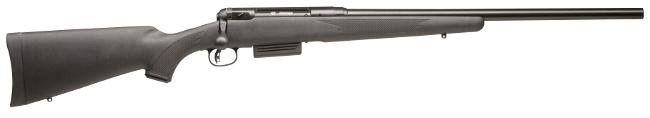
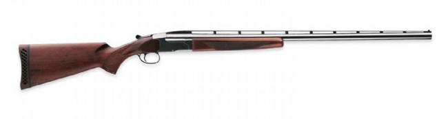
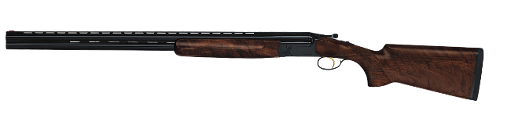
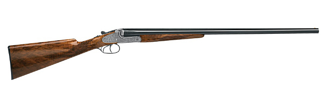
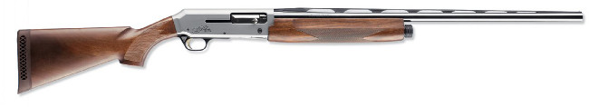
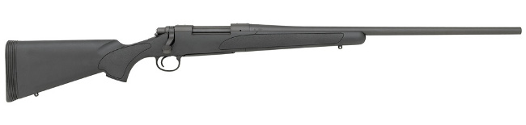
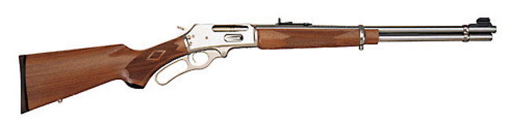
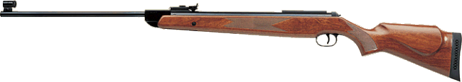
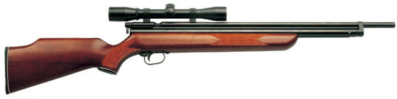
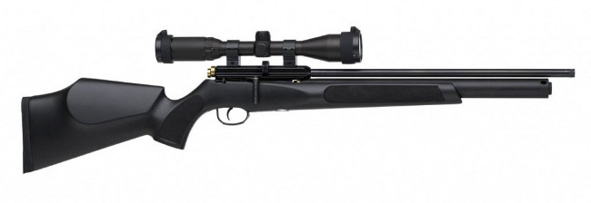

銃の種類や型式の一覧です。（関連：[実包と弾丸について](/articles/1414035778/)）

**種類** 銃はまず*空気銃*と火薬を利用する*猟銃（装薬銃）*に大別されます。猟銃はさらに銃身の1つ以上に銃腔の長さの半分を超えるライフリングが施されている*ライフル銃*とそれ以外の*ライフル銃以外の猟銃*の猟銃に分類されます。ライフル銃以外の猟銃は散弾を発射する*散弾銃*と*散弾銃及びライフル銃以外の猟銃（ハーフライフル）*から構成されています。「散弾銃及びライフル銃以外の猟銃」とは、サボット弾と呼ばれるプラスチックの覆いと一緒に弾丸を発射するための銃で、銃腔内に長さが半分を超えないようにライフリングが施されています。

- 銃砲
    - 空気銃
    - 猟銃（装薬銃）
        - ライフル銃
        - ライフル銃以外の猟銃	
            - 散弾銃
            - 散弾銃及びライフル銃以外の猟銃

**型式**　*型式*とは猟銃の場合は装てん・排莢の形式、銃身数と配置などによって、空気銃においては空気充てん方法などによって決定される分類です。  
猟銃では以下のような型式が存在しています。

- 自動式
- ボルト式
- スライド式
- レバー式
- 単身元折式
- 上下二連元折式
- 水平二連元折式

空気銃については次のような型式が存在します。

- スプリング式
- ポンプ式
- プレチャージ式

# 種類について

## ライフル銃

銃身内に銃腔の長さの1/2超のライフリングがある銃で、ライフリングによって弾丸を回転させ発射します。これによって長い飛距離と良い命中精度を期待できます。狩猟用で所持する場合にはヒグマ、ツキノワグマ、イノシシやシカ等の大型獣類に対して使用します。

## 散弾銃

粒状の散弾やスラッグ弾（一発弾）を発射することができます。標的射撃ではトラップ射撃やスキート射撃といったクレー射撃、ランニング・ターゲット等、狩猟では鳥類から小型の獣類から、スラッグ弾を用いれば大型の獣類に対してと広く使用できます。

## 散弾銃及びライフル銃以外の猟銃（ハーフライフル）

銃身内に銃腔の長さの 1/2 以下のライフリングがある銃です。サボット弾と呼ばれるプラスチック製のカバーに覆われた弾を発射します。ライフリングによって弾が回転し、普通のスラッグ弾よりも良い命中精度が期待されます。技能講習についてはライフル銃とライフル銃以外の猟銃に分かれているので、普通の散弾銃の技能講習を受講すれば更新や所持許可の取得ができます。

散弾銃及びライフル銃以外の猟銃 Savage 220 Slug Gun (http://www.savagearms.com/ より)

## 空気銃

空気やガスの圧力によって弾丸を発射します。銃身にはライフリングがあります。

# 型式について

## 単身元折式

1本の銃身を持ち、薬室に1発装填できます。銃身と機関部の間を折ることで、実包の装填と排莢を行います。散弾銃が主ですが、ライフル銃もまれにあります。

単身元折式散弾銃 Browning BT-99 (http://www.browning.com/ より)

## 上下二連元折式

2本の銃身が上下に並んでおり、薬室に2発装填できます。銃身と機関部の間を折ることで、実包の装填と排莢を行います。クレー射撃用の散弾銃に多く使われていますが、狩猟用の軽いものもあります。

上下二連元折式散弾銃 Perazzi Mx8 (http://perazzi.it/ より)

## 水平二連元折式

2本の銃身が左右に並んでおり、薬室に2発装填できます。銃身と機関部の間を折ることで、実包の装填と排莢を行います。それぞれの銃身に対して引き金が1個ずつ、計2個あるものを両引き、引き金が1個のものを単引きといいます。主に狩猟用の散弾銃に使われていますが、クレー射撃用のものもあります。

水平二連元折式散弾銃 Merkel 60E (http://gunshub.ru/Merkel/60Eより)

## 自動式

1本の銃身を持ち薬室に1発、弾倉には散弾銃で最大2発、ライフル銃で最大5発入ります。自動式という名の通り、発射の際のガスや反動を利用して排莢と装填を自動で行います。散弾銃は狩猟用・標的射撃用に、ライフル銃は狩猟用に多く使用されています。

自動式散弾銃 Browning Silver Hunter (http://www.browning.com/より)

## ボルト式

1本の銃身を持ち薬室に1発、弾倉には散弾銃で最大2発、ライフル銃で最大5発入ります。ボルトを前後に押し引きすることで排莢、装填が行われます。主にライフル銃に多い型式で、競技用には単発式が採用されることが多いです。ハーフライフル（散弾銃およびライフル銃以外の猟銃）にもこの型式が多く採用されていまが、排莢・装填の滑らかさはライフル銃に劣ります。散弾銃にも稀に使われているそうです。

ボルト式ライフル銃 Remington Model 700™ SPS™ (http://www.remington.com/より)

## スライド式

1本の銃身を持ち薬室に1発、弾倉には散弾銃で最大2発、ライフル銃で最大5発入ります。先台をスライドさせることによって、排莢と装填を行います。ポンプ銃またはレピーター銃とも呼ばれています。散弾銃は狩猟・標的射撃用に、ライフル銃は主に狩猟用に使用されています。

スライド式散弾銃 Remington Model 870™ Express® (http://www.remington.com/より)

## レバー式

1本の銃身を持ち薬室に1発、弾倉には散弾銃で最大2発、ライフル銃で最大5発入ります。用心金と一体になったレバーを動かすことによって、排莢と装填が行われます。ライフル銃や口径の小さい散弾銃に採用されており、主に狩猟に用いられます。

レバー式ライフル銃 Marlin Model 336SS (http://www.marlinfirearms.com/より)

## スプリング式

スプリングを圧縮し、その復元力によって空気を圧縮し、圧縮された空気によって弾丸を発射する単発式の空気銃です。スプリング式は、スプリングの圧縮方法によって、銃身を折ってスプリングを圧縮する中折式と、レバーを引いてスプリングを圧縮するレバー式に分類されます。スプリング式の空気銃は、他の空気銃の型式に比べて強い反動があります。

スプリング式空気銃 Diana RWS Model 350 Magnum (http://www.airgunsofarizona.com/rws.htmlより)

## ポンプ式

銃にポンプと蓄圧室が付いていて、3～4回ポンプすることで蓄圧室に空気を蓄え、その空気によって弾丸を発射します。主に狩猟に用いられます。

ポンプ式空気銃 シャープ ACEハンター (http://nippokogyo.co.jp/items/air-rifle/より)

## プレチャージ式

銃に蓄圧室や着脱式のタンクが付いていて、ポンプやボンベから空気を充填し、弾丸を発射します。他の型式の空気銃と比べ威力の強いものも販売されています。弾倉には最大5発の鉛弾を入れることができます。標的射撃、狩猟両方に用いられます。

プレチャージ式空気銃 FX Cyclone/Syntetic (http://www.fxairguns.com/rifle/the-cyclone/より)