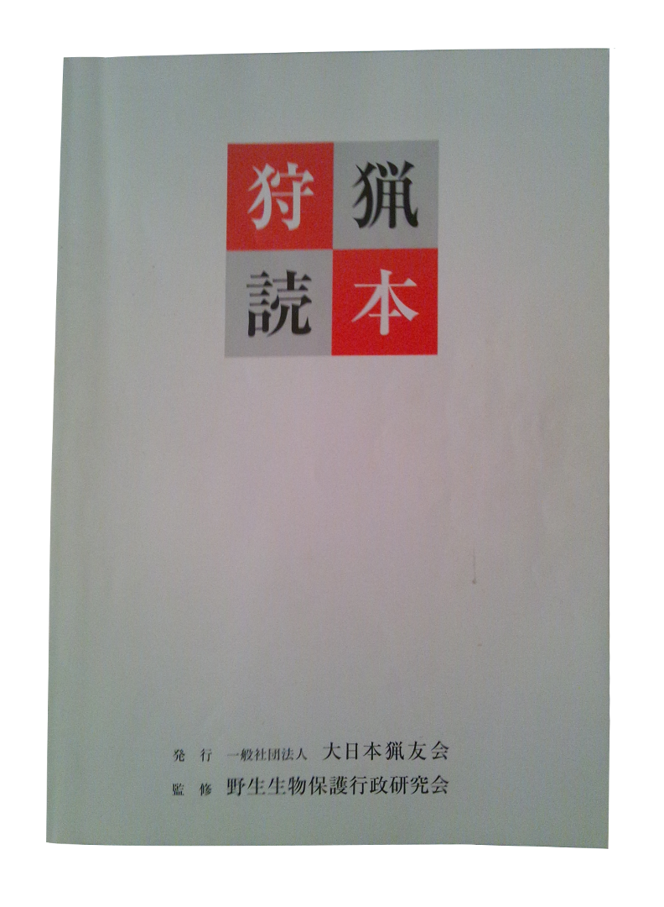

狩猟とは、法に定められた猟具（装薬銃・空気銃・わな・網）によって、狩猟鳥獣の捕獲等をすることとされています。 現在、日本に生息する鳥獣のうち 48 種（鳥類 28 種・獣類 20 種）が[狩猟鳥獣](/articles/1403693668)に指定されています。

このページでは、狩猟をするために必要な狩猟免許の取得方法について説明しています。銃猟免許は 20 歳以上、わな・網猟免許は 18 歳以上の方であれば取得できます。

# はじめに　〜免許の種類・費用等〜

銃器（ライフル銃・散弾銃・空気銃）、わなや網といった法定猟具を用いて猟をするためには狩猟免許を取得する必要があります。狩猟免許には[表 1](#tbl:狩猟免許)のように 4 種類あり、それぞれ扱える猟具が異なります。

表 1 狩猟免許の種類と使用出来る猟具

| 免許の種類     | 使用できる猟具                             |
| :------------- | :----------------------------------------- |
| 網猟免許       | むそう網、はり網、つき網、なげ網           |
| わな猟免許     | くくりわな、はこわな、はこおとし、囲いわな |
| 第一種銃猟免許 | 銃器（装薬銃・空気銃）                     |
| 第二種銃猟免許 | 空気銃                                     |

第一種銃猟免許は第二種銃猟免許を含んでいますが、その他は独立なので猟の方法に合わせて免許を取る必要があります。例えば、空気銃とわなを使って狩猟をしようとする場合は、第二種銃猟免許とわな猟免許を取得する必要があります。

狩猟免許は、第一種・第二種銃猟免許の場合は 20 歳以上、わな・網猟免許の場合は 18 歳以上の方で、以下の欠格事由に該当しなければ誰でも申請できます。

  
欠格事由

  <ul>
    <li>精神障害、統合失調症、躁鬱病、癲癇（軽微なものを除く）等に罹っている者</li>
    <li>麻薬、大麻、阿片又は覚醒剤の中毒者</li>
    <li>自分の行為の是非を判別して行動する能力が欠如又は著しく低い者</li>
    <li>鳥獣法に違反し、罰金以上の刑に処され、その執行を終わり、又は執行を受けることのなくなった日から3年を経過していない者</li>
    <li>狩猟免許を取消された日から3年を経過していない者</li>
  </ul>

ただし、第一種銃猟免許・第二種銃猟免許を取得して銃猟をする場合には、狩猟免許に加えて狩猟用途で[銃砲の所持許可を取得する](/articles/1378038316)必要があります。狩猟免許の取得と、所持許可の申請はどちらを先に行っても構いません。また、所持許可を取得せずに銃猟免許だけを維持することもできます。

# 都道府県猟友会による予備講習（任意）

狩猟免許を取得するためには、各都道府県に狩猟免許の申請をし、その後行われる狩猟免許試験に合格する必要があります。しかしながら、この試験は猟具・鳥獣・法令の知識や猟具の扱い方を知らないと合格が難しいので、各都道府県猟友会支部によって、試験の 1 ヶ月ほど前に[予備講習](http://www.moriniikou.jp/index.php?blogid=20)が開催されています。この予備講習の申込先は各都道府県猟友会のウェブサイト等に掲載されています。

予備講習では法令・鳥獣・猟具に関する講義、模造銃を用いた分解・組立の方法の講習、わな・網の設置の仕方の講習等が行われているそうです。この予備講習に申し込むと、狩猟読本[[図 1]](#fig:狩猟読本)という鳥獣の図画・解説、法令の解説、猟具の解説等が掲載されている冊子が配布されます。また狩猟免許試験の例題集も一緒に配布されます。狩猟免許試験における鳥獣の判別の考査においては、狩猟読本巻頭に掲載されている鳥獣の図画がそのまま出題されます。また狩猟免許試験には銃や罠の操作についての試験や、鳥獣の判別についての試験があるので、予備講習に参加して予め練習しておくことをおすすめします。

図 1 　狩猟読本

狩猟免許試験における鳥獣の判別試験では狩猟読本に掲載されている図が用いられており、また猟具の分解・組立や設置の実技試験もあるので、この講習を受けないと試験は難しいかもしれません。（その他都道府県によって細かい項目の違い等もあるので、おそらく初めて受験される方だと合格できない可能性が高いと思います。）

# 狩猟免許の申請

## 狩猟免許試験への申込

狩猟免許試験の開催日時は都道府県によって公開されています。（夏ごろが多いようです。）以下の申請書等を各都道府県の自然環境行政担当部局に提出してください:

- 狩猟免許申請書（様式は各都道府県によって異なります）　（取得しようとする免許の数）通
- 申請人の写真（無帽・無背景、縦 3.0cm× 横 2.4cm のライカ判）　（取得しようとする免許の数）枚
- 精神保健指定医等の専門医の診断書（銃の許可を受けている場合は猟銃・空気銃所持許可証の写しを添付し、原本を持参すれば必要ない）
- 申請手数料として都道府県の収入証紙　 5200 円 ×（取得しようとする免許の数）

## 狩猟免許試験

(試験の詳細については「[狩猟免許試験について](/articles/1415891983)」をご覧ください。)

狩猟免許試験の内容は各都道府県によって異なりますが、共通しているのは知識試験（鳥獣法・鳥獣・猟具・鳥獣保護管理に関する知識）、適性試験（視力・聴力・運動能力）、技能試験（猟具の使用法・銃の扱い・鳥獣の判別等）が行われることです。

まず初めに行われる知識試験は、3 つのうちから 1 つを選ぶ三者択一式で、

- 鳥獣法に関する法令の問題　 13 問
- 鳥獣の保護管理に関する問題　 2 問
- 猟具に関する問題　 6 問
- 鳥獣に関する問題　 9 問

の合計 30 問が出題され、70%以上の正答で合格です。

知識試験に合格した場合のみ適性試験が行われます。この試験では視力や聴力、運動能力といったものが、狩猟を行うにあたって支障のないものかを判定します。あくまで支障がないか判別する程度の簡単な運動（屈伸など）と視力と聴力の検査なので、ここで落ちることはまずありません。

知識試験と適性試験に合格すると次は実技試験です。網・罠の場合は猟具の判別・設置・狩猟鳥獣の判別、銃の場合は銃器の分解結合・装填動作・射撃姿勢・団体行動・鳥獣の判別・距離の目測が行われます。鳥獣の判別では狩猟読本に出ている絵がそのまま出題され、狩猟鳥獣の場合はその名前を答えます。距離の目測では、試験官が建物までの距離を尋ねるので 300m・50m・30m・10m のうちいずれかを答えます。これも 70%以上の正答で合格です。

これらの試験に合格すると、数週間後に各種狩猟免状が交付されます。このあとは毎年の狩猟者登録を行い、登録証と記章を手に入れれば狩猟期間に狩猟をすることができるようになります。

# 狩猟者登録と猟友会への加入

狩猟免許は全国で有効ですが、これだけでは狩猟をすることができません。毎年、狩猟を行おうとする場所の都道府県ごとに狩猟者登録をしなければなりません。登録の資格は次のとおりです:

- 有効な狩猟免許を所持していること
- 3000 万円以上の損害保険（猟友会の狩猟事故共済・ハンター保険等）に加入していること

さてハンター保険についてですが、現在個人による加入を受け付けている保険会社はありません。それではどうするかというと、猟友会に入会し猟友会を通して保険に加入します。各猟友会支部の連絡先については大日本猟友会ウェブサイトにある「各都道府県猟友会の所在地、連絡先一覧」をご覧ください。保険料は数千円ですが、この他に猟友会への加入費・年会費が必要となります。狩猟者登録については、猟友会も窓口となっているので、各猟友会支部で狩猟者登録の申込と保険の申込を一緒に行うことができます。狩猟者登録証の返納先も猟友会支部で大丈夫です。
