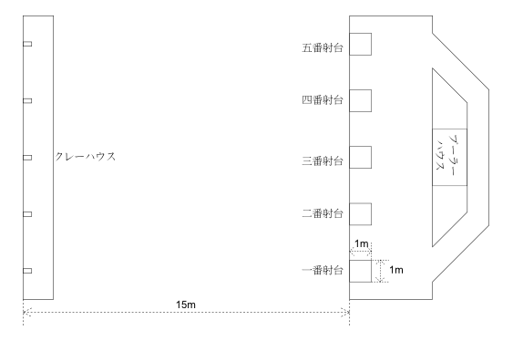
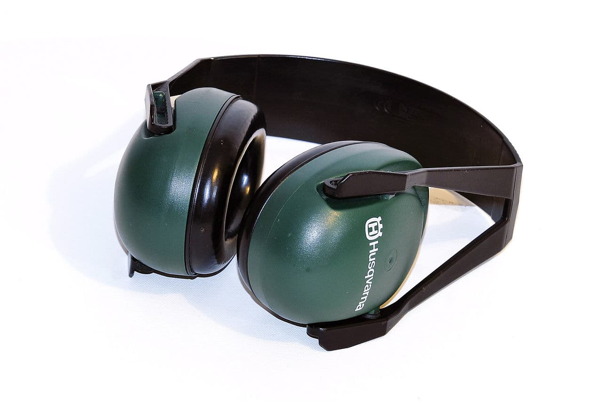
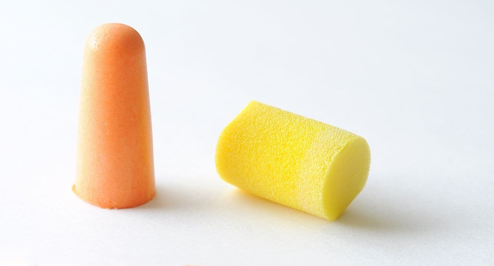
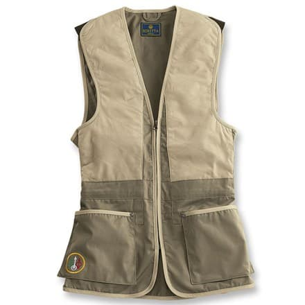

クレー射撃とは、クレーと呼ばれる飛翔する15cm程度の円盤状物体を散弾銃で撃破するスポーツです。 枚数や飛翔の方法、ルール等によっていくつかに分類されますが、大別すると「トラップ射撃」と「スキート射撃」に分けることができます。 主なクレー射撃の競技はとしては、以下のものが挙げられます。

- トラップ射撃
    - ダブル・トラップ
    - トリプル・トラップ
    - アメリカン・トラップ
- スキート射撃

※クレー射撃を始めるためには、散弾銃の所持許可を取得する必要があります。

# トラップ射撃について

トラップ射撃とは、横一列に配置された5個の射台を順番に回りながら、射台の15m先にあるクレー放出機から射出されるクレーを撃破していく競技です。 1枚のクレーに対して2発まで撃つことができ、撃破できれば得点となります。 このとき1発目を「初矢」、2発目を「二の矢」と言います。 25枚を1ラウンドとして、大会では4ラウンドあるいは2ラウンド行われます。 25枚全てを撃破することを「満射」といいます。 各1ラウンドの競技は「射団」と呼ばれる最大6人から成る集団で行われます。 射手が自分の番に声を発して合図をすると、前方に設置されたマイクロフォンが感知してクレーが放出されます。

図1　トラップ射面鳥瞰図

## 必要な用品と射撃に用いる銃・装弾

トラップ射撃に使用する銃としては、口径12番の上下二連散弾銃が一般的ですが、口径20番や自動銃でも射撃を楽しむことができます。 また、装弾はトラップには7.5号の24gが一般的に用いられます。 射撃場に行くときには、散弾銃とともに猟銃・空気銃所持許可証と猟銃用火薬類譲受許可書（射撃場で装弾を購入する場合）が必要です。 その他に射撃用のチョッキがないと射撃場によっては射撃をすることができません。 また銃の発砲音はとても大きいので耳栓かイヤープロテクターも必ず持って行ってください。 この他、あると便利なものとして射撃用の手袋、サングラスなどがあります。

  

イヤーマフ  
<small>[CC](http://opap.jp/cc/by-nc/3.0/deed.ja) [Earmuffs](http://commons.wikimedia.org/wiki/File:Ear_muff_white_bg.jpg) (2006) by [fir0002](http://en.wikipedia.org/wiki/User:Fir0002)</small>

  

  

耳栓  
<small>[CC](http://opap.jp/cc/by-sa/3.0/deed.ja) [Two versions of earplugs. Yellow: E-A-R; Orange](http://commons.wikimedia.org/wiki/File:Earplugs_EAR.jpg) (2010) by Simon A. Eugster</small>

  

  

射撃ベスト  
<small>（ http://www.berettausa.com/ より）</small>

  

## 競技のルールと進行

トラップ射撃では、5つの射台を最大6人の射手が順番に回りながら競技を進めていきます。自分の番になったら「ハイ」や「ホー」などの声を発することでクレーを射出しそれを撃破します。まず射撃場についたら、トラップ射撃場のクラブハウスで受付を済ませます。そこでスコアカードを貰ったら、それを持ってトラップ射面に行き、競技の間などを見計らってプーラーに渡します。競技が始まってからの大まかな流れは以下に示すとおりです：

- 1〜5番射手がそれぞれ1〜5番射台に入る。6番射手は1番射手の後ろで待機する。
- プーラーの合図ののち、1番射手が撃ち、排莢する。1番射手はそのまま1番射台で待機する。
- 2番射手が装填し撃った後、排莢する。1番射手は2番射台の後ろに移動し待機する。2番射手はそのまま2番射台で待機する。6番射手は1番射台に入る。
- 3番射手が装填し撃った後、排莢する。2番射手は3番射台の後ろに移動し待機する。3番射手はそのまま3番射台で待機する。
- 4番射手が装填し撃った後、排莢する。3番射手は4番射台の後ろに移動し待機する。4番射手はそのまま4番射台で待機する。
- 5番射手が装填し撃った後、排莢する。4番射手は5番射台の後ろに移動し待機する。5番射手は右回りに回って、プーラーハウスの後ろを通って一番射台に移動する。
- 5番射手が移動している間、6番射手は1番射台において装填し撃つ。撃った後はそのまま1番射台で待機する。
- （以下この繰り返し）

トラップ射撃における競技の進行
図　トラップ射撃における競技の進行

注意として、撃った後すぐに次の射台に移動せず、次の射手が撃ち終わるまで射台の中で待機することと、次の射手が撃ち終わったら射台を出て次の射台の後ろで待機してください。また5番射台から1番射台に移るとき銃口が左の射手に向かないように回れ右をして、またプーラーハウスの後ろを通って移動してください。（プーラーハウスの後ろが無い場合もあるので、そのときは適宜判断してください。）また、前の射手が撃ち終えるまで装填はしないでください。

# トラップ射撃のバリエーション

ダブル・トラップ
トリプル・トラップ
アメリカン・トラップ
基本的なスキート射撃について

# 参考資料

- International Shooting Sport Federation, Official Statutes Rules and Regulations, http://www.issf-sports.org/documents/rules/2013/ISSFRuleBook2013-3rdPrint-ENG.pdf