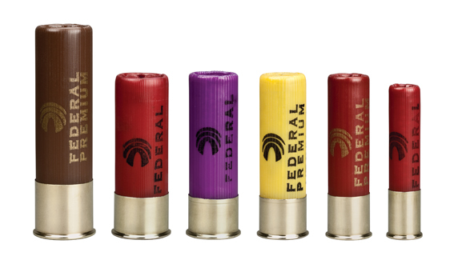
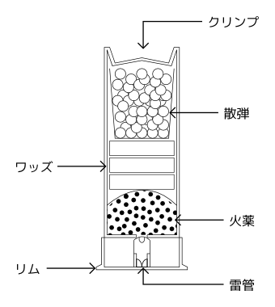

**実包・空包とは**　実包または装弾とは弾丸・火薬・薬莢・雷管などから構成されていて、薬室等に装填すればすぐに発射可能な状態になっている火工品のことをいいます。散弾銃には散弾実包・スラッグ実包・その他ゴム弾の実包等、ライフル銃にはライフル実包、空気銃には空気銃弾がそれぞれ用いられます。一方、空包とは実包から弾丸を取り除いたもののことを言います。

**最大到達距離と最大有効射程距離**　弾丸の飛距離は素材等によって異なりますが、一般に初めの速さ、発射角度及びその他初期条件を一定にした場合、弾丸の質量が大きいほど飛距離が長くなります。角度を変えた場合においては、発射角度が20°〜35°（散弾実包では20°〜35°、ライフル実包では32°〜35°）のときに飛距離が最大になります。飛距離については、殺傷力の有無を問わずに弾丸が最も遠くまで飛んだときの距離を最大到達距離、獲物を捕獲できる最も遠い距離を 最大有効射程距離と呼んで区別します。

**散弾実包の種類**　 散弾実包とは、散弾銃に装填してそのまま発射可能な状態の火工品で、プラケースの薬莢・散弾・ワッズ・火薬・雷管部分で構成されており、薬莢の口が開いたときの長さによって23/4インチ（70mm）・21/2インチ（65mm）・3インチ（75mm）のものに類別されます。さらに薬莢の長さに加えて、その直径によって12番・14番・16番・20番・24番・28番・32番・410番に分けられます。ここで散弾銃の口径が n 番であるとは、1/n ポンドの鉛製の球を発射できる内径を持つことをいいます。よって、数字が小さくなるほど実包の直径は大きくなります。（n 番のことを n ga（gauge の略）と書いたりもします。）日本では12番・20番・410番の散弾実包が一般的です。例えば、トラップやスキートなどのクレー射撃では12番の散弾実包が一般的に使われています、昔は薬莢が紙でできていたので、その名残りから適合実包欄に「20番紙薬莢」などと書いくことがあります。

  

図1　散弾実包の番径の比較 左から10番・12番・16番・20番・28番・410番 （http://www.federalpremium.com/ より）

  

  

図2　散弾実包の断面図

  

**散弾の種類**　散弾実包には散弾と呼ばれる弾の集団が詰まっています。この粒の大きさは○号などと表されますが、数字が小さくなるほど散弾1粒の直径が大きくなります。散弾の飛距離は番径ではなくこの散弾自体の大きさ・素材に依存します。散弾の号数は競技や対象の狩猟鳥獣に合わせて選びます。実包の中に入っている散弾の量ですが、12番の場合 30〜33 g、35〜43 g（ベビーマグナム）、53 g（3インチマグナム）等ですが、トラップ射撃の場合は国際ルールで 24 g と定められています。

鉛製散弾の最大到達距離と最大有効射的距離

<table>
    <thead>
    <tr>
        <th>JIS での名称 /mm</th>
        <th>通称</th>
        <th>最大到達距離 /m</th>
        <th>最大有効射的距離 /m</th>
        <th>用途</th>
    </tr>
    </thead>
    <tbody>
    <tr>
        <td>-</td>
        <td>スラッグ（12番）</td>
        <td>700</td>
        <td>100</td>
        <td>クマ、イノシシ、シカ</td>
    </tr>
    <tr>
        <td>8.6</td>
        <td>00B</td>
        <td>515</td>
        <td>50</td>
        <td>イノシシ、シカ</td>
    </tr>
    <tr>
        <td>4.5</td>
        <td>BB</td>
        <td>340</td>
        <td>50</td>
        <td rowspan="3">中型獣、カモの沖撃ち</td>
    </tr>
    <tr>
        <td>4.0</td>
        <td>1号</td>
        <td>315</td>
        <td>50</td>
    </tr>
    <tr>
        <td>3.75</td>
        <td>2号</td>
        <td>300</td>
        <td>50</td>
    </tr>
    <tr>
        <td>3.5</td>
        <td>3号</td>
        <td>290</td>
        <td>50</td>
        <td rowspan="2">カモ、ノウサギ</td>
    </tr>
    <tr>
        <td>3.25</td>
        <td>4号</td>
        <td>275</td>
        <td>50</td>
    </tr>
    <tr>
        <td>3.0</td>
        <td>5号</td>
        <td>265</td>
        <td>45</td>
        <td rowspan="2">キジ、ヤマドリ、カモの近射</td>
    </tr>
    <tr>
        <td>2.75</td>
        <td>6号</td>
        <td>250</td>
        <td>45</td>
    </tr>
    <tr>
        <td>2.5</td>
        <td>7号</td>
        <td>240</td>
        <td>40</td>
        <td>コジュケイ、キジバト、ヤマシギ</td>
    </tr>
    <tr>
        <td>2.41</td>
        <td>7.5号</td>
        <td>235</td>
        <td>40</td>
        <td>トラップ射撃</td>
    </tr>
    <tr>
        <td>2.25</td>
        <td>8号</td>
        <td>225</td>
        <td>40</td>
        <td>コジュケイ、キジバト、ヤマシギ</td>
    </tr>
    <tr>
        <td>2.0</td>
        <td>9号</td>
        <td>210</td>
        <td>40</td>
        <td>スキート射撃、タシギ</td>
    </tr>
    <tr>
        <td>1.75</td>
        <td>10号</td>
        <td>195</td>
        <td>40</td>
        <td>スズメ</td>
    </tr>
</tbody></table>

# スラッグ弾について

散弾銃で発射可能な弾丸の中にはスラッグと呼ばれる一発弾のものがあります。スラッグ弾は

- ライフルド・スラッグ
- サボット・スラッグ

に分けられ、これらは狩猟においてはイノシシやシカなどの大型獣類を仕留めるため、標的射撃においては静止した紙の的やランニング・ターゲットを撃つために用いられます。

**サボット・スラッグ**　スラッグ弾のうちサボット・スラッグとは、弾の周りにプラスチック製のカバーがあるもののことをいいます。これをハーフライフルで発射することによってプラスチック製のカバーが銃腔内のライフリングと噛み合い、通常のスラッグ弾よりも命中精度が良くなり飛距離が伸びます。（プラスチックのカバーは銃口から出たら弾から外れます。）

## 散弾実包・スラッグ実包の価格

散弾実包の国内での値段ですが、12番が1発40円前後・20番が1発50円前後・410番が1発110円前後・スラッグ弾が1発300円前後です。サボット弾はさらに高くて1発600〜800円程度、あるいは1000円近くです。また鉛の弾を使った実包よりも非鉛散弾を用いた実包のほうが値段が高い傾向にあります。

# ライフル実包とライフル弾

ライフルの実包は非常に種類が多く、命名規則にも明確な規則はありませんが、基本的には口径、薬きょうの形、雷管の形式によって分類することができます。

## 薬きょうの形状

薬きょうの形状は薬きょうの底面と薬きょうの壁が垂直な*ストレートウォール形*、底面から上部にかけて先細りになっていく*テーパー型*、弾頭を挿入する部分がワインの瓶状にすぼまっている*ボトルネック型*の3種類に大別できます。

**リム**　*リム（rim）*とは、薬きょうの底部のはみ出している部分のことを指します。リムはエキストラクターが薬きょうを引き出す際などに利用され、またこのリムによってヘッドスペース（薬室で薬きょうが止まる部分からボルト・フェイスまでの距離）が決定することもあります。

*リムド（rimmed）*は、薬きょうの下部にボディーよりも径の大きいリムがはみ出しています。ヘッドスペースはリムの厚みと等しくなります。*セミリムド（semi-rimmed）*も底部に張り出した部分がありますが、その上部に溝があります。*リムレス（rimless）*は、ボディーと同じ直径のリムで、セミリムドと同様に溝があります。*リベート・リム（rebated rim）*のリムの直径は薬きょうのボディーのそれよりも小さく、同様にリムの上のボディーには溝があります。*ベルト（belted）*薬きょうには薬きょうの下部にベルト状ので出っ張った部分があり、底面からこのベルトまでがヘッドスペースになります。

リムファイアとセンターファイア
雷管の形式によってリムファイア（ヘリ打ち）式とセンターファイア式に分けられます。リムファイア式では撃針がリムを、センターファイア式では中心の雷管を叩きます。

## 弾頭
ライフルの弾頭は鉛の芯に銅のジャケットをかぶせたものが一般的です。先端の形状としては、先端まで銅で覆われているフルメタル・ジャケット (FMJ)、先端が空洞になっているホローポイント (HP)、先端にプラスチック製のチップを付けたチップ弾頭などがあります。鉛芯の弾頭以外にも、北海道で使用できるすべてが銅製の弾頭や主に自分でキャステングする鉛製の弾頭があります。

## 口径

散弾実包と異なりライフル実包の口径には明確な基準がなく複雑です。しかし、名称からある程度はその薬きょうがどのようなものか推測することができます。例えば .30 などドットのあとに数字が続く場合は口径が約0.30インチということがわかります。6.5×47mm のような表記は口径が 6.5 mm、薬きょう長が 47 mm ということを表しています。大抵の場合は \[口径\[×薬きょう長\]\[mm\]\[R\] ブランド名\[ Magnum\]\] のような形式になっています。以下に例を挙げます。

- .243 Winchester: 口径が0.243インチ
- 6.5mm Creedmoor: 口径が 6.5 mm
- 6.5×47mm Lapua: 口径が 6.5 mm で薬きょう長が 47 mm
- 7mm-08 Remington: 口径が 7 mm で .308 Winchester をネックダウン

# 空気銃ペレット

空気銃には主にエアライフル射撃競技に使用される 4.5 mm (.177)、主に狩猟に使用される 5.0 mm (.20)、 5.5 mm (.22)、わなの止め刺しやベンチレスト射撃に使用される 6.35 mm (.25)、7.62 mm (.30) といった口径があります。鉛製、すず製、銅コーティングを施したものなど素材は様々で、また形状も多くの種類があります。主流なのは鉛製のディアボロ型で、先端部分とライフリングに食い込むスカート部分で構成されています。標的射撃では先端が平らなものが、狩猟では主に先端が丸型のものを使用されます。