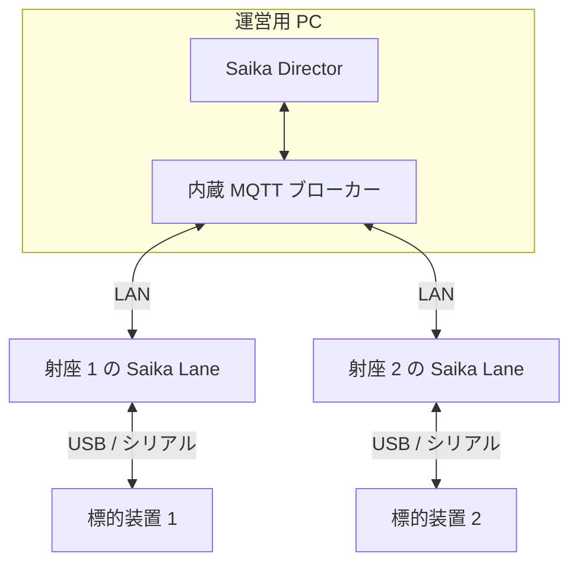

<!-- SPDX-License-Identifier: MIT -->

# 導入と接続

[マニュアルの入口](./README.md) / 導入と接続

## 使用するアプリを選ぶ

| 使い方                       | 必要なもの                                                             |
| ---------------------------- | ---------------------------------------------------------------------- |
| 1つの射座で練習・記録する    | 標的装置と、それに接続する PC の Saika Lane                            |
| 複数の射座をまとめて進行する | 各射座の Lane に加え、運営用 PC の Saika Director と共通のネットワーク |

連携時は、MQTT ブローカーが Director と Lane の通信を中継します。Director の内蔵ブローカーを使う構成は次のとおりです。

図が表示されない場合：標的装置を各 Lane に接続し、各 Lane と Director を同じブローカーへ接続します。

## アプリを用意する

[GitHub Releases](https://github.com/sasakiuri/oss/releases) から、使用する版・アプリ・OS に合うファイルを選びます。
連携する Director と Lane は同じ版を使用してください。

| OS          | 配布形式                                                 |
| ----------- | -------------------------------------------------------- |
| Windows x64 | インストーラー（`.exe`）または ZIP                       |
| macOS       | DMG または ZIP。Intel は `x64`、Apple Silicon は `arm64` |
| Linux x64   | AppImage または Debian パッケージ（`.deb`）              |

Windows 10 / 11の x64を主な動作対象とし、macOS・Linux は実験対象です。[対応機器と検証状態](./lane/SPEC.md#動作環境と対応機器) を確認してください。受信処理の実装と、使用する機器・OS での実機検証は別です。

インストール後、[Lane 操作ガイド](./lane/README.md#起動と準備) に従って競技種別を選び、標的装置に接続します。練習用の記録で、着弾位置・射数・得点が表示され、印刷画面でも記録を確認できることを確かめてください。

Lane 単独なら、そのまま同ガイドの試射・本射の手順へ進みます。大会を一括進行する場合は、次の接続設定を行います。

## Director と Lane を接続する

### 1. Director で接続先を確認する

1. Director を起動し、「Settings」を開く。
2. 「Embedded」を選ぶ。既定のポートは TCP `1883` である。
3. 「Broker service」が `Running`、「Director client」が `Connected` であることを確認する。
4. 「Lane connection URLs」から、Lane と同じネットワークの URL を控える。

例えば Director の IP アドレスが `192.168.10.10` なら、Lane には `mqtt://192.168.10.10:1883` を入力します。
別の PC にある Lane で `localhost` を指定すると、その Lane 自身へ接続してしまいます。

既設のブローカーを使う場合は「External」を選び、「Broker URL」を入力して「Save and connect」を押します。
すべての Lane にもそのブローカーの URL を設定します。

### 2. 各 Lane を接続する

1. Lane の「Settings」→「MQTT」で「Enable MQTT」をオンにする。
2. 「Broker URL」に接続先を入力する。
3. 「Lane Alias」に `Lane 1`、`Lane 2` のように、射座番号を含む重複しない名前を入力する。
4. 次回起動時も接続するなら「Auto Connect」をオンにする。
5. 「Save Settings」を押し、「Connect」で接続する。`Status: connected` を確認する。
6. Director の「Competition Control」→「Lanes」に各 Lane が表示されることを確認する。

接続先を変更する場合は、先に「Disconnect」を押し、新しい URL を「Save Settings」で保存してから「Connect」で接続します。MQTT を無効にする場合も、切断してから「Enable MQTT」をオフにして保存します。設定の保存だけでは、接続先の切り替えや切断は行われません。

Lane の「General」で設定する射座番号と「Lane Alias」は別の設定です。
Director の射座割には「Lanes」一覧の射座番号を使います。実際の射座と違う場合は、開始前に「Lane Alias」の番号と他の Lane との重複を確認して保存し直します。「Refresh」で番号を再確認してから射座割を反映してください。番号の決まり方は [射座番号と選手の対応](./director/MQTT_CONTROL.md#射座番号と選手の対応) を参照してください。

### 3. 競技開始前に確認する

- Lane ごとに、標的装置への接続と MQTT への接続を確認する。MQTT の接続だけでは標的の準備完了を示さない。
- Director と Lane の PC の時計を同期する。
- Director の競技種別と Lane の対応機器を確認する。互換性のエラーが出た場合は、版と選択した機器・種別を見直す。

次は [Director 操作ガイド](./director/README.md) で大会と競技を準備します。

## 接続できないとき

| 症状                          | 確認すること                                                                      |
| ----------------------------- | --------------------------------------------------------------------------------- |
| 内蔵ブローカーが `Stopped`    | 別のアプリが同じポートを使用していないか、Director のエラーを確認する             |
| Lane の MQTT が接続できない   | URL、同じネットワークへの接続、ブローカー側のファイアウォールと認証設定を確認する |
| MQTT は接続済みだが着弾しない | Lane の「Connection」で標的装置の電源・ケーブル・ポート・機種を確認する           |
| Director に Lane が現れない   | 両アプリの接続先を確認し、「Competition Control」の「Refresh」を押す              |

内蔵ブローカーの認証は既定で無効です。平文の `mqtt://` 接続は信頼できる隔離ネットワークで使用してください。
認証や暗号化を必要とする構成は、管理担当者向けの [MQTT 接続構成](./director/MQTT_CONTROL.md#接続構成) を参照してください。

## 更新するとき

競技が終了してから、次の順で更新します。

1. [Lane のデータ保存](./lane/README.md#設定と記録を保存する) と [Director のバックアップ](./director/RESULTS.md#director-のバックアップと復元) を行う。
2. 使用する版の変更内容を確認し、Director と各 Lane の更新版を用意する。
3. アプリを更新する。Director は配布ファイルから手動で更新する。
4. 両アプリの版、射座番号、競技種別、標的装置、MQTT 接続を確認する。

Lane は「Settings」→「General」の「Application Update」から更新を確認できます。対応する配布形式では「Check for Updates」で確認後にダウンロードし、「Restart & Install」で適用します。自動更新を利用できない場合は、同じ版の配布ファイルを使います。

## 問い合わせに必要な情報

問題が解消しない場合は、次の情報を控えて [サポート窓口](../../SUPPORT.md) へ報告してください。

- Lane・Director の版、OS、標的装置の機種、内蔵・外部ブローカーのどちらを使っているか。
- 発生時刻、操作手順、期待した動作、実際の表示、エラーメッセージ。
- 対象の射座番号、競技種別、標的装置の接続状態。Director 連携時は MQTT の状態と直前の応答（ACK）も添える。

公開する情報からは、選手の個人情報や接続用の認証情報を除きます。大会中の申告は [Lane の連絡操作](./lane/README.md#director-と連携して使う) を使い、射場役員にも伝えてください。
