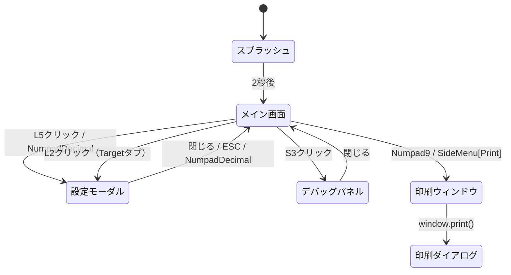
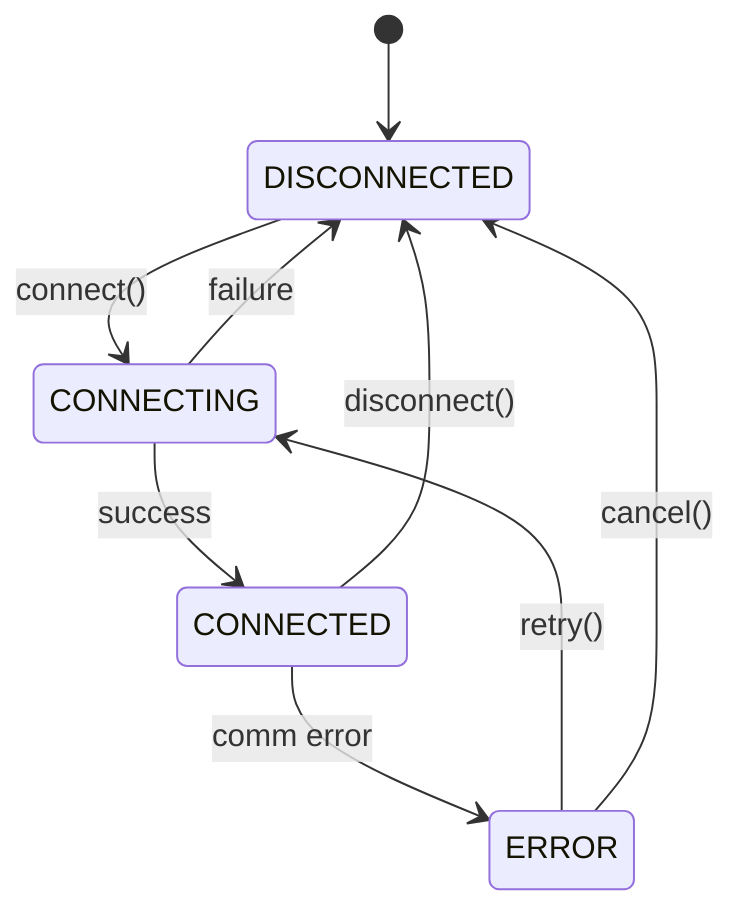
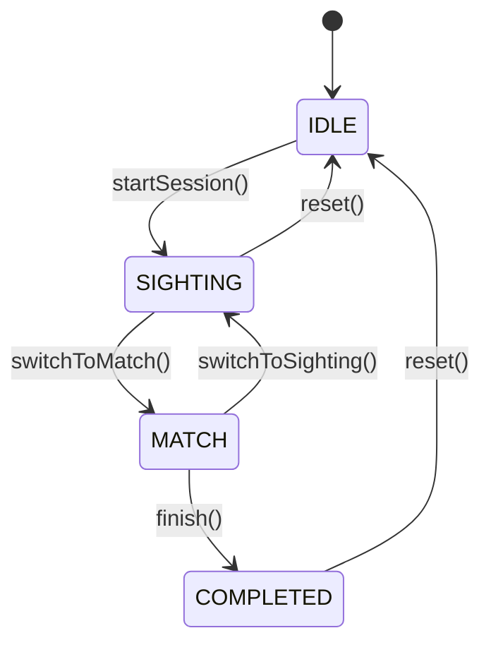
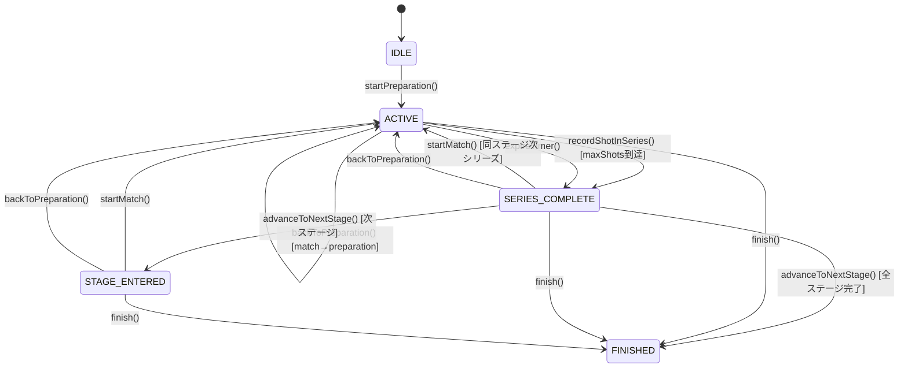

<!-- SPDX-License-Identifier: MIT -->

# Saika Lane — SPEC

> この文書は移植時点の設計資料です。実装と差異がある場合は [`saika-lane`](../../saika-lane/) のソースコードとテストを優先してください。

### 1. 概要 (Overview)

Saika Lane（サイカ・レーン）は、PC／ノートパソコンにインストールして使用する電子標的着弾点表示システムである。着弾点のリアルタイム表示、点数の自動計算、シリーズ合計、記録管理を行う。Electron ベースのデスクトップアプリケーションとして、Windowsを正式対象とし、macOS・Linuxを実験対象とする。

#### 対象ユーザー

射撃場運営者、個人競技者、大会運営者。

---

### 2. 標的装置と種目 (Target Devices & Disciplines)

#### 標的装置一覧

登録済み装置と実装状況は [`saika-lane` のREADME](../../saika-lane/README.md#supported-devices) を正とする。第三者製品名は互換性対象を識別するためにのみ使用する。

| メーカー / 種別   | 装置ID                                                  | 実装状況                      |
| ----------------- | ------------------------------------------------------- | ----------------------------- |
| Kohto Electronics | `MT201`, `BPT216`                                       | 対応（BPT-216は実機検証待ち） |
| SIUS              | `HS10`, `HS25`                                          | スタブ                        |
| Meyton            | `MEYTON_DEFAULT`                                        | スタブ                        |
| DISAG             | `DISAG_KT_RDT_ZIE_1_RIFLE`, `DISAG_KT_RDT_ZIE_1_PISTOL` | 実装済み（実機検証待ち）      |
| Custom            | `CUSTOM`                                                | 対応                          |

#### 選択の挙動

- 標的装置への接続設定は保存され、次回移行に自動で接続を試みる。
- メーカーを変更すると、装置リストが自動更新される。
- 装置を変更すると、ポートリストが自動更新される（利用可能な USB ポートを自動探索）。

> 詳細な標的仕様・スコアリングは [TARGET_SPEC.md](../common/TARGET_SPEC.md)、MT201のSaika側受信形式は
> [MT201受信互換仕様](./devices/kohto/mt201/README.md)、
> [BPT-216受信互換仕様](./devices/kohto/bpt216/README.md) を参照。

---

### 3. 画面遷移 (Screen Flow)



#### 画面一覧

| 画面名           | 説明                                      | 遷移元       | 遷移先                          |
| ---------------- | ----------------------------------------- | ------------ | ------------------------------- |
| スプラッシュ     | 起動スプラッシュ（2秒表示）               | -            | メイン画面                      |
| メイン画面       | 着弾表示・点数管理                        | スプラッシュ | 設定モーダル                    |
| 設定モーダル     | 射座番号・種目選択・接続設定（3タブ構成） | メイン画面   | メイン画面                      |
| エラーダイアログ | エラーメッセージ表示                      | メイン画面   | 元の画面                        |
| デバッグパネル   | デバッグ情報表示                          | メイン画面   | メイン画面                      |
| 印刷ウィンドウ   | ScoreSheet 個票印刷                       | メイン画面   | 印刷ダイアログ（OS ネイティブ） |

---

### 4. メイン画面 (Main Screen)

メイン画面は、サイドメニュー（L）、サイドパネル（P）、メインパネル（MAIN）、ステータスバー（S）の4つの領域で構成される。スプラッシュ画面（2秒表示）の後に表示される。

#### レイアウト

```
┌──────┬──────────────┬────────────────────────────────────────────────────┐
│ [L1] │ [P1]         │ [MAIN]                                             │
│ [L2] ├────┬─────────┤                                                    │
│ [L3] │[P2]│ [P3]    │                                                    │
│ [L4] ├────┴─────────┤                                                    │
│      │              │                                                    │
│      │ [P4]         │                                                    │
│      │              │                                                    │
│      ├──────────────┤                                                    │
│      │ [P5]         │                                                    │
│      │              │                                                    │
│      │              │                                                    │
│      │              │                                                    │
│      │              │                                                    │
│      │              │                                                    │
│      │              │                                                    │
│      │              │                                                    │
│      ├──────────────┤                                                    │
│      │              │                                                    │
│      │ [P6]         │                                                    │
│      │              │                                                    │
│      ├──────────────┤                                                    │
│      │ [P7]         │                                                    │
│ [L5] │              │                                                    │
├──────┴──────────────┴────────────────────────────────────────────────────┤
│ [S1]                                                           [S2] [S3] │
└──────────────────────────────────────────────────────────────────────────┘
```

#### サイドメニュー（L）

**L1 拡大縮小ボタン**

押下でズームサイクルが切り替わる。Z0（自動）→ Z1 → Z2 → Z3 → Z4 → Z0。Z0 では初期状態で Z1 の拡大率を使用し、着弾ごとに直近8発の標準偏差に基づいてZ1〜Z4を自動選択する。

**L2 種目選択ボタン**

設定モーダルを Target タブで開く。種目一覧をカード形式で表示し、現在選択中の種目はハイライト（ring-2 ring-blue-400）表示する。種目カードをクリックすると即座にストア更新・設定永続化が行われ、セッション未開始時は自動でセッションが開始される。連打防止のため、処理中はカードが disabled になる。

**L3 試射モードボタン**

試射（Preparation）モードへ切り替える。現在のモードが試射の場合、ボタンは強調表示される。試射モードで記録された着弾は合計点に加算されない。

**L4 本射モードボタン**

本射（Match）モードへ切り替える。切り替え時に確認ダイアログを表示し、承認後に試射データがリセットされる。ボタン色は赤色（#E54437）。現在のモードが本射の場合、ボタンは強調表示される。

**L5 設定ボタン**

設定モーダルを General タブで開く。設定モーダルは「General」タブ（射座番号の設定）、「Target」タブ（種目選択）、「Connection」タブ（接続設定）の3タブ構成で、各設定値は永続化ストレージに保存され、次回起動以降も復元される。キーボードショートカット（NumpadDecimal）でも開閉できる。

#### ズームレベル

| レベル | 説明                                                                         |
| ------ | ---------------------------------------------------------------------------- |
| Z0     | 自動（デフォルト）。初期は Z1。その後、直近8発の着弾が表示されるよう自動調整 |
| Z1     | 黒色圏の中心 1/3 程度が表示される倍率                                        |
| Z2     | 黒色圏の半分程度が表示される倍率                                             |
| Z3     | 黒色圏のすべてが表示される倍率                                               |
| Z4     | 標的全体が表示される倍率                                                     |

#### メインパネル（MAIN）

- 外側ゾーン（OUTER_RINGS）は #E0E0E0 の背景色に #2D2D2D のストロークで描画される。
- 黒色圏（INNER_RINGS）は #02C38D の背景色で、得点圏は #FFFFFF のリングで区切られる。
- 10点圏（INNER_TEN）は #FFFFFF の白円（塗りつぶしなし）で描画される。
- ゾーン境界は種目ごとに定義される（下表参照）。各得点圏のリングには上下左右4方向に得点ラベル（1-8点）が印字される。

| 種目            | 外側ゾーン | 内側ゾーン | 10点圏 |
| --------------- | ---------- | ---------- | ------ |
| BEAM_RIFLE_10M  | 1-3点      | 4-9点      | 10点   |
| AIR_RIFLE_10M   | 1-3点      | 4-9点      | 10点   |
| AIR_PISTOL_10M  | 1-6点      | 7-9点      | 10点   |
| BEAM_PISTOL_10M | 1-6点      | 7-9点      | 10点   |
| RIFLE_50M       | 1-3点      | 4-9点      | 10点   |

- 着弾円は標的に対して実寸サイズの円で表示される。
- 着弾円の内部にはショットナンバー（何発目か）が印字される。
- 最新の1発について、10点は rgba(254, 1, 0, 0.7)、9点は rgba(253, 254, 3, 0.7)、8点以下は rgba(0, 102, 255, 0.7) で表示する。
- 過去の着弾は rgba(68, 68, 68, 0.7) で表示する。
- 最大8発の着弾円を描画する。
- マウスホイールでズームイン／ズームアウト。
- ドラッグで標的の移動（パン操作）。

#### サイドパネル（P）

`SidePanel` は `side-panel/` サブモジュール（`ShotHistory`、`SeriesScoreGrid`）に表示ロジックを分離している。スコア計算ユーティリティは `presentation/utils/scoreUtils` に共通配置している。

| 要素 | 内容                                                      | 配置             |
| ---- | --------------------------------------------------------- | ---------------- |
| P1   | 種目名                                                    | パネル内上寄せ   |
| P2   | 射座番号（設定から変更）                                  | パネル内上寄せ   |
| P3   | 「Preparation」または「Match」                            | パネル内上寄せ   |
| P4   | 合計点（小数1桁）                                         | パネル内上寄せ   |
| P5   | 最新10発のショットナンバーと点数、自動スクロール          | 残りの余白すべて |
| P6   | シリーズ（10発）ごとの点数。横3列 x 縦2列、自動スクロール | パネル内下寄せ   |
| P7   | 平均点（小数2桁）                                         | パネル内下寄せ   |

#### ステータスバー（S）

- **S1**: 時刻（HH:MM:SS 形式）
- **S2**: 標的装置への接続状態（接続中、切断、エラー）
- **S3**: デバッグパネルの表示切り替えボタン

#### キーボードショートカット

テンキー（Numpad）を使用したショートカットキー操作に対応する。`event.code` を使用するため NumLock の状態に依存しない。ショートカットキー定義は `src/renderer/presentation/constants/shortcuts.ts` に集約されている。`useAppKeyboardShortcuts`（App レベル）はリセット・モード切替・印刷・フルスクリーンを処理し、`MainScreen` はズーム操作・設定モーダル・ESC を処理する。`useAppNavigation` は画面遷移（`'splash' | 'main'`）を管理する。

| キー         | event.code       | 操作                             | 管理箇所                |
| ------------ | ---------------- | -------------------------------- | ----------------------- |
| Numpad 0     | `Numpad0`        | リセットセッション               | useAppKeyboardShortcuts |
| Numpad 1     | `Numpad1`        | Preparation（試射）モードに切替  | useAppKeyboardShortcuts |
| Numpad 2     | `Numpad2`        | Match（本射）モードに切替        | useAppKeyboardShortcuts |
| Numpad 5     | `Numpad5`        | オートズーム（AUTO に戻す）      | MainScreen              |
| Numpad 9     | `Numpad9`        | 印刷（スコアシート）             | useAppKeyboardShortcuts |
| Numpad .     | `NumpadDecimal`  | 設定モーダル開閉                 | MainScreen              |
| Numpad +     | `NumpadAdd`      | ズームイン（次のズームモード）   | MainScreen              |
| Numpad -     | `NumpadSubtract` | ズームアウト（前のズームモード） | MainScreen              |
| Numpad Enter | `NumpadEnter`    | フルスクリーン切替               | useAppKeyboardShortcuts |
| ESC          | `Escape`         | モーダルを閉じる                 | MainScreen              |

**ズームモード順序**: AUTO <-> RING_8 <-> RING_6 <-> RING_4 <-> FULL

NumpadAdd でズームイン（AUTO → RING_8 → RING_6 → RING_4 → FULL）、NumpadSubtract でズームアウト（逆順）する。Numpad5 で AUTO に戻る。

#### 着弾音 (Shot Sound)

着弾イベント受信時に効果音を再生する（`useAudioPlayback` フック）。再生動作の仕様は以下のとおり。

- **低レイテンシパイプライン**: USB データ受信直後（デバッグログやパース処理の前）に `shotReceived` IPC シグナルを発火し、Renderer 側で即座に Web Audio API で再生する。IPC ペイロードは空オブジェクトで最小化されている。
- **AudioContext 設定**: `latencyHint: 'interactive'` で生成し、アプリ起動時に即座に `resume()` を実行する（fire-and-forget）。suspended → resume の非同期待機を排除し、初弾の再生レイテンシを最小化する。
- **モノフォニック再生**: 前の音が再生中の場合は停止してから新しい音を再生する。複数ショットが短時間に連続した場合の重複再生を防ぐ。

---

### 5. 設定モーダル (Settings Modal)

設定モーダルは「General」タブ（射座番号）、「Target」タブ（種目選択）、「Connection」タブ（接続設定）の3タブで構成される。メイン画面の L5 ボタンまたは NumpadDecimal で開閉し、ESC で閉じる。

#### General タブ

射座番号（整数、1〜99）を設定する。設定値は永続化ストレージに保存され、次回起動以降も復元される。

#### Connection タブ

標的装置メーカー、標的装置、接続先ポートを選択し、接続を行う。

**操作フロー**:

1. メーカーを選択する。選択するとデバイスリストが自動更新される。
2. デバイスを選択する。選択するとポートリストが自動更新される（利用可能な USB ポートを自動探索）。
3. 接続ボタンをクリックする。全項目が選択されている場合のみ有効化される。
4. 接続成功時はモーダル内に接続状態が表示される。
5. 接続失敗時はエラーダイアログを表示する。

全ての選択は次回起動時に復元される。

#### メーカー一覧

| 表示名            | コード   | 選択可能な装置              | 実装状況                      |
| ----------------- | -------- | --------------------------- | ----------------------------- |
| Kohto Electronics | `KOHTO`  | MT201, BPT-216              | 対応（BPT-216は実機検証待ち） |
| SIUS              | `SIUS`   | HS10, HS25                  | スタブ                        |
| Meyton            | `MEYTON` | Meyton Standard             | スタブ                        |
| DISAG             | `DISAG`  | DISAG RedDot Rifle / Pistol | 実装済み（実機検証待ち）      |
| Custom            | `CUSTOM` | Custom                      | 対応                          |

> 「スタブ」はUI・型・パーサーの骨格が存在することを示し、実機互換性を保証しない。
> `DISAG_DEFAULT` の内部定義は互換性のため残すが、接続可能なDISAG装置としてUIへ列挙しない。

#### 接続ボタンの挙動

- 全項目（メーカー、装置、ポート）が選択されている場合のみ有効化される。
- クリック時に接続処理を開始し、ローディング状態を表示する。
- 接続成功: 接続状態が更新される。
- 接続失敗: エラーダイアログを表示する。ダイアログには [再試行] と [キャンセル] ボタンを配置する。

#### シリアル通信デフォルト設定

設定値は [`targetDeviceDefinitions.ts`](../../saika-lane/src/main/modules/target/domain/targetDeviceDefinitions.ts) を正とする。値が登録されていても、スタブ装置の実機互換性を意味しない。

| 装置ID                      | ボーレート | データビット | ストップビット | パリティ |
| --------------------------- | ---------: | -----------: | -------------: | -------- |
| `MT201`                     |       9600 |            8 |              1 | none     |
| `BPT216`                    |     115200 |            8 |              1 | none     |
| `HS10`, `HS25`              |       9600 |            8 |              1 | none     |
| `MEYTON_DEFAULT`            |      19200 |            8 |              1 | none     |
| `DISAG_DEFAULT`             |       9600 |            8 |              1 | none     |
| `DISAG_KT_RDT_ZIE_1_RIFLE`  |       9600 |            8 |              1 | none     |
| `DISAG_KT_RDT_ZIE_1_PISTOL` |       9600 |            8 |              1 | none     |
| `CUSTOM`                    |       9600 |            8 |              1 | none     |

---

### 6. 通信プロトコル (Communication Protocols)

受信データはメーカー別パーサーでフレーミングし、装置アダプターで共通の `Shot` に変換する。
MT201については、メーカーの公式通信仕様ではなく、公開実装が受理する入力契約として
[MT201受信互換仕様](./devices/kohto/mt201/README.md) に記録する。BPT-216については、公式V201
アプリケーションの相互運用目的の静的解析から得た必要最小限の挙動を
[BPT-216受信互換仕様](./devices/kohto/bpt216/README.md) に記録する。DISAG RedDotについては、
[RedDot受信互換・実装仕様](./devices/disag/reddot/README.md) にポーリング、59 byteフレーム、BCC、
座標変換、Rifle/Pistolプロファイル、Saikaへの組み込み条件を定義する。RedDotの受信・変換・再接続
コードと合成fixtureによる自動テストは実装済みである。実portでの複数ショット検証が完了するまでは
「実機検証待ち」とし、実機対応を保証しない。それ以外の第三者装置の未検証ワイヤープロトコルは公開しない。

独自装置向けの `CUSTOM` 形式はSaika独自仕様で、改行区切りの `x,y` または `x,y,label`（座標単位はmm）を受け取る。実装は [`CustomAdapter.ts`](../../saika-lane/src/main/modules/target/adapters/CustomAdapter.ts) を参照する。

---

### 7. ドメインモデル (Domain Model)

#### コアインターフェース

**Shot（着弾）**: ショットナンバー、X/Y 座標（mm）、点数（0.0〜10.9）、タイムスタンプ、モード（Preparation / Match）を持つ。1発の射撃を表すデータ単位。

**Session（セッション）**: セッション ID（UUID）、射座番号、種目、現在のモード、着弾データの配列、開始時刻を持つ。1回の射撃練習または競技の単位を表す。

**Series（シリーズ）**: シリーズ番号、スコアリスト、最大発数（`maxShots`）を持つ不変値オブジェクト。`maxShots` はデフォルト 10、0 は無制限を表す。`isComplete` は `maxShots > 0 && scores.length >= maxShots` で判定される。`Series.create(seriesNumber, maxShots = 10)` で生成し、`addScore()` で maxShots を保持した新インスタンスを返す。

**CompetitionState（競技状態）**: 競技の状態マシンを管理する不変集約ルート。フェーズ（IDLE / ACTIVE / SERIES_COMPLETE / STAGE_ENTERED / FINISHED）、現在のステージ・シリーズインデックス、シリーズ内発数、タイマーを持つ。

**Timer（タイマー）**: 残り秒数と合計秒数を持つ不変値オブジェクト。`tick()` / `tickBy(seconds)` で新インスタンスを返す。`formattedRemaining` で "MM:SS" 形式を提供。

**CompetitionTypeDefinition（競技種別定義）**: 1つの CompetitionTypeDefinition は1つのラウンド（例: BR60S の Qualification）を表す。`id`（種別ID）、`name`（表示名）、`config`（ステージ・シリーズ・タイマーの構成）をデータ駆動で定義するインターフェース。Qualification と Final は別々の定義として登録される。

**TargetDevice（標的装置）**: 装置 ID、メーカー名、モデル名、対応種目リスト、通信方式（USB / TCP）を持つ。

**ConnectionSettings（接続設定）**: ポート名、メーカー、装置 ID、射座番号、種目を持つ。

#### 境界づけられたコンテキスト (Bounded Contexts)

**セッション管理コンテキスト (Session Management)**

セッションのライフサイクル管理を担う。セッションの開始・終了、試射/本射モードの切り替え、データリセット、ショットの記録を制御する。セッション内のショット番号の連番管理やシリーズの自動生成もこのコンテキストの責務である。`SessionFactory` がエンティティの生成・復元を担い、`SessionStorageSchema` がストレージとの永続化スキーマを定義する。

**データ取得コンテキスト (Data Acquisition)**

電子標的からのデータ受信と変換を担う。USB/TCP 接続の確立・切断・再接続、メーカー別のデータ受信、生データから共通 Shot フォーマットへの変換を行う。`SerialDataParser` は Strategy パターンで `IManufacturerParser` にメーカー別処理を委譲する。アダプターは `AdapterContext` を外部から受け取るステートレス設計。

**標的表示コンテキスト (Target Display)**

標的と着弾点の視覚化を担う。種目別の標的デザインのレンダリング、着弾円の描画（色分け・ハイライト）、ズーム制御（5段階 + 自動）、パン操作を行う。

**点数計算コンテキスト (Score Calculation)**

着弾点座標から点数を算出する。種目別の得点圏テーブルを参照し、0.1点単位で計算する。シリーズ合計（10発ごと）、合計点、平均点の計算もこのコンテキストの責務である。

**競技管理コンテキスト (Competition Management)**

競技のライフサイクルと進行制御を担う。競技種別定義（`CompetitionTypeDefinition`）に基づいてステージ構成・シリーズ発数・タイマーをデータ駆動で制御する。`CompetitionState` 集約ルートが状態マシンを管理し、`LaneTimerService` がドリフト補正付きカウントダウンタイマーを提供する。`CompetitionTypeRegistry` に登録された種別定義から競技を開始し、試射→本射のステージ遷移、シリーズ完了の自動検知、タイマー満了処理を行う。

**印刷コンテキスト (Printing)**

ScoreSheet（個票）の印刷を担う。HTML+CSS+別 BrowserWindow+`window.print()` 方式で、saika.director と同一のアプローチを採用する。`PrintWindowService` が BrowserWindow の作成・管理を行い、`ScoreSheetPrintScreen` が印刷画面のルートコンポーネント、`ScoreSheet` が A4 用紙対応の個票レイアウトコンポーネントとして機能する。セッションデータから `ScoreSheetDto` への変換は `GetScoreSheetHandler` が担う。選手情報（playerName, affiliation, relay）はディレクター連携未実装のため空欄で印刷される。

**印刷レイアウト仕様:**

- 印刷は A4 サイズに最適化（`@media print` でターゲットサイズ・フォント・余白を縮小）
- ヘッダー + サマリー + シリーズ 1〜6 は 1 ページ目に収まるよう設計
- シリーズ 7 以降は 2 ページ目に改ページ（`page-break-before`）
- DTO、得点単位、Director向け設計との境界は [帳票仕様](../common/PRINT_SPEC.md) を参照

#### 集約と不変条件

**Session 集約**:

- セッション ID は一意である
- ショット番号は連番である
- 本射モードのショットのみが合計点に加算される
- シリーズは maxShots 発（デフォルト10）ごとに自動生成される
- maxShots は `Series.create(seriesNumber, maxShots)` で設定し、シリーズ完了時に次シリーズへ転送される

**Competition 集約**:

- 競技 ID は一意であり、1つのセッションに紐づく
- フェーズ遷移は状態マシンの規則に従う（IDLE → ACTIVE → SERIES_COMPLETE → STAGE_ENTERED → FINISHED）
- タイマーはステージまたはシリーズ単位で管理される
- 終了済み競技に対する状態変更操作は拒否される

**Connection 集約**:

- 同時にアクティブな接続は1つのみ
- 接続状態は DISCONNECTED / CONNECTING / CONNECTED のいずれか

**Target 集約**:

- 種目と標的デザインは1対1の関係
- 標的サイズは種目によって固定
- アダプターはステートレスであり、セッション状態は `AdapterContext` として外部注入

#### ドメインサービス

**ScoreCalculationService**: 着弾点の標的中心からの距離を算出し、種目別の得点圏テーブルを参照して点数を計算する。平均点は合計点 / 記録対象ショット数（本射のみ）で算出し、小数1桁に丸める。

**DataConversionService**: メーカー別アダプターを選択し、受信した生バイト列をパースして共通 Shot フォーマットに変換する。アダプターはステートレスであり、変換に必要なセッション状態は `AdapterContext` として外部から注入される。

**SessionFactory**: Session エンティティの生成を担う。ストレージからの復元（`reconstruct`）と新規作成（`create`）の2つのファクトリメソッドを提供する。

#### ドメインイベント

| イベント              | 説明                          |
| --------------------- | ----------------------------- |
| SessionStarted        | セッションが開始された        |
| ShotRecorded          | ショットが記録された          |
| SeriesCompleted       | シリーズが完了した            |
| ModeSwitched          | 試射/本射モードが切り替わった |
| SessionReset          | セッションがリセットされた    |
| SessionEnded          | セッションが終了した          |
| ConnectionEstablished | 標的装置との接続が確立された  |
| ConnectionLost        | 標的装置との接続が切断された  |
| CompetitionStarted    | 競技が開始された              |
| PhaseChanged          | 競技フェーズが遷移した        |
| TimerTick             | タイマーが1秒減算された       |
| TimerExpired          | タイマーが満了した            |
| StageAdvanced         | 次のステージに進んだ          |
| CompetitionFinished   | 競技が終了した                |

#### データフロー

```
Target Device --> [USB/TCP] --> SerialDataParser --> IManufacturerParser --> RawData
  --> USBDataPipeline (AdapterContext 生成) --> DataConversionService --> Adapter --> Common Shot
  --> [IPC] --> SessionStore --> useEventSubscriptions --> UI Components
```

---

### 8. 状態機械 (State Machines)

接続状態、セッション状態、競技状態の3つの独立した状態機械で、アプリケーション全体の状態遷移を管理する。

#### 接続状態機械



| 状態         | 説明       | UI表示            |
| ------------ | ---------- | ----------------- |
| DISCONNECTED | 未接続     | グレー表示        |
| CONNECTING   | 接続試行中 | 黄色「接続中...」 |
| CONNECTED    | 接続済み   | 緑色「接続中」    |
| ERROR        | 通信エラー | 赤色「エラー」    |

#### セッション状態機械



| 状態      | 説明                 |
| --------- | -------------------- |
| IDLE      | セッション未開始     |
| SIGHTING  | 試射中 (Preparation) |
| MATCH     | 本射中               |
| COMPLETED | 完了                 |

#### 競技フロー (Competition Flow)

Saika Lane は「フリー射撃」モードに加え、競技種別定義に基づいた構造化された「競技フロー」をサポートする。

- **フリー射撃モード**: 競技種別を指定せずにセッションのみで運用する。ショットは無条件に受理され、手動で試射/本射を切り替える。シリーズはデフォルト10発で自動切り替え。
- **競技モード**: 競技種別（BR60S、BP60 等）を指定して開始する。`CompetitionState` が試射→本射のステージ遷移、シリーズ完了の自動検知、タイマー制御を管理する。ショットは `canAcceptShot()` で ACTIVE フェーズのみ受理される。

#### ショット受理ガード

競技モードでは `CompetitionState.canAcceptShot()` がショット受理の可否を判定する。

| フェーズ                                          | `canAcceptShot()` | 説明                                             |
| ------------------------------------------------- | ----------------- | ------------------------------------------------ |
| ACTIVE                                            | `true`            | 試射中・本射中のみショットを受理する             |
| IDLE / SERIES_COMPLETE / STAGE_ENTERED / FINISHED | `false`           | フェーズ間の遷移待ち・準備中はショットを拒否する |

フリー射撃モード（`CompetitionState` なし）ではガードは適用されず、すべてのショットが無条件に受理される。

#### スタンドアローンモード操作

Saika Lane がディレクター（saika.director）に接続せず単独で動作するスタンドアローンモードでは、3ボタンモデルにより競技の進行を制御する。

**3ボタンモデル**:

| ボタン      | 色         | キーボード | 操作内容                                      |
| ----------- | ---------- | ---------- | --------------------------------------------- |
| Preparation | 緑 #029863 | Numpad1    | 試射開始 / IDLE リセット / 試射に戻る         |
| Match       | 赤 #E54437 | Numpad2    | 本射開始 / 次シリーズ開始                     |
| Next Stage  | 白         | Numpad3    | 試射終了→次ステージへ / シリーズ完了→次へ進む |

**Phase 別ボタン操作内容**:

| 状態                 | Preparation ボタン    | Match ボタン              | Next Stage ボタン             |
| -------------------- | --------------------- | ------------------------- | ----------------------------- |
| IDLE (トレーニング)  | 試射ステージ開始      | — (無効)                  | — (無効)                      |
| ACTIVE [preparation] | IDLE にリセット       | 試射終了→本射開始         | 試射終了 (SERIES_COMPLETE へ) |
| ACTIVE [match]       | IDLE にリセット       | — (無効)                  | — (無効)                      |
| SERIES_COMPLETE      | 試射に戻る (stage[0]) | 本射開始 / 次シリーズ開始 | 次ステージへ進む              |
| STAGE_ENTERED        | 試射に戻る (stage[0]) | 本射開始                  | — (無効)                      |
| FINISHED             | — (無効)              | — (無効)                  | — (無効)                      |

- **IDLE (トレーニングモード)**: 発数・時間制限なしで自由射撃可能。ショットは表示・印刷可能
- **Preparation → Match の直接遷移**: Match ボタン1クリックで endPreparation → advanceStage → startMatch を連鎖実行
- **リセット**: ACTIVE 中の Preparation 押下は resetToIdle() で起動時状態に完全リセット（セッションローテーション付き）

**操作フロー例**:

```
起動 → [IDLE: トレーニング自由射撃]
  → [Prep] → [ACTIVE: preparation 試射]
  → [Match] → [ACTIVE: match 本射]
  → (maxShot到達で自動完了)
  → [印刷]
  → [Prep] → [IDLE: トレーニングにリセット]
```

#### 競技状態マシン



| フェーズ        | 説明                       |
| --------------- | -------------------------- |
| IDLE            | 初期状態（未開始）         |
| ACTIVE          | 射撃中（試射・本射問わず） |
| SERIES_COMPLETE | シリーズ完了（遷移待ち）   |
| STAGE_ENTERED   | 新ステージ進入（開始待ち） |
| FINISHED        | 競技終了                   |

#### 競技種別定義（CompetitionTypeDefinition）

> 競技種別の定義構造と対応種別一覧は [競技種別定義](../common/COMPETITION_TYPES.md) を参照。

1つの `CompetitionTypeDefinition` は1つのラウンド（Qualification / Final 等）を定義する。`config`（`RoundConfig`）にステージ構成・シリーズ発数・タイマー設定を保持する。

| 種別ID | 表示名                     | ラウンド      |
| ------ | -------------------------- | ------------- |
| BR60S  | 10m ビームライフル60発立射 | Qualification |
| BP60   | 10m ビームピストル60発     | Qualification |

Saika Lane では Qualification ラウンドのみをサポートする。

> 詳細は [競技種別定義](../common/COMPETITION_TYPES.md) を参照。

#### タイマー仕様

**タイマーモード**:

- `stage` モード: ステージ全体で1つのカウントダウン。ステージ内の全シリーズを通じてタイマーが継続する。
- `series` モード: シリーズごとに個別のカウントダウン。シリーズ開始時にタイマーがリセットされる。
- `shot` モード: 1発ごとにカウントダウン。シリーズ内の全スロットを消化すると次シリーズへ進む（Final 2nd Stage 等で使用）。

**ドリフト補正**: `LaneTimerService` は `Date.now()` ベースでドリフト補正を実施する。

**タイマー満了時の動作**: タイマーが0に達すると `TimerExpired` イベントが発火し、`CompetitionState` が SERIES_COMPLETE フェーズに遷移する。`LaneTimerService` は自動的に停止する。

**UI 表示**: Renderer では `TimerTick` イベントの `formattedRemaining`（"MM:SS" 形式）をカウントダウン表示する。プログレスバーで残り時間の割合を視覚化し、残り60秒で黄色、残り30秒で赤色に色変化する。

---

### 9. イベントと IPC (Events & IPC)

#### アーキテクチャ概要

Main プロセスと Renderer プロセス間の IPC 通信は、Zod スキーマベースのコントラクトシステムで型安全に定義される。すべてのコントラクトは `src/shared/ipc/contracts/` に配置され、`defineContract()` DSL により Main / Preload / Renderer の3層で共有される。Renderer プロセスは `@/main/modules/` から直接インポートせず、全ての DTO 型は共有 IPC コントラクト経由で取得する（Renderer → Main 直接インポート: 0件）。Session DTO は `session/application/dto/index.ts` から共有コントラクトへ再エクスポートされている。

- **Main プロセス**: `IpcRouter` がコントラクトからハンドラーを自動登録し、入力を Zod スキーマで検証する。
- **Preload**: `createBridge()` / `createEventBridge()` がコントラクトからブリッジ関数を自動生成する。
- **Renderer**: Preload が公開した型安全な API を通じて IPC を呼び出す。

#### レスポンス形式

応答形式は `{ success: true, data: T }` または `{ success: false, error: IpcErrorDto }` の Result 型で統一される。イベントは Main から Renderer への単方向プッシュ通知であり、`ipcRenderer.on()` で受信する。

#### IPC チャネル命名規則

| プレフィックス | 用途                     | 方向            |
| -------------- | ------------------------ | --------------- |
| `command:*`    | コマンド（状態変更操作） | Renderer → Main |
| `query:*`      | クエリ（データ取得）     | Renderer → Main |
| `usb:*`        | USB / 接続操作           | Renderer → Main |
| `settings:*`   | 設定の保存・取得         | Renderer → Main |
| `report:*`     | 帳票・印刷操作           | Renderer → Main |
| `event:*`      | イベント通知             | Main → Renderer |
| `error`        | エラー通知               | Main → Renderer |
| `log:*`        | ログメッセージ           | Main → Renderer |

#### Session コントラクト（session.contract.ts）

セッションのライフサイクルとショット記録を管理するコントラクト。

| チャネル                | 種別    | 入力                              | 出力                    | 説明                       |
| ----------------------- | ------- | --------------------------------- | ----------------------- | -------------------------- |
| `command:startSession`  | Command | discipline                        | `{ sessionId: string }` | セッションを開始する       |
| `command:recordShot`    | Command | sessionId, impactPoint, timestamp | void                    | ショットを記録する         |
| `command:switchMode`    | Command | sessionId, mode                   | void                    | モードを切り替える         |
| `command:resetSession`  | Command | sessionId                         | void                    | セッションをリセットする   |
| `query:getSessionScore` | Query   | sessionId                         | SessionScoreDto         | セッションの点数を取得する |
| `query:getShotHistory`  | Query   | sessionId                         | ShotHistoryDto          | ショット履歴を取得する     |

#### Connection コントラクト（connection.contract.ts）

USB デバイスの接続・切断・探索を管理するコントラクト。

| チャネル                       | 種別    | 入力                                         | 出力                        | 説明                         |
| ------------------------------ | ------- | -------------------------------------------- | --------------------------- | ---------------------------- |
| `usb:connect`                  | Command | portName, manufacturer, deviceId?, baudRate? | `{ connectionId: string }`  | デバイスに接続する           |
| `usb:disconnect`               | Command | connectionId                                 | void                        | 接続を切断する               |
| `usb:listPorts`                | Query   | なし                                         | ListPortsDto                | 利用可能なポートを一覧する   |
| `usb:getDevicesByManufacturer` | Query   | manufacturer                                 | GetDevicesByManufacturerDto | メーカー別デバイスを取得する |

#### Settings コントラクト（settings.contract.ts）

接続設定とユーザー設定の永続化を管理するコントラクト。

| チャネル                            | 種別    | 入力               | 出力               | 説明                                                                   |
| ----------------------------------- | ------- | ------------------ | ------------------ | ---------------------------------------------------------------------- |
| `settings:save-connection-settings` | Command | 接続設定データ     | void               | 接続設定を保存する                                                     |
| `settings:get-connection-settings`  | Query   | なし               | 接続設定データ     | 接続設定を取得する                                                     |
| `settings:save-user-preferences`    | Command | ユーザー設定データ | void               | ユーザー設定をマージ保存する（既存値と差分マージ、undefined 値は無視） |
| `settings:get-user-preferences`     | Query   | なし               | ユーザー設定データ | ユーザー設定を取得する                                                 |

#### Competition コントラクト（competition.contract.ts）

競技のライフサイクル管理と状態取得を行うコントラクト。

| チャネル                    | 種別    | 入力              | 出力                                           | 説明                      |
| --------------------------- | ------- | ----------------- | ---------------------------------------------- | ------------------------- |
| `command:startCompetition`  | Command | competitionTypeId | `{ competitionId: string, sessionId: string }` | 競技を開始する            |
| `command:startPreparation`  | Command | competitionId     | void                                           | 試射を開始する            |
| `command:startMatch`        | Command | competitionId     | void                                           | 本射/次シリーズを開始する |
| `command:advanceStage`      | Command | competitionId     | void                                           | 次のステージへ進む        |
| `command:finishCompetition` | Command | competitionId     | void                                           | 競技を終了する            |
| `query:getCompetitionState` | Query   | competitionId     | CompetitionStateDto                            | 競技状態を取得する        |
| `query:getCompetitionTypes` | Query   | なし              | CompetitionTypeDto[]                           | 競技種別一覧を取得する    |

#### Report コントラクト（report.contract.ts）

帳票の生成と印刷ウィンドウの管理を行うコントラクト。

| チャネル                  | 種別    | 入力      | 出力          | 説明                                       |
| ------------------------- | ------- | --------- | ------------- | ------------------------------------------ |
| `query:getScoreSheet`     | Query   | sessionId | ScoreSheetDto | セッションから ScoreSheet データを取得する |
| `command:openPrintWindow` | Command | sessionId | void          | 印刷用 BrowserWindow を作成・表示する      |

#### Events コントラクト（events.contract.ts）

Main プロセスから Renderer プロセスへのプッシュ通知イベントを定義するコントラクト。

| チャネル                        | ペイロード                                                  | 説明                       |
| ------------------------------- | ----------------------------------------------------------- | -------------------------- |
| `event:shotRecorded`            | sessionId, shot                                             | ショットが記録された       |
| `event:connectionStatusChanged` | connectionId, status, manufacturer?, portPath?, reason?     | 接続状態が変化した         |
| `event:sessionStarted`          | sessionId, discipline                                       | セッションが開始された     |
| `event:modeSwitched`            | sessionId, mode                                             | モードが切り替わった       |
| `event:sessionReset`            | sessionId                                                   | セッションがリセットされた |
| `event:competitionStarted`      | competitionTypeId, sessionId, config                        | 競技が開始された           |
| `event:phaseChanged`            | previousPhase, newPhase, stageIndex, seriesIndex, stageName | 競技フェーズが遷移した     |
| `event:timerTick`               | remainingSeconds, totalSeconds, formattedRemaining          | タイマーが1秒減算された    |
| `event:timerExpired`            | stageIndex, timerMode                                       | タイマーが満了した         |
| `event:seriesCompleted`         | stageIndex, seriesIndex, shotCount                          | シリーズが完了した         |
| `event:stageAdvanced`           | previousStageIndex, newStageIndex, stageName, stageType     | 次のステージに進んだ       |
| `event:competitionFinished`     | sessionId                                                   | 競技が終了した             |
| `error`                         | code, message, userMessage, severity                        | IPC エラーが発生した       |
| `log:message`                   | entry（id, timestamp, level, message, source, metadata?）   | ログメッセージが送信された |

---

### 10. エラーハンドリング (Error Handling)

#### エラーカタログ構成

エラー定義は `src/shared/errors/catalogs/` にドメイン別に分割されている:

| カタログファイル     | 対象ドメイン                         | エラーコード数 |
| -------------------- | ------------------------------------ | -------------- |
| ConnectionErrors.ts  | USB 接続・通信エラー                 | 12             |
| SessionErrors.ts     | セッション管理・バリデーションエラー | 10             |
| StorageErrors.ts     | ストレージ操作エラー                 | 4              |
| InfraErrors.ts       | インフラ基盤エラー                   | 9              |
| TargetErrors.ts      | 標的・種目・メーカー関連エラー       | 7              |
| CompetitionErrors.ts | 競技管理・状態遷移エラー             | 7              |

`ErrorCatalog` がこれらを統合し、型安全なエラー生成ファクトリ（`ErrorCatalog.createError()`）を提供する。全ドメイン層・アプリケーション層・インフラ層で `throw new Error()` は使用せず、`ErrorCatalog.createError()` による統一されたエラー生成を行う。合計 6 カタログ 49 エラーコード体制。

#### エラーハンドリングユーティリティ

| ユーティリティ                  | ファイル                                           | 説明                                                                                                              |
| ------------------------------- | -------------------------------------------------- | ----------------------------------------------------------------------------------------------------------------- |
| `toError()`                     | `src/shared/errors/toError.ts`                     | `unknown` 型を安全に `Error` へ変換するユーティリティ。`error as Error` の安全でないキャストを排除する            |
| `withRepositoryErrorHandling()` | `src/shared/errors/withRepositoryErrorHandling.ts` | リポジトリ共通のエラーラッパー。ErrorCatalog の `REPOSITORY_ERROR` を使用して統一的なエラーハンドリングを提供する |

全リポジトリ実装（`ConnectionRepositoryImpl`、`SessionRepositoryImpl`、`CompetitionRepositoryImpl`）は `withRepositoryErrorHandling()` を使用し、個別の try-catch ブロックではなく統一されたエラー処理パターンを適用する。`error as Error` の安全でないキャストはコードベース全体で排除されている（23箇所 → 0箇所）。

#### 表示方式の詳細

**モーダル（severity: error、致命的）**: タイトル、エラーメッセージ、原因、対処法を表示する。[再試行] と [キャンセル] ボタンを配置する。対象: CONNECTION_FAILED, USB_OPEN_FAILED 等。

**トースト（severity: warning）**: 画面右上に表示し、5秒後に自動消去する。クリックで即座に消去可能。対象: USB_READ_TIMEOUT, MAX_RECONNECT_EXCEEDED 等。

**インライン（severity: error/warning、軽微）**: ステータスバー S2 に赤色テキストで表示する。詳細はデバッグパネルにログ出力する。対象: USB_PARSE_ERROR, DATA_CONVERSION_ERROR, VALIDATION_ERROR 等。

#### エラーログとレベルの対応

| severity | ログレベル | 代表的なエラーコード                     | 表示方式   |
| -------- | ---------- | ---------------------------------------- | ---------- |
| error    | ERROR      | CONNECTION_FAILED, USB_OPEN_FAILED       | モーダル   |
| warning  | WARN       | USB_READ_TIMEOUT, MAX_RECONNECT_EXCEEDED | トースト   |
| error    | INFO       | USB_PARSE_ERROR, VALIDATION_ERROR        | インライン |
| info     | INFO       | DATA_CONVERSION_ERROR                    | インライン |

---

### 11. 制約事項とパフォーマンス (Constraints & Performance)

#### UI 制約

- 最小解像度: 1024x768
- 推奨解像度: 1920x1080 以上
- 最小ウィンドウサイズ: 800x600
- 着弾円の最大表示数: 8発
- ズーム: 5段階（Z0〜Z4）

#### データ制約

- 射座番号: 1〜99
- セッションあたりの最大ショット数: 10,000発
- 点数: 0.0〜10.9（小数1桁）
- 座標: -999.99〜999.99 mm

#### 通信制約

- USB ポート: 同時に1つのみ接続可能
- TCP/IP 接続: 同時に1つのみ接続可能
- 接続・読み取りタイムアウトは現行実装とテストを正とする。
- 再接続: 最大3回、2秒間隔

#### パフォーマンス目標（UI 操作）

| 操作                         | 目標             |
| ---------------------------- | ---------------- |
| 標的ズーム                   | < 50ms           |
| 着弾円描画                   | < 16ms（60 FPS） |
| モーダル表示                 | < 100ms          |
| スクロール/ドラッグ          | 60 FPS           |
| ボタンクリックフィードバック | < 100ms          |

#### パフォーマンス目標（データ処理）

| 処理           | 目標    |
| -------------- | ------- |
| データ受信     | < 10ms  |
| データ変換     | < 5ms   |
| 点数計算       | < 1ms   |
| 統計計算       | < 10ms  |
| セッション保存 | < 100ms |

#### メモリバジェット

| 状態          | 目標    |
| ------------- | ------- |
| アイドル時    | < 100MB |
| 100発着弾時   | < 150MB |
| 1,000発着弾時 | < 200MB |

#### 信頼性

- 自動再接続: 3回まで、2秒間隔
- クラッシュ復旧: 最後のセッションを自動保存し、再起動時に復元を提案
- RTO < 1分、RPO = 最新の1ショット

#### セキュリティ（Electron）

- nodeIntegration: false
- contextIsolation: true
- sandbox: true
- CSP 適用

#### OS 互換性

| OS      | バージョン                | サポートレベル |
| ------- | ------------------------- | -------------- |
| Windows | 10+                       | 必須           |
| macOS   | 12+                       | 必須           |
| Linux   | Ubuntu 20.04+, Fedora 35+ | 推奨           |

---

### 12. デザインシステム (Design System)

#### カラーパレット

| 名称          | カラーコード | 用途                |
| ------------- | ------------ | ------------------- |
| Primary       | #029863      | 試射モード、成功    |
| Primary Light | #02C38D      | 黒色圏背景          |
| Danger        | #E54437      | 本射モード、エラー  |
| Warning       | #FDFE03      | 警告、9点の着弾     |
| Info          | #0066FF      | 情報、8点以下の着弾 |
| Black         | #000000      | テキスト            |
| Gray Dark     | #444444      | 過去の着弾          |
| Gray          | #686868      | 補助テキスト        |
| Gray Light    | #E0E0E0      | 区切り線            |
| White         | #FFFFFF      | 背景、得点圏区切り  |

#### タイポグラフィ

`font-family`: システムフォントスタック（-apple-system, BlinkMacSystemFont, 'Segoe UI', 'Roboto' 等）

| サイズ名 | サイズ | 用途                 |
| -------- | ------ | -------------------- |
| xs       | 11px   | 補助情報             |
| sm       | 14px   | 通常テキスト         |
| md       | 16px   | ショット番号、ボタン |
| lg       | 20px   | 得点圏ラベル、見出し |
| xl       | 24px   | タイトル             |
| xxl      | 32px   | 合計点               |

#### アクセシビリティ

- コントラスト: 通常テキスト #000/#FFF = 21:1、ボタン #FFF/#029863 = 4.8:1（WCAG AA 準拠）
- フォーカスリング: 2px solid #0066FF
- 最小フォントサイズ: 12px

#### 国際化

- 対応言語: ja（デフォルト）、en
- ライブラリ: i18next + react-i18next
- 翻訳対象: ボタンラベル、メニュー項目、エラーメッセージ、モーダルタイトル、ツールチップ
- 翻訳非対象: 種目名（BR60S, AR60S 等）、メーカー名、ログメッセージ、デバッグ情報

---

### 13. 機能マトリクス (Feature Matrix)

#### P0 機能（MVP 必須）

| ID    | 機能名                 | 概要                                                                       |
| ----- | ---------------------- | -------------------------------------------------------------------------- |
| F-001 | USB 接続管理           | USB 接続確立、状態監視、自動リトライ（3回/2秒間隔）                        |
| F-002 | 着弾データ受信         | RS-232 バイナリ/テキスト受信、チェックサム検証                             |
| F-003 | データ変換             | メーカー別アダプターで共通フォーマットに変換                               |
| F-004 | 着弾点リアルタイム表示 | 種目別標的上に着弾円描画、色分け、ハイライト                               |
| F-005 | 点数表示・計算         | 0.1点単位、シリーズ合計、合計点、平均点                                    |
| F-006 | 種目名表示             | 種目切り替え、標的デザイン・計算ルール連動                                 |
| F-013 | エラーハンドリング     | ErrorCatalog 統一エラー生成、6カタログ49エラーコード、日本語メッセージ     |
| F-014 | 競技進行管理           | 競技種別定義ベースのステージ・シリーズ・タイマー制御、自動シリーズ完了検知 |

#### P1 機能（MVP 推奨）

| ID       | 機能名               | 概要                                                                                                                                                           |
| -------- | -------------------- | -------------------------------------------------------------------------------------------------------------------------------------------------------------- |
| F-001-01 | シリアル通信設定詳細 | baudRate/dataBits/stopBits/parity/flowControl 編集、メーカー別デフォルト                                                                                       |
| F-007    | 標的選択機能         | メーカー・種目選択 UI、前回設定復元、自動接続                                                                                                                  |
| F-008    | 着弾データリセット   | 確認ダイアログ付きリセット、履歴保存、新セッション開始                                                                                                         |
| F-009    | 試射/本射モード切替  | モードボタン、試射は合計点非加算、視覚的区別                                                                                                                   |
| F-010    | 標的拡大表示         | ズーム5段階、ホイール、ドラッグパン                                                                                                                            |
| F-011    | ScoreSheet 個票印刷  | HTML+CSS+別BrowserWindow+window.print() 方式、A4最適化（1頁:ヘッダー+サマリー+Series1-6、2頁:Series7+）、セッションデータからScoreSheetDto変換、選手情報は空欄 |
| F-012    | セッション管理       | UUID 自動生成、開始/終了時刻、ローカル保存                                                                                                                     |

#### 将来機能（P2/P3）

- **P2**: MQTT 連携、ランキングシステム、観客用ボード、大会管理、データ分析、セッション履歴
- **P3**: 複数標的管理、クラウド同期

---

### 14. データストレージ (Data Storage)

#### 使用技術

electron-store を使用する。

#### ストレージインターフェース

ストレージアクセスは `ILocalStorage` インターフェース（`src/shared/storage/ILocalStorage.ts`）を通じて抽象化されている。`ServiceRegistry.storage` は `ILocalStorage` インターフェース型として定義され、具象クラス（`LocalStorageAdapter`）に直接依存しない。これにより、モジュール間の結合度が低減され、テスト時のモック差し替えが容易になっている。

#### OS ごとの保存パス

| OS      | パス                                        |
| ------- | ------------------------------------------- |
| Windows | `%APPDATA%\saika-lane\`                     |
| macOS   | `~/Library/Application Support/saika-lane/` |
| Linux   | `~/.config/saika-lane/`                     |

#### config.json トップレベルキー

| キー        | 型     | 説明                                 |
| ----------- | ------ | ------------------------------------ |
| sessions    | object | セッション ID ごとのセッションデータ |
| config      | object | アプリケーション設定                 |
| connections | object | 接続履歴                             |
| targets     | object | 標的定義                             |

#### config サブキー

- **connection**: lastUsedPort, lastUsedManufacturer, lastUsedDiscipline, autoConnect
- **ui**: theme, language, targetZoomLevel
- **sound**: enabled, volume（0.0〜1.0）
- **print**: paperSize, includeScores
- **mode**: current, autoSwitchEnabled, autoSwitchCount
- **serialSettings**: current（baudRate/dataBits/stopBits/parity/flowControl）、isCustomized、manufacturerDefaults

---

### Appendix A: 用語集

| 用語               | 説明                                                                                 |
| ------------------ | ------------------------------------------------------------------------------------ |
| 共通データ形式     | メーカー独自の生データを変換した、アプリ内部で統一的に扱う Shot フォーマット         |
| データコンバーター | メーカー別の生データを共通データ形式に変換するアダプターコンポーネント               |
| ショットイベント   | 着弾データの受信・変換が完了した際に発火するドメインイベント                         |
| セッション         | 1回の射撃練習または競技の単位。開始から終了までの一連のショットを管理する            |
| モード切り替え     | 試射モードと本射モードの切り替え操作。本射への切り替え時に試射データがリセットされる |
| Individual         | ISSF ラウンド種別。単独で完結するラウンド（予選・決勝の区分なし）                    |

---

> **変更履歴**: アーキテクチャリファクタリングの記録は [HISTORY.md](./HISTORY.md) を参照。
