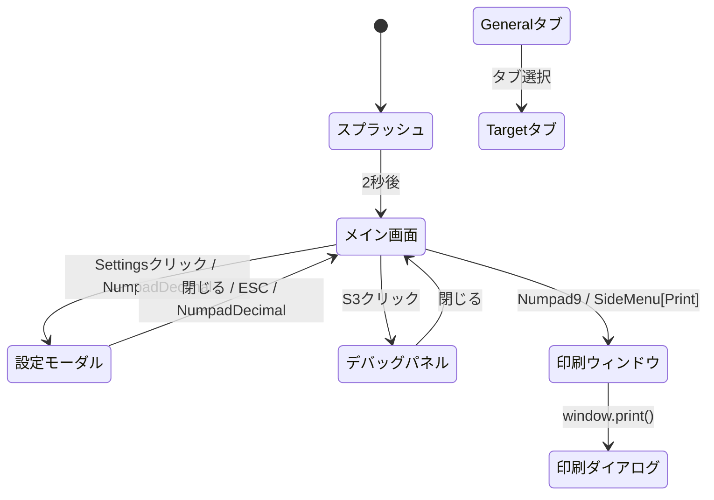
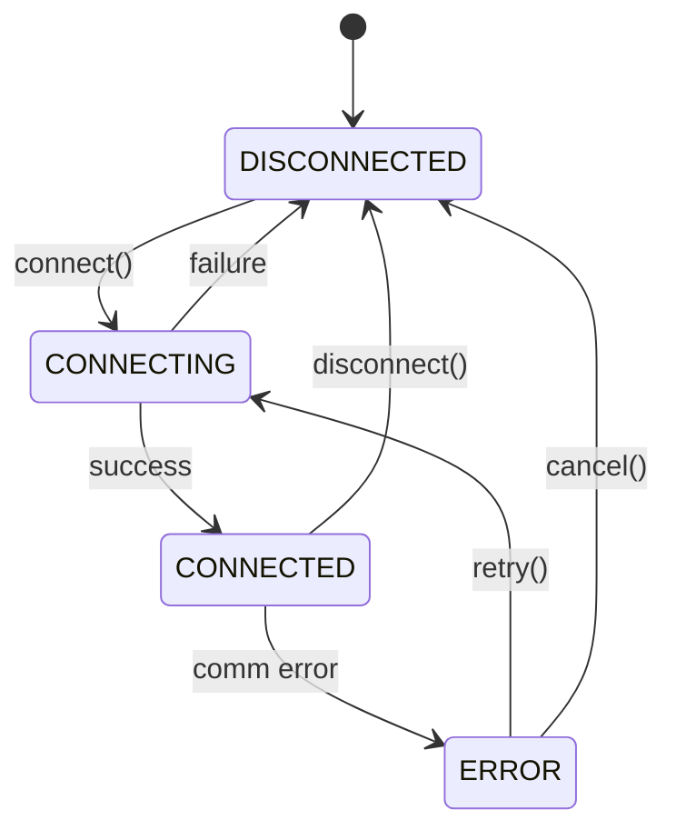
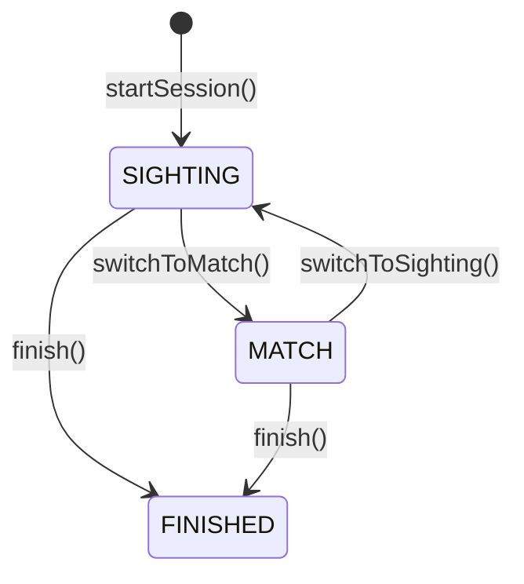
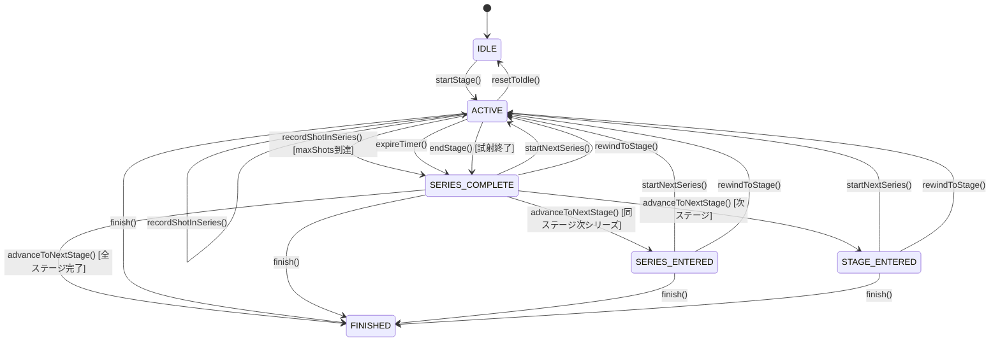

<!-- SPDX-License-Identifier: MIT -->

# Saika Lane — SPEC

> この文書は移植時点の設計資料です。実装と差異がある場合は [`saika-lane`](../../saika-lane/) のソースコードとテストを優先してください。

### 1. 概要 (Overview)

Saika Lane（サイカ・レーン）は、PC／ノートパソコンにインストールして使用する電子標的着弾点表示システムである。着弾点のリアルタイム表示、点数の自動計算、シリーズ合計、記録管理を行う。Electron ベースのデスクトップアプリケーションとして、Windowsを正式対象とし、macOS・Linuxを実験対象とする。

#### 対象ユーザー

射撃場運営者、個人競技者、大会運営者。

---

### 2. 標的装置と種目 (Target Devices & Disciplines)

#### 標的装置一覧

登録済み装置と実装状況は [`saika-lane` のREADME](../../saika-lane/README.md#supported-devices) を正とする。第三者製品名は互換性対象を識別するためにのみ使用する。

| メーカー / 種別   | 装置ID                                                  | 実装状況                      |
| ----------------- | ------------------------------------------------------- | ----------------------------- |
| Kohto Electronics | `MT201`, `BPT216`, `BPT216_RS232`                       | 対応（BPT-216は実機検証待ち） |
| SIUS              | `HS10`, `HS25`                                          | スタブ                        |
| Meyton            | `MEYTON_DEFAULT`                                        | スタブ                        |
| DISAG             | `DISAG_KT_RDT_ZIE_1_RIFLE`, `DISAG_KT_RDT_ZIE_1_PISTOL` | 実装済み（実機検証待ち）      |
| Custom            | `CUSTOM`                                                | 対応                          |

#### 選択の挙動

- 標的装置への接続設定は保存され、次回起動時に自動で接続を試みる。
- メーカーを変更すると、装置リストが自動更新される。
- ポートリストは装置選択とは独立して探索され、Connection タブの更新ボタンで再探索できる。

> 詳細な標的仕様・スコアリングは [TARGET_SPEC.md](../common/TARGET_SPEC.md)、MT201のSaika側受信形式は
> [MT201受信互換仕様](./devices/kohto/mt201/README.md)、
> [BPT-216受信互換仕様](./devices/kohto/bpt216/README.md) を参照。

---

### 3. 画面遷移 (Screen Flow)



#### 画面一覧

| 画面名         | 説明                                                  | 遷移元       | 遷移先                          |
| -------------- | ----------------------------------------------------- | ------------ | ------------------------------- |
| スプラッシュ   | 起動スプラッシュ（2秒表示）                           | -            | メイン画面                      |
| メイン画面     | 着弾表示・点数管理                                    | スプラッシュ | 設定モーダル                    |
| 設定モーダル   | 更新・射座・音量・種目・接続・MQTT・JSON設定（5タブ） | メイン画面   | メイン画面                      |
| デバッグパネル | デバッグ情報表示                                      | メイン画面   | メイン画面                      |
| 印刷ウィンドウ | ScoreSheet 個票印刷                                   | メイン画面   | 印刷ダイアログ（OS ネイティブ） |

---

### 4. メイン画面 (Main Screen)

メイン画面は、タイトルバーと、サイドメニュー（L）、サイドパネル（P）、メインパネル（MAIN）、ステータスバー（S）の4領域で構成される。スプラッシュ画面（2秒表示）の後に表示される。

#### レイアウト

```
┌──────────────────────────── TitleBar ─────────────────────────────┐
├ SideMenu [L1-L6] ┬ SidePanel [P1-P7] ┬ TargetDisplay [MAIN]      │
└──────────────────┴────────────────────┴───────────────────────────┤
│ StatusBar [S1-S3]                                                 │
└───────────────────────────────────────────────────────────────────┘
```

#### サイドメニュー（L）

**L1 拡大縮小ボタン**

押下でズームモードが AUTO → RING_8 → RING_6 → RING_4 → FULL → AUTO の順に切り替わる。AUTO は直近8発が画面内に収まる倍率を着弾位置と分散から連続的に計算する。

**L2 試射モードボタン**

Preparation（試射）を開始する。競技が ACTIVE のときは新しいセッションへローテーションして IDLE に戻し、遷移待ちフェーズでは先頭ステージへ戻る。現在のステージが試射中の場合は強調表示される。

**L3 本射モードボタン**

Match（本射）または次シリーズを開始する。試射中は `endStage` → `advanceStage` → `startNextSeries` を連続実行する。現在のステージが本射中の場合は強調表示される。

**L4 Next Stage ボタン**

試射中はステージを終了し、SERIES_COMPLETE では次シリーズまたは次ステージへ進む。現在のフェーズで操作できない場合は無効化される。

**L5 印刷ボタン**

現在のセッションを ScoreSheet として別ウィンドウで開く。セッションがない場合は無効化される。

**L6 設定ボタン**

設定モーダルを General タブで開く。設定モーダルは「General」「Target」「Connection」「MQTT」「JSON」の5タブ構成で、各設定値は永続化ストレージに保存され、次回起動以降も復元される。キーボードショートカット（NumpadDecimal）でも開閉できる。

#### ズームレベル

| モード | 説明                                                              |
| ------ | ----------------------------------------------------------------- |
| AUTO   | 自動（デフォルト）。直近8発と弾径が画面内に収まるよう自動調整する |
| RING_8 | 8点圏を基準にした固定倍率                                         |
| RING_6 | 6点圏を基準にした固定倍率                                         |
| RING_4 | 4点圏を基準にした固定倍率                                         |
| FULL   | 標的全体を表示する固定倍率                                        |

#### メインパネル（MAIN）

- 外側ゾーン（OUTER_RINGS）は #E0E0E0 の背景色に #2D2D2D のストロークで描画される。
- 黒色圏（INNER_RINGS）は #02C38D の背景色で、得点圏は #FFFFFF のリングで区切られる。
- 10点圏（INNER_TEN）は #FFFFFF の白円（塗りつぶしなし）で描画される。
- ゾーン境界は種目ごとに定義される（下表参照）。各得点圏のリングには上下左右4方向に得点ラベル（1-8点）が印字される。

| 種目            | 外側ゾーン | 内側ゾーン | 10点圏 |
| --------------- | ---------- | ---------- | ------ |
| BEAM_RIFLE_10M  | 1-3点      | 4-9点      | 10点   |
| AIR_RIFLE_10M   | 1-3点      | 4-9点      | 10点   |
| AIR_PISTOL_10M  | 1-6点      | 7-9点      | 10点   |
| BEAM_PISTOL_10M | 1-6点      | 7-9点      | 10点   |
| RIFLE_50M       | 1-3点      | 4-9点      | 10点   |
| PISTOL_25M      | 1-6点      | 7-9点      | 10点   |

- 着弾円は標的に対して実寸サイズの円で表示される。
- 着弾円の内部にはショットナンバー（何発目か）が印字される。
- 最新の1発について、10点は rgba(254, 1, 0, 0.7)、9点は rgba(253, 254, 3, 0.7)、8点以下は rgba(0, 102, 255, 0.7) で表示する。
- 過去の着弾は rgba(68, 68, 68, 0.7) で表示する。
- 最大8発の着弾円を描画する。

#### サイドパネル（P）

`SidePanel` は `side-panel/` サブモジュール（`ShotHistory`、`SeriesScoreGrid`）に表示ロジックを分離している。スコア計算ユーティリティは `presentation/utils/scoreUtils` に共通配置している。

| 要素 | 内容                                                  | 配置             |
| ---- | ----------------------------------------------------- | ---------------- |
| P1   | 種目名                                                | パネル内上寄せ   |
| P2   | 射座番号（設定から変更）                              | パネル内上寄せ   |
| P3   | モード、または競技フェーズ                            | パネル内上寄せ   |
| P4   | 合計点（RING は整数、DECIMAL は小数1桁）              | パネル内上寄せ   |
| P5   | 最新10発のショットナンバーと点数、自動スクロール      | 残りの余白すべて |
| P6   | シリーズごとの点数。横3列、必要に応じて自動スクロール | パネル内下寄せ   |
| P7   | 平均点（小数2桁）                                     | パネル内下寄せ   |

#### ステータスバー（S）

- **S1**: 時刻（HH:MM:SS 形式）
- **S2**: 標的装置への接続状態（接続済み／切断）
- **S3**: デバッグパネルの表示切り替えボタン

#### キーボードショートカット

テンキー（Numpad）を使用したショートカットキー操作に対応する。`event.code` を使用するため NumLock の状態に依存しない。ショートカットキー定義は `src/renderer/presentation/constants/shortcuts.ts` に集約されている。`useAppKeyboardShortcuts`（App レベル）はモード切替・競技進行・印刷・フルスクリーンを処理し、`MainScreen` はズーム操作・設定モーダル・ESC を処理する。

| キー     | event.code      | 操作                            | 管理箇所                |
| -------- | --------------- | ------------------------------- | ----------------------- |
| Numpad 1 | `Numpad1`       | Preparation（試射）モードに切替 | useAppKeyboardShortcuts |
| Numpad 2 | `Numpad2`       | Match（本射）モードに切替       | useAppKeyboardShortcuts |
| Numpad 3 | `Numpad3`       | 次のステージ／シリーズへ進む    | useAppKeyboardShortcuts |
| Numpad 5 | `Numpad5`       | オートズーム（AUTO に戻す）     | MainScreen              |
| Numpad 6 | `Numpad6`       | ズームモードを順に切り替える    | MainScreen              |
| Numpad 9 | `Numpad9`       | 印刷（スコアシート）            | useAppKeyboardShortcuts |
| Numpad . | `NumpadDecimal` | 設定モーダル開閉                | MainScreen              |
| F11      | `F11`           | フルスクリーン切替              | useAppKeyboardShortcuts |
| ESC      | `Escape`        | モーダルを閉じる                | MainScreen              |

**ズームモード順序**: AUTO → RING_8 → RING_6 → RING_4 → FULL → AUTO

Numpad6 で上記の順に切り替え、Numpad5 で AUTO に戻る。

#### 着弾音 (Shot Sound)

着弾イベント受信時に効果音を再生する（`useAudioPlayback` フック）。再生動作の仕様は以下のとおり。

- **低レイテンシパイプライン**: MT201 などの直接ストリームでは USB チャンク受信直後に、BPT-216 / DISAG RedDot などのフレーム型プロトコルではフレーム検証・変換成功後に `shotReceived` IPC シグナルを発火する。Renderer 側は Web Audio API で再生し、IPC ペイロードは空オブジェクトで最小化されている。
- **AudioContext 設定**: `latencyHint: 'interactive'` で生成し、起動時に `resume()` を試みる。ユーザー操作、statechange、visibilitychange でも再開・無音ウォームアップを行い、初弾の再生レイテンシを抑える。
- **モノフォニック再生**: 前の音が再生中の場合は停止してから新しい音を再生する。複数ショットが短時間に連続した場合の重複再生を防ぐ。

---

### 5. 設定モーダル (Settings Modal)

設定モーダルは「General」「Target」「Connection」「MQTT」「JSON」の5タブで構成される。メイン画面の L6 ボタンまたは NumpadDecimal で開閉し、ESC で閉じる。

#### General タブ

アプリ更新の確認・インストール状態、射座番号（1以上の整数）、着弾音量を設定する。設定値は永続化ストレージに保存され、次回起動以降も復元される。

#### Target タブ

競技種別をカードから選択する。種目と採点方式は選択した定義から導出され、新しいセッションと競技を作成して最初のステージを開始する。競技種別 ID はユーザー設定へ永続化する。

#### Connection タブ

標的装置メーカー、標的装置、接続先ポートを選択し、接続を行う。

**操作フロー**:

1. メーカーを選択する。選択するとデバイスリストが自動更新される。
2. ポートリストを確認し、必要に応じて更新ボタンで再探索する。
3. デバイスとポートを選択して接続ボタンをクリックする。
4. 接続成功時はモーダル内に接続状態が表示される。
5. 接続失敗時は Connection タブ内にエラーを表示する。

全ての選択は次回起動時に復元される。

#### メーカー一覧

| 表示名            | コード  | UIで選択可能な装置                     | 実装状況                      |
| ----------------- | ------- | -------------------------------------- | ----------------------------- |
| Kohto Electronics | `KOHTO` | MT201, BPT-216（BP-217 I/F / RS-232C） | 対応（BPT-216は実機検証待ち） |
| DISAG             | `DISAG` | DISAG RedDot Rifle / Pistol            | 実装済み（実機検証待ち）      |

SIUS、Meyton、Custom と `DISAG_DEFAULT` は内部定義を持つが、現行 Connection タブのメーカー候補には列挙しない。

#### 接続ボタンの挙動

- 利用可能なポートが選択され、複数の装置候補がある場合は装置も選択されているときに有効化される。
- クリック時に接続処理を開始し、ローディング状態を表示する。
- 接続成功: 接続状態が更新される。
- 接続失敗: Connection タブ内にエラーを表示する。

#### MQTT タブ

MQTT の有効化、Broker URL、射座エイリアス、自動接続、Lane ID を設定し、Broker への接続・切断を操作する。

#### JSON タブ

正本となる `settings.json` 全体を JSON として表示・編集する。保存時は IPC スキーマで検証し、空の MQTT Lane ID は既存の安定した ID を維持する。

#### シリアル通信デフォルト設定

設定値は [`targetDeviceDefinitions.ts`](../../saika-lane/src/main/modules/target/domain/targetDeviceDefinitions.ts) を正とする。値が登録されていても、スタブ装置の実機互換性を意味しない。

| 装置ID                      | ボーレート | データビット | ストップビット | パリティ |
| --------------------------- | ---------: | -----------: | -------------: | -------- |
| `MT201`                     |       9600 |            8 |              1 | none     |
| `BPT216`                    |     115200 |            8 |              1 | none     |
| `BPT216_RS232`              |       9600 |            8 |              1 | none     |
| `HS10`, `HS25`              |       9600 |            8 |              1 | none     |
| `MEYTON_DEFAULT`            |      19200 |            8 |              1 | none     |
| `DISAG_DEFAULT`             |       9600 |            8 |              1 | none     |
| `DISAG_KT_RDT_ZIE_1_RIFLE`  |       9600 |            8 |              1 | none     |
| `DISAG_KT_RDT_ZIE_1_PISTOL` |       9600 |            8 |              1 | none     |
| `CUSTOM`                    |       9600 |            8 |              1 | none     |

---

### 6. 通信プロトコル (Communication Protocols)

受信データはメーカー別パーサーでフレーミングし、装置アダプターで共通の `Shot` に変換する。
MT201については、メーカーの公式通信仕様ではなく、公開実装が受理する入力契約として
[MT201受信互換仕様](./devices/kohto/mt201/README.md) に記録する。BPT-216については、公式V201
アプリケーションの相互運用目的の静的解析から得たBP-217 I/F形式と、実装・自動テストで受理契約を
固定したRS-232C形式を [BPT-216受信互換仕様](./devices/kohto/bpt216/README.md) に記録する。DISAG RedDotについては、
[RedDot受信互換・実装仕様](./devices/disag/reddot/README.md) にポーリング、59 byteフレーム、BCC、
座標変換、Rifle/Pistolプロファイル、Saikaへの組み込み条件を定義する。RedDotの受信・変換・再接続
コードと合成fixtureによる自動テストは実装済みである。実portでの複数ショット検証が完了するまでは
「実機検証待ち」とし、実機対応を保証しない。それ以外の第三者装置の未検証ワイヤープロトコルは公開しない。

独自装置向けの `CUSTOM` 形式はSaika独自仕様で、改行区切りの `x,y` または `x,y,label`（座標単位はmm）を受け取る。実装は [`CustomAdapter.ts`](../../saika-lane/src/main/modules/target/adapters/CustomAdapter.ts) を参照する。

---

### 7. ドメインモデル (Domain Model)

#### コアインターフェース

**Shot（着弾）**: ショットナンバー、X/Y 座標（mm）、点数（0.0〜10.9）、タイムスタンプ、モード（Preparation / Match）を持つ。1発の射撃を表すデータ単位。

**Session（セッション）**: セッション ID（UUID）、種目、現在のモード、シリーズ、着弾履歴、開始・終了時刻、採点方式を持つ。射座番号はユーザー設定として別に管理する。1回の射撃練習または競技の単位を表す。

**Series（シリーズ）**: シリーズ番号、スコアリスト、最大発数（`maxShots`）を持つ不変値オブジェクト。`maxShots` はデフォルト 10、0 は無制限を表す。`isComplete` は `maxShots > 0 && scores.length >= maxShots` で判定される。`Series.create(seriesNumber, maxShots = 10)` で生成し、`addScore()` で maxShots を保持した新インスタンスを返す。

**CompetitionState（競技状態）**: 競技の状態マシンを管理する不変集約ルート。フェーズ（IDLE / ACTIVE / SERIES_COMPLETE / SERIES_ENTERED / STAGE_ENTERED / FINISHED）、現在のステージ・シリーズインデックス、シリーズ内発数、タイマーを持つ。

**Timer（タイマー）**: 残り秒数と合計秒数を持つ不変値オブジェクト。`tick()` / `tickBy(seconds)` で新インスタンスを返す。`formattedRemaining` で "MM:SS" 形式を提供。

**CompetitionTypeDefinition（競技種別定義）**: 1つの CompetitionTypeDefinition は1つのラウンド（例: BR60S の Qualification）を表す。`id`（種別ID）、`name`（表示名）、`config`（ステージ・シリーズ・タイマーの構成）をデータ駆動で定義するインターフェース。現行レジストリには Qualification の4種別を登録する。

**TargetDevice（標的装置）**: 装置 ID、メーカー名、モデル名、シリアル通信設定、対応種目リストを持つ。

**ConnectionSettings（接続設定）**: ポート名、メーカー、任意の装置 ID と USB 識別情報（serialNumber / vendorId / productId）を持つ。

#### 境界づけられたコンテキスト (Bounded Contexts)

**セッション管理コンテキスト (Session Management)**

セッションのライフサイクル管理を担う。セッションの開始・終了、試射/本射モードの切り替え、データリセット、ショットの記録を制御する。セッション内のショット番号の連番管理やシリーズの自動生成もこのコンテキストの責務である。`SessionFactory` がエンティティの生成・復元を担い、`SessionStorageSchema` がストレージとの永続化スキーマを定義する。

**データ取得コンテキスト (Data Acquisition)**

電子標的からのデータ受信と変換を担う。USB シリアル接続の確立・切断・再接続、メーカー別のデータ受信、生データから共通 Shot フォーマットへの変換を行う。`SerialDataParser` は Strategy パターンで `IManufacturerParser` にメーカー別処理を委譲する。アダプターは `AdapterContext` を外部から受け取るステートレス設計。

**標的表示コンテキスト (Target Display)**

標的と着弾点の視覚化を担う。種目別の標的デザインのレンダリング、着弾円の描画（色分け・ハイライト）、AUTO と4つの固定モードによるズーム制御を行う。

**点数計算コンテキスト (Score Calculation)**

着弾点座標から点数を算出する。種目別の得点圏テーブルを参照し、0.1点単位で計算する。競技定義の発数に基づくシリーズ合計、合計点、平均点の計算もこのコンテキストの責務である。

**競技管理コンテキスト (Competition Management)**

競技のライフサイクルと進行制御を担う。競技種別定義（`CompetitionTypeDefinition`）に基づいてステージ構成・シリーズ発数・タイマーをデータ駆動で制御する。`CompetitionState` 集約ルートが状態マシンを管理し、`LaneTimerService` がドリフト補正付きカウントダウンタイマーを提供する。`CompetitionTypeRegistry` に登録された種別定義から競技を開始し、試射→本射のステージ遷移、シリーズ完了の自動検知、タイマー満了処理を行う。

**印刷コンテキスト (Printing)**

ScoreSheet（個票）の印刷を担う。HTML+CSS+別 BrowserWindow+`window.print()` 方式で、saika.director と同一のアプローチを採用する。`PrintWindowService` が BrowserWindow の作成・管理を行い、`ScoreSheetPrintScreen` が印刷画面のルートコンポーネント、`ScoreSheet` が A4 用紙対応の個票レイアウトコンポーネントとして機能する。セッションデータから `ScoreSheetDto` への変換は `GetScoreSheetHandler` が担う。選手情報（playerName, affiliation, relay）はディレクター連携未実装のため空欄で印刷される。

**印刷レイアウト仕様:**

- 印刷は A4 サイズに最適化（`@media print` でターゲットサイズ・フォント・余白を縮小）
- ヘッダー + サマリー + シリーズ 1〜6 は 1 ページ目に収まるよう設計
- シリーズ 7 以降は 2 ページ目に改ページ（`page-break-before`）
- DTO、得点単位、Director向け設計との境界は [帳票仕様](../common/PRINT_SPEC.md) を参照

#### 集約と不変条件

**Session 集約**:

- セッション ID は一意である
- ショット番号は連番である
- 本射モードのショットのみが合計点に加算される
- シリーズは maxShots 発（デフォルト10）ごとに自動生成される
- maxShots は `Series.create(seriesNumber, maxShots)` で設定し、シリーズ完了時に次シリーズへ転送される

**Competition 集約**:

- 競技 ID は一意であり、1つのセッションに紐づく
- フェーズ遷移は状態マシンの規則に従う（シリーズ内遷移では SERIES_ENTERED、ステージ間遷移では STAGE_ENTERED を経由する）
- タイマーはステージまたはシリーズ単位で管理される
- 終了済み競技に対する状態変更操作は拒否される

**Connection 集約**:

- 同時にアクティブな接続は1つのみ
- 接続状態は DISCONNECTED / CONNECTING / CONNECTED / ERROR のいずれか

**Target 集約**:

- 種目と標的デザインは1対1の関係
- 標的サイズは種目によって固定
- アダプターはステートレスであり、セッション状態は `AdapterContext` として外部注入

#### ドメインサービス

**ScoreCalculationService**: 着弾点の標的中心からの距離を算出し、種目別の得点圏テーブルを参照して点数を計算する。平均点は Renderer で合計点 / 記録対象ショット数（本射のみ）として算出し、小数2桁で表示する。

**DataConversionService**: メーカーまたは装置 ID に対応するアダプターを選択し、フレーミング済みの `RawData` を共通 Shot フォーマットに変換する。ストリームのパースは `SerialDataParser` または装置プロトコルが担当する。アダプターはステートレスであり、変換に必要なセッション状態は `AdapterContext` として外部から注入される。

**Session / SessionFactory**: 新規セッションは `Session.create()`、永続化データからの復元は `SessionFactory.fromStorageData()` と `Session.reconstruct()` が担う。

#### ドメインイベント

| イベント              | 説明                          |
| --------------------- | ----------------------------- |
| SessionStarted        | セッションが開始された        |
| ShotRecorded          | ショットが記録された          |
| SeriesCompleted       | シリーズが完了した            |
| ModeSwitched          | 試射/本射モードが切り替わった |
| SessionReset          | セッションがリセットされた    |
| ConnectionEstablished | 標的装置との接続が確立された  |
| ConnectionLost        | 標的装置との接続が切断された  |
| CompetitionStarted    | 競技が開始された              |
| PhaseChanged          | 競技フェーズが遷移した        |
| TimerTick             | タイマーが1秒減算された       |
| TimerExpired          | タイマーが満了した            |
| StageAdvanced         | 次のステージに進んだ          |
| CompetitionFinished   | 競技が終了した                |
| MqttConnected         | MQTT Brokerへ接続した         |
| MqttDisconnected      | MQTT Brokerから切断した       |

#### データフロー

```
Target Device --> [USB serial] --> TargetProtocol --> USBDataPipeline (AdapterContext 生成)
  --> [direct stream: SerialDataParser --> IManufacturerParser | accepted shot frame: RawData]
  --> DataConversionService --> Adapter --> Common Shot
  --> [IPC] --> SessionStore --> useEventSubscriptions --> UI Components
```

---

### 8. 状態機械 (State Machines)

接続状態、セッションのモード／終了状態、競技状態を独立して管理する。競技進行は明示的な状態機械、Session はモードと `finishedAt` を持つ不変集約として表現する。

#### 接続状態機械



| 状態         | 説明       | UI表示            |
| ------------ | ---------- | ----------------- |
| DISCONNECTED | 未接続     | グレー表示        |
| CONNECTING   | 接続試行中 | 黄色「接続中...」 |
| CONNECTED    | 接続済み   | 緑色「接続中」    |
| ERROR        | 通信エラー | 赤色「エラー」    |

#### セッションのライフサイクル



Session 自体に IDLE 状態はない。進行中は `mode` が SIGHTING または MATCH を表し、`finishedAt` の有無で終了済みかを判定する。`resetSession` は同じセッションの着弾・シリーズを初期化する。

#### 競技フロー (Competition Flow)

Saika Lane は「フリー射撃」モードに加え、競技種別定義に基づいた構造化された「競技フロー」をサポートする。

- **フリー射撃相当の IDLE**: 起動直後の競技状態。発数・時間制限なしでショットを受理する。
- **競技モード**: 競技種別（AR60、AP60、BR60S、BP60 等）を指定して開始する。`CompetitionState` が試射→本射のステージ遷移、シリーズ完了の自動検知、タイマー制御を管理する。

#### ショット受理ガード

競技モードでは `CompetitionState.canAcceptShot()` がショット受理の可否を判定する。

| フェーズ                                                    | `canAcceptShot()` | 説明                                             |
| ----------------------------------------------------------- | ----------------- | ------------------------------------------------ |
| IDLE / ACTIVE                                               | `true`            | IDLE の自由射撃、または進行中の試射・本射を受理  |
| SERIES_COMPLETE / SERIES_ENTERED / STAGE_ENTERED / FINISHED | `false`           | フェーズ間の遷移待ち・終了後はショットを拒否する |

#### スタンドアローンモード操作

Saika Lane がディレクター（saika.director）に接続せず単独で動作するスタンドアローンモードでは、3ボタンモデルにより競技の進行を制御する。

**3ボタンモデル**:

| ボタン      | 色         | キーボード | 操作内容                                      |
| ----------- | ---------- | ---------- | --------------------------------------------- |
| Preparation | 緑 #029863 | Numpad1    | 試射開始 / IDLE リセット / 試射に戻る         |
| Match       | 赤 #E54437 | Numpad2    | 本射開始 / 次シリーズ開始                     |
| Next Stage  | 白         | Numpad3    | 試射終了→次ステージへ / シリーズ完了→次へ進む |

**Phase 別ボタン操作内容**:

| 状態                 | Preparation ボタン    | Match ボタン              | Next Stage ボタン             |
| -------------------- | --------------------- | ------------------------- | ----------------------------- |
| IDLE (トレーニング)  | 試射ステージ開始      | — (無効)                  | — (無効)                      |
| ACTIVE [preparation] | IDLE にリセット       | 試射終了→本射開始         | 試射終了 (SERIES_COMPLETE へ) |
| ACTIVE [match]       | IDLE にリセット       | — (無効)                  | — (無効)                      |
| SERIES_COMPLETE      | 試射に戻る (stage[0]) | 本射開始 / 次シリーズ開始 | 次ステージへ進む              |
| SERIES_ENTERED       | 試射に戻る (stage[0]) | 次シリーズ開始            | — (無効)                      |
| STAGE_ENTERED        | 試射に戻る (stage[0]) | 本射開始                  | — (無効)                      |
| FINISHED             | — (無効)              | — (無効)                  | — (無効)                      |

- **IDLE (トレーニングモード)**: 発数・時間制限なしで自由射撃可能。ショットは表示・印刷可能
- **Preparation → Match の直接遷移**: Match ボタン1クリックで `endStage` → `advanceStage` → `startNextSeries` を連鎖実行
- **リセット**: ACTIVE 中の Preparation 押下は resetToIdle() で起動時状態に完全リセット（セッションローテーション付き）

**操作フロー例**:

```
起動 → [IDLE: トレーニング自由射撃]
  → [Prep] → [ACTIVE: preparation 試射]
  → [Match] → [ACTIVE: match 本射]
  → (maxShots到達で自動完了)
  → [印刷]
  → [Prep] → [IDLE: トレーニングにリセット]
```

#### 競技状態マシン



| フェーズ        | 説明                                     |
| --------------- | ---------------------------------------- |
| IDLE            | 初期状態（未開始）                       |
| ACTIVE          | 射撃中（試射・本射問わず）               |
| SERIES_COMPLETE | シリーズ完了（遷移待ち）                 |
| SERIES_ENTERED  | 同一ステージの次シリーズ進入（開始待ち） |
| STAGE_ENTERED   | 新ステージ進入（開始待ち）               |
| FINISHED        | 競技終了                                 |

#### 競技種別定義（CompetitionTypeDefinition）

> 競技種別の定義構造と対応種別一覧は [競技種別定義](../common/COMPETITION_TYPES.md) を参照。

1つの `CompetitionTypeDefinition` は1つのラウンド（Qualification / Final 等）を定義する。`config`（`RoundConfig`）にステージ構成・シリーズ発数・タイマー設定を保持する。

| 種別ID | 表示名                     | ラウンド      |
| ------ | -------------------------- | ------------- |
| AR60   | 10m エアライフル60発       | Qualification |
| AP60   | 10m エアピストル60発       | Qualification |
| BR60S  | 10m ビームライフル60発立射 | Qualification |
| BP60   | 10m ビームピストル60発     | Qualification |

Saika Lane では Qualification ラウンドのみをサポートする。

> 詳細は [競技種別定義](../common/COMPETITION_TYPES.md) を参照。

#### タイマー仕様

**タイマー設定**:

- ステージの `timer`: ステージ全体で1つのカウントダウン。ステージ内のシリーズを通じて継続する。
- シリーズの `timer`: シリーズ開始時に個別のカウントダウンを生成する。
- シリーズの `shotTimer`: 型定義上は将来の Final 対応用に予約されており、現行の進行処理では使用しない。

**ドリフト補正**: `LaneTimerService` は `Date.now()` ベースでドリフト補正を実施する。

**タイマー満了時の動作**: タイマーが0に達すると `TimerExpired` イベントが発火し、`CompetitionState` が SERIES_COMPLETE フェーズに遷移する。`LaneTimerService` は自動的に停止する。

**UI 表示**: Renderer は `TimerTick` イベントの残り秒数と合計秒数をストアへ反映し、残り時間を "MM:SS" 形式で表示する。プログレスバーで残り時間の割合を視覚化し、残り60秒で黄色、残り30秒で赤色に色変化する。

---

### 9. イベントと IPC (Events & IPC)

#### アーキテクチャ概要

Main プロセスと Renderer プロセス間の IPC 通信は、Zod スキーマベースのコントラクトシステムで型安全に定義される。すべてのコントラクトは `src/shared/ipc/contracts/` に配置され、`defineContract()` DSL により Main / Preload / Renderer の3層で共有される。Renderer プロセスは `@/main/modules/` から直接インポートせず、DTO 型は共有 IPC コントラクト経由で取得する。Main 側の Session DTO エントリーポイントも共有コントラクトの型を再エクスポートする。

- **Main プロセス**: `IpcRouter` がコントラクトからハンドラーを自動登録し、入力を Zod スキーマで検証する。
- **Preload**: `createBridge()` / `createEventBridge()` がコントラクトからブリッジ関数を自動生成する。
- **Renderer**: Preload が公開した型安全な API を通じて IPC を呼び出す。

#### レスポンス形式

データを返す Query は `{ success: true, data: T }` または `{ success: false, data: null, error: IpcErrorDto }`、データを返す Command は成功時に `data`、失敗時に `error` を持つ判別可能な Result とする。データを返さない Command は `success` と任意の `error` を返す。イベントは Main から Renderer への単方向プッシュ通知であり、`ipcRenderer.on()` で受信する。

#### IPC チャネル命名規則

| プレフィックス | 用途                     | 方向            |
| -------------- | ------------------------ | --------------- |
| `command:*`    | コマンド（状態変更操作） | Renderer → Main |
| `query:*`      | クエリ（データ取得）     | Renderer → Main |
| `usb:*`        | USB / 接続操作           | Renderer → Main |
| `settings:*`   | 設定の保存・取得         | Renderer → Main |
| `mqtt:*`       | MQTT 接続・設定          | Renderer → Main |
| `updater:*`    | アプリ更新               | Renderer → Main |
| `event:*`      | イベント通知             | Main → Renderer |
| `error`        | エラー通知               | Main → Renderer |
| `log:*`        | ログメッセージ           | Main → Renderer |

#### Session コントラクト（session.contract.ts）

セッションのライフサイクルとショット記録を管理するコントラクト。

| チャネル                | 種別    | 入力                              | 出力                    | 説明                       |
| ----------------------- | ------- | --------------------------------- | ----------------------- | -------------------------- |
| `command:startSession`  | Command | discipline                        | `{ sessionId: string }` | セッションを開始する       |
| `command:recordShot`    | Command | sessionId, impactPoint, timestamp | void                    | ショットを記録する         |
| `command:switchMode`    | Command | sessionId, mode                   | void                    | モードを切り替える         |
| `command:resetSession`  | Command | sessionId                         | void                    | セッションをリセットする   |
| `query:getSessionScore` | Query   | sessionId                         | SessionScoreDto         | セッションの点数を取得する |
| `query:getShotHistory`  | Query   | sessionId                         | ShotHistoryDto          | ショット履歴を取得する     |

#### Connection コントラクト（connection.contract.ts）

USB デバイスの接続・切断・探索を管理するコントラクト。

| チャネル                       | 種別    | 入力                                         | 出力                        | 説明                         |
| ------------------------------ | ------- | -------------------------------------------- | --------------------------- | ---------------------------- |
| `usb:connect`                  | Command | portName, manufacturer, deviceId?, baudRate? | `{ connectionId: string }`  | デバイスに接続する           |
| `usb:disconnect`               | Command | connectionId                                 | void                        | 接続を切断する               |
| `usb:listPorts`                | Query   | なし                                         | ListPortsDto                | 利用可能なポートを一覧する   |
| `usb:getDevicesByManufacturer` | Query   | manufacturer                                 | GetDevicesByManufacturerDto | メーカー別デバイスを取得する |

#### Settings コントラクト（settings.contract.ts）

接続設定とユーザー設定の永続化を管理するコントラクト。

| チャネル                            | 種別    | 入力               | 出力               | 説明                                                                   |
| ----------------------------------- | ------- | ------------------ | ------------------ | ---------------------------------------------------------------------- |
| `settings:save-connection-settings` | Command | 接続設定データ     | void               | 接続設定を保存する                                                     |
| `settings:get-connection-settings`  | Query   | なし               | 接続設定データ     | 接続設定を取得する                                                     |
| `settings:save-user-preferences`    | Command | ユーザー設定データ | void               | ユーザー設定をマージ保存する（既存値と差分マージ、undefined 値は無視） |
| `settings:get-user-preferences`     | Query   | なし               | ユーザー設定データ | ユーザー設定を取得する                                                 |
| `settings:save-app-settings`        | Command | 設定文書全体       | void               | `settings.json` 全体を検証して保存する                                 |
| `settings:get-app-settings`         | Query   | なし               | 設定文書全体       | 正規化された設定文書を取得する                                         |
| `settings:get-settings-file-info`   | Query   | なし               | path               | 設定ファイルの情報を取得する                                           |

#### Competition コントラクト（competition.contract.ts）

競技のライフサイクル管理と状態取得を行うコントラクト。

| チャネル                    | 種別    | 入力              | 出力                                           | 説明                         |
| --------------------------- | ------- | ----------------- | ---------------------------------------------- | ---------------------------- |
| `command:startCompetition`  | Command | competitionTypeId | `{ competitionId: string, sessionId: string }` | 競技を作成する               |
| `command:startStage`        | Command | competitionId     | `{ sessionId: string }`                        | 最初のステージを開始する     |
| `command:startNextSeries`   | Command | competitionId     | void                                           | 次のシリーズを開始する       |
| `command:advanceStage`      | Command | competitionId     | void                                           | 次シリーズ／ステージへ進む   |
| `command:endStage`          | Command | competitionId     | void                                           | 採点対象外ステージを終了する |
| `command:finishCompetition` | Command | competitionId     | void                                           | 競技を終了する               |
| `query:getCompetitionState` | Query   | competitionId     | CompetitionStateDto                            | 競技状態を取得する           |
| `query:getCompetitionTypes` | Query   | なし              | CompetitionTypeDto[]                           | 競技種別一覧を取得する       |

#### MQTT コントラクト（mqtt.contract.ts）

| チャネル            | 種別    | 入力                                | 出力     | 説明               |
| ------------------- | ------- | ----------------------------------- | -------- | ------------------ |
| `mqtt:connect`      | Command | brokerUrl, laneAlias?, autoConnect? | void     | Brokerへ接続する   |
| `mqtt:disconnect`   | Command | なし                                | void     | Brokerから切断する |
| `mqtt:getStatus`    | Query   | なし                                | MQTT状態 | 接続状態を取得する |
| `mqtt:saveSettings` | Command | MQTT設定                            | void     | MQTT設定を保存する |
| `mqtt:getSettings`  | Query   | なし                                | MQTT設定 | MQTT設定を取得する |

MQTT モジュールは着弾・得点・競技状態の publish、競技状態・コマンドの subscribe、および RPC 応答を実装する。トピックとペイロードの詳細は実装内の Zod スキーマを正とする。

#### Window / Updater コントラクト

- Window: `command:toggleFullscreen`、`command:minimize`、`command:maximize`、`command:close`、`query:getWindowState`
- Updater: `updater:get-update-state`、`updater:check-for-updates`、`updater:quit-and-install`

#### Report コントラクト（report.contract.ts）

帳票の生成と印刷ウィンドウの管理を行うコントラクト。

| チャネル                  | 種別    | 入力      | 出力          | 説明                                       |
| ------------------------- | ------- | --------- | ------------- | ------------------------------------------ |
| `query:getScoreSheet`     | Query   | sessionId | ScoreSheetDto | セッションから ScoreSheet データを取得する |
| `command:openPrintWindow` | Command | sessionId | void          | 印刷用 BrowserWindow を作成・表示する      |

#### Events コントラクト（events.contract.ts）

Main プロセスから Renderer プロセスへのプッシュ通知イベントを定義するコントラクト。

| チャネル                        | 主なペイロード                                                           | 説明                       |
| ------------------------------- | ------------------------------------------------------------------------ | -------------------------- |
| `event:shotReceived`            | `{}`                                                                     | 着弾音用の受信通知         |
| `event:shotRecorded`            | sessionId, shot                                                          | ショットが記録された       |
| `event:connectionStatusChanged` | connectionId, status, manufacturer?, portPath?, deviceId?, reason?       | 接続状態が変化した         |
| `event:sessionStarted`          | sessionId, discipline                                                    | セッションが開始された     |
| `event:modeSwitched`            | sessionId, mode                                                          | モードが切り替わった       |
| `event:sessionReset`            | sessionId                                                                | セッションがリセットされた |
| `event:competitionStarted`      | competitionId, competitionTypeId, sessionId, config, shotsPerSeries, acc | 競技が開始された           |
| `event:phaseChanged`            | previousPhase, newPhase, stageIndex, seriesIndex, stageName, scored      | 競技フェーズが遷移した     |
| `event:timerTick`               | remainingSeconds, totalSeconds, formattedRemaining                       | タイマーが1秒減算された    |
| `event:timerExpired`            | stageIndex                                                               | タイマーが満了した         |
| `event:seriesCompleted`         | stageIndex, seriesIndex, shotCount                                       | シリーズが完了した         |
| `event:stageAdvanced`           | previousStageIndex, newStageIndex, stageName, scored                     | 次のステージに進んだ       |
| `event:competitionFinished`     | sessionId                                                                | 競技が終了した             |
| `event:mqttStatusChanged`       | status, brokerUrl?, laneId?                                              | MQTT接続状態が変化した     |
| `event:fullscreenChanged`       | isFullscreen                                                             | 全画面状態が変化した       |
| `event:updateStateChanged`      | AppUpdateState                                                           | アプリ更新状態が変化した   |
| `error`                         | code, message, userMessage, severity                                     | IPC エラーが発生した       |
| `log:message`                   | entry（id, timestamp, level, message, source, metadata?）                | ログメッセージが送信された |

---

### 10. エラーハンドリング (Error Handling)

#### エラーカタログ構成

エラー定義は `src/shared/errors/catalogs/` にドメイン別に分割されている:

| カタログファイル     | 対象ドメイン                         |
| -------------------- | ------------------------------------ |
| CompetitionErrors.ts | 競技管理・状態遷移エラー             |
| ConnectionErrors.ts  | USB 接続・通信エラー                 |
| InfraErrors.ts       | インフラ基盤エラー                   |
| MqttErrors.ts        | MQTT接続・通信エラー                 |
| ReportErrors.ts      | 帳票・印刷エラー                     |
| SessionErrors.ts     | セッション管理・バリデーションエラー |
| StorageErrors.ts     | ストレージ操作エラー                 |
| TargetErrors.ts      | 標的・種目・メーカー関連エラー       |

`ErrorCatalog` がこれらを統合し、型安全なエラー生成ファクトリ（`ErrorCatalog.createError()`）を提供する。ドメイン境界や共有エラーはカタログを使用し、Renderer の局所的な入力・状態検査などでは通常の `Error` も使用する。カタログとコードの一覧は `src/shared/errors/catalogs/` を正とする。

#### エラーハンドリングユーティリティ

| ユーティリティ                  | ファイル                                           | 説明                                                                                                              |
| ------------------------------- | -------------------------------------------------- | ----------------------------------------------------------------------------------------------------------------- |
| `toError()`                     | `src/shared/errors/toError.ts`                     | `unknown` 型を安全に `Error` へ変換するユーティリティ。`error as Error` の安全でないキャストを排除する            |
| `withRepositoryErrorHandling()` | `src/shared/errors/withRepositoryErrorHandling.ts` | リポジトリ共通のエラーラッパー。ErrorCatalog の `REPOSITORY_ERROR` を使用して統一的なエラーハンドリングを提供する |

接続・セッション・競技のリポジトリ実装は `withRepositoryErrorHandling()` を使用し、ストレージ例外を共通のリポジトリエラーへ変換する。

#### 表示方式の詳細

- Connection、設定、MQTT、更新操作の失敗は各タブまたは操作領域内にインライン表示する。
- 予期しない標的切断は、Connection 設定を開く操作付きの警告トーストとして6秒間表示する。
- 接続状態はステータスバーにも表示し、通信・変換の詳細はログとデバッグパネルで確認する。
- IPC の `error` イベントは共通の code / message / userMessage / severity を運ぶが、severity だけで一律に表示方式を決める汎用ディスパッチャーは設けていない。

---

### 11. 制約事項とパフォーマンス (Constraints & Performance)

#### UI 制約

- 初期ウィンドウサイズ: 1280x800（パッケージ版は全画面で起動）
- 着弾円の最大表示数: 8発
- ズーム: AUTO / RING_8 / RING_6 / RING_4 / FULL の5モード

#### データ制約

- 射座番号: 1以上の整数
- 点数: 0.0〜10.9（小数1桁）

#### 通信制約

- USB ポート: 同時に1つのみ接続可能
- 接続・読み取りタイムアウトは現行実装とテストを正とする。
- 予期しない切断時の自動再接続: 旧ポートのclose完了後に即時1回

以下は設計目標であり、現行実装が実行時に保証する上限値ではない。

#### パフォーマンス目標（UI 操作）

| 操作                         | 目標             |
| ---------------------------- | ---------------- |
| 標的ズーム                   | < 50ms           |
| 着弾円描画                   | < 16ms（60 FPS） |
| モーダル表示                 | < 100ms          |
| スクロール                   | 60 FPS           |
| ボタンクリックフィードバック | < 100ms          |

#### パフォーマンス目標（データ処理）

| 処理           | 目標    |
| -------------- | ------- |
| データ受信     | < 10ms  |
| データ変換     | < 5ms   |
| 点数計算       | < 1ms   |
| 統計計算       | < 10ms  |
| セッション保存 | < 100ms |

#### メモリバジェット

| 状態          | 目標    |
| ------------- | ------- |
| アイドル時    | < 100MB |
| 100発着弾時   | < 150MB |
| 1,000発着弾時 | < 200MB |

#### 信頼性

- 自動再接続: 旧ポートのclose完了後に即時1回
- セッションと着弾は受信ごとにローカルストレージへ保存する。

#### セキュリティ（Electron）

- nodeIntegration: false
- contextIsolation: true
- sandbox: true
- CSP 適用

#### OS 互換性

| OS      | サポートレベル |
| ------- | -------------- |
| Windows | 正式対象       |
| macOS   | 実験対象       |
| Linux   | 実験対象       |

---

### 12. デザインシステム (Design System)

#### カラーパレット

| 名称          | カラーコード | 用途                |
| ------------- | ------------ | ------------------- |
| Primary       | #029863      | 試射モード、成功    |
| Primary Light | #02C38D      | 黒色圏背景          |
| Danger        | #E54437      | 本射モード、エラー  |
| Warning       | #FDFE03      | 警告、9点の着弾     |
| Info          | #0066FF      | 情報、8点以下の着弾 |
| Black         | #000000      | テキスト            |
| Gray Dark     | #444444      | 過去の着弾          |
| Gray          | #686868      | 補助テキスト        |
| Gray Light    | #E0E0E0      | 区切り線            |
| White         | #FFFFFF      | 背景、得点圏区切り  |

#### タイポグラフィ

`font-family`: システムフォントスタック（-apple-system, BlinkMacSystemFont, 'Segoe UI', 'Roboto' 等）

| サイズ名 | サイズ | 用途                 |
| -------- | ------ | -------------------- |
| xs       | 12px   | 補助情報             |
| sm       | 14px   | 通常テキスト         |
| md       | 16px   | ショット番号、ボタン |
| lg       | 20px   | 得点圏ラベル、見出し |
| xl       | 24px   | タイトル             |
| xxl      | 32px   | 合計点               |

#### アクセシビリティ

- 操作要素にはフォーカスリングを表示する。
- モーダル、警告、主要ボタンには role / aria-label / aria-live などを設定する。
- Playwright と axe によるアクセシビリティ検査を行う。個別の色組み合わせを含む包括的な WCAG 適合宣言は行わない。

#### 国際化

現行 UI は主に英語で記述され、国際化フレームワークは導入していない。将来ローカライズする場合も、競技種別 ID、メーカー名、ログ・デバッグ情報は安定した識別子または原文として扱う。

---

### 13. 機能マトリクス (Feature Matrix)

#### P0 機能（MVP 必須）

| ID    | 機能名                 | 概要                                                                       |
| ----- | ---------------------- | -------------------------------------------------------------------------- |
| F-001 | USB 接続管理           | USB 接続確立、状態監視、自動再接続（旧ポートclose後に即時1回）             |
| F-002 | 着弾データ受信         | RS-232 バイナリ/テキスト受信、チェックサム検証                             |
| F-003 | データ変換             | メーカー別アダプターで共通フォーマットに変換                               |
| F-004 | 着弾点リアルタイム表示 | 種目別標的上に着弾円描画、色分け、ハイライト                               |
| F-005 | 点数表示・計算         | 0.1点単位、シリーズ合計、合計点、平均点                                    |
| F-006 | 種目名表示             | 種目切り替え、標的デザイン・計算ルール連動                                 |
| F-013 | エラーハンドリング     | ドメイン別 ErrorCatalog と型安全な共通エラー生成                           |
| F-014 | 競技進行管理           | 競技種別定義ベースのステージ・シリーズ・タイマー制御、自動シリーズ完了検知 |

#### P1 機能（MVP 推奨）

| ID       | 機能名              | 概要                                                                                                                                                           |
| -------- | ------------------- | -------------------------------------------------------------------------------------------------------------------------------------------------------------- |
| F-001-01 | シリアル通信設定    | 装置定義に基づく baudRate / dataBits / stopBits / parity の適用                                                                                                |
| F-007    | 標的・競技選択機能  | メーカー・装置・競技種別の選択 UI、前回設定復元、自動接続                                                                                                      |
| F-008    | 着弾データリセット  | Preparation 操作による履歴保存、セッションローテーション、競技状態リセット                                                                                     |
| F-009    | 試射/本射モード切替 | モードボタン、試射は合計点非加算、視覚的区別                                                                                                                   |
| F-010    | 標的拡大表示        | AUTO と4つの固定ズームモードをボタン／Numpad6で循環                                                                                                            |
| F-011    | ScoreSheet 個票印刷 | HTML+CSS+別BrowserWindow+window.print() 方式、A4最適化（1頁:ヘッダー+サマリー+Series1-6、2頁:Series7+）、セッションデータからScoreSheetDto変換、選手情報は空欄 |
| F-012    | セッション管理      | UUID 自動生成、開始/終了時刻、ローカル保存                                                                                                                     |
| F-015    | MQTT 連携           | Broker設定・接続、着弾／得点／競技状態publish、競技状態／コマンドsubscribe、RPC応答                                                                            |

#### 将来機能（P2/P3）

- **P2**: ランキングシステム、観客用ボード、大会管理、データ分析、セッション履歴
- **P3**: 複数標的管理、クラウド同期

---

### 14. データストレージ (Data Storage)

#### 使用技術

用途に応じて、SQLite、`settings.json`、electron-store の3経路を使用する。

| 保存先            | 実装             | 内容                                       |
| ----------------- | ---------------- | ------------------------------------------ |
| `saika-lane.db`   | better-sqlite3   | セッション、着弾履歴、得点                 |
| `settings.json`   | AppSettingsStore | 正本となるアプリ、機器、ユーザー、MQTT設定 |
| `saika-lane.json` | electron-store   | 互換設定、接続履歴、進行中の競技状態       |

#### ストレージインターフェース

接続・競技・互換設定のアクセスは `ILocalStorage` インターフェース
（`src/shared/storage/ILocalStorage.ts`）を通じて抽象化し、`LocalStorageAdapter` が electron-store を
実装する。設定の正本は `AppSettingsStore`、セッションと着弾履歴は `ISessionRepository` を介して
SQLiteへ保存する。

#### OS ごとの保存パス

| OS      | パス                                        |
| ------- | ------------------------------------------- |
| Windows | `%APPDATA%\Saika Lane\`                     |
| macOS   | `~/Library/Application Support/Saika Lane/` |
| Linux   | `~/.config/Saika Lane/`                     |

`settings.json` は `connection`、`userPreferences`、`mqtt` の3セクションを持つ。旧形式との互換性と、
接続・競技リポジトリのために `saika-lane.json` も併存する。すべてのローカルデータを削除する場合は、
アプリを終了して上記ディレクトリ全体を削除する。

---

### Appendix A: 用語集

| 用語               | 説明                                                                                 |
| ------------------ | ------------------------------------------------------------------------------------ |
| 共通データ形式     | メーカー独自の生データを変換した、アプリ内部で統一的に扱う Shot フォーマット         |
| データコンバーター | メーカー別の生データを共通データ形式に変換するアダプターコンポーネント               |
| ショットイベント   | 着弾データの受信・変換が完了した際に発火するドメインイベント                         |
| セッション         | 1回の射撃練習または競技の単位。開始から終了までの一連のショットを管理する            |
| モード切り替え     | 試射モードと本射モードの切り替え操作。本射への切り替え時に試射データがリセットされる |
| Individual         | ISSF ラウンド種別。単独で完結するラウンド（予選・決勝の区分なし）                    |

---

> **変更履歴**: アーキテクチャリファクタリングの記録は [HISTORY.md](./HISTORY.md) を参照。
