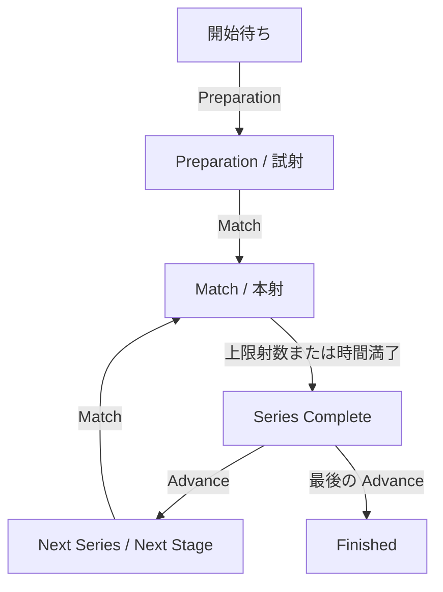

<!-- SPDX-License-Identifier: MIT -->

# Lane 製品仕様

[Lane 操作ガイド](./README.md)

操作ガイドを補う外部仕様です。画面で確認できる状態、入力の制約、記録と出力の扱いを説明します。使用する版の [競技種別定義](../common/COMPETITION_TYPES.md) と併せて参照してください。

## 動作環境と対応機器

Windows 10 / 11の x64を主な動作対象とし、macOS・Linux は実験対象です。標的装置1台に対して Lane を1つ起動し、同時に接続するシリアルポートは1つです。MQTT を無効にしても、標的への接続、着弾の記録・表示、単独の競技進行、印刷を利用できます。

「Connection」で選択できる機器は次のとおりです。全機器でデータビット8、ストップビット1、パリティなしを使用します。

| メーカー          | 装置 / ID                                   | ボーレート | 実装・検証状態         |
| ----------------- | ------------------------------------------- | ---------: | ---------------------- |
| Kohto Electronics | MT201 / `MT201`                             |       9600 | 受信・座標変換に対応   |
| Kohto Electronics | BPT-216（`BP-217 I/F`）/ `BPT216`           |     115200 | 実装済み、実機検証待ち |
| Kohto Electronics | BPT-216（RS-232C）/ `BPT216_RS232`          |       9600 | 実装済み、実機検証待ち |
| DISAG             | RedDot Rifle / `DISAG_KT_RDT_ZIE_1_RIFLE`   |       9600 | 実装済み、実機検証待ち |
| DISAG             | RedDot Pistol / `DISAG_KT_RDT_ZIE_1_PISTOL` |       9600 | 実装済み、実機検証待ち |

SIUS、Meyton、Custom は内部定義を持ちますが、現行の接続画面には表示しません。競技種別の登録と、実機での受信・標的信号の出力は別の対応範囲です。

受理するデータ、単位、通信異常への対応は機器ごとの仕様にまとめています。

- [MT201 受信互換仕様](./devices/kohto/mt201/README.md)
- [BPT-216 受信互換仕様](./devices/kohto/bpt216/README.md)
- [DISAG RedDot 受信互換仕様](./devices/disag/reddot/README.md)

## 設定項目と反映時点

「Settings」は5つのタブで構成されます。初回起動時の射座番号は `1`、音量は `50`、競技種別は `BR60S` です。MQTT は無効で、自動接続も無効です。

| 場所・項目                   | 入力・制約                                                  | 反映と保存                                                             |
| ---------------------------- | ----------------------------------------------------------- | ---------------------------------------------------------------------- |
| General / Lane Number        | 1以上の整数                                                 | 「Save」で保存し、次回起動時にも使用                                   |
| General / Shot Sound Volume  | 0〜100の整数。0は無音                                       | 「Test sound」で確認し、「Save」で保存                                 |
| General / Application Update | 更新状態を表示                                              | ダウンロード後の「Restart & Install」で適用                            |
| General / Shot timing        | 受信遅延・時計の不確かさ。各 0〜60000 ms の整数、空欄は不明 | 競技終了後に「Save shot timing」または保存済みプロファイルの適用で反映 |
| Target                       | 登録済み競技種別から選択                                    | 選択時に新しい競技とセッションを作成し、最初のステージを開始           |
| Connection                   | ポート、メーカー、装置                                      | 接続成功時の設定を保存し、次回起動時に再接続を試行                     |
| MQTT                         | 有効化、Broker URL、Lane Alias、Auto Connect                | 「Save Settings」で保存。「Connect」・「Disconnect」で接続を操作       |
| JSON                         | `settings.json` 全体                                        | 形式と値を検査して保存。不正な入力は拒否                               |

競技種別の選択は閲覧操作ではありません。現在の記録を印刷したい場合は、選択する前に印刷画面を開いてください。MQTT の Lane ID は端末の識別子で、射座番号・Lane Alias とは別です。JSON で空の ID を保存した場合も、既存の安定した ID を維持します。

### 計時測定データとプロファイル

「Settings」→「General」の「Shot timing」で、標的時間制御に使う判定方法を選びます。

| Timing assessment          | 動作                                                                                 |
| -------------------------- | ------------------------------------------------------------------------------------ |
| Review uncertain timing    | 受信遅延と時計の不確かさを考慮し、射撃可能時間の境界にかかる着弾などを確認対象にする |
| Use the supplied timestamp | 受信遅延と時計の不確かさを考慮せず、与えられた時刻を使う                             |

初期値は「Review uncertain timing」で、両方の上限値は不明です。不明な値は空欄のままにします。手入力の値は「Save shot timing」で保存します。これらの設定で射撃可能時間は延長されません。

「Measured timing profiles」では、手入力した上限値または測定 JSON から設定を保存できます。作成・適用は [次節の手順](#測定プロファイルを作成して適用する) を参照してください。

測定 JSON は UTF-8 の配列です。上限は 262,144 バイト、2,000 サンプルです。次は形式を示す合成データであり、実際の設備の推奨値ではありません。

```json
[
  { "kind": "RECEIPT_DELAY", "valueMilliseconds": 12.4, "uncertaintyMilliseconds": 0.6 },
  { "kind": "CLOCK_OFFSET", "valueMilliseconds": -2.1, "uncertaintyMilliseconds": 0.4 }
]
```

`RECEIPT_DELAY` は非負の受信遅延、`CLOCK_OFFSET` は符号付きの時計差です。単位は ms で、各測定の不確かさも必須です。時計差は ±60000 ms、受信遅延・不確かさ・余裕は 0〜60000 ms の範囲です。空配列や、計算した上限値が 60000 ms を超える入力は拒否します。

種別ごとに `abs(valueMilliseconds) + uncertaintyMilliseconds` の最大値を取り、指定した余裕を加えて整数へ切り上げます。上の例で両方の余裕を 1 ms とすると、候補は受信遅延 14 ms、時計の不確かさ 4 ms です。サンプルのない種別は不明のままです。

解析は設定を変更しません。保存時に再計算し、入力原文・SHA-256・計算方式・余裕を残します。適用は競技終了後の別操作です。測定した範囲からの推定値なので、設備の運転条件を含む測定かどうかを担当者が確認します。

### 測定プロファイルを作成して適用する

測定証拠を使う場合は、機器と時計の構成を確認し、次の順でプロファイルを作成・適用します。

1. 「Settings」→「General」の「Shot timing」で「Load measured timing profiles」を押す。
2. 「Timing official」に担当者を入力する。構成の初回登録や変更は「Record an equipment or clock setup change」を開き、内容を入力して「Record changed installation」で記録する。
3. 「Save a new measured profile」を開く。「Profile bounds source」で「Measurement data with explicit margins」を選ぶ。
4. 測定 JSON を読み込み、受信遅延と時計差の余裕を ms 単位で入力する。「Analyze timing measurements」を押し、サンプル数と計算値を確認する。
5. プロファイル名、設備構成、測定資料の参照、測定日時を入力する。開始条件で測定証拠を必須にする場合は有効期限も指定し、「Save timing measurement」で保存する。
6. 「Timing profile」で保存した項目を選ぶ。現在の構成との一致を確認してチェックを付け、「Apply selected timing profile」を押す。

「Measured timing profile applied.」と適用値を確認してください。解析・保存だけでは適用されません。機器・配線・時計を変更した後は、構成を記録し直して新しい測定を保存します。競技中や構成不一致で拒否された場合は、原因を解消してから読み直します。

Director で測定証拠を開始条件にする操作は [開始前の運用設定](../director/OPERATIONS.md#開始前の運用設定) を参照してください。

## 接続状態と異常時の動作

標的と MQTT の接続は独立しています。右下の接続アイコンは標的の状態を示し、MQTT の状態は「Settings」→「MQTT」で確認します。

| 状況                     | 表示・動作                                                      | 次の操作                                              |
| ------------------------ | --------------------------------------------------------------- | ----------------------------------------------------- |
| ポート・装置の選択が不足 | 接続ボタンが無効                                                | 必要な項目を選択                                      |
| 標的へ接続中             | 接続処理中の表示                                                | 完了またはエラーを待つ                                |
| 標的へ接続成功           | 「Disconnect」と接続済み表示                                    | 種目と着弾を確認                                      |
| 接続失敗                 | Connection タブにエラー                                         | ポート、電源、ケーブル、装置を確認して再接続          |
| 予期しない標的切断       | 接続設定を開ける警告を表示。旧ポートの終了後に1回だけ自動再接続 | 復旧しなければ Connection タブから接続                |
| MQTT 切断                | 遠隔操作・配信ができなくなる。ローカルの記録は継続              | 同じブローカーへ再接続し、Director 担当者と状態を確認 |

標的切断や MQTT 切断だけでは、競技タイマーは停止しません。中断が必要な場合は、役員の判断と Director の中断操作が必要です。更新・設定保存の失敗は、その操作領域のエラーを確認します。通信や変換の詳細は [ログの確認手順](./README.md#ログを確認する) を参照してください。

## 競技の状態と操作

単独使用の通常進行を示します。ボタンは現在の状態に応じて有効・無効が変わります。Director 連携中は担当者の指示に従います。



| 表示・状態                 | 操作・条件                 | 結果                                             |
| -------------------------- | -------------------------- | ------------------------------------------------ |
| 開始待ち                   | Preparation                | 先頭の試射ステージを開始                         |
| Preparation                | Match                      | 試射を終了し、本射へ移行                         |
| Preparation                | End Preparation            | 試射を終了して待機。Advance、Match で本射へ進む  |
| Match                      | 規定射数への到達・時間満了 | シリーズ完了を表示                               |
| Series Complete            | Advance                    | 次シリーズ・次ステージの開始待ち、または競技終了 |
| Next Series / Next Stage   | Match                      | 次のシリーズを開始                               |
| 射撃中                     | Preparation                | 新しいセッションに切り替え、開始待ちへ戻る       |
| シリーズ完了・切り替え待ち | Preparation                | 新しいセッションで先頭ステージを開始             |
| Finished                   | Target で競技種別を選択    | 新しい競技を作成                                 |

「Preparation」による記録の切り替えは、一時停止や再開とは異なります。25m の標的時間制御と決勝の進行は [Director 運用ガイド](../director/OPERATIONS.md) を参照してください。

### タイマー

- ステージ全体のタイマーは、同じステージのシリーズ間でも継続する。
- シリーズのタイマーは、次のシリーズで新しい持ち時間を使う。
- 決勝には1発ごとのタイマーもある。射数・時間は競技種別で決まる。
- 残り時間は分・秒と進行バーで表示する。残り60秒で黄色、30秒で赤色になる。
- Director 連携時は絶対開始時刻を基に計算する。再接続しても持ち時間は最初からには戻らない。

時計の検査条件と遅延時の処理は [MQTT 連携仕様](./MQTT_DESIGN.md#時刻とタイマー) を参照してください。

### 安全停止と中断

| 状態                 | Lane の動作                                          | 解除・再開                                                    |
| -------------------- | ---------------------------------------------------- | ------------------------------------------------------------- |
| STOP                 | 中断時の残り時間を保存し、タイマーを停止             | 許可内容を記録した Director から再開                          |
| STOP / UNLOAD        | 開始操作を禁止し、以後の射撃データを通常採点から隔離 | Director で明示的に安全確認。解除だけではタイマーは再開しない |
| SIGHTING（中断復旧） | 許可された追加試射を記録                             | Director の「Resume MATCH fire」で本射へ戻る                  |

証拠保全中や未完了の中断記録がある場合、記録のリセット・競技離脱・保持データの消去は拒否されます。解除条件は [中断と安全 STOP](../director/OPERATIONS.md#中断と安全-stop) を参照してください。

## 着弾・得点・表示

標的の着弾座標は中心を原点とする mm 単位です。得点は0.0〜10.9の範囲を使用します。装置が報告した得点、座標から計算した得点、実際に採用した得点を区別します。採用条件は機器と競技種別に従います。標的面、採点ゲージ、インナー10の判定は [標的・採点データ](../common/TARGET_SPEC.md) にまとめています。

| 表示                 | 対象・精度                                       |
| -------------------- | ------------------------------------------------ |
| 標的上の着弾         | 直近8発。番号を表示し、最新弾を得点別に色分け    |
| 最新弾の色           | 10点は赤、9点は黄、8点以下は青。過去の着弾は灰色 |
| 左側の着弾一覧       | 直近10発の番号と得点                             |
| 合計点・シリーズ得点 | RING は整数、DECIMAL は小数1桁                   |
| 平均点               | 小数2桁                                          |
| ズーム               | 自動、8点圏、6点圏、4点圏、標的全体の5種類       |

自動ズームは直近8発が収まる倍率に調整します。表示件数から外れた着弾も、保存済みの記録には残ります。着弾音は受信の通知です。音が鳴ったことだけでは、採点対象として記録されたことを確認できません。画面の得点、シリーズ内の射数、必要に応じてログも確認してください。

キーボード操作は [Lane 操作ガイド](./README.md#表示を調整する) を参照してください。入力欄の編集中はテンキーの操作ショートカットは働きません。

## 記録と出力

セッションは着弾の記録単位で、本射への移行や競技のやり直しで切り替わります。試射の着弾を本射の合計点へ加算しません。25m 決勝のヒット数集計では、元の得点も保持します。

| 出力先          | 内容・制約                                                   |
| --------------- | ------------------------------------------------------------ |
| Lane の印刷画面 | 現在のセッション。本射があれば本射のみ、なければ現在の全着弾 |
| MQTT            | 接続・進行・割当・得点の最新状態と着弾イベント               |
| ローカルデータ  | 設定、セッション、着弾、進行状態などを保存                   |

過去のセッションを選んで開く履歴画面はありません。個票の項目、得点単位、改ページは [帳票仕様](../common/PRINT_SPEC.md) を参照してください。OS の印刷先に PDF 保存がある場合は利用できます。専用の履歴一括エクスポート操作ではありません。

## データの保存場所

「Settings」→「JSON」に表示される設定ファイルのパスを確認してください。既定のユーザーデータフォルダーは次のとおりです。

| OS      | パス                                        |
| ------- | ------------------------------------------- |
| Windows | `%APPDATA%\Saika Lane\`                     |
| macOS   | `~/Library/Application Support/Saika Lane/` |
| Linux   | `~/.config/Saika Lane/`                     |

| ファイル          | 保存内容                             |
| ----------------- | ------------------------------------ |
| `settings.json`   | 接続、ユーザー設定、MQTT 設定        |
| `saika-lane.db`   | セッション、着弾、得点など           |
| `saika-lane.json` | 互換設定、接続履歴、進行中の競技状態 |

設定ファイルだけでは記録をバックアップできません。アプリを閉じてフォルダー全体をコピーします。手順は [設定と記録の保存](./README.md#設定と記録を保存する) を参照してください。複数端末に同じ設定を複製すると Lane ID も重複し得るため、端末ごとに設定します。

## 仕様の確認

[操作確認シナリオ](./TESTS.md) は、この仕様を確認するための代表例です。自動テストと実機検証は別に扱います。実装済みの機能についても、装置・OS・接続構成ごとの検証状況は機器資料を確認してください。応答時間、描画速度、メモリ使用量について、全環境で共通の保証値は設けていません。

実装上の定義が必要な場合は、[設定の入力形式](../../saika-lane/src/shared/ipc/contracts/settings.contract.ts)、[機器の定義](../../saika-lane/src/main/modules/target/domain/targetDeviceDefinitions.ts)、[アプリの構成](../../../ARCHITECTURE.md) を参照してください。
