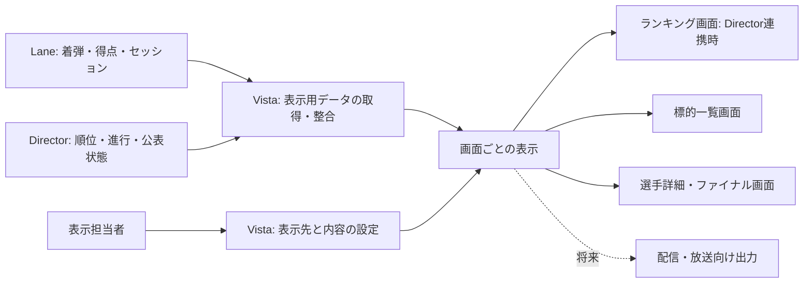

<!-- SPDX-License-Identifier: MIT -->

# Saika Vista 要件定義

Saika Vista は、電子標的の着弾・得点・ランキングと競技の進行状況を観客へ届ける独立アプリです。会場モニターとサイネージから始め、将来は配信・放送の映像にも利用します。

[文書一覧](../INDEX.md)

- 状態：要件定義の継続検討稿。実装済みの機能や提供保証を示す文書ではありません。
- 更新日：2026-09-11
- 「確定」は利用者との対話で確認した条件。「提案」はレビュー対象の具体化。
- 「未決」は設計着手前または初期リリースの受入れ前に決める項目。
- 利用者による確定条件は第1節に集約する。それ以外のシナリオ・要件・対象外の範囲・優先度は、確定条件を具体化するエージェントの提案として扱う。既存実装の記述は調査事実であり、要件の合意を意味しない。
- 既存実装の確認基準：コミット `76831a56`。
- 競合比較：[7社の公式資料との比較](./COMPETITIVE_REVIEW.md)を参照する。標的の表示切替は C-25で初期採用、時計専用画面は C-26で初期対象から外れた。自動表示開始は C-27、待機への一時切替は C-28で初期採用となった。一覧画面の表示方法と巡回設定は C-29で初期採用となった。実画面の識別表示と設定の適用確認は C-30で初期採用となった。詳細仕様の提案と確定条件を区別する。

## 1. 確定した条件

| ID   | 条件                                                                                                                                                                    |
| ---- | ----------------------------------------------------------------------------------------------------------------------------------------------------------------------- |
| C-01 | 正式名は Saika Vista。Lane・Director とは別のアプリとして提供する。                                                                                                     |
| C-02 | 会場の観客用モニターとサイネージへ、ランキングと各選手の標的・着弾・点数を表示する。                                                                                    |
| C-03 | 初期対象は、10m エアライフル、エアピストル、ビームライフル、ビームピストルの予選・本選とファイナル。                                                                    |
| C-04 | 複数画面に、ランキング・標的一覧など別々の内容を同時表示する。                                                                                                          |
| C-05 | Director と連携する構成に加え、Lane だけで運用する構成にも初期から対応する。                                                                                            |
| C-06 | Vista は表示に専念する。ファイナルの脱落判定、結果確定などの競技運営は担当しない。                                                                                      |
| C-07 | 射座数と観客用画面数は無制限とする。製品・ライセンス・設定に固定上限を設けない。                                                                                        |
| C-08 | 将来、YouTube などの配信や放送にも表示内容を利用できるようにする。                                                                                                      |
| C-09 | 初期版の観客画面は、PC に接続したモニターを対象とする。                                                                                                                 |
| C-10 | Lane 単独時は、1射座または複数射座の標的・着弾・点数を表示する。ランキング形式のビューは初期対象に含めない。                                                            |
| C-11 | 初期対応する PC の OS は Windows・macOS・Linux の3種類とする。                                                                                                          |
| C-12 | 複数 PC の観客画面の表示内容は、1台の操作用 PC からまとめて設定・切替できる。                                                                                           |
| C-13 | 1台の PC に複数モニターを接続する構成と、複数 PC で表示を分担する構成の両方に初期から対応する。                                                                         |
| C-14 | 初期対象の競技形式は個人競技のみとする。団体順位・混合団体は初期対象に含めない。                                                                                        |
| C-15 | Lane 単独運用は、Vista と Lane の設定だけで開始できる。別の通信サービスの手動導入・設定を必須にしない。                                                                 |
| C-16 | 接続する Lane と表示用 PC は会場ネットワーク内の候補を自動検出し、担当者が選んで接続する。接続先の手動入力にも対応する。                                                |
| C-17 | 競技終了後の標的・点数・結果は、Vista や表示用 PC の再起動後も復元でき、担当者が表示対象を切り替えるまで保持する。                                                      |
| C-18 | 初期版の表示内容は競技画面と待機画面に絞る。大会案内・スポンサー画像・選手紹介を挟む巡回表示は初期対象に含めない。                                                      |
| C-19 | 初期版は観客画面ごとの設定とし、表示先グループへの内容・テーマの一括適用は将来対応とする。                                                                              |
| C-20 | 初期版はインターネット接続なしで、会場内のネットワークだけで起動・設定・表示・再起動後の復元を行える。                                                                  |
| C-21 | 操作画面と観客画面の UI は基本的に英語とし、選手名などは日本語で表示できる。                                                                                            |
| C-22 | 性能検証は100射座を基準とする。各射座の後ろでその射座の標的・点数を映すモニターと、60型以上のサイネージ複数台を想定する。製品の台数上限ではない。                       |
| C-23 | 初期対象は標準の競技定義に従う個人競技とし、独自ルールの表示対応は初期対象に含めない。                                                                                  |
| C-24 | 基準構成で、Vista が表示用データを受け取ってから画面へ反映するまでの95%以上を1秒以内とし、12時間の連続運用に対応する。Lane・Director から届くまでの遅延は別に測定する。 |
| C-25 | 操作用 PC から画面ごとに、標的の全体表示・拡大率と、全弾・現在シリーズ・直近の指定弾数を初期版から切り替えられる。                                                      |
| C-26 | 初期版の時計は競技画面内に表示する。残り時間だけを大きく映す時計専用画面は初期対象に含めない。                                                                          |
| C-27 | 表示用 PC で OS へのログインが済んだ後、毎回アプリを操作せず、設定済みの観客画面を自動で全画面表示できることを初期必須とする。                                          |
| C-28 | 操作用 PC から特定の観客画面だけを一時的に待機画面へ切り替え、同じ競技表示へ戻せることを初期必須とする。競技進行とデータ受信は継続する。                                |
| C-29 | 一覧画面ごとに固定表示と自動巡回を選び、配置数と各ページの表示時間を設定できることを初期必須とする。                                                                    |
| C-30 | 操作用 PC から指定した実画面に識別名を一時表示し、各画面への設定の適用結果を確認する機能を初期版に含める。                                                              |

C-02・C-04のランキング表示は Director 連携時に提供します。Lane 単独時の表示範囲は C-10に従います。

## 2. 役割と責任の境界（提案）

| 担当       | 責任                                                                             |
| ---------- | -------------------------------------------------------------------------------- |
| Lane       | 標的との接続、着弾の取得、射座のセッション・得点・競技状態の提供。               |
| Director   | 大会・選手・射座割、競技進行、裁定の反映、競技順位、結果の公表状態の管理。       |
| Vista      | 表示対象の選択、画面構成、表示先の管理、観客向けの表現、データの受信状態の提示。 |
| 表示担当者 | Vista で会場の画面を設定し、表示内容を切り替える。競技操作の権限は別に持つ。     |
| 観客       | 操作画面を触らずに、選手・得点・競技状況を確認する。                             |

Vista が許可する操作は、表示設定と表示用データの取得に限定します。競技の開始・停止、選手の割当変更、得点訂正、脱落判定、結果確定の要求は送信しません。表示端末の接続・終了・再起動や Vista の障害によって、Lane の計測や Director の競技進行が変化してはいけません。

以下は論理的な責任分担です。プロセス構成、通信方式、アプリの実行基盤は未決です。



## 3. 初期に成立させる利用シナリオ

C-09・C-11に基づき、Windows・macOS・Linux の PC に接続したモニターで観客画面を表示します。C-12に基づき、各観客画面の表示内容は1台の操作用 PC から設定・切替します。OS の対応版とアプリの実行基盤は Q-01で別途定めます。

### Director と連携する大会

1. 表示担当者が大会・種目・ラウンド・射群と対象選手を選ぶ。
2. 画面 A にランキング、画面 B に標的一覧、画面 C に注目選手を割り当てる。
3. 各画面が、試射と本射を区別しながら着弾・得点・進行状況を更新する。
4. ファイナルでは、競技運営側が決定した脱落・同点解消待ち・シュートオフを表示する。
5. 競技終了後も成績表示を維持し、公表・訂正の状態を追従させる。

### Lane だけで運用する射場

1. Director を起動せず、Vista と Lane の設定だけで接続を準備する。自動検出した候補から表示対象の Lane を選び、必要に応じて接続先を手動入力する。
2. 選手名が提供されない場合は射座名を表示し、必要に応じて表示用の名前を設定する。
3. 接続前の射撃を含む現在のセッションを復元し、標的・得点・射数を表示する。
4. 画面ごとに、1射座の標的と点数、または複数射座の標的一覧を選ぶ。
5. ファイナルでも各射座の標的・得点・個別の進行を表示する。脱落判定や結果確定は扱わない。

表示用の名前や表示対象の選択は Vista の設定です。Lane・Director の公式な選手登録や競技記録は書き換えません。C-15に基づき、Director 不在時の通信に必要な準備は Vista と Lane の導入・設定に含めます。内部の実行構成や通信方式は設計時に決定します。

### 多数の射座・表示端末

C-13に基づき、1台の PC に接続した複数モニターと、複数 PC に分かれたモニターの両方を表示先として扱います。表示担当者は1台の操作用 PC から各モニターを識別し、それぞれに異なる内容を設定します。

表示用 PC の接続も C-16に従います。操作用 PC で自動検出した候補を選択するか、接続先を手動入力します。

射場や表示内容ごとに表示先を追加でき、複数端末へ処理を分散できるようにします。画面 A の内容変更が画面 B の表示対象や競技選択に影響しないことを基本とします。C-19に基づき、初期版は画面ごとに内容を設定します。

## 4. 初期対応種目と前提

| 種目               | 既存の予選用 ID | ファイナルの現状と要件                                                                                      |
| ------------------ | --------------- | ----------------------------------------------------------------------------------------------------------- |
| 10m エアライフル   | `AR60`          | `AR60_FINAL` が存在する。進行・得点・判定済み順位を表示対象とする。                                         |
| 10m エアピストル   | `AP60`          | `AP60_FINAL` が存在する。予選と決勝の採点方式の違いを反映する。                                             |
| 10m ビームライフル | `BR60S`         | `BR60S_FINAL` は Director の大会管理に存在するが、Lane の定義が未対応。初期対応に必要な前提作業として扱う。 |
| 10m ビームピストル | `BP60`          | `BP60_FINAL` は Director の大会管理に存在するが、Lane の定義が未対応。初期対応に必要な前提作業として扱う。  |

既存 ID は実装調査の結果であり、Vista が規則を新たに定めるものではありません。射数・時間・採点方法・標的面は、競技運営側が選択した競技定義と規則の版に従います。ビーム競技のファイナルをエア競技の設定で代用しません。対応する定義とデータが揃うことを受入れ条件とします。

種目 ID と通信形式の版だけでは、適用する競技定義の一致を判断しません。標的面、座標の単位・原点・向き、得点精度、ステージ・シリーズの構成を、提供元が選択した定義の識別と対応付けます。同じ種目 ID でも内容が異なる定義を区別し、表示に必要な定義を確認できない場合は未対応として示します。保存した終了画面にも当時の表示に必要な定義を結び付け、現在の定義へ黙って置換しません。方式は D-12・Q-04・Q-09・Q-10で具体化します。

C-14に基づき、初期対象の競技形式は個人競技のみとします。団体順位・混合団体は将来の拡張候補です。C-23に基づき、独自ルールの表示対応も初期対象に含めません。50m・300m・25m は初期対象に含めません。将来の種目追加で、画面管理やデータ取得の全体を作り直さずに拡張できる構造を検討します。

## 5. 機能要件（提案）

「必須」は確定条件を成立させるための初期要件案です。「追加候補」は初期の優先度が未決です。「将来候補」は初期対象に含めません。

| ID   | 優先度   | 要件                                                                                                                                                                                  |
| ---- | -------- | ------------------------------------------------------------------------------------------------------------------------------------------------------------------------------------- |
| F-01 | 必須     | Director 連携と Lane 単独の接続構成を選択し、現在の情報源と接続状態を確認できる。                                                                                                     |
| F-02 | 必須     | PC と各モニターを区別して表示先を識別・命名し、画面ごとに大会・種目・ラウンド・射群・Lane・選手を選択できる。                                                                         |
| F-03 | 必須     | Director 連携時はランキング、標的一覧、選手詳細、ファイナル概要、待機画面を切り替えられる。Lane 単独時は標的・点数の個別表示、一覧、待機画面を切り替えられる。                        |
| F-04 | 必須     | 一覧に収まらない選手をページ分割し、自動巡回・手動切替・固定表示を選択できる。                                                                                                        |
| F-05 | 必須     | 標的面、着弾位置、射順、最新弾、試射・本射の区別を表示する。座標がない射撃は中心着弾として描かない。                                                                                  |
| F-06 | 必須     | 合計、直近弾、シリーズ得点、射数を表示する。整数点・小数点は提供元の採点方式に従う。                                                                                                  |
| F-07 | 必須     | Director 連携時のランキングには比較対象の範囲と表示の性質を示す。競技順位、速報、参考順位を区別する。                                                                                 |
| F-08 | 必須     | Director が提供する順位、分類、訂正、減点を反映する。Vista 独自の再採点で上書きしない。                                                                                               |
| F-09 | 必須     | ファイナルの段階、射数、得点を表示する。Director 連携時は判定済みの脱落、同点解消待ち、シュートオフも反映する。情報がなければ判定を推測しない。                                       |
| F-10 | 必須     | 競技画面内に時計を表示し、情報源が確定した開始・終了・停止状態に従う。時計情報がない場合は未提供と示す。時刻ゼロを競技終了や順位確定とみなさない。                                    |
| F-11 | 必須     | 競技中断・再開、選手交代、射群変更、予備射座への移動を反映する。射座固定と選手追従を区別し、別選手の着弾を混在させず、同一選手の移動前後の履歴を保持する。詳細は第5.5節に従う。       |
| F-12 | 必須     | 初回接続・途中参加・再接続で、現在の状態と必要な射撃履歴を取得して表示を復元する。                                                                                                    |
| F-13 | 必須     | 同じ射撃の再送で射数・合計・着弾を重複させない。履歴の再取得を新しい着弾の演出として再生しない。                                                                                      |
| F-14 | 必須     | 競技終了や通信上の保持データ消去によって、表示中の成績を直ちに消さない。Vista や表示用 PC の再起動後も終了画面を復元し、担当者が表示対象を切り替えるまで保持する。                    |
| F-15 | 必須     | 結果の行、公表状態、版を一体で更新する。結果訂正・公表の取り消し・要再確認を反映する。                                                                                                |
| F-16 | 必須     | データの更新停止を検出し、最後に確認した情報であることと復旧状態を表示する。古いデータを現在の確定結果に見せない。                                                                    |
| F-17 | 必須     | 表示担当者は1台の操作用 PC から各観客画面の内容を設定・切替できる。設定を確認してから対象画面へ適用する。観客画面には操作パネルや内部エラーの詳細を出さない。                         |
| F-18 | 必須     | 表示先・画面構成・一時待機の状態と、終了画面の復元に必要な表示用データを保存する。接続先・セッションを再確認するまでライブ情報として扱わない。Director 連携時は公表状態も再確認する。 |
| F-19 | 必須     | Lane 単独でもセッション開始・リセット・種目変更を識別する。旧セッションの着弾・得点を現在のセッションへ混在させない。                                                                 |
| F-20 | 必須     | Lane 単独時に選手情報がない場合は、射座名または Vista の表示用ラベルを使用する。射座名と選手名相当のラベルの有効範囲を分け、別選手へ名前を引き継がない。公式な選手識別とは区別する。  |
| F-21 | 将来候補 | 大会案内・スポンサー画像・選手紹介を競技画面と組み合わせて巡回表示する。C-18に基づき、初期対象から外す。                                                                              |
| F-22 | 将来候補 | 表示先をグループ化し、共通テーマや表示内容をまとめて設定する。C-19に基づき、初期対象から外す。                                                                                        |
| F-23 | 必須     | 接続する Lane と表示用 PC の候補を自動検出し、提供元を識別して担当者が選択できる。接続先の手動入力も用意し、接続できない場合は理由を担当者へ知らせる。                                |
| F-24 | 必須     | Director 不在時も Vista と Lane の導入・設定により必要な通信を利用できる。利用者に別の通信サービスの手動導入・設定を要求しない。                                                      |

競合比較に基づく機能と現在の採否は次のとおりです。F-25〜F-29は C-25・C-27〜C-30に基づく初期要件です。F-30は C-26に基づき将来候補とします。詳細仕様の具体化は第11節で扱います。

| ID   | 優先度   | 要件                                                                                                                                                                                       |
| ---- | -------- | ------------------------------------------------------------------------------------------------------------------------------------------------------------------------------------------ |
| F-25 | 必須     | 操作用 PC から画面ごとに標的の全体表示・拡大率と、全弾・現在シリーズ・直近の指定弾数を切り替えられる。表示範囲と最新弾を識別し、縮小時も着弾を見失わない表現を用意する。                   |
| F-26 | 必須     | 画面ごとに固定表示と自動巡回を選び、配置数と各ページの表示時間を設定できる。射座順を定め、表示対象の取りこぼしを担当者が確認できる。                                                       |
| F-27 | 必須     | 操作用 PC から選択した実画面に識別名を一時表示し、設定の適用結果を確認できる。画面ごとの接続状態、表示対象、最終受信と復旧の状態も確認できる。                                             |
| F-28 | 必須     | 表示用 PC で OS へのログインが済んだ後、毎回アプリを操作せず、設定済みの観客画面を自動で全画面表示できる。自動起動の有効化方法と、表示中にスリープなどで画面が消えないための設定を定める。 |
| F-29 | 必須     | 操作用 PC から画面ごとに競技表示を一時的に待機画面へ切り替え、同じ対象へ戻せる。競技進行とデータ受信を継続し、終了画面の保持と訂正の反映も継続する。                                       |
| F-30 | 将来候補 | 時計を大きく表示する専用画面を選べる。C-26に基づき、初期対象から外す。採用時は Director の全体時計と Lane の個別時計を区別する。                                                           |

### 5.1 順位と結果の扱い

Director 連携時は、選手・射群・大会との対応と、競技運営側が提供する順位を使用します。現在の射群の速報と、他の射群を含む大会全体の結果は異なる範囲として選択・表示します。確定した射群の成績と進行中の速報を混ぜる場合の投影は、Director 側で定義する必要があります。Vista が「全射群順位」を名乗って、現在接続中の Lane だけを並べることはできません。

Lane 単独時は C-10に基づき、1射座または複数射座の標的・着弾・点数を表示します。ランキングビューと参考順位の算出は初期対象に含めません。複数射座の一覧でも、射座ごとのセッション・試射と本射・得点・射数を識別できるようにします。

ファイナルの脱落、進出、メダル順位は、Director 連携時に競技運営側の判断済み情報を表示します。Lane 単独時は、各射座の標的・着弾・得点と個別の進行を表示します。シュートオフの射撃を通常本射の合計へ無条件に加算しません。

Director から提供された不出場・途中棄権・失格・順位対象外などの分類は、順位や得点とは別の状態として表示します。順位なしを0位に置換せず、同順位も提供元の値に従います。実射の0点、射撃前、得点未提供を区別し、数値の欠落を0点で埋めません。分類と得点・順位の組合せを Vista で裁定せず、未対応の分類は要確認として担当者へ知らせます。表示する英語の分類名・略号と説明は Q-09・Q-11で提供元の契約と対応付けます。

結果の公表状態は、観客向けには次のように区別する案とします。表は意味の対応であり、提供元の API の列挙値を固定するものではありません。第7.3節の受信・同期状態は別に重ねて示します。

| 提供元で確認した状態           | 観客表示の案                                   | 結果行の扱い                                                                                           |
| ------------------------------ | ---------------------------------------------- | ------------------------------------------------------------------------------------------------------ |
| 未公表・下書き                 | Draft                                          | 表示用として取得が許可された行だけを非公式の内容として表示する。                                       |
| 暫定公表・抗議中・抗議期間終了 | Preliminary / Protest pending / Protest closed | 行と同じ版の状態を表示する。抗議期間終了だけで Official にしない。                                     |
| 公式公表・ファイナルの結果宣言 | Official / Final                               | 提供元がその版について確認した場合だけ表示する。Vista の時計や最終発から推測しない。                   |
| 公表取り消し・要再確認         | Review required                                | 許可された行を保持できるが、公式・結果宣言済みの表示を外す。取り消し後の意味を明示する。               |
| 未知の状態・最新確認不能       | Status unverified                              | 対象が一致する確認済み・保存済みの行は、その時点の内容と明示して保持できる。現在も公式とは表示しない。 |

この表は初期の会場表示を対象とします。非公開情報の取得を許可するものではなく、将来の外部配布・送出停止は F-34・F-35の条件に従います。

### 5.2 時計と更新停止

Director 連携時の全体時計、Lane ごとの個別時計、追加時間や中断は区別します。Lane 単独時に各 Lane の時計が揃っていない場合、架空の共通残り時間を作りません。表示端末の時計差が許容値を超える場合や情報源を失った場合は、同期未確認として扱います。受信のない期間だけで通信断と判定せず、射撃のない正常な待機と更新不能を識別します。

時計の情報には対象・段階・時計の世代と更新順序を対応付け、中断・再開・追加時間の反映後に遅れて届いた更新で巻き戻しません。端末の時刻変更やスリープからの復帰で同期を確認できなくなった場合も、同期未確認へ移ります。その間は確認済みの残時間としてカウントダウンを続けず、最後に確認した残時間をその時点の値として示すか、数値を隠して状態を示します。最新の時計状態と同期を再確認してから通常の時計表示へ戻します。数値の見せ方、許容差、停止検出・再確認の期限は Q-05・Q-09・Q-10・Q-11で具体化します。

公開状態の確認に失敗した場合、最終成功時の結果行を保持しても、現在も公式であるとは表示しません。復旧後は最新の版を取得し、内容と公表状態が揃ってから通常表示へ戻します。履歴が不足している場合は、不完全な標的を全射撃の標的として見せません。

### 5.3 終了画面の保存と復元

C-17に基づき、終了した競技の標的・点数・結果と、その表示設定を復元できるようにします。保存対象は各画面で表示を継続する競技・セッションです。情報源の保持データが消去されても復元できる保存方法を定めます。

表示対象を切り替えるまで、再起動や日付の変更だけで終了画面を消しません。同じ対象内のページ巡回や画面形式の変更によって、復元に必要なデータを失わないようにします。別画面で表示を続ける対象のデータも保持します。終了後の射群切替や Lane のセッションリセットを、担当者による表示対象の切替とみなしてはいけません。

復元時は保存した内容であることを示します。Director 連携時は公表状態と訂正の有無を再確認し、同じ結果の新しい版が提供された場合は F-15に従って更新します。Lane 単独時は C-10の表示範囲を維持します。過去の競技を蓄積して検索・再生する長期アーカイブは将来候補です。

終了通知の受信だけでは、終了時の内容を保存できたとは扱いません。表示対象・提供元・世代・終了時の更新境界、必要な履歴と得点、当時の表示定義を対応付けて取得し、整合と永続化の完了を確認します。Director 連携時は結果行と同じ版の公表状態も保存します。設定の保存完了とデータの保存完了を分け、担当者が復元可能な版と未保存・未取得の状態を確認できるようにします。

保存中の異常終了、容量不足、書き込み失敗で、最後に整合して保存できた版を壊しません。未保存の更新や履歴不足は担当者へ通知し、古い保存版を終了時の完全な内容と表示しません。終了後の訂正も同じ条件で保存します。競技処理を Vista の保存応答待ちにせず、情報源の通信上の保持値が消去された後も必要な内容を再取得できる経路・保存責任を D-13で定めます。

C-17による保存済み終了画面の保持期間は、担当者が表示対象を切り替えるまでです。これとは別に、保存完了前の復旧で必要な情報源の再取得可能期間、想定する停止期間、保存容量と障害からの復旧手順を Q-08・Q-09・Q-10で設計し、初期受入れ前に固定します。未受信・未保存の内容が全取得先から失われた場合まで復元できるとは保証せず、その場合は復元不能を明示します。正常な競技終了やセッション切替だけで必要データを失う構成は、初期要件を満たしません。

### 5.4 競合比較から具体化する表示と運用（提案）

F-25〜F-30の根拠と比較上の不足は、[競合比較の G-02〜G-08](./COMPETITIVE_REVIEW.md)に整理しています。F-25〜F-29の初期採用は確定しています。以下の詳細な挙動は具体化の提案です。F-30は将来候補です。

C-25に基づき、F-25の表示切替は Director 連携と Lane 単独の両構成で行えます。中心固定・自動の拡大方式、具体的な倍率と直近表示の弾数の選択肢は、詳細仕様の提案として検討します。現在の試射・本射の区分と表示する射撃範囲を明示します。表示弾数を絞っても、競技全体の合計と射数を書き換えません。拡大範囲外の着弾がある場合はその存在を示し、全体表示へ戻せることを求めます。縮小表示の補助記号は実際の弾径や採点範囲と区別します。最新弾、訂正された射撃、記録対象外の射撃は、提供元の情報に従って識別します。履歴取得は F-13に従い、新着の演出として扱いません。

C-29に基づき、F-26では画面ごとに表示方法、配置数、ページの表示時間を設定します。射座順や空き射座の扱いは詳細仕様の提案です。固定配置の空き射座や切断した射座を残す表示を用意し、他の射座を黙って詰め替えません。自動巡回では、設定した対象が一巡に含まれることと総ページ数を確認できます。Director の順位更新で巡回が先頭へ戻り続け、下位の行を見られなくなる動作を避けます。連続スクロールを採用する場合は、速度と先頭を読む待ち時間も設定対象とします。Lane 単独では射座順の標的一覧とし、順位での並べ替えは追加しません。

C-30に基づき、F-27では操作用 PC から指定した実画面へ識別名を一時表示し、設定の適用結果を確認できます。設定を送信した状態と、表示端末が適用を確認した状態を区別します。接続できない画面を適用済みと表示しません。画面上の識別名は一時表示とし、解除後に元の競技画面または待機画面へ戻します。操作用 PC のプレビューを用意する場合も、実画面が正常に描画している証拠とは区別します。表示先グループへの一括適用は C-19に従って将来対応のままです。

設定要求と適用結果は、表示先と設定の版に対応付けます。設定 A の後に B を要求した場合、遅れて届いた A の指示・応答・再送で B やその適用状態を上書きしません。再接続・再起動時も、最新の要求と実際の適用状態を照合し、取り消した要求や古い保存設定を再適用しません。識別名の表示は競技設定を変更しない一時的な重ね表示とし、解除時点の設定へ戻します。識別中に設定を変更しても、解除によって識別開始前の設定へ戻してはいけません。

表示対象と画面設定は一組として適用し、新しい選手名に古い対象の得点を組み合わせません。適用待ち・失敗時は、操作画面で要求した設定と最後に適用できた設定を区別します。新しい対象のデータ取得中は取得中の画面を表示でき、設定の適用とデータの同期完了は別々に確認します。C-17の旧対象の保持解除は、新しい対象への設定適用が確認された時点とします。送信しただけ、失敗した、取り消したという理由では旧対象の復元データを削除しません。別画面や一時待機の復帰先で必要なデータは引き続き保持します。

設定の適用済みは、その設定を再起動後も復元できる保存の完了を含みます。保存失敗時は適用済みとせず、最後に復元可能だった設定を維持して担当者へ知らせます。要求の識別方法、保存先と適用の手順は Q-08・Q-11で設計します。

C-27に基づき、F-28では OS へのログイン後に観客画面を自動で全画面表示します。導入時の設定と日常の起動手順を分け、対応する3種類の OS ごとに自動起動の有効化方法を定めます。OS への自動ログインや PC の電源投入は、この確定条件には含めません。起動時は F-18に従って表示を復元します。モニターの交換・抜き差しで保存済みの画面を識別できなくなった場合は、別の画面へ黙って内容を移さず担当者に知らせます。自動起動の有効化方法と表示中の省電力設定は Q-01で具体化します。

C-28に基づく F-29は、操作用 PC から対象画面だけに行う表示操作です。他の観客画面の内容と競技進行、データ受信を維持します。Lane・Director へ競技停止を送信せず、最後の映像を固定する機能も含めません。一時的な待機への切替を C-17の表示対象変更とは扱わず、復帰時は同じ対象の最新データを確認します。Director 連携時は公表状態も確認します。対象が終了していた場合は、保存した終了画面を維持します。待機中に情報源が新しい射群・セッションへ変わっても、表示対象を自動で変更しません。

一時待機の状態と復帰先は F-18の保存対象に含めます。操作用 PC・表示用 PC の再起動や自動起動後も待機を維持し、担当者の復帰操作で解除します。待機中に表示設定を変更した場合も自動では解除せず、復帰先の変更として適用結果を示します。別の競技を復帰先へ明示的に適用した場合は C-17の表示対象変更として扱います。復帰先と一致する終了画面を保存している場合は、情報源の取得失敗・対象消去があっても、担当者の復帰操作で保存した内容へ戻せます。その際は保存内容であることと最新情報を再確認できないことを示し、現在も公式であるとは表示しません。復帰先の情報を取得できず、保存した終了画面も確認できない場合は待機を維持し、担当者へ理由を示します。

C-26に基づき、初期版は競技画面内で時計を表示します。F-30の時計専用画面は将来候補です。将来採用する場合も F-10・第5.2節の時計同期と更新停止の扱いを適用し、競技を開始・停止する操作は提供しません。

### 5.5 表示対象の追従と名前の有効範囲（提案）

F-02の対象選択では、射座に固定する表示と、同じ競技内の選手を追う表示を区別し、設定内容に示します。射座後方の画面・射座順の一覧は射座固定、選手詳細は選手追従を既定案とします。Lane 単独では選手の公式な対応を取得できないため射座固定とし、表示用名の一致から他の Lane へ追従しません。

| 場面                                         | 射座固定の画面                                                                                                                                                   | 選手追従の画面（Director 連携）                                                                    |
| -------------------------------------------- | ---------------------------------------------------------------------------------------------------------------------------------------------------------------- | -------------------------------------------------------------------------------------------------- |
| 同じ競技内の予備射座への移動                 | 移動元は移動済みと示し、移動前の内容を現在もその射座で射撃中の情報に見せない。移動先が表示対象に含まれる画面では、対応確認後に選手と引継ぎ済みの履歴を表示する。 | Director が確定した移動先へ追従し、射座の変更を示す。移動前後の同一選手の履歴を連続して表示する。  |
| 移動が準備中・取り消し・対応未確認           | 確認できた状態と移動処理中などの表示を維持し、移動完了を推測しない。                                                                                             | 準備中の移動先へ先行して切り替えない。取り消し後は Director が確認した割当に従う。                 |
| 同じ競技内の選手交代                         | 確認済みの新しい割当と対象の履歴を一組で反映し、前の選手の内容を混ぜない。                                                                                       | 選択した選手を維持する。競技対象から外れた場合はその状態を示し、代わりの選手へ自動で切り替えない。 |
| 選択した競技の終了後、新しい射群・競技が開始 | C-17に従って終了画面を保持し、担当者が新しい対象へ切り替えるまで自動追従しない。                                                                                 | 同じ選手が次のラウンドへ進んでも終了した対象を保持する。競技をまたぐ追従は行わない。               |

移動元 Lane のセッション終了を、選手の競技終了と同一視しません。移動元・移動先で同じセッションや射撃が提供されても、選手を単位とする一覧に二重登録せず、移送した履歴を新着として演出しません。対応が揃うまで第7.3節の再同期表示を用います。移動情報には、元と先の対応、確定・準備中・取り消し、履歴の継承関係が必要です。C-17の終了画面保持は、追従対象の競技が終了した後に適用します。

Lane 単独の射座固定では、選択中の競技が継続している間の試射・本射・シリーズの移行は追従します。競技との継続関係を確認できないセッション変更・リセットでは、自動で新しい対象へ切り替えず、担当者へ再選択を求めます。同じセッション ID であってもリセット世代が違えば再確認します。選択時にセッションがなければ待機し、新しい候補を取得できたことを担当者へ知らせて選択を待ちます。

表示用ラベルは、Lane に結び付く射座名と、選択した競技・セッションに結び付く選手名相当のラベルに分けます。射座名は対象変更後も維持できます。選手名相当のラベルは別競技・別選手・リセット後の対象へ自動継承せず、解除して射座名を表示するか、担当者が再確認して設定します。同一競技の試射から本射への移行は、提供元から継続関係を確認できる場合に限り維持します。保持中の終了画面には当時のラベルを残し、新しい対象に設定した名前で過去の選手名を書き換えません。

### 5.6 端末の登録と管理権限（提案）

自動検出は接続候補を見つける機能であり、管理権限を与える操作とは分けます。許可した操作端末・表示端末・情報源を、表示名や IP アドレスだけに依存しない識別で対応付けます。実端末での確認など、会場内で相手を確認して初回登録できる方法と、登録解除・再登録・操作端末交換時の引継ぎを Q-07で定めます。インターネットのアカウント認証を必須にしません。

表示設定の変更、識別名の表示、一時待機・復帰は、対象画面の管理を許可された操作主体だけが行えます。表示データを取得する権限から管理権限を得ることはできません。同じ管理対象への同時操作は1つの操作主体に限定し、別の主体への引継ぎを明示的に行う案とします。複数担当者の共同編集は要求しません。

管理権限の世代と設定の版を分け、引継ぎ前の要求・応答・保存設定を新しい管理主体の要求として扱いません。解除・引継ぎは対象端末で確認できた結果を示し、切断中の端末は未完了として扱います。再接続時は、管理権限を再確認してから設定要求を実行し、失効した主体の待ち行列や再送を適用しません。解除されていない正規端末は、オフラインでの再起動後も確認・復旧できることを求めます。操作用 PC を失った場合の引継ぎ方法と、旧 PC の復帰を拒否する条件も Q-07で定めます。

## 6. 規模・品質要件（提案）

### 6.1 射座数・画面数を無制限にする

- 射座数・画面数に、コードやライセンス上の固定上限を設けない。
- 射場・表示先・購読対象ごとにデータ処理を分割し、複数端末へ負荷を分散できる。
- 表示端末は、選択した対象の描画に必要なデータを扱う。全射場の全履歴の常駐を前提にしない。
- 一覧はページ分割や対象選択で可読性を維持する。1画面内の配置数と製品全体の接続数を区別する。
- 処理能力が不足した場合は担当者へ知らせ、出力追加や対象分割で対応できるようにする。
- 機材・ネットワーク構成ごとの検証済み規模を公開する。検証規模は製品の上限として扱わない。

任意の台数・機材で同じ性能を保証するという意味ではありません。負荷試験では射座数、射撃頻度、表示先数、表示内容、同時復旧数を増やし、遅延・欠落・資源使用量を測定します。初回の射座数は C-22に従って100射座を基準とし、残る機材条件と分散構成は第6.3節で具体化します。

### 6.2 その他の品質目標

表示遅延1秒以内の割合と連続12時間の目標は C-24で確定しています。機材と通信構成を決めた後、測定条件を固定して受入れ基準にします。その他の品質条件は、確定事項を具体化する提案です。

| ID   | 要件・目標                                                                                                                                                                             |
| ---- | -------------------------------------------------------------------------------------------------------------------------------------------------------------------------------------- |
| N-01 | 会場内のネットワークだけで起動・設定・表示・再起動後の復元を行える。インターネット接続を必須にせず、必要なフォントや表示素材もローカルで利用できる。                                   |
| N-02 | 基準構成で、表示用サービスが更新を受理してから対象画面への反映までの遅延を95パーセンタイルで1秒以内とする。Lane・Director からの取得遅延は別に測定する。                               |
| N-03 | 長時間運用の基準試験は12時間とし、受信データの欠落や無制限なメモリ増加がないことを確認する。                                                                                           |
| N-04 | 最低限、横向きのフル HD 画面で離れた観客が読める構成を用意する。文字サイズ・配置密度・コントラストを設定できる。                                                                       |
| N-05 | 色だけで試射・本射、接続状態、脱落・同点を区別しない。氏名が長い場合の省略方針を定める。                                                                                               |
| N-06 | 操作画面と観客画面の UI は基本的に英語とする。選手名・所属名・表示用ラベルなどは日本語で表示できる。必要な日本語フォントをローカルで利用できる。                                       |
| N-07 | 観客端末から競技操作と管理情報へアクセスできない。表示専用権限で取得・復旧できる構成にする。                                                                                           |
| N-08 | 公開する情報は氏名・所属・得点など表示に必要な項目に限定する。審判用メモ・連絡先・競技操作や管理用の認証情報を表示端末へ配布しない。表示端末自身に必要な取得権限は表示専用に限定する。 |
| N-09 | 接続断・復旧・設定適用・データ不整合を担当者が確認できる。観客向けの簡潔な状態表示と運用上の診断を分ける。                                                                             |
| N-10 | 台数追加や表示切替の負荷で Lane の射撃記録や Director の操作が妨げられないことを検証する。                                                                                             |
| N-11 | Windows・macOS・Linux で、表示内容の設定・切替と観客画面の表示を行える。対応する OS の版と CPU の種類、Linux のディストリビューションは別途定める。                                    |
| N-12 | 許可された操作主体だけが対象画面の表示を管理できる。登録・失効・引継ぎと再起動後の権限確認を会場内で行え、未登録・失効した相手の操作を拒否する。                                       |

### 6.3 性能検証の基準構成

会場構成の基準は C-22で確認済みです。以下の検証方法はエージェントの提案であり、実測済みの性能を示すものではありません。

| 項目              | 基準とする条件                                                     | 残る確認事項                                                        |
| ----------------- | ------------------------------------------------------------------ | ------------------------------------------------------------------- |
| 射座              | 100射座。                                                          | 射撃頻度、試験時の種目と競技段階、復元する履歴量。                  |
| 射座用モニター    | 各射座の後ろに1枚、計100枚。その射座の標的・着弾・点数を表示する。 | 画面サイズ、解像度、観客との距離。                                  |
| 大型サイネージ    | 60型以上を複数台。射座用モニターに加えて設置する。                 | 台数、解像度、観客との距離、各画面の表示内容。                      |
| 総画面数          | 100枚の射座用モニターと、大型サイネージの台数の合計。              | 大型サイネージの台数を決めて試験条件を固定する。                    |
| PC とネットワーク | 1台への複数モニター接続と、複数 PC での表示分担を検証する。        | 操作・表示・通信処理に用いる PC の仕様と台数、OS の構成、接続経路。 |

射座数、モニターの枚数、PC の台数を分けて記録します。100射座という基準は、1台の PC で全画面を処理する条件ではありません。機材と分担方法を明記した構成で検証します。

| 検証場面             | 確認内容                                                                                                                             |
| -------------------- | ------------------------------------------------------------------------------------------------------------------------------------ |
| 通常運用             | 100射座分の更新を受け、各射座のモニターと大型サイネージへ反映する。N-02の表示遅延、欠落・重複、CPU・メモリ・通信量を記録する。       |
| 更新の集中           | 複数射座の更新が短時間に重なる条件で、遅延と表示の整合を確認する。射撃頻度と集中の条件を試験記録に残す。                             |
| 初回接続・一斉復旧   | 基準構成の表示端末を同時に接続・復旧し、履歴取得から正しい表示に戻るまでの時間と資源使用量を測定する。復旧時間の目標値は別途定める。 |
| 連続運用             | N-03の連続運用時間に、表示切替・切断・復旧・終了画面の復元を含め、データ整合と資源使用量を確認する。                                 |
| 基準規模を超える構成 | 射座・表示先を追加したときの変化を測定する。処理の分担を変える前後で測り、端末追加や対象分割による拡張方法を記録する。               |

Director 連携と Lane 単独は別々に検証し、C-10に従って表示内容を選びます。通常表示の遅延と、初回接続・復旧の所要時間を混ぜて評価しません。表示用データを受理してから描画するまでの区間と、Lane・Director から届くまでの区間を分け、測定に必要な時刻同期の条件も記録します。

N-02の測定は、更新を Vista の取得入口で受け取った時点から、対象画面でその更新に対応する内容を描画した時点までとし、内部の待ち行列・配布・描画待ちを含めます。測定対象の更新と表示先を対応付け、通常表示中の各画面について95パーセンタイルを判定する案とします。情報源・表示形式別の分布、未反映件数、試験時間内に反映されなかった更新も記録し、全画面の集計だけで遅い画面を隠しません。巡回の非表示ページ・一時待機など、実際に描画しない対象の同期と再表示は別に測定します。

初回同期、再同期、設定適用、更新停止の検出には通常表示の1秒目標を流用せず、Q-05でそれぞれの期限と測定条件を定めます。Lane・Director 側の発生から Vista の取得入口までの区間も別測定し、観客用途として許容する遅延を確認します。復旧直後や非表示からの復帰をいつ通常表示として評価するかも固定します。具体的な期限は、試験条件とともに初期受入れ前に確定します。

N-04・N-05の視認性は、射座後方の画面と大型サイネージを分けて評価します。画面寸法・解像度・観客までの距離・配置数・照明条件を記録し、想定距離から選手識別、得点、試射・本射、公表・更新状態を判読できることを確認します。長い日本語名、同名・省略名、最大桁の得点、縮小した着弾も対象にします。推奨配置と読めない配置の判断方法は Q-05・Q-11で定めます。

100画面を管理する担当者の設営・射群切替・切断画面の発見も検証します。画面名・射座・接続状態・未適用状態の確認を含め、各画面を個別に設定する所要時間と誤操作からの復旧手順を記録します。操作の具体化は Q-05・Q-11で評価します。検索・絞り込み・一括適用を新たな必須機能にはせず、C-19と第5.5節の対象変更の条件を維持します。

### 6.4 導入・対応版と障害時の運用（提案）

操作・表示・データ配布の各役割について、対応 OS・CPU と Lane・Director・Vista の対応版、通信形式・保存形式の識別を Q-01・Q-07・Q-08で定めます。未対応の組合せは理由を示して拒否し、別形式や別情報源へ黙って切り替えません。保存形式が未対応の場合は、その内容を上書き・初期化しません。C-17は対応環境での再起動後の復元を求める条件です。異なるアプリ版への移行は更新提供時に別途定め、初期版へ移行機構や暗黙の後方互換を要求しません。

導入に必要な実行資源・フォント・素材と、OS ごとの自動起動・ネットワーク設定手順を明記します。初回起動時に追加のオンライン取得や認証を必須にせず、C-15・C-20を満たす導入物を用意します。Vista 自身の更新や再起動を、会場表示中に予告なく開始しない運用とします。将来の更新で保存形式を移行する場合は、保存データを保全する方法と移行失敗時の復旧条件をその更新の受入れに含めます。

障害時の状態は第7.3節に従います。処理の配置によって影響範囲が変わるため、Q-07で次の各場面の影響画面・継続範囲・通知・復旧操作を構成図と対応付け、Q-05で検出と復旧の期限を定めます。

| 停止した対象                    | 確認する動作                                                                                                           |
| ------------------------------- | ---------------------------------------------------------------------------------------------------------------------- |
| 操作 UI だけ                    | 取得・配布・描画を独立して継続する案を優先して検討する。継続できない構成なら停止する機能と保存表示への移行を明示する。 |
| 表示用データの配布処理・その PC | 影響する画面が更新停止を示し、対象が一致する保存内容を維持する。再起動後は対象・世代・版を確認して再同期する。         |
| Lane または Director            | 影響を受ける取得範囲を示し、取得できない順位・裁定・時計を他の情報源から推測して補わない。                             |
| 個別の描画処理・表示用 PC       | 設定適用済みの応答だけで現在の描画成功と扱わない。接続・同期・描画処理の状態を区別し、対象の画面を担当者へ示す。       |
| モニターの切断・交換            | 検出できる範囲で異常と再割当の必要を示し、別画面へ黙って移さない。機器上の実際の映像は設営時の確認も用いる。           |

操作用 PC と配布処理が同居する場合など、複数の役割を担う機器の停止も検証します。冗長サーバーや無停止切替は初期必須にせず、保存内容がない場合は状態表示・待機へ移ります。いずれの障害も Lane の計測や Director の競技進行を Vista に依存させません。

## 7. 表示用データに必要な契約（提案）

これは論理項目の一覧です。既存の MQTT や IPC をそのまま外部公開する決定ではありません。取得する情報は表示モードに応じます。Lane 単独構成に、競技順位や結果公表状態の提供は要求しません。

| 分類       | 必要な情報・保証                                                                                           |
| ---------- | ---------------------------------------------------------------------------------------------------------- |
| 情報源     | 提供元の識別、接続の世代、提供できる機能、データ形式の版。                                                 |
| 表示定義   | 適用する競技・標的定義の正確な識別と、描画に必要な定義。種目 ID や通信形式の版と区別する。                 |
| 表示範囲   | Director 連携では大会・種目・ラウンド・射群・競技との対応。Lane 単独では画面ごとの表示対象と各セッション。 |
| 選手と射座 | 安定した選手・Lane・割当の識別。射座番号や表示名だけに依存しない。                                         |
| セッション | セッション ID、開始・終了・リセット境界、種目、試射・本射、ステージ・シリーズ。                            |
| 着弾       | 射撃 ID、射順、着弾時刻、座標の有無と単位・向き、標的面、採点方式、試射・本射、記録対象かどうか。          |
| 得点       | 合計・シリーズ・射数、整数点・小数点の表現、速報か裁定反映後か、訂正と取り消し。                           |
| 進行と時計 | 段階、開始・終了予定、停止・再開、個別の残時間、時計同期を確認する情報。                                   |
| ファイナル | 判定済みの脱落順位、同点解消待ち、シュートオフの別記録、判定の取り消し。                                   |
| 結果公表   | 結果の行と同じ版の公開状態、版番号、更新時刻、訂正・要再確認。                                             |
| 復旧       | 状態と履歴を取得できること。スナップショットと差分を整合させ、欠落・重複・順序逆転を検出できること。       |

データ取得の要求と競技を変更する命令を権限上で分離します。購読だけで履歴を復元できない場合、読み取り専用の履歴取得要求を許可する契約が必要です。未対応の形式・種目・情報源は明示し、別の情報源やモードへ黙って切り替えません。

### 7.1 表示モードごとの取得範囲

以下は取得できる必要がある情報です。通信経路、サービスの分割、API の形式を決めるものではありません。

| 情報                 | Director 連携                                                                         | Lane 単独                                                                            |
| -------------------- | ------------------------------------------------------------------------------------- | ------------------------------------------------------------------------------------ |
| 表示対象の選択       | 大会・種目・ラウンド・射群・選手・射座との対応を取得する。                            | 選択した Lane の現在セッションと種目を取得する。大会や公式な選手登録を必須にしない。 |
| 標的・得点・個別進行 | Lane の射撃情報と Director の選手・競技との対応を確認する。                           | Lane の標的面、採点方式、射撃履歴、合計・射数、試射・本射と個別進行を取得する。      |
| 大会の順位・公表結果 | Director が提供する順位の対象範囲と性質、結果行、公表状態、訂正を取得する。           | 取得・算出しない。                                                                   |
| ファイナル           | 上記の標的・得点に加え、Director が判定済みの脱落・同点解消・シュートオフを取得する。 | 標的・得点と個別進行を取得する。競技全体の脱落や順位は求めない。                     |
| 時計                 | Director の全体時計と Lane の個別時計を、提供される範囲で区別する。                   | 選択した Lane の個別時計を、提供される範囲で取得する。                               |
| 終了画面の復元       | 保存した対象・内容を復元し、同じ対象の訂正と公表状態を Director に確認する。          | 保存した対象・内容を復元する。公表状態の取得は求めない。                             |

同じ得点でも、Lane の計測・集計値と Director の裁定反映後の結果は役割が異なります。表示する値の情報源を定め、Vista で片方へ無条件に上書きしません。Director の結果を表示する画面では、Lane の着弾から再計算した値を競技結果として代用しません。

同じ画面で計測・集計値と裁定反映後の値を併記する場合は、観客にも両者の意味を識別できる見出しや注記を付けます。減点などによって標的・シリーズの計測値と結果合計が異なることを、Vista の再計算で解消しません。片方だけが更新停止した場合はその範囲を示し、画面全体が最新であるかのように見せません。独立した情報源へ同一の版番号を要求するものではなく、対象・割当と各情報の更新状態を確認します。

### 7.2 取得と復旧で守る条件

D-01〜D-13は、F-01・F-05・F-06・F-08〜F-19・F-23・F-24を満たすための技術要件案です。方式や項目名の確定ではなく、設計時に満たすべき条件を定めます。

| ID   | 必要な条件                                                                                                                                                                                                                 | 主な関連要件           |
| ---- | -------------------------------------------------------------------------------------------------------------------------------------------------------------------------------------------------------------------------- | ---------------------- |
| D-01 | 接続先が提供する機能とデータ形式の版を確認できる。選択した表示に必要な情報が欠ける場合は、その不足を担当者へ示す。                                                                                                         | F-01、F-16、F-23       |
| D-02 | Lane 単独では、競技 ID やセッション ID を手入力せず現在の表示対象を取得できる。セッションなし、接続不能、未対応を区別する。                                                                                                | F-12、F-19、F-24       |
| D-03 | 提供元、セッション、リセット前後の世代を識別できる。セッション ID が同じままリセットされる場合や、情報源の再起動を挟む場合も古いデータを混在させない。                                                                     | F-11、F-18、F-19       |
| D-04 | 初回・再接続時に、同じ対象・世代・更新境界に対応する状態と必要な履歴を取得できる。取得途中の着弾を失わず、その後の更新へ接続できる。                                                                                       | F-12、F-13             |
| D-05 | 射撃の追加、訂正、取り消し、重複、順序逆転を識別できる。更新が欠けた場合は検出して再取得する。最後の更新だけが欠け、その後に射撃がない場合も検出できる。                                                                   | F-08、F-12、F-13、F-16 |
| D-06 | Director の結果行と公表状態を同じ表示用の版として扱う。得点・順位が変わらず公表状態だけ変化した場合も更新する。古い応答で新しい状態を巻き戻さない。                                                                        | F-07、F-08、F-15       |
| D-07 | Director 連携時は、ファイナルの判定済み情報と、未判定・同点解消待ち・取り消しを区別できる。判定前の候補情報を脱落確定として表示しない。                                                                                    | F-09、F-15             |
| D-08 | 通信できていることと、表示データが最新まで揃っていることを区別する。復旧途中・履歴不足・保存した内容の表示を、現在の確認済みデータとして扱わない。                                                                         | F-12、F-16、F-18       |
| D-09 | 復元対象のデータが情報源から消去された場合、対象なしと一時的な取得失敗を区別できる。保存した終了画面を維持し、別セッションへ自動で切り替えない。                                                                           | F-14、F-18、F-19       |
| D-10 | 表示に必要な対象と公開項目に限定した読み取り権限で、初回取得・継続更新・復旧を行える。100射座の一斉復旧でも、再試行の集中が競技処理を妨げない構成にする。                                                                  | C-06、N-07〜N-10       |
| D-11 | Director 連携時は、同じ競技内の選手と移動元・移動先、割当の版、移動状態、履歴の継承関係を取得できる。Lane 単独時も、同一競技の段階移行と別競技・リセットを区別できる。更新と復旧で第5.5節の追従先を確認できる。            | F-02、F-11〜F-14、F-19 |
| D-12 | 初回・更新・復元で、対象に適用された競技・標的定義と表示に必要な内容を同一に識別できる。同じ種目 ID で内容が異なる場合も区別し、確認不能な定義を現在のローカル定義で代用しない。保存対象に当時の描画に必要な定義を含める。 | F-05、F-06、F-18       |
| D-13 | 終了時の更新境界と必要履歴の完全性を確認でき、競技終了・セッション切替・通信上の保持値消去後も、合意した復旧条件内で終了データを再取得できる。保存責任・取得可能期間を定め、Vista の保存完了を競技進行の前提にしない。     | F-12、F-14、F-15、F-18 |

同じ射撃の同じ版の再送は重複として扱います。一方、同じ射撃の訂正版は無視しません。時刻だけで新旧やリセットを判断せず、提供元が示す版・世代・更新境界などで整合を確認します。その具体的な表現と、欠落を検出する仕組みは設計時に定めます。

履歴を分割して取得する場合も、全件を取得できたか確認できることを求めます。取得中にリセットや訂正が入って整合を保てなくなった場合は、途中の内容を完全な標的として表示せず、対象と世代を確認して取得し直します。試射・本射・シリーズの境界と採点方式は、復元後も区別できる必要があります。

整合を保証する範囲は表示対象ごとに定めます。各 Lane の表示を更新するために、会場全体の100射座を同時に固定することは要求しません。Director のランキングや公表結果は、その一覧の対象範囲について一貫したデータを提供する必要があります。

取得したデータと復元する保存データは、D-01・D-12の形式・定義に加え、必要項目、値の型・範囲、有限な数値、対象との対応を検証してから表示へ適用します。不正な値を0点や中心着弾へ補正して受け入れません。標的の黒点や拡大範囲の外側というだけで有効な着弾を不正とせず、提供元の定義と F-25の範囲外表示に従います。

選手名・所属・表示用ラベルなど、外部から得た文字列は文字として扱い、実行可能なコード、操作命令、外部素材の読み込みとして解釈しません。検証に失敗した更新は対象を示して担当者へ通知し、最後に確認できた内容と更新不能の状態を表示します。未確認の内容で保存済みの正常な版を上書きしません。1対象の不正データによって、無関係な対象の受信・描画・設定操作を停止させないことを求めます。同じランキングの行など整合が必要な範囲は一組で扱い、共有 PC 自体の停止による影響範囲は第6.4節に従います。検証境界と適用単位は Q-07〜Q-10で定めます。

### 7.3 表示状態と終了画面の扱い

| 状態                             | 観客表示と操作用 PC の扱い                                                                                 |
| -------------------------------- | ---------------------------------------------------------------------------------------------------------- |
| 未選択・セッションなし           | 待機画面とする。接続できない場合とは区別する。                                                             |
| 初回取得・再同期中               | 取得中であることを示す。表示対象が一致する保存済み内容を使う場合は、保存した内容と分かる表示にする。       |
| 更新を確認済み                   | 対象・世代と必要なデータが揃ってから通常の更新表示を行う。終了した対象も、訂正・公表状態の確認を継続する。 |
| 更新停止・取得失敗               | F-16に従い、最後に確認した内容と復旧状態を示す。通信の復旧だけでは通常表示に戻さない。                     |
| 対象消去・形式未対応・整合不成立 | 理由を担当者へ示す。保持済みの終了画面は消去せず、現在の情報を再確認できないことを明示する。               |

保存済みの終了画面を表示対象としている場合は、情報源が「現在セッションなし」を返しても、その終了画面の保持を優先します。保持対象の終了画面がなければ、セッションなしを待機画面で示します。

表示状態と競技の公表状態は別々に扱います。たとえば以前は公式だった終了画面を保存していても、再確認できない間は現在も公式であるとは表示しません。公表状態の扱いは Director 連携時だけに適用します。

初回取得、再同期、リセットの識別に必要な条件を満たせない既存の通信だけでは、初期要件を満たしたと判定しません。第8節の不足を解消する作業を Lane・Director・共通契約側の依存事項として扱います。

## 8. 既存実装との関係と不足

| 調査結果                                                                                                | 初期要件への影響                                                                                                     |
| ------------------------------------------------------------------------------------------------------- | -------------------------------------------------------------------------------------------------------------------- |
| Director には Target、Ranking、Results、Final の Board 画面が存在する。                                 | 表示内容と運用の参考にする。別アプリ・別端末への公開が完成しているとはみなさない。既存画面の撤去は本要件に含めない。 |
| Director の `GetLiveRanking` は平均点・合計点・時刻による参考順序を返す。                               | 正式な競技順位として流用しない。速報と参考順位の基準を定める。                                                       |
| 公表結果とファイナル判定は主に Director の Electron IPC で提供される。                                  | 表示専用の外部データ契約が必要。結果行と公表状態を同じ版で扱う。                                                     |
| 内蔵ブローカーの既存ロールは `DIRECTOR` と `LANE`。                                                     | Vista 用の読み取り権限が必要。Director の権限を表示端末へ渡さない。                                                  |
| 競技の着弾は非 retained。Vista だけの途中参加・切断では全履歴が復元できない。                           | 初回・再接続時のスナップショットと履歴取得を必須にする。                                                             |
| Lane 単独でも、ローカル競技があれば一部の得点・状態を公開できる。生着弾の契約にはセッション識別がない。 | 現在セッションの探索・種目識別・リセット境界と、単独で利用できる履歴復旧契約が必要。既存の公開機能を調べて拡張する。 |
| Lane 単独セッションには選手名の既存公開源がない。                                                       | 射座名と表示用ラベルを扱う。正式な選手割当と区別する。                                                               |
| Lane は外部ブローカーへ接続できるが、ブローカーを起動しない。                                           | C-15を満たすよう、Director 不在時の通信基盤の準備を Vista と Lane の導入・設定に含める方式が必要。                   |
| ビーム競技のファイナルは Lane の定義が未対応。                                                          | 関連アプリ・規則定義側の対応を初期リリースの前提として追跡する。                                                     |

これらは要件を実現するための依存事項です。本稿の作成時点ではコードを変更していません。

第7.2節を具体化するため、以下の既存処理も確認しました。

| 確認した処理                                                                                              | 要件への反映                                                                                                                           |
| --------------------------------------------------------------------------------------------------------- | -------------------------------------------------------------------------------------------------------------------------------------- |
| Lane の `Session.reset()` は、セッション ID と開始時刻を維持して射撃データを消去する。                    | ID と開始時刻の一致だけではリセット前後を識別できない。D-03で、リセットを識別する世代などの提供を求める。                              |
| Lane の既存 RPC は競技単位のトピックに接続し、履歴・得点の取得には既知のセッション ID を渡す。            | 履歴取得の処理は存在するが、Lane 単独の現在セッションの発見と、取得中の更新との整合は別に定める。D-02・D-04・D-05の条件を確認する。    |
| Director の結果表示用スナップショットは結果の版と公表状態を照合する。公表状態は結果行とは別に変化し得る。 | 既存の整合確認を参考にする。D-06では結果行の版だけで重複を判定せず、公表状態の変化も表示へ届けることを求める。                         |
| Director のファイナル契約には判定候補、判定の取り消し、競技命令の実行記録も含まれる。                     | 契約全体を観客端末へ渡さず、D-07・D-10に従って表示に必要な判断済み情報と状態を提供する。                                               |
| Lane の予備射座移動は元セッションを終了させ、移動先へ同じ ID と射撃履歴を含むセッションを復元する。       | 元 Lane の終了だけで選手の競技終了を判断しない。D-11の読み取り契約に移動状態と継承関係を含め、移動処理の命令や審判用情報は公開しない。 |

## 9. 将来の拡張

初期要件との境界を保ちながら、以下を追加できる構造を検討します。

| 拡張先       | 将来の要件候補                                                                       |
| ------------ | ------------------------------------------------------------------------------------ |
| 配信ソフト   | カメラ映像に重ねられる透明背景の標的・順位・選手紹介、映像との遅延調整。             |
| YouTube など | Vista の出力を配信制作側が取り込み、会場用画面と別の構成で利用する。                 |
| 放送設備     | 必要な解像度・フレームレート・映像形式で受け渡す。具体的な入出力方式は未決。         |
| Web 観戦     | 観客が選手や競技を選んで閲覧する。会場外への公開範囲とアクセス方式を別途定める。     |
| 振り返り     | 過去の射撃・競技を再生する。ライブ表示との区別と保存期間を定める。                   |
| 種目・演出   | 追加種目、団体順位、混合団体、独自ルール、選手紹介、スポンサー、競技に合わせた演出。 |

配信サービスへのログイン・動画送信、カメラの制御、映像編集は初期要件に含めません。画面の表示設定と表示先を分離し、会場用と配信用に異なる構成を持てることを設計時に確認します。

### 9.1 競合調査と将来の運用から追加する候補

以下は2026-09-11の追加調査に基づく提案です。[競合比較の G-10〜G-14](./COMPETITIVE_REVIEW.md)に、確認した事実と Vista 独自の具体化を分けて記載しています。すべて将来候補であり、初期要件や提供保証へ追加する決定ではありません。C-18・C-19・C-26の対象外条件も維持します。

| ID   | 優先度   | 要件案と利用目的                                                                                                                                   | 採用前に具体化する条件                                                                                                                                                                 |
| ---- | -------- | -------------------------------------------------------------------------------------------------------------------------------------------------- | -------------------------------------------------------------------------------------------------------------------------------------------------------------------------------------- |
| F-31 | 将来候補 | 表示設定の下書きを操作画面でプレビューし、明示的に適用するまで観客画面を変更しない。対象の画面比率、文字省略、拡大、巡回ページを設営前に確認する。 | F-17・F-27の適用確認と分離し、設定版、データの取得時点、表示先の寸法を示す。プレビューだけで実画面の描画成功とは扱わない。                                                             |
| F-32 | 将来候補 | 名前付きの表示設定ひな型を保存し、別の大会や交換した表示端末で再利用する。ひな型には画面形式・配置・拡大などを含める。                             | 現在の状態を復元する F-18と分離する。認証情報・選手名・得点・終了画面はひな型に含めず、情報源・競技・射座・実画面を適用先で選び直す。保存形式の版と互換条件を定める。                  |
| F-33 | 将来候補 | 同じ観客画面の複数領域へ、異なる競技・射場の内容を独立表示する。領域ごとに対象、採点方式、時計、公表・更新状態を識別する。                         | 異なる競技の得点や順位を合算しない。Lane 単独はランキングを表示しない。領域ごとの設定・待機・終了画面保持と、画面全体への操作の優先関係を定め、可読性と負荷を検証する。                |
| F-34 | 将来候補 | Web 観客が公開を許可された競技・選手を選択して追える。会場内表示と会場外への配布許可を分け、外部への配布を明示的に開始・停止する。                 | Director の競技結果の公表操作は行わない。外部公開項目、認証・アクセス範囲、失効の反映期限、閲覧環境と観客数を定める。会場用端末の追加だけで外部公開しない。                            |
| F-35 | 将来候補 | 配信用の表示構成と映像に合わせる遅延を、会場表示から独立して設定する。標的・得点・順位・時計を対応する競技時点にそろえて出力する。                 | 映像制作側との出力契約で透明背景、解像度、フレームレート、遅延範囲と許容差を定める。遅延待ちの内容の訂正・公表取り消しを扱い、配信サービスへのログインや動画送信は制作側の責任とする。 |

F-34の配布停止と F-35の公表取り消しは、Vista が管理する出力と保存データへ反映します。公表取り消し・配布停止を確認した内容は、遅延待ちでも送出を止めます。送出前の訂正は、関連する値を同じ版で更新できる場合だけ差し替え、それ以外は確認中の表示にします。通信断で公表状態を確認できない場合の扱いと、再確認の期限は採用前に定めます。すでに配布済みの録画や観客が保存した内容を回収できる保証は含めません。

これらの候補の採用判断は、初期版の成立性を確認した後に行います。F-31・F-32は画面管理と保存形式、F-33は取得範囲と負荷分散、F-34・F-35は公表状態と配布境界の設計を前提とします。初期の技術選定では拡張可能な境界を確認しますが、将来機能の実装を初期版の受入れ条件にはしません。

競技段階に応じた標的一覧と順位表の切替、順位変動・得点差など観戦を助ける表現も将来の検討対象です。[競合比較の G-15](./COMPETITIVE_REVIEW.md)を参考に、同じ競技内の表示形式の切替と、C-17で担当者が行う競技対象の変更を分けます。自動表示を採用する場合も一時待機や担当者の固定表示を勝手に解除しません。参考となる得点差・必要点・順位変動は Director の表示用情報として扱い、確定した判定と区別します。Lane 単独のランキングや Vista の採点・順位計算は追加しません。

[競合比較の G-19・G-20](./COMPETITIVE_REVIEW.md)では、進捗の図示、予測得点、選手属性と順位表の表示定義も確認しています。初期の進捗把握は F-06の射数と F-09の段階で扱い、予測得点や任意の属性欄・テンプレート実行を必須にしません。将来追加する場合も、表示可能な項目と定義を明示して受け取り、計測値・裁定値・予測値の意味と更新状態を区別します。提供元の任意コードを描画側で実行せず、未対応の定義は D-01・D-12に従って知らせます。

### 9.2 初期設計で確認する拡張の境界（提案）

将来機能の実装ではなく、次の境界と変更範囲を設計レビューで確認します。特定の通信方式、汎用プラグイン基盤、全履歴を保持する基盤の先行実装は要求しません。

| 境界                 | 初期設計で確認する条件                                                                                                                                                                                          |
| -------------------- | --------------------------------------------------------------------------------------------------------------------------------------------------------------------------------------------------------------- |
| 情報源と表示データ   | Lane・Director の取得方法を描画から分け、対象・機能・定義・世代・版・完全性を表示用契約で扱う。取得方式を変えても画面管理全体を作り直さない。                                                                   |
| 競技定義と描画       | 標的面・採点表現・ステージを D-12の定義に対応付ける。追加種目による変更は定義・必要なデータ契約・描画へ限定し、登録・設定適用・保存の責任を維持する。                                                           |
| 競技対象と選手・射座 | 初期は個人競技に限定するが、表示対象の識別を氏名や単一の射座番号に固定しない。将来の団体では競技単位とメンバーを分け、順位を提供元から受け取れる境界を保つ。                                                    |
| 表示構成と出力先     | 内容・配置・出力寸法・実画面への割当を分け、会場、プレビュー、配信用の構成を独立させられるようにする。識別表示・待機と通常表示の優先関係も分離する。                                                            |
| 時間と保存           | 更新の順序・境界と適用した定義を保持し、将来の遅延出力や再生をライブ表示と分けられるようにする。設定・一時待機・管理権限の復元と C-17の終了画面保持を維持し、長期アーカイブや異なる版への移行は採用時に定める。 |
| 会場と外部配布       | 表示に必要な情報だけを扱う契約と、会場外へ配布する許可を分ける。将来 F-34・F-35を追加しても、会場端末の追加だけで外部公開されない構造にする。                                                                   |

追加種目1つ、異なる寸法の出力、未対応の定義、配布処理の一部停止を例に、変更する箇所・既存機能への影響・失敗時の挙動を説明できることを確認します。分離できない場合は理由と将来変更時の影響を記録し、C-08の配信利用と第4節の種目追加を妨げないことを設計時に評価します。

## 10. 受入れシナリオ（提案）

実装の完了は画面の有無だけで判断しません。以下のシナリオで確認します。

| ID   | 確認内容                                                                                                                                                                                                                                                  | 関連要件                           |
| ---- | --------------------------------------------------------------------------------------------------------------------------------------------------------------------------------------------------------------------------------------------------------- | ---------------------------------- |
| A-01 | AR・AP・BR・BP の予選・本選を、Director 連携と Lane 単独の両構成で確認する。試射・本射、標的面、採点方式、得点、射数が情報源と一致する。                                                                                                                  | C-03、F-05、F-06                   |
| A-02 | 4種目のファイナルを両構成で確認する。段階・射数・得点を表示し、Director 連携時は判定済みの順位・脱落・同点・訂正を反映する。Lane 単独時は個別表示に徹し、脱落や結果確定を推測しない。ビーム競技の前提対応も確認する。                                     | C-03、C-10、F-08、F-09             |
| A-03 | Director 連携時に PC 接続のモニターを用い、複数端末でランキング・標的一覧・選手詳細を同時表示する。1画面の設定変更が他画面に波及しない。                                                                                                                  | C-04、C-09、F-02、F-03             |
| A-04 | Director を停止した構成で Lane の現在セッションを表示できる。表示用ラベルの変更が Lane の記録を書き換えない。                                                                                                                                             | C-05、F-19、F-20                   |
| A-05 | 射撃途中に Vista を接続しても、以前の着弾・得点を含む状態が復元される。Director 連携・Lane 単独の両方で実施する。                                                                                                                                         | F-12、F-13                         |
| A-06 | Vista だけを切断して復旧しても、欠落・重複が残らず、過去の射撃を新着として演出しない。両モードで実施する。                                                                                                                                                | F-12、F-13、F-16                   |
| A-07 | セッションリセット、選手交代、射群切替、射座移動後に旧選手の着弾が混ざらない。                                                                                                                                                                            | F-11、F-19                         |
| A-08 | Director の訂正・減点・分類変更・公表取り消しが、同じ版の行と状態で表示される。古い公式ラベルが残らない。                                                                                                                                                 | F-08、F-15                         |
| A-09 | 競技終了後に MQTT の保持データが消去されても、終了時の表示を維持できる。後日の訂正は新しい版で反映する。                                                                                                                                                  | F-14、F-15                         |
| A-10 | 共通時計と個別中断を区別し、時計差・接続断・端末時刻の変更・スリープからの復帰を確認する。同期未確認中の数値表示と再確認後の復帰が第5.2節に従う。中断・再開・追加時間の後に古い時計更新を届けても巻き戻らず、時刻ゼロや最終発だけで結果確定を表示しない。 | F-09、F-10、F-16、D-03             |
| A-11 | Lane 単独時に1射座・複数射座の標的と点数を表示でき、ランキングビューを提供しない。セッションを混同せず、脱落や公式順位を推測しない。                                                                                                                      | C-10、F-03、F-09、F-19             |
| A-12 | 表示端末から競技操作・得点訂正・非公開情報へアクセスできない。読み取り権限で初回取得と復旧ができる。                                                                                                                                                      | C-06、N-07、N-08                   |
| A-13 | インターネット接続を切った会場内ネットワークで、初回起動・設定・表示・再起動後の終了画面の復元を行える。Director 連携・Lane 単独の両構成で確認する。                                                                                                      | C-17、C-20、F-18、N-01             |
| A-14 | 射座数と画面数を追加しても固定上限で拒否されない。分散構成で負荷を増やし、遅延・欠落・資源使用量を記録する。                                                                                                                                              | C-07、N-02、N-10                   |
| A-15 | 基準構成で12時間運用し、通信断・復旧・表示切替を含めてデータ整合と読みやすさを維持する。                                                                                                                                                                  | N-03、N-04、N-05                   |
| A-16 | 座標のない得点、履歴不足、未対応形式で、架空の中心着弾・完全な標的・確定結果を表示しない。                                                                                                                                                                | F-05、F-16                         |
| A-17 | Windows・macOS・Linux の各対応環境で、設定操作と観客画面の表示を確認する。1台の操作用 PC から複数 PC の各画面を識別し、選択した画面だけの内容を変更できる。                                                                                               | C-11、C-12、F-17、N-11             |
| A-18 | 1台の PC に複数モニターを接続する構成と、複数 PC で表示を分担する構成の両方で確認する。操作用 PC から各モニターを識別して異なる内容を設定できる。Director 連携・Lane 単独それぞれの表示範囲で実施する。                                                   | C-04、C-10、C-12、C-13、F-02、F-17 |
| A-19 | Director と別途手動導入した通信サービスがない環境で、Vista と Lane の導入・設定だけで接続を準備し、現在セッションの標的・点数を表示できる。                                                                                                               | C-05、C-15、F-24                   |
| A-20 | 会場ネットワーク内の Lane と表示用 PC を候補として検出し、担当者が選択して接続できる。自動検出の対象外でも接続先を手動入力でき、接続不能時は理由を確認できる。                                                                                            | C-16、F-23                         |
| A-21 | 操作画面と観客画面が英語を基本とし、日本語の選手名・所属名・表示用ラベルを表示できる。Director の選手情報と Lane 単独時の表示用ラベルで確認し、インターネット接続なしでの表示と再起動後の復元も検証する。                                                 | C-20、C-21、F-20、N-06             |

A-01・A-02は C-14・C-23に従い、標準の競技定義による個人競技を対象とします。ビーム競技ファイナルの定義が現状未実装であることを、初期対象から外す理由にはしません。

A-14・A-15は第6.3節の基準構成を用います。100射座に加え、射座用モニター100枚と大型サイネージの同時表示を検証し、製品の台数上限とは区別して記録します。

A-14・A-15では Vista の取得入口で更新を受信してから各対象画面で描画するまでの遅延と未反映を記録し、一部の画面だけを遅くした条件と内部の待ち行列・配布を含めます。初回同期・復旧・待機や巡回からの再表示は通常表示と分け、Q-05で確定した判定条件と照合します。視認性は第6.3節の距離・配置・日本語名・得点・状態の条件で確認します。

A-08・A-16・A-28・A-31では、第5.1節の公表状態と分類の表示を各ビューで確認します。実射の0点、未射撃、得点未提供、順位なし・同順位、未知の分類を与え、値を補作せず、公式状態を推測しないことを確認します。ランキング・詳細・終了画面で同じ意味の状態を一貫して示します。

A-08では、減点後の結果合計と Lane の計測・集計値が異なる表示も確認します。併記する画面で値の意味を識別でき、片方の取得停止をその範囲に示し、再計算や別情報源による代用をしないことを検証します。

A-09では Vista と表示用 PC の再起動も実施し、C-17に従って終了画面を復元できることを確認します。Director 連携・Lane 単独の両構成を対象にし、情報源の保持データ消去後も表示を復元します。担当者が対象を切り替えるまで保持します。Director 連携時は、公表状態の再確認前に現在の確定結果として表示しないことも検証します。

競合比較に基づく機能の受入れ案は次のとおりです。A-22〜A-26は C-25・C-27〜C-30に対応する初期要件の検証に用います。A-27は C-26に従って将来対応時に検証します。

| ID   | 確認内容                                                                                                                                                                                                                                                                  | 関連要件                           |
| ---- | ------------------------------------------------------------------------------------------------------------------------------------------------------------------------------------------------------------------------------------------------------------------------- | ---------------------------------- |
| A-22 | 操作用 PC から画面ごとに全体表示・拡大率と、全弾・現在シリーズ・直近の指定弾数を切り替える。他画面の設定と合計・射数・採点が変わらないことを Director 連携と Lane 単独で確認する。範囲外の着弾、履歴不足、最新弾と訂正、縮小時の補助記号も4種目で確認する。               | C-25、F-25、F-05、F-13、N-05       |
| A-23 | 画面ごとに固定表示・自動巡回、配置数、ページの表示時間を設定し、他画面の設定が変わらないことを確認する。一覧を超える対象数と順位更新が続く状態でも、全対象を一巡して読めることを確認する。固定配置では空き射座・切断で位置が変わらず、Lane 単独ではランキングにならない。 | C-29、F-26、F-04、C-10、N-04       |
| A-24 | 複数モニターと複数 PC の構成で、操作用 PC から選択した実画面だけに識別名を出して解除できる。各画面への設定の送信中・適用済み・適用失敗を区別し、切断した画面を適用済みと誤認しない。                                                                                      | C-30、F-27、F-02、F-17、N-09       |
| A-25 | 対応する3種類の OS で自動起動を設定し、ログイン後にアプリを操作せず、各観客画面を自動で全画面表示できることを確認する。保存済みの表示対象を復元し、モニターの抜き差しで別画面へ誤って表示しない。連続運用中の省電力設定も確認する。                                       | C-27、F-28、F-18、C-11、C-17、N-03 |
| A-26 | 操作用 PC から1画面だけを待機へ切り替えて同じ競技表示へ戻す間も、他画面と競技進行、データ受信が変わらない。待機中の着弾と、Director 連携時の訂正・公表取り消しを復帰時に反映する。終了後に別セッションが開始しても保存した対象を維持する。                                | C-28、F-29、F-14、F-15、C-06、C-17 |
| A-27 | 将来の時計専用画面で提供元の時計を識別できる。Lane ごとの異なる時計を共通時計へまとめず、中断・同期未確認・通信断を表示に反映する。C-26に従い初期受入れの対象外とする。                                                                                                   | C-26、F-30、F-10、F-16             |

A-23〜A-25は第6.3節の100射座と画面構成にも組み込みます。倍率・配置数・滞在秒数・文字の視認性は、Q-05の機材と観客までの距離を決めた後に評価します。

A-23〜A-25には初期設営と次の射群への手動切替も含め、対象画面の識別、個別設定、切断・未適用の発見、誤操作からの復旧手順と所要時間を記録します。画面数と表示先グループ機能の有無を混同しません。

読み取り用契約の具体化に伴う受入れ案は次のとおりです。競合比較の追加候補の採否にかかわらず、第7節の基本的な取得・復旧条件を確認します。

| ID   | 確認内容                                                                                                                                                                                               | 関連要件               |
| ---- | ------------------------------------------------------------------------------------------------------------------------------------------------------------------------------------------------------ | ---------------------- |
| A-28 | Lane 単独で現在セッションを取得し、セッションなし・射撃前の0発・接続不能・必要な機能の未対応を区別する。競技 ID とセッション ID の手入力を求めない。                                                   | D-01、D-02、C-15、C-16 |
| A-29 | 同じセッション ID のままリセットし、遅れて届くリセット前の着弾・履歴応答が混ざらないことを確認する。切断中のリセットと情報源の再起動も含める。                                                         | D-03、F-19             |
| A-30 | 履歴取得中の着弾・訂正・リセット、再送、順序逆転、最後の更新1件の欠落を与える。正しい状態へ復元でき、古い履歴を新着として演出しない。                                                                  | D-04、D-05、F-12、F-13 |
| A-31 | Director で得点・順位を変えず公表状態だけ変更し、Vista に反映する。新しい状態の後に古い応答を届けても巻き戻らない。ファイナルの判定候補を脱落確定に見せず、判定の取り消しも反映する。                  | D-06、D-07、F-15       |
| A-32 | 現在セッションなし、通信だけ復旧して履歴が揃わない状態、情報源からの対象消去をそれぞれ確認する。保存した終了画面を維持し、再確認前に現在の確認済み情報と表示しない。別セッションへ自動で切り替えない。 | D-08、D-09、C-17       |
| A-33 | 表示専用権限で初回取得・更新・復旧を行い、範囲外の履歴や非公開項目を取得できないことを確認する。第6.3節の一斉復旧で競技処理への影響も測定する。                                                        | D-10、A-12、N-10       |

対象の追従と表示操作の組合せも、次のシナリオで確認します。これらは既存の確定条件を具体化する初期受入れ案です。

| ID   | 確認内容                                                                                                                                                                                                                                                                                                                                                      | 関連要件                     |
| ---- | ------------------------------------------------------------------------------------------------------------------------------------------------------------------------------------------------------------------------------------------------------------------------------------------------------------------------------------------------------------- | ---------------------------- |
| A-34 | 射座固定・選手追従の画面を同時に表示し、予備射座移動の準備・完了・取り消し・途中切断を与える。固定画面は別射座へ追従せず、選手画面は確定した移動先と移動前後の履歴を表示する。同じセッション・射撃の移送を二重登録・新着演出せず、元 Lane の終了だけで選手の終了画面へ固定しない。競技終了後は両画面とも次の競技へ自動追従しない。                            | F-02、F-11〜F-14、D-11、A-07 |
| A-35 | Lane 単独で射座名と選手名相当のラベルを設定し、試射から本射への移行・リセット・別選手の新競技への再選択を確認する。同一競技の継続を確認できる場合だけ選手名を維持し、別の対象へ名前を自動継承しない。終了画面の当時の名前は、新しい対象のラベル変更や再起動後も変わらない。開始前にセッションなしの場合も、新しい候補を無断で選択しない。                     | F-18〜F-20、D-03、D-11、A-04 |
| A-36 | 設定 A の後に B を要求し、指示・適用結果の遅延、順序逆転、再送、切断、両 PC の再起動、保存失敗を与える。古い要求で表示が巻き戻らず、応答を別の要求の適用成功にしない。失敗した対象変更で旧対象の復元データを消さず、名前と得点を別対象から混在させない。識別表示中に設定を変え、解除しても最新設定を維持する。                                                | F-14、F-17、F-18、F-27、A-24 |
| A-37 | 一時待機中に操作用 PC・表示用 PC をそれぞれ再起動し、自動起動後も待機と復帰先を維持する。待機中の設定変更だけで競技表示を再開せず、復帰操作で適用済みの対象へ戻る。復帰先の取得失敗・対象消去でも、同じ対象の終了画面があれば保存内容・最新確認不能として復帰できる。取得できず終了画面もない場合は待機と診断を維持する。復旧時は内容と公表状態を再確認する。 | F-18、F-28、F-29、A-25、A-26 |

保存・権限・定義と運用の補強は、以下の初期受入れ案で確認します。既存 ID を維持するため、将来候補 A-38〜A-42の後の番号を使います。A-47は設計レビューであり、将来機能の実装試験ではありません。

| ID   | 確認内容                                                                                                                                                                                                                                                                                                                        | 関連要件                           |
| ---- | ------------------------------------------------------------------------------------------------------------------------------------------------------------------------------------------------------------------------------------------------------------------------------------------------------------------------------- | ---------------------------------- |
| A-43 | 両接続構成で終了通知と最終履歴・訂正の順序を逆転させ、データ保存の失敗・容量不足・書き込み中の異常終了を与える。合意した復旧条件内で、情報源の保持値消去後も再取得して終了画面を保存・復元できる。最後の整合済み保存版と未取得・未保存を区別し、復元不能な場合は完全な終了画面と表示しない。競技処理は Vista の応答を待たない。 | F-14、F-15、F-18、D-13、A-09       |
| A-44 | 会場内だけで端末を登録・解除・再登録・管理移管し、未登録の操作端末、同名の別情報源、失効した旧操作端末からの設定・識別・待機操作を拒否する。切断中の解除は未完了と示し、再接続時に古い権限の待ち行列・再送を適用しない。正規端末の再起動、旧管理 PC 不在の引継ぎ、旧 PC の復帰も確認する。                                      | F-17、F-23、F-27、F-29、N-12       |
| A-45 | 同じ種目 ID の異なる競技・標的定義、定義不足、未対応の通信・保存形式を与える。対象に結び付く定義で表示・再起動後の復元を行い、別のローカル定義や形式で代用しない。未対応の保存内容を上書きしない。異なるアプリ版への移行は、提供する場合の別の受入れで確認する。                                                                | D-01、D-12、F-05、F-06、F-18、N-11 |
| A-46 | 両接続構成で操作 UI、配布処理、情報源、描画処理、共有 PC、モニターを個別に停止・再接続する。第6.4節の構成別に定めた継続範囲・通知・復旧期限を満たし、設定適用と現在の描画状態を混同しない。保存内容のない画面は取得不能の状態を示し、競技進行に影響を与えない。                                                                 | F-16〜F-18、F-27、N-09、N-10       |
| A-47 | 第9.2節の4例について、情報取得・競技定義・描画・画面管理・保存・外部配布の変更箇所と失敗時の挙動を設計レビューする。初期の個人競技・会場表示と将来の種目追加・配信の境界を説明できる。                                                                                                                                          | C-08、D-12、第4節、第9.2節         |
| A-48 | 両接続構成で、必要項目の欠落、型・範囲の違反、非有限値、コードや外部参照に見える名前を、受信と保存からの復元へ与える。不正値を得点・着弾へ補作せず、文字列がコード実行・通信・操作を起こさない。対象の検証失敗を示し、無関係な表示と操作、最後に整合して保存した版を維持する。有効な範囲外着弾と日本語名は拒否しない。          | D-01、D-12、F-05、F-16、N-07〜N-09 |

次のシナリオは F-31〜F-35を採用した場合だけの受入れ案であり、初期受入れの対象外です。

| ID   | 将来採用時の確認内容                                                                                                                                                                                                                                       | 関連要件                     |
| ---- | ---------------------------------------------------------------------------------------------------------------------------------------------------------------------------------------------------------------------------------------------------------- | ---------------------------- |
| A-38 | 下書きの変更・取り消しで実画面が変わらない。画面比率、長い日本語名、拡大、全巡回ページを確認し、プレビューの版とデータ時点を識別できる。実画面への適用は F-27で別に確認する。                                                                              | F-31、F-17、F-27             |
| A-39 | ひな型を別の大会・交換端末で読み込み、対象と実画面を再選択して適用する。認証情報・過去の選手名・得点を引き継がず、未対応の保存形式は明示して適用しない。失敗しても適用済みの画面を変えない。                                                               | F-32、F-18、F-27             |
| A-40 | 採点方式と時計が異なる競技を別領域へ表示し、対象名と公表・更新状態を識別する。一方の情報源の切断・競技終了で他方を止めず、異なる競技の順位を統合しない。領域ごとの待機・復帰・保存も確認する。                                                             | F-33、F-10、F-14〜F-16、F-29 |
| A-41 | 同名選手と射座移動がある公開競技で、安定した識別により正しい選手を追う。配布停止・公表取り消し・再接続で許可範囲と最新版を守り、Vista が管理する配布と保存データの更新が採用時に定めた期限内に反映される。会場表示を設定しただけで外部公開しない。         | F-34、D-06、D-10、D-11       |
| A-42 | 配信用の遅延を変えても会場表示は遅れない。対象・値・時計の競技時点を照合し、遅延待ちの訂正・公表取り消し・通信断を与える。取り消し済み内容を送出せず、整合しない訂正を部分的に差し替えない。出力仕様と遅延の許容差は映像制作側との条件に照らして測定する。 | F-35、F-15、D-06             |

## 11. 未決事項

確定条件を再確認するための一覧ではありません。優先度と確認順はエージェントの提案です。技術課題は、利用者が通信方式や内部構造を選ぶ質問に置き換えず、必要な運用条件を確認してから具体化します。

### 11.1 優先度と判断の担当

- P0：初期対応の成立性と対象範囲を左右する。最優先で具体化する。
- P1：導入・日常運用・データ保持に関わる。P0の条件を受けて具体化する。
- P2：表示品質と検証条件を数値化する。基準構成を決めた後、受入れ前に確定する。

| ID   | 優先度 | 判断する事項                                                              | 判断の担当と次に必要な内容                                                                                                                                                                             |
| ---- | ------ | ------------------------------------------------------------------------- | ------------------------------------------------------------------------------------------------------------------------------------------------------------------------------------------------------ |
| Q-01 | P0     | 表示端末と操作端末の実行環境。一部確定。                                  | PC 接続のモニター、3種類の OS、操作の集約、複数モニターと複数 PC の両構成は C-09・C-11〜C-13で確定。技術側：実行基盤と OS の対応版、CPU の種類、Linux のディストリビューションを具体化する。           |
| Q-04 | P0     | ビーム競技ファイナルの競技定義と関連アプリの対応範囲。                    | 技術側：適用する規則の版、種目 ID、進行・採点・標的の不足を整理する。利用者には適用大会や規則に選択が必要な場合だけ確認する。初期対応から外さない。                                                    |
| Q-09 | P0     | Director の順位・公表状態・進行・選手の対応を外部提供する読み取り用契約。 | 技術側：順位の対象範囲、結果行と公表状態の同じ版での取得、訂正・公表取り消し、射座移動と履歴継承の対応、復旧、表示専用権限を具体化する。既存の IPC を外部公開する方式は未選定。                        |
| Q-10 | P0     | 接続先の発見、Lane 単独時のセッション識別・履歴復元。一部確定。           | Lane と表示用 PC の自動検出・担当者による選択・手動入力は C-16で確定。技術側：検出できるネットワークの範囲、現在セッションの取得、競技の継続とリセット境界、初回・再接続時の履歴と差分の整合を定める。 |
| Q-07 | P1     | Director 不在時の通信基盤、データ配布、操作・表示端末の認証。一部確定。   | 別の通信サービスの手動導入・設定を必須にしないことを C-15で確定。技術側：Vista と Lane の導入に含める通信機能、その実行場所、表示専用権限、端末追加と処理の分散方法を具体化する。                      |
| Q-08 | P1     | 終了画面の保存と訂正の取得。一部確定。                                    | 再起動後の復元と、担当者による表示対象の切替まで保持することは C-17で確定。技術側：復元に必要なデータ、その保存先、画面間の共有、表示中の訂正取得と切替後の保存データの整理を具体化する。              |
| Q-05 | P2     | 基準機材、負荷試験、時計差・更新停止の閾値、表示距離・解像度。一部確定。  | 言語は C-21、100射座と画面構成は C-22、表示遅延と連続運用の目標は C-24で確定。技術側：第6.3節の残る機材条件、測定方法、復旧時間と更新停止の閾値、氏名の省略方針を具体化する。                          |

競合比較により、次の判断事項を追加します。

| ID   | 優先度 | 判断する事項                                         | 判断の担当と次に必要な内容                                                                                                                                                                                                  |
| ---- | ------ | ---------------------------------------------------- | --------------------------------------------------------------------------------------------------------------------------------------------------------------------------------------------------------------------------- |
| Q-11 | P1     | 採用した表示・運用機能の詳細仕様。機能の採否は確定。 | F-25〜F-29は C-25・C-27〜C-30で初期採用が確定。技術側：拡大方式と倍率・弾数、射座順と巡回、設定要求と適用結果の版の照合、自動起動と待機状態の復元、第5.5節の対象・ラベル選択の操作を具体化する。数値条件は Q-05へ反映する。 |

Q-09と Q-10は、第7節・第8節で判明していた依存事項です。判断漏れを防ぐため、未決事項の一覧にも個別の項目として記載しました。初期対応範囲を追加する決定ではありません。

Q-02は C-10の確定により検討を終了しました。Lane 単独時のランキングは初期対象から外れたため、参考順位の算出方法を決める必要はありません。

Q-03は C-14・C-23として確定しました。初期対象は標準の競技定義による個人競技のみとし、団体順位・混合団体・独自ルールの検討は将来の拡張時に行います。

Q-06は C-18・C-19として確定しました。案内画像・選手紹介の巡回表示と表示先グループは将来対応とし、初期版は競技画面・待機画面と画面ごとの設定に絞ります。

Q-12は C-26として確定しました。初期版は競技画面内の時計で対応し、時計専用画面は将来の拡張時に検討します。

### 11.2 次の具体化（提案）

各 Q 項目の具体化では、次の成果物を用意します。これは技術方式や追加機能の採用を利用者へ聞き直す一覧ではありません。構成に依存する版・数値の未決と、必要な条件自体の欠落を分けて管理します。

| 判断項目         | 補強する内容と決定時期                                                                                                                                                                |
| ---------------- | ------------------------------------------------------------------------------------------------------------------------------------------------------------------------------------- |
| Q-04・Q-09・Q-10 | 初期4種目と両接続構成の表示項目、正確な競技・標的定義の識別、終了時の更新境界、再取得可能な範囲を設計着手時に契約へ整理する。D-12・D-13と第5.1節の状態を含める。                      |
| Q-07             | 接続先への信頼、端末登録・解除・引継ぎと管理権限の世代、旧操作 PC 不在時の復旧、機器ごとの役割と障害時の継続範囲を通信・配置方式の選定前に定める。                                    |
| Q-08・Q-09・Q-10 | データの保存完了条件、保存責任、情報源の再取得可能期間と想定停止期間、容量不足・保存失敗時の復旧を設計で定め、初期受入れ前に固定する。保存済み終了画面の保持期間は C-17のままとする。 |
| Q-01・Q-07・Q-08 | 役割別の対応 OS・CPU・アプリ版・通信形式・保存形式、オフラインで初回起動するための導入物、自動起動手順を初期受入れ前に確定する。異なる版への移行は更新を提供する際に定める。          |
| Q-05             | 画面別の通常遅延の集計方法、同期・復旧・適用・停止検出・再表示の期限、上流遅延の許容条件、負荷と機材、距離・配置・判読条件を初期受入れ前に確定する。C-24の数値を変更しない。          |
| Q-11             | 分類・公表状態の英語表示、画面ごとの設定操作、100画面の設営・射群切替の評価を行う。数値条件は Q-05と合わせて初期受入れ前に固定する。                                                  |

第5.2節の時計の世代・順序・再確認と第7.1節の値の併記は、Q-05・Q-09・Q-10・Q-11で表示・測定条件へ反映します。第7.2節の文字列・不正値の検証境界と障害の適用単位は Q-07〜Q-10の契約・保存・配置方式へ反映します。A-08・A-10・A-48の期待結果を初期受入れ前に固定します。

1. Q-09・Q-10では、第7.1〜7.3節の条件を満たす情報源側の契約案を作成する。取得単位、世代・版・更新境界の表現、移動と競技継続の識別、履歴の完全性の確認、訂正と欠落の検出方法を比較する。現時点では API の形式と通信方式は未選定であり、A-28〜A-37・A-43〜A-47も未検証である。
2. Q-01・Q-07・Q-08の実行基盤、導入と通信の構成、権限、保存方法を比較する。Q-04では適用する標準競技定義の版と、ビーム競技ファイナルの不足を解消する条件を整理する。
3. Q-05では、確定した100射座の基準と性能目標に対し、具体的な試験機材・負荷・測定方法を定める。機材の選択や運用条件に利用者の判断が必要な場合は、未決の点だけ少数ずつ確認する。
4. Q-11では C-25・C-27〜C-30で確定した表示・運用機能の詳細を具体化し、第5.4・5.5節と A-22〜A-26・A-34〜A-37へ反映する。採用の有無は聞き直さず、操作・表示仕様と検証条件を詰める。時計専用画面は C-26に従って将来対応とする。競合にある機能の採用だけで、第1〜3項の成立性確認を終えたとは扱わない。

## 12. 根拠と参照先

競合製品の公開資料、確認した機能、Vista への反映理由は [競合比較](./COMPETITIVE_REVIEW.md)を参照してください。F-25〜F-30・A-22〜A-27・Q-11・Q-12と、将来候補 F-31〜F-35・A-38〜A-42の検討根拠です。利用者が確定した条件の根拠とは分けています。

確定条件 C-01〜C-08の根拠は、前の要件確認と今回の引継ぎ指示です。C-09は2026-09-10の利用者回答「PC につないだモニターを対象にする」に基づきます。C-10は同日の利用者回答に基づきます。Lane 単独時はランキングビューを必要とせず、単独または複数の標的や点数を表示して構成を簡潔にするという判断です。

C-11・C-12も同日の利用者回答に基づきます。対応 OS として Windows・macOS・Linux の3種類、操作方法として1台の操作用 PC から各観客画面をまとめて設定する構成が選択されました。

C-13・C-14も同日の利用者回答に基づきます。1台の PC に複数モニターを接続する構成と、複数 PC で表示を分担する構成の両方を初期対象とします。競技形式は個人競技のみが選択されました。

C-15・C-16も同日の利用者回答に基づきます。Lane 単独運用は Vista と Lane の設定だけで開始できることを必須とし、接続先の自動検出と手動入力の両方に対応します。

C-17・C-18も同日の利用者回答に基づきます。終了画面は再起動後も復元し、担当者が表示対象を切り替えるまで保持します。初期の表示内容は競技画面と待機画面に絞ります。

C-19・C-20も同日の利用者回答に基づきます。画面グループ機能は将来対応とし、インターネット接続なしでの会場運用を必須とします。

C-21も同日の利用者回答に基づきます。UI は基本的に英語とし、選手名などは日本語で表示できることを求めます。

C-22も同日の利用者回答に基づきます。各射座後方の個別モニターと60型以上のサイネージ複数台という構成を採用し、射座数の検証基準は追記指示に従って100射座とします。

C-23・C-24も同日の利用者回答に基づきます。標準の競技定義のみを初期対象とし、表示用データの受信から画面反映まで95%以上が1秒以内、12時間の連続運用という目標で進めます。

C-25・C-26も同日の利用者回答に基づきます。標的の拡大率と表示弾数は、操作用 PC から画面ごとに初期版から切り替えられることを求めます。時計は競技画面内で十分とし、時計専用画面は初期対象に含めません。

C-27・C-28も同日の利用者回答に基づきます。OS へのログイン後に設定済みの観客画面を自動で全画面表示することと、特定の観客画面だけを一時的に待機画面へ切り替えて戻せることを初期必須とします。待機中も競技進行とデータ受信を継続します。

C-29も同日の利用者回答に基づきます。一覧画面ごとに固定表示と自動巡回を選び、配置数と各ページの表示時間を設定できることを初期必須とします。

C-30も同日の利用者回答に基づきます。操作用 PC から指定した実画面への識別名の一時表示と、画面ごとの設定の適用結果の確認を初期版に含めます。

以下は既存製品の実装と責任境界を確認するための参照先です。

- [競技種別定義](../common/COMPETITION_TYPES.md)：対応種目、採点方式、ビーム競技ファイナルの不足。
- [Director 操作ガイド](../director/README.md)：競技と大会の対応、競技終了後の成績保存と保持データ消去。
- [Director 運用ガイド](../director/OPERATIONS.md)：中断、ファイナル、成績確認と公表の区別。
- [Director MQTT 制御・運用](../director/MQTT_CONTROL.md)：競技状態、タイマー、接続と復旧。
- [共通通信契約](../../saika-protocol/README.md)：アプリ共通のデータ契約の責任。
- [アプリ構成と通信契約の ADR](../../../docs/adr/0005-application-composition-and-wire-contracts.md)：独立アプリと共有契約の境界。

実装の確認箇所は次のとおりです。パスはリポジトリのルートからの相対パスです。

```text
packages/saika-director/src/shared/types/BoardWindowConfig.ts
packages/saika-director/src/main/modules/board/board.module.ts
packages/saika-director/src/main/modules/result-publication/application/ResultBoardSnapshotService.ts
packages/saika-director/src/shared/ipc/contracts/resultPublication.contract.ts
packages/saika-director/src/shared/ipc/contracts/finalControl.contract.ts
packages/saika-director/src/main/modules/mqtt/domain/EmbeddedMqttAccessPolicy.ts
packages/saika-director/src/renderer/presentation/features/boards/PublishedResultsSummary.tsx
packages/saika-director/src/renderer/presentation/features/boards/rangeClock.ts
packages/saika-protocol/src/Shots.ts
packages/saika-protocol/src/LaneScore.ts
packages/saika-protocol/src/LaneAssignment.ts
packages/saika-protocol/src/CompetitionState.ts
packages/saika-rules/src/RulePackIdentity.ts
packages/saika-lane/src/main/modules/mqtt/application/RawShotPublisher.ts
packages/saika-lane/src/main/modules/mqtt/application/CompetitionShotPublisher.ts
packages/saika-lane/src/main/modules/mqtt/application/LaneScorePublisher.ts
packages/saika-lane/src/main/modules/mqtt/application/LaneCompetitionStatePublisher.ts
packages/saika-lane/src/main/modules/mqtt/application/RetainPublisher.ts
packages/saika-lane/src/main/modules/mqtt/application/RpcRequestHandler.ts
packages/saika-lane/src/main/modules/session/domain/Session.ts
packages/saika-lane/src/main/modules/session/application/handlers/ResetSessionHandler.ts
packages/saika-lane/src/main/modules/session/application/handlers/GetShotHistoryHandler.ts
packages/saika-lane/src/main/modules/competition/application/handlers/StartCompetitionHandler.ts
packages/saika-lane/src/main/modules/reserve-lane-transfer/infra/StoredReserveLaneTransferState.ts
packages/saika-protocol/src/ReserveLaneTransfer.ts
```
